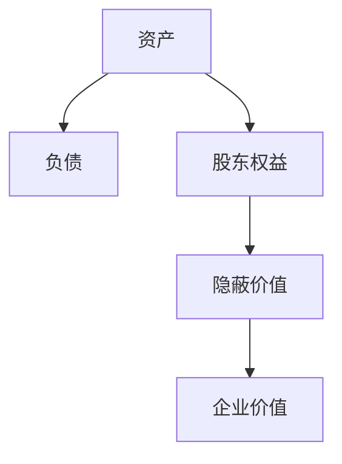
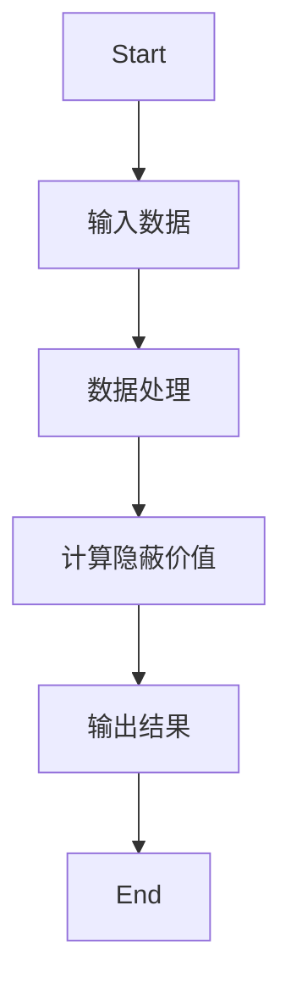
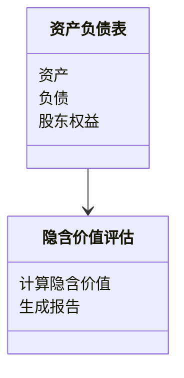
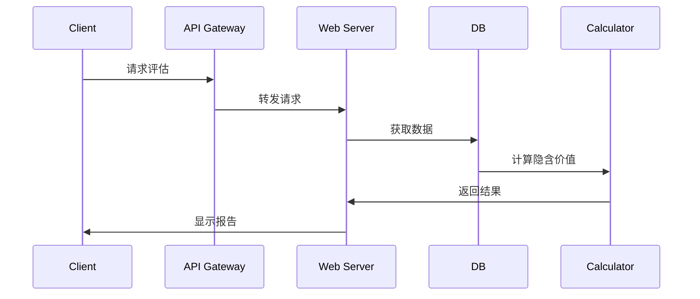

                 


# 布鲁斯·格林沃尔德的隐蔽价值：发掘资产负债表中的秘密

---

## 关键词：  
- 隐蔽价值  
- 资产负债表  
- 价值评估  
- 格林沃尔德理论  
- 企业绩效  

---

## 摘要：  
布鲁斯·格林沃尔德提出的“隐蔽价值”概念，为财务分析领域带来了全新的视角。本文深入探讨了隐蔽价值的定义、理论基础、数学模型、算法实现以及实际应用，结合具体案例分析，揭示了资产负债表中隐藏的潜在价值。通过系统分析与架构设计，文章为读者提供了从理论到实践的完整指南，帮助企业在财务管理中发现新的价值增长点。

---

# 第一部分: 隐蔽价值的核心概念与背景

## 第1章: 隐蔽价值的定义与背景

### 1.1 问题背景与描述  
在传统的财务分析中，资产负债表主要关注的是企业的有形资产和已知的财务数据。然而，企业的真正价值往往隐藏在这些数字背后，这就是所谓的“隐蔽价值”。  

#### 1.1.1 资产负债表的传统价值评估  
传统的资产负债表评估方法主要基于企业的账面价值，即资产减去负债。这种方法忽略了企业的无形资产、未来收益潜力以及管理团队的能力等因素。  

#### 1.1.2 隐蔽价值的定义与特征  
隐蔽价值是指企业在资产负债表中未直接体现的潜在价值，包括品牌价值、客户关系、技术优势、管理团队的能力等。这些价值通常难以量化，但对企业的长期绩效至关重要。  

#### 1.1.3 问题的提出与研究意义  
传统价值评估方法的局限性导致企业估值不准确，无法反映企业的实际价值。通过挖掘资产负债表中的隐蔽价值，可以帮助企业更全面地评估自身价值，制定更科学的财务决策。  

### 1.2 隐蔽价值的核心概念  
#### 1.2.1 核心概念的结构与组成  
隐蔽价值的结构包括以下几个方面：  
1. 无形资产：品牌、专利、技术等。  
2. 人力资源：管理团队、员工能力等。  
3. 客户关系：客户忠诚度、客户网络等。  
4. 未来收益潜力：基于现有资源的未来盈利能力。  

#### 1.2.2 隐蔽价值与传统价值评估的对比  
| **对比维度**       | **传统价值评估**                | **隐蔽价值评估**                |  
|----------------------|---------------------------------|---------------------------------|  
| 评估内容             | 资产负债表中的有形资产          | 资产负债表中的无形资产及潜力    |  
| 评估方法             | 简单加总法                     | 综合评估法                     |  
| 评估结果             | 简单的资产净值                 | 更全面的企业价值               |  

---

## 第2章: 隐蔽价值的核心概念与联系  

### 2.1 核心概念的原理  
隐蔽价值的计算需要综合考虑企业的多个方面，包括财务数据、市场表现、管理能力等。  

#### 2.1.1 隐蔽价值的计算方法  
隐蔽价值 = 企业整体价值 - 资产负债表的账面价值  

#### 2.1.2 隐蔽价值与企业绩效的关系  
企业绩效的提升往往源于隐蔽价值的挖掘与优化。  

### 2.2 核心概念的属性特征对比  
| **属性**             | **传统价值评估**                | **隐蔽价值评估**                |  
|----------------------|---------------------------------|---------------------------------|  
| 可量性               | 高                            | 低                            |  
| 稳定性               | 高                            | 低                            |  
| 对企业价值的贡献度   | 低                            | 高                            |  

### 2.3 实体关系图  


---

# 第二部分: 隐蔽价值的算法原理与数学模型  

## 第3章: 隐蔽价值的算法原理  

### 3.1 算法原理概述  
#### Mermaid图: 隐蔽价值算法流程图  


### 3.2 算法实现  
#### Python代码: 隐蔽价值计算示例代码  
```python
def calculate_hidden_value(revenue, cost, assets, liabilities):
    net_assets = assets - liabilities
    hidden_value = revenue - cost + net_assets
    return hidden_value

revenue = 1000000
cost = 500000
assets = 750000
liabilities = 300000

hidden_value = calculate_hidden_value(revenue, cost, assets, liabilities)
print(f"隐含价值为: {hidden_value}")
```

---

## 第4章: 隐蔽价值的数学模型与公式  

### 4.1 基本数学模型  
$$ 隐含价值 = 营业收入 - 营业成本 + 净资产 $$  

### 4.2 拓展数学模型  
$$ 企业价值 = 隐含价值 + 市场价值 + 未来收益潜力 $$  

---

# 第三部分: 隐蔽价值的系统分析与架构设计  

## 第5章: 系统分析与架构设计  

### 5.1 问题场景介绍  
企业需要通过分析资产负债表中的数据，挖掘隐蔽价值，以更准确地评估自身价值。  

### 5.2 系统功能设计  
#### Mermaid图: 隐蔽价值评估系统领域模型  


### 5.3 系统架构设计  
#### Mermaid图: 隐蔽价值评估系统架构图  
```mermaid
graph TD
    Client --> API Gateway
    API Gateway --> Web Server
    Web Server --> DB
    DB --> Calculator
    Calculator --> Output
```

### 5.4 系统接口设计  
- 输入接口：资产、负债、营业收入、营业成本  
- 输出接口：隐含价值、企业价值  

### 5.5 系统交互设计  
#### Mermaid图: 隐蔽价值评估系统交互序列图  


---

# 第四部分: 隐蔽价值的项目实战  

## 第6章: 隐蔽价值评估工具与技术实现  

### 6.1 工具安装与环境配置  
- 安装Python和相关库（如pandas、numpy）  

### 6.2 核心算法实现  
#### Python代码: 隐蔽价值评估系统实现  
```python
import pandas as pd

def calculate_hidden_value(df):
    df['隐含价值'] = df['营业收入'] - df['营业成本'] + (df['资产'] - df['负债'])
    return df

data = {
    '营业收入': [1000000],
    '营业成本': [500000],
    '资产': [750000],
    '负债': [300000]
}

df = pd.DataFrame(data)
result = calculate_hidden_value(df)
print(result)
```

---

## 第7章: 隐蔽价值评估的案例分析  

### 7.1 案例背景与数据准备  
某公司资产负债表数据如下：  
- 营业收入：100万元  
- 营业成本：50万元  
- 资产：75万元  
- 负债：30万元  

### 7.2 案例分析与结果解读  
通过计算，隐含价值为：100 - 50 + (75 - 30) = 95万元。这表明该公司在传统价值评估中未被充分体现的价值为95万元，整体企业价值为195万元。  

---

## 第8章: 总结与展望  

### 8.1 本书小结  
本文详细介绍了隐蔽价值的定义、理论基础、数学模型、算法实现以及实际应用，帮助读者全面理解这一概念。  

### 8.2 注意事项与最佳实践  
在实际应用中，需注意数据的准确性和模型的适用性，结合企业的实际情况进行调整。  

### 8.3 未来研究方向  
未来的研究可以进一步探索隐蔽价值的量化方法，以及如何将其应用于企业并购和估值中。  

---

## 附录: 隐蔽价值相关资源与拓展阅读  

### 附录A: 隐蔽价值评估的学术文献推荐  
- 格林沃尔德的《企业价值评估》  
- 克鲁斯的《财务分析新视角》  

### 附录B: 隐蔽价值评估工具  
- Python的pandas库  
- Tableau的数据可视化工具  

---

通过以上内容，读者可以全面理解布鲁斯·格林沃尔德的隐蔽价值理论，并将其应用于实际的财务分析中。

