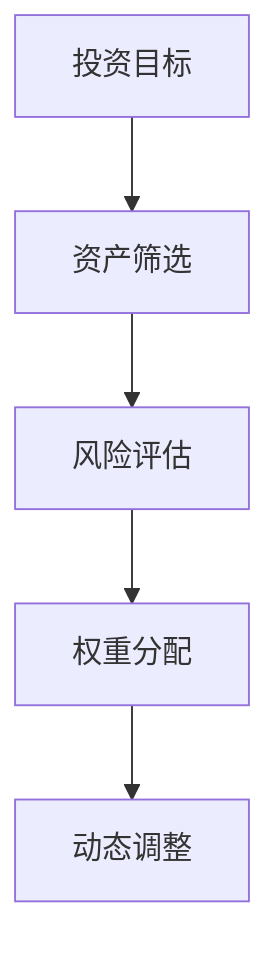

                 

# 布鲁斯·格林沃尔德的隐藏资产价值投资：发掘被低估的资产

---

## 关键词：  
价值投资、隐藏资产、资产定价、基本面分析、市场情绪、格林沃尔德、投资策略  

---

## 摘要：  
本文深入探讨了布鲁斯·格林沃尔德的隐藏资产价值投资理论，结合实际案例分析，系统地介绍了如何识别和评估被市场低估的资产。文章从价值投资的背景出发，逐步解析隐藏资产的识别方法、资产定价模型、投资策略与组合管理，最后通过项目实战和最佳实践，为读者提供一套完整的隐藏资产价值投资框架。  

---

## 第一部分: 价值投资的背景与基础

### 第1章: 价值投资的核心概念

#### 1.1 价值投资的定义与背景  
价值投资是一种以资产的内在价值为核心的投资策略，其核心思想是寻找市场价格低于内在价值的资产。布鲁斯·格林沃尔德在《隐藏资产价值投资》一书中提出，隐藏资产是指那些被市场忽视或低估，但具有长期增值潜力的资产。  

##### 核心概念术语说明：  
- **内在价值**：资产在未来现金流的现值，不依赖于市场情绪。  
- **市场价格**：资产在市场上的交易价格，受市场情绪和外部因素影响。  
- **隐藏资产**：市场价格低于内在价值的资产，通常是市场忽视或低估的资产。  

##### 问题背景：  
传统投资理论（如有效市场假说）认为市场价格反映所有可获取的信息，但市场并非总是有效。许多资产由于信息不对称、市场情绪或投资者认知偏差，其市场价格可能低于其内在价值。  

##### 问题解决：  
格林沃尔德提出通过基本面分析、市场情绪分析和资产定价模型，识别这些被低估的资产，并构建投资组合以实现超额收益。  

##### 边界与外延：  
- 资产可以是股票、债券、房地产或其他金融资产。  
- 隐藏资产的识别需要结合定量分析和定性判断。  

##### 概念结构与核心要素：  
- **内在价值**：现金流折现、ROE、ROA等指标。  
- **市场价格**：市盈率、市净率等估值指标。  
- **市场情绪**：投资者情绪、市场波动性等。  

---

### 第2章: 隐藏资产的识别方法

#### 2.1 基本面分析法  
基本面分析是识别隐藏资产的核心方法，通过分析资产的财务状况、行业地位和管理层质量，评估其内在价值。  

##### 核心原理：  
- **财务指标分析**：通过ROE、ROA、净利润增长率等指标，评估资产的盈利能力。  
- **行业分析**：分析行业竞争格局、增长潜力和周期性，判断资产的行业地位。  
- **管理层评估**：考察管理层的诚信、战略能力和执行能力。  

##### 实例分析：  
以某公司为例，通过分析其财务报表，计算其ROE和ROA，发现其盈利能力远高于行业平均水平，但市场价格低于行业平均市盈率。这表明该资产可能是隐藏资产。  

---

## 第二部分: 资产定价与价值评估

### 第3章: 资产定价模型

#### 3.1 现金流折现法  
现金流折现法是评估资产内在价值的核心方法，通过将未来现金流折现为现值，计算资产的内在价值。  

##### 公式：  
$$ V = \sum_{t=1}^{n} \frac{CF_t}{(1+r)^t} $$  
其中，\( V \) 为内在价值，\( CF_t \) 为第 \( t \) 年的现金流，\( r \) 为折现率。  

##### 实例：  
假设某公司未来5年的现金流分别为100、120、140、160、180万元，折现率为10%。计算其内在价值：  
$$ V = \frac{100}{1.1} + \frac{120}{1.1^2} + \frac{140}{1.1^3} + \frac{160}{1.1^4} + \frac{180}{1.1^5} \approx 478.11 \text{万元} $$  

---

## 第三部分: 投资策略与项目实战

### 第4章: 投资策略与组合管理

#### 4.1 投资组合构建  
投资组合的构建需要结合资产的内在价值和市场价格，选择那些市场价格低于内在价值的资产。  

##### 系统架构图：  

##### 实例：  
假设投资者有100万元资金，通过基本面分析和资产定价模型，筛选出三只隐藏资产，分别分配30%、40%、30%的资金。定期评估资产的内在价值和市场价格，动态调整投资组合。  

---

## 第四部分: 最佳实践与总结

### 第5章: 最佳实践与小结

#### 5.1 最佳实践  
- 定期进行基本面分析和市场情绪分析，及时发现被低估的资产。  
- 结合定量分析（如资产定价模型）和定性判断（如管理层评估），提高投资决策的准确性。  
- 保持投资组合的分散化，降低风险。  

#### 5.2 注意事项  
- 隐藏资产的投资需要长期持有，短期波动可能影响收益。  
- 避免过度依赖单一分析方法，结合多种方法提高判断的准确性。  

#### 5.3 拓展阅读  
推荐阅读《隐藏资产价值投资》一书，深入理解格林沃尔德的理论和方法。

---

## 总结  
通过本文的系统分析，读者可以掌握隐藏资产价值投资的核心方法，从基本面分析、资产定价到投资策略，构建自己的投资框架。价值投资不仅是一种投资方法，更是一种长期持有的投资理念，需要耐心、信心和恒心。

