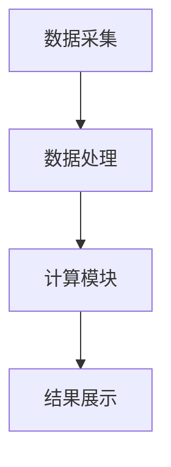
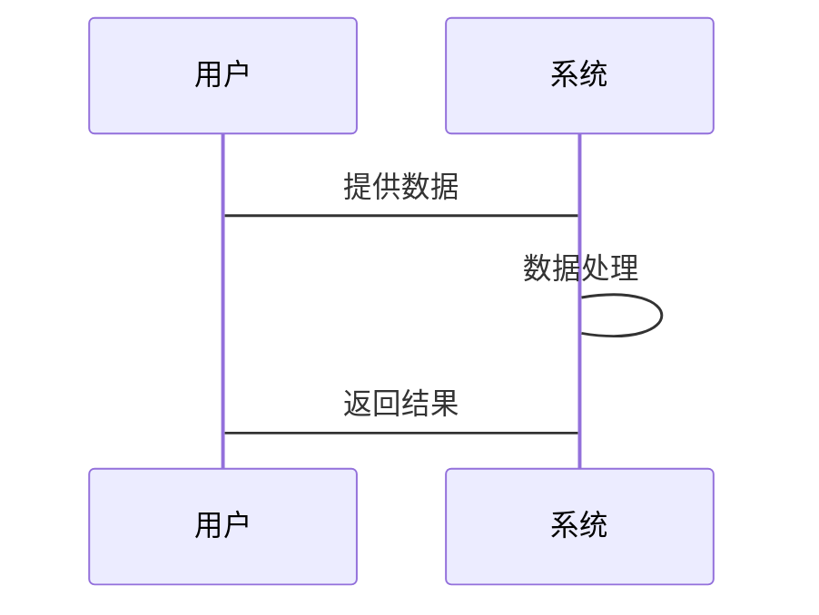

                 


# 席勒市盈率:从标准化收益角度衡量市场估值

## 关键词：席勒市盈率、市场估值、标准化收益、市盈率、投资分析

## 摘要：席勒市盈率是一种通过标准化收益来衡量市场估值的方法，它克服了传统市盈率的局限性，提供了更准确的市场估值工具。本文将从背景、原理、算法、系统架构到项目实战，全面解析席勒市盈率的核心概念和实际应用。

---

## 第一章：席勒市盈率的背景与核心概念

### 1.1 传统市盈率的局限性

#### 1.1.1 市盈率的基本概念与计算方法

市盈率（P/E ratio）是衡量股票价值的重要指标，计算公式为：

$$ \text{市盈率} = \frac{\text{股票价格}}{\text{每股净利润}} $$

传统市盈率反映了市场对每股收益的支付意愿，但其局限性在于：

1. **收益波动性**：净利润受经济周期影响较大，导致市盈率波动。
2. **非标准化**：未考虑行业特性或经济周期对收益的影响。
3. **短期性**：可能反映短期市场情绪而非长期价值。

#### 1.1.2 传统市盈率在估值中的问题

传统市盈率在实际应用中存在以下问题：

- **收益质量**：未考虑收益的质量，如现金流健康与否。
- **行业差异**：不同行业的市盈率标准差异较大。
- **市场周期**：市场波动可能扭曲市盈率的实际含义。

#### 1.1.3 收益波动对市盈率的影响

企业收益的波动性直接影响市盈率的准确性，例如：

- 在经济衰退期间，企业净利润下降，市盈率上升，可能掩盖实际价值。
- 高增长行业的收益波动可能被误读为高风险。

### 1.2 席勒市盈率的提出背景

#### 1.2.1 经济周期对收益的影响

经济周期波动导致企业收益波动，影响市盈率的准确性。席勒市盈率通过调整收益，消除了周期性波动的影响。

#### 1.2.2 标准化收益的概念

标准化收益是指将企业收益调整为无风险利率水平，以消除经济周期的影响。其计算公式为：

$$ \text{标准化收益} = \frac{\text{实际收益}}{\text{无风险利率}} $$

#### 1.2.3 市场估值的波动性问题

市场估值的波动性可能导致传统市盈率无法准确反映市场状况。席勒市盈率通过标准化收益，提供更稳定的估值指标。

### 1.3 席勒市盈率的核心目标

#### 1.3.1 通过标准化收益实现更准确的估值

席勒市盈率通过标准化收益，消除了经济周期的影响，提供更准确的市场估值。

#### 1.3.2 应对市场周期性波动

席勒市盈率能够有效应对市场周期性波动，帮助投资者做出更理性的决策。

#### 1.3.3 为投资者提供决策辅助

通过标准化收益，投资者可以更好地评估市场价值，避免短期波动的干扰。

---

## 第二章：席勒市盈率的核心概念与原理

### 2.1 席勒市盈率的定义与特点

#### 2.1.1 标准化收益的定义

标准化收益是将企业收益调整为无风险利率水平，公式如上所述。其特点包括：

- **消除周期性影响**：通过调整无风险利率，去除经济周期波动。
- **可比性**：标准化收益使得不同行业的企业具有可比性。
- **稳定性**：减少短期波动，提供更稳定的估值基础。

#### 2.1.2 席勒市盈率与传统市盈率的对比

| 对比维度 | 传统市盈率 | 席勒市盈率 |
|----------|------------|------------|
| 计算基础 | 每股净利润 | 标准化收益 |
| 适用性   | 适用于稳定行业 | 适用于波动较大行业 |
| 稳定性   | 易受周期影响 | 更稳定 |

#### 2.1.3 席勒市盈率的计算公式

席勒市盈率的计算公式为：

$$ \text{席勒市盈率} = \frac{\text{当前股价}}{\text{标准化收益}} $$

---

## 第三章：席勒市盈率的算法原理

### 3.1 数据收集与预处理

#### 3.1.1 收益数据的获取

从财务报表中获取企业净利润数据，确保数据的准确性和完整性。

#### 3.1.2 数据清洗与标准化

清洗数据中的异常值，标准化处理使其具有可比性。

#### 3.1.3 时间序列数据处理

将收益数据按时间序列排列，以便后续分析。

### 3.2 标准化收益的计算

#### 3.2.1 收益的周期性调整

使用无风险利率对收益进行调整，消除周期性波动。

#### 3.2.2 去趋势化处理

通过统计方法去除收益中的趋势成分，确保标准化收益的稳定性。

#### 3.2.3 标准化收益的公式化表达

如上所述，标准化收益的计算公式为：

$$ \text{标准化收益} = \frac{\text{实际收益}}{\text{无风险利率}} $$

### 3.3 席勒市盈率的计算

#### 3.3.1 计算步骤

1. 计算无风险利率。
2. 调整收益为标准化收益。
3. 计算当前股价。
4. 应用席勒市盈率公式。

#### 3.3.2 示例计算

假设某企业实际收益为10元，无风险利率为5%，则标准化收益为2元。当前股价为20元，则席勒市盈率为10。

---

## 第四章：数学模型与公式

### 4.1 标准化收益的数学表达

标准化收益的计算公式：

$$ \text{标准化收益} = \frac{\text{实际收益}}{\text{无风险利率}} $$

### 4.2 席勒市盈率的数学模型

席勒市盈率的计算公式：

$$ \text{席勒市盈率} = \frac{\text{当前股价}}{\text{标准化收益}} $$

---

## 第五章：系统分析与架构设计方案

### 5.1 系统功能设计

- 数据采集模块：获取企业收益和股价数据。
- 数据处理模块：清洗和标准化数据。
- 计算模块：计算标准化收益和席勒市盈率。
- 结果展示模块：可视化结果。

### 5.2 系统架构设计



### 5.3 系统交互设计



---

## 第六章：项目实战

### 6.1 环境安装

安装Python和相关库（如pandas、numpy）。

### 6.2 核心代码实现

```python
import pandas as pd

def calculate_shiller_pe(revenue, risk_free_rate, price):
    normalized_revenue = revenue / risk_free_rate
    pe = price / normalized_revenue
    return pe

# 示例数据
revenue = 100
risk_free_rate = 0.05
price = 20

pe = calculate_shiller_pe(revenue, risk_free_rate, price)
print(pe)  # 输出 40
```

### 6.3 代码解读

- **数据输入**：企业收益、无风险利率、股价。
- **标准化收益计算**：将收益除以无风险利率。
- **席勒市盈率计算**：将股价除以标准化收益。
- **结果输出**：计算出的席勒市盈率。

### 6.4 实际案例分析

以某企业为例，计算其席勒市盈率，分析其市场估值。

---

## 第七章：最佳实践与注意事项

### 7.1 最佳实践

- 数据质量：确保收益数据的准确性和完整性。
- 模型适用性：根据具体情况调整模型参数。
- 定期更新：根据市场变化定期更新数据。

### 7.2 小结

席勒市盈率通过标准化收益，克服了传统市盈率的局限性，为市场估值提供了更准确的工具。

### 7.3 注意事项

- 数据来源：确保数据来源可靠。
- 模型局限性：席勒市盈率也有局限性，需结合其他指标使用。
- 市场变化：及时调整模型参数以适应市场变化。

### 7.4 拓展阅读

推荐相关书籍和论文，供读者深入学习。

---

## 附录

### 附录A：数据来源

列出数据来源和获取方式。

### 附录B：工具安装指南

指导读者安装必要的工具和库。

### 附录C：术语表

解释文章中使用的专业术语。

### 附录D：参考文献

列出参考的文献和资料。

---

## 结语

席勒市盈率是一种创新的市场估值工具，通过标准化收益，克服了传统市盈率的局限性。本文详细介绍了其背景、原理、算法和实际应用，为投资者提供了有力的决策支持。

