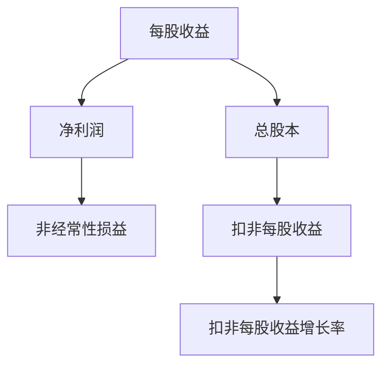
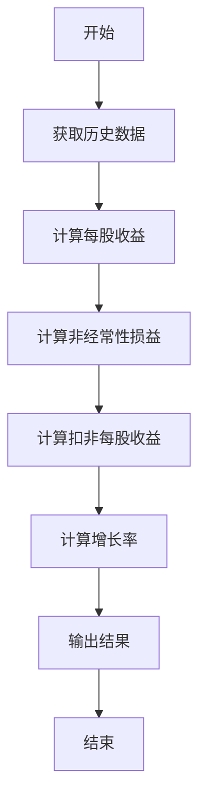
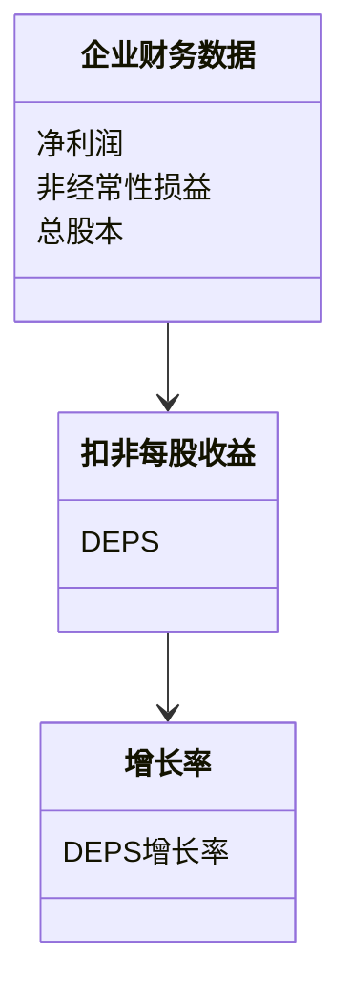
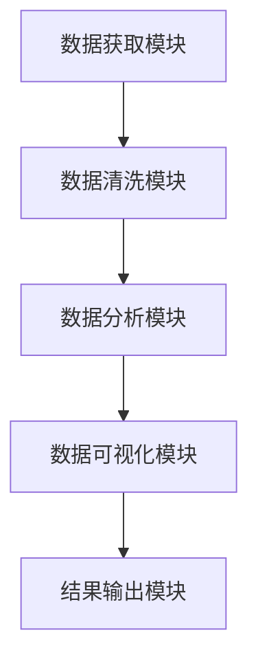
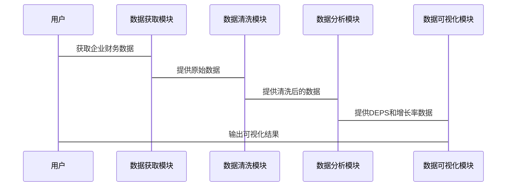

                 


# 10年扣非每股收益增长率的意义

## 关键词：扣非每股收益，每股收益增长率，时间序列分析，投资决策，财务指标

## 摘要：  
扣非每股收益增长率是衡量企业长期盈利能力的重要财务指标，通过分析过去10年的非经常性损益对企业每股收益的影响，可以帮助投资者更准确地评估企业的核心盈利能力。本文从定义、算法原理、系统架构、项目实战等多方面详细解读扣非每股收益增长率的意义，并提供实际案例分析和最佳实践建议。

---

# 第一部分: 扣非每股收益增长率的背景与意义

## 第1章: 扣非每股收益增长率的定义与背景

### 1.1 扣非每股收益的定义

#### 1.1.1 每股收益的基本概念  
每股收益（Earnings Per Share，简称EPS）是衡量企业盈利能力的重要指标，计算公式为：  
$$ EPS = \frac{\text{净利润}}{\text{总股本}} $$  
EPS越高，说明企业的盈利能力越强，每股收益是投资者评估企业价值的重要参考。

#### 1.1.2 非经常性损益的定义与范围  
非经常性损益是指企业经营活动中偶发性的收益或损失，例如出售资产、诉讼赔偿、政府补贴等。这些损益与企业主营业务无关，但在财务报表中会影响净利润。根据会计准则，非经常性损益需要单独列示。

#### 1.1.3 扣非每股收益的计算公式  
扣除非经常性损益后的每股收益（Diluted Earnings Per Share，简称DEPS）的计算公式为：  
$$ DEPS = \frac{\text{净利润} - \text{非经常性损益}}{\text{总股本}} $$  

### 1.2 扣非每股收益增长率的意义

#### 1.2.1 长期投资视角下的企业盈利能力分析  
扣非每股收益增长率（DEPS Growth Rate）是衡量企业核心盈利能力的重要指标，剔除非经常性损益的影响后，能够更真实地反映企业主营业务的盈利能力。通过分析过去10年的DEPS增长率，可以帮助投资者评估企业的长期增长潜力。

#### 1.2.2 扣非每股收益增长率的市场应用价值  
在股票投资中，许多企业通过出售资产或计提减值等方式 manipulate净利润，导致传统EPS指标失真。扣非每股收益增长率能够剔除这些非经常性因素的干扰，为投资者提供更准确的参考依据。

#### 1.2.3 为什么选择10年的跨度进行研究  
10年是一个较长的时间跨度，能够覆盖经济周期的波动，帮助投资者更全面地分析企业的长期盈利能力。通过分析10年的数据，可以发现企业的成长趋势、周期性特征以及潜在的风险因素。

---

## 第2章: 扣非每股收益增长率的核心概念与联系

### 2.1 核心概念原理

#### 2.1.1 非经常性损益对企业利润的影响  
非经常性损益通常会导致企业净利润的波动，但这些波动并不反映企业的核心竞争力。通过扣除非经常性损益，可以更准确地评估企业的主营业务盈利能力。

#### 2.1.2 扣非每股收益增长率的计算方法  
扣非每股收益增长率的计算公式为：  
$$ \text{DEPS Growth Rate} = \frac{\text{DEPS}_t - \text{DEPS}_{t-1}}{\text{DEPS}_{t-1}} \times 100\% $$  
其中，DEPS为扣除非经常性损益后的每股收益。

#### 2.1.3 时间序列分析的基本原理  
时间序列分析是一种统计技术，用于研究数据随时间的变化趋势。通过分析10年的DEPS数据，可以发现企业的盈利能力是否呈现增长、稳定或下降的趋势。

### 2.2 核心概念属性特征对比表

| 概念 | 定义 | 计算公式 | 时间跨度 | 应用场景 |
|------|------|----------|----------|----------|
| 每股收益 | 每股的净利润 | $$ EPS = \frac{\text{净利润}}{\text{总股本}} $$ | 单期或多期 | 评估企业盈利能力 |
| 扣非每股收益 | 扣除非经常性损益后的每股收益 | $$ DEPS = \frac{\text{净利润} - \text{非经常性损益}}{\text{总股本}} $$ | 单期或多期 | 更准确反映企业核心盈利能力 |
| 扣非每股收益增长率 | 扣非每股收益的年复合增长率 | $$ \text{DEPS Growth Rate} = \frac{\text{DEPS}_t - \text{DEPS}_{t-1}}{\text{DEPS}_{t-1}} \times 100\% $$ | 10年 | 评估企业长期盈利能力稳定性 |

### 2.3 ER实体关系图



---

## 第3章: 扣非每股收益增长率的算法原理

### 3.1 算法原理概述

#### 3.1.1 时间序列分析的基本概念  
时间序列分析是一种研究数据随时间变化的方法，通常用于预测未来趋势。通过分析历史数据，可以发现数据的周期性、趋势性和随机性特征。

#### 3.1.2 扣非每股收益增长率的计算步骤  
1. 收集过去10年的净利润数据。  
2. 扣除非经常性损益，计算扣非净利润。  
3. 计算每期的扣非每股收益（DEPS）。  
4. 计算DEPS的年复合增长率。  

#### 3.1.3 年复合增长率的数学模型  
年复合增长率的计算公式为：  
$$ \text{CAGR} = \left( \frac{\text{DEPS}_t}{\text{DEPS}_0} \right)^{\frac{1}{t}} - 1 $$  
其中，CAGR表示年复合增长率，DEPS_t为第t年的DEPS，DEPS_0为初始年的DEPS，t为时间跨度（年）。

### 3.2 算法流程图



### 3.3 Python实现代码

```python
def calculate_growth_rate(years, eps_data):
    growth_rates = []
    for i in range(1, len(years)):
        growth_rate = ((eps_data[i] - eps_data[i-1]) / eps_data[i-1]) * 100
        growth_rates.append(growth_rate)
    return growth_rates

# 示例数据
years = [2013, 2014, 2015, 2016, 2017, 2018, 2019, 2020, 2021, 2022]
eps_data = [1.0, 1.2, 1.5, 1.8, 2.0, 2.2, 2.5, 2.8, 3.0, 3.5]

# 计算增长率
growth_rates = calculate_growth_rate(years, eps_data)
print("年增长率：", growth_rates)
print("年复合增长率：", calculate_cagr(years, eps_data))
```

---

## 第4章: 系统分析与架构设计方案

### 4.1 问题场景介绍

#### 4.1.1 数据获取  
需要从企业财务报表中获取过去10年的净利润和非经常性损益数据。

#### 4.1.2 数据清洗  
剔除异常数据，确保数据的准确性和完整性。

#### 4.1.3 数据分析  
计算扣非每股收益和增长率，分析趋势和波动性。

#### 4.1.4 数据可视化  
通过图表展示DEPS和增长率的变化趋势。

### 4.2 系统功能设计

#### 4.2.1 领域模型



#### 4.2.2 系统架构设计



### 4.3 系统接口设计

#### 4.3.1 数据接口  
通过API接口获取企业财务数据。

#### 4.3.2 分析接口  
提供DEPS和增长率的计算接口。

### 4.4 系统交互设计



---

## 第5章: 项目实战

### 5.1 环境安装

#### 5.1.1 Python环境配置  
安装Python和必要的库（如Pandas、Matplotlib）。

#### 5.1.2 数据获取工具  
使用Yahoo Finance API获取企业财务数据。

### 5.2 核心实现

#### 5.2.1 数据清洗与预处理  
使用Pandas库清洗数据，剔除缺失值和异常值。

#### 5.2.2 DEPS计算  
编写Python代码计算扣非每股收益。

#### 5.2.3 增长率计算  
使用公式计算DEPS增长率。

### 5.3 实际案例分析

#### 5.3.1 案例背景  
以某企业为例，分析过去10年的DEPS和增长率。

#### 5.3.2 数据分析结果  
展示DEPS和增长率的趋势图。

### 5.4 代码应用解读

```python
import pandas as pd
import matplotlib.pyplot as plt

# 数据清洗
data = pd.read_csv('financial_data.csv')
data.dropna(inplace=True)

# DEPS计算
data['DEPS'] = (data['净利润'] - data['非经常性损益']) / data['总股本']

# 增长率计算
growth_rates = []
for i in range(1, len(data)):
    gr = ((data['DEPS'].iloc[i] - data['DEPS'].iloc[i-1]) / data['DEPS'].iloc[i-1]) * 100
    growth_rates.append(gr)

# 可视化
plt.plot(data.index, data['DEPS'], label='DEPS')
plt.title('扣非每股收益趋势图')
plt.xlabel('年份')
plt.ylabel('DEPS')
plt.legend()
plt.show()
```

---

## 第6章: 总结与注意事项

### 6.1 总结

#### 6.1.1 核心观点回顾  
扣非每股收益增长率是衡量企业长期盈利能力的重要指标，通过分析过去10年的数据，可以帮助投资者更准确地评估企业的核心竞争力。

#### 6.1.2 投资中的注意事项  
在使用扣非每股收益增长率进行投资决策时，需要注意企业的业务模式、行业地位和财务健康状况。

### 6.2 最佳实践 tips

#### 6.2.1 数据来源的可靠性  
确保数据来源可靠，避免使用错误或不完整的数据。

#### 6.2.2 结合其他指标分析  
DEPS增长率应与其他财务指标（如ROE、营业收入增长率）结合使用，全面评估企业的盈利能力。

#### 6.2.3 风险提示  
投资有风险，建议投资者在做出决策前进行充分的研究和风险评估。

### 6.3 拓展阅读

#### 6.3.1 推荐书籍  
《投资学基础》、《财务报表分析》

#### 6.3.2 相关研究  
关于DEPS增长率与其他财务指标的关联性研究。

---

## 附录

### 附录1: 术语解释  
解释文中涉及的专业术语。

### 附录2: 代码示例  
提供完整的Python代码示例，供读者参考。

### 附录3: 数据来源  
说明数据的获取方式和来源。

---

通过以上分析和实践，我们可以看出，扣非每股收益增长率是衡量企业长期盈利能力的重要指标，合理使用这一指标可以帮助投资者做出更明智的投资决策。

