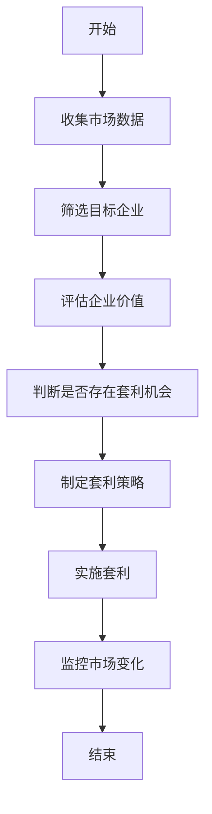
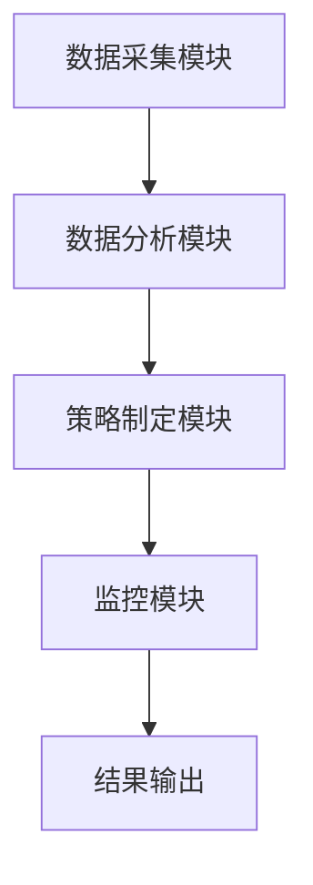

                 


# 并购套利策略：从企业重组中获取收益

## 关键词：并购套利、企业重组、投资策略、风险控制、套利机会

## 摘要：  
并购套利是一种通过企业重组和市场价差获取超额收益的投资策略。本文从并购套利的基本概念出发，结合市场环境、核心策略、算法原理、数学模型、系统设计、项目实战等多方面展开分析，探讨如何识别套利机会、评估风险、制定策略并实现收益。通过实际案例分析和代码实现，帮助投资者和从业者深入理解并购套利的理论与实践。

---

## 第一部分: 并购套利策略的背景与基础

### 第1章: 并购套利的基本概念

#### 1.1 并购套利的定义与特点
##### 1.1.1 并购套利的定义  
并购套利（Merger Arbitrage）是一种利用企业并购交易中的价差进行投资的策略。当一家公司收购另一家公司时，目标公司的股价可能会出现低估或高估的情况，套利者通过买入低估的股票或卖出高估的股票，在并购完成后的价差中获利。

##### 1.1.2 并购套利的核心特点  
1. **价差驱动**：套利者关注并购交易中的股价差异，利用市场对信息的不完全反应进行投资。
2. **短期性**：并购套利通常在并购交易完成前或完成后短期内完成，套利者不会长期持有股票。
3. **低风险高收益**：套利者通过分析企业价值和市场反应，寻找高收益低风险的机会。
4. **信息敏感性**：套利机会往往依赖于对市场信息的快速反应和精准分析。

##### 1.1.3 并购套利与传统投资的区别  
| 特性 | 并购套利 | 传统投资 |
|------|----------|-----------|
| 投资目标 | 利用并购价差获利 | 长期资本增值 |
| 持股时间 | 短期 | 长期 |
| 风险 | 低（套利机会通常具有较高的确定性） | 高（市场波动、经济周期等） |
| 信息依赖 | 高（依赖并购消息和市场反应） | 中 |

---

#### 1.2 并购套利的历史发展
##### 1.2.1 并购套利的起源  
并购套利起源于20世纪60年代，随着企业并购活动的增加，套利者开始利用并购交易中的价格差异进行投资。

##### 1.2.2 并购套利的发展阶段  
1. **早期阶段**：套利者主要关注并购交易中的价格差异，通过买入目标公司股票或卖出收购公司股票获利。
2. **专业化阶段**：随着市场的成熟，套利者开始专业化，利用复杂的金融工具和模型进行套利。
3. **现代阶段**：并购套利结合了大数据分析和量化投资，套利者利用算法和模型快速捕捉套利机会。

##### 1.2.3 当前并购套利的现状  
当前，并购套利已成为机构投资者的重要策略之一，尤其是在市场波动较大时，套利者通过分析企业价值和市场反应，寻找短期获利机会。

---

#### 1.3 并购套利的理论基础
##### 1.3.1 资本资产定价模型（CAPM）
CAPM模型用于评估资产的预期收益，套利者可以通过比较实际收益与预期收益的差异，寻找套利机会。

##### 1.3.2 套利定价理论（APT）
APT理论认为，资产的收益可以通过多个因素解释，套利者可以通过对这些因素的分析，寻找市场中的套利机会。

##### 1.3.3 市场不完美与套利机会  
市场不完美（如信息不对称、交易成本等）为套利者提供了机会，套利者通过套利行为纠正市场不完美，实现收益。

---

### 第2章: 并购套利的市场环境

#### 2.1 并购市场的基本结构
##### 2.1.1 并购市场的参与者  
1. **收购公司**：主动发起并购交易的公司。
2. **目标公司**：被并购的公司。
3. **投资者**：套利者、机构投资者等。
4. **中介**：投行、律师、会计师等。

##### 2.1.2 并购市场的类型  
1. **友好并购**：双方协商一致的并购。
2. **敌意并购**：目标公司不情愿的并购。
3. **杠杆并购**：使用杠杆融资的并购。

##### 2.1.3 并购市场的驱动因素  
1. **企业战略调整**：企业为了扩大市场份额或优化业务结构。
2. **行业整合**：行业集中度提高，企业通过并购整合资源。
3. **市场波动**：经济波动导致企业价值低估或高估。

#### 2.2 并购套利的机会与风险
##### 2.2.1 并购套利的机会来源  
1. **并购价差**：目标公司股价低于并购价格。
2. **市场反应滞后**：市场对并购消息反应不足，套利者可以利用时间差获利。
3. **信息不对称**：套利者掌握内部信息或市场信息先机。

##### 2.2.2 并购套利的主要风险  
1. **交易失败风险**：并购交易可能因各种原因失败，导致套利失败。
2. **股价波动风险**：市场波动可能导致股价下跌，套利者可能亏损。
3. **流动性风险**：套利者可能无法在短期内变现。

##### 2.2.3 如何评估并购套利的可行性  
套利者需要综合考虑并购交易的可行性、市场反应、交易风险等因素，制定合理的套利策略。

---

### 第3章: 并购套利的核心策略

#### 3.1 识别套利机会的方法
##### 3.1.1 市场价差分析  
套利者需要分析并购交易中的市场价差，判断是否存在套利空间。

##### 3.1.2 企业价值评估  
套利者需要对目标公司进行企业价值评估，判断其股价是否被低估或高估。

##### 3.1.3 并购溢价分析  
套利者需要分析并购溢价，判断是否存在套利机会。

#### 3.2 并购套利的实施步骤
##### 3.2.1 确定目标企业  
套利者需要根据市场信息和企业基本面，筛选出具有套利潜力的目标企业。

##### 3.2.2 评估企业价值  
套利者需要对目标公司进行详细的企业价值评估，包括财务状况、行业地位、竞争优势等。

##### 3.2.3 制定套利策略  
套利者根据市场价差和企业价值评估，制定买入或卖出的套利策略。

##### 3.2.4 实施与监控  
套利者需要及时执行套利策略，并持续监控市场变化，调整策略以应对市场波动。

#### 3.3 并购套利的风险管理
##### 3.3.1 风险识别与评估  
套利者需要识别并购套利的主要风险，并评估其潜在影响。

##### 3.3.2 风险控制措施  
套利者可以通过分散投资、设置止损点、监控市场变化等方式，降低并购套利的风险。

##### 3.3.3 风险与收益的平衡  
套利者需要在风险与收益之间找到平衡点，制定合理的套利策略。

---

## 第二部分: 并购套利的算法与数学模型

### 第4章: 并购套利的算法原理

#### 4.1 并购套利算法的流程图


#### 4.2 并购套利的数学模型
##### 4.2.1 市场价差计算  
套利者需要计算目标公司股价与并购价格之间的差异，判断是否存在套利空间。

##### 4.2.2 企业价值评估  
套利者需要使用企业价值评估模型，如DCF模型，计算目标公司的企业价值。

##### 4.2.3 并购溢价分析  
套利者需要计算并购溢价，判断是否存在套利机会。

---

## 第三部分: 并购套利的系统设计与实现

### 第5章: 并购套利的系统架构设计

#### 5.1 系统功能设计
##### 5.1.1 数据采集模块  
功能：从市场数据源采集并购交易数据，包括股价、并购价格、交易时间等。

##### 5.1.2 数据分析模块  
功能：对采集的数据进行分析，包括市场价差计算、企业价值评估、并购溢价分析等。

##### 5.1.3 策略制定模块  
功能：根据分析结果，制定套利策略，包括买入或卖出目标公司股票。

##### 5.1.4 监控模块  
功能：实时监控市场变化，调整套利策略，确保套利交易的顺利进行。

#### 5.2 系统架构设计


---

### 第6章: 并购套利的项目实战

#### 6.1 项目环境安装
##### 6.1.1 安装Python
```bash
python --version
pip install numpy pandas matplotlib
```

##### 6.1.2 安装其他依赖
```bash
pip install yfinance
```

#### 6.2 核心代码实现
##### 6.2.1 数据采集模块  
```python
import yfinance as yf

def get_stock_data(ticker, start_date, end_date):
    data = yf.download(ticker, start=start_date, end=end_date)
    return data['Close']
```

##### 6.2.2 数据分析模块  
```python
import numpy as np
import pandas as pd

def calculate_price_diff(data):
    return data.max() - data.min()
```

##### 6.2.3 策略制定模块  
```python
def execute_strategy(price_diff):
    if price_diff > 0:
        return "买入"
    else:
        return "卖出"
```

##### 6.2.4 监控模块  
```python
import matplotlib.pyplot as plt

def plot_price_trend(data):
    plt.plot(data.index, data.values)
    plt.title('股价走势')
    plt.xlabel('时间')
    plt.ylabel('股价')
    plt.show()
```

#### 6.3 案例分析
##### 6.3.1 案例背景  
假设目标公司A被公司B以溢价收购，目标公司A的股价在并购消息公布前被低估。

##### 6.3.2 数据分析  
目标公司A的股价数据如下：
```python
data = pd.read_csv('a_stock.csv')
print(data.head())
```

##### 6.3.3 策略制定  
套利者通过分析数据，判断目标公司A的股价被低估，决定买入A股票，同时卖出B股票。

##### 6.3.4 交易执行  
套利者在股价低估时买入A股票，股价上涨后卖出，获利。

#### 6.4 项目小结  
通过实际案例分析，套利者可以验证并购套利策略的有效性，并根据市场变化调整策略。

---

## 第四部分: 并购套利的最佳实践

### 第7章: 并购套利的最佳实践

#### 7.1 小结  
并购套利是一种利用企业并购交易中的价差进行投资的策略，套利者需要综合考虑市场环境、企业价值、交易风险等因素，制定合理的套利策略。

#### 7.2 注意事项  
1. **风险控制**：套利者需要严格控制风险，避免因市场波动或交易失败导致亏损。
2. **信息敏感性**：套利者需要及时获取市场信息，抓住套利机会。
3. **策略调整**：套利者需要根据市场变化，及时调整套利策略。

#### 7.3 拓展阅读  
1. 《并购套利：从理论到实践》
2. 《企业并购与投资策略》
3. 《量化投资与算法交易》

---

## 总结  
并购套利是一种高风险高收益的投资策略，套利者需要具备专业的知识和技能，才能在市场中获取超额收益。通过本文的分析，读者可以深入了解并购套利的背景、策略、算法和系统设计，并通过实际案例分析，掌握并购套利的核心技巧。

