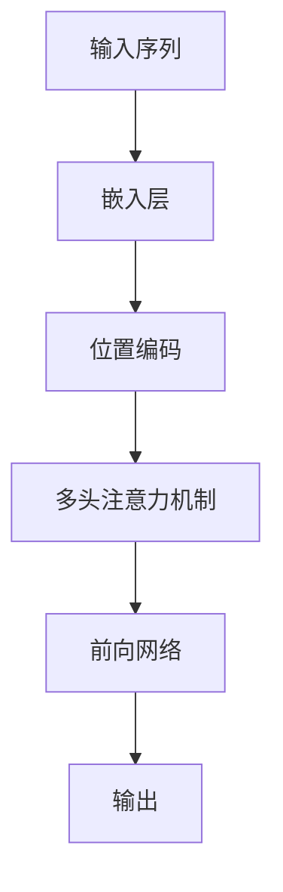
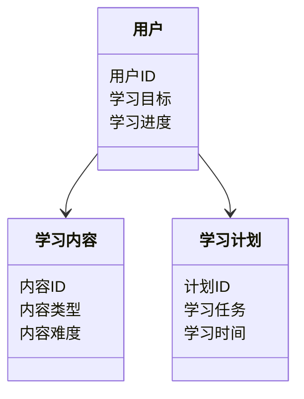

                 


# 开发AI Agent的个性化学习助手系统

> 关键词：AI Agent，个性化学习助手，自然语言处理，推荐算法，系统架构设计，算法原理

> 摘要：本文将详细探讨开发AI Agent的个性化学习助手系统的各个方面，从背景介绍到算法实现，再到系统架构设计，最后结合实际案例进行分析。通过本文的学习，读者将能够理解AI Agent的核心原理、个性化学习助手系统的实现方法，以及如何在实际项目中应用这些技术。

---

## 第一部分：AI Agent与个性化学习助手系统概述

### 第1章：AI Agent与个性化学习助手系统背景介绍

#### 1.1 AI Agent的基本概念
##### 1.1.1 AI Agent的定义与特点
AI Agent（人工智能代理）是指能够感知环境、自主决策并执行任务的智能实体。其特点包括：
- **自主性**：能够在没有外部干预的情况下独立运行。
- **反应性**：能够实时感知环境并做出反应。
- **学习性**：能够通过数据和经验进行学习和优化。
- **交互性**：能够与用户或其他系统进行交互。

##### 1.1.2 AI Agent的核心要素与组成
AI Agent的核心要素包括：
- **感知模块**：负责接收外部输入并进行数据处理。
- **决策模块**：基于感知的数据做出决策。
- **执行模块**：根据决策执行具体操作。
- **学习模块**：通过数据优化感知、决策和执行过程。

##### 1.1.3 AI Agent的分类与应用场景
AI Agent可以根据功能和应用场景分为以下几类：
- **简单反射型Agent**：基于预设规则做出反应，适用于简单的任务。
- **基于模型的反应式Agent**：基于内部模型和外部环境信息做出决策，适用于复杂任务。
- **目标驱动型Agent**：以特定目标为导向，主动规划和执行任务。
- **效用驱动型Agent**：通过最大化效用函数来优化决策，适用于多目标优化场景。

AI Agent的应用场景包括智能助手、自动驾驶、智能客服、机器人控制等。

#### 1.2 个性化学习助手系统的定义与特点
##### 1.2.1 个性化学习助手的基本概念
个性化学习助手是一种基于AI技术的学习工具，能够根据用户的学习需求、学习风格和进度，提供个性化的学习建议、内容推荐和学习路径规划。

##### 1.2.2 个性化学习助手的核心功能
个性化学习助手的核心功能包括：
- **学习需求分析**：通过用户输入和历史数据，分析用户的学习目标和需求。
- **学习内容推荐**：基于学习需求和用户偏好，推荐合适的学习材料。
- **学习路径规划**：根据用户的学习进度和能力，制定个性化的学习计划。
- **学习效果评估**：通过测试和数据分析，评估用户的学习效果并提供反馈。

##### 1.2.3 个性化学习助手与传统学习工具的区别
个性化学习助手与传统学习工具的区别主要体现在以下几个方面：
- **个性化推荐**：个性化学习助手能够根据用户需求推荐内容，而传统工具通常提供固定的内容。
- **动态调整**：个性化学习助手能够根据用户反馈动态调整学习计划，而传统工具通常不具备这种能力。
- **智能化**：个性化学习助手基于AI技术，能够进行学习效果预测和优化，而传统工具通常不具备这种能力。

#### 1.3 AI Agent在个性化学习助手中的作用
##### 1.3.1 AI Agent在个性化学习中的应用
AI Agent在个性化学习助手中的应用主要体现在以下几个方面：
- **用户需求分析**：通过自然语言处理和机器学习技术，分析用户的语言输入，理解用户的需求。
- **内容推荐**：基于用户的需求和行为数据，推荐合适的学习内容。
- **学习路径规划**：根据用户的学习进度和能力，制定个性化的学习计划。

##### 1.3.2 AI Agent如何提升学习效率
AI Agent通过以下方式提升学习效率：
- **精准推荐**：基于用户的学习需求和行为数据，精准推荐相关内容，减少无效信息的干扰。
- **动态调整**：根据用户的学习反馈动态调整学习计划，确保学习内容和进度与用户需求匹配。
- **实时反馈**：通过实时数据分析，提供即时的学习反馈，帮助用户快速调整学习策略。

##### 1.3.3 个性化学习助手系统的边界与外延
个性化学习助手系统的边界主要在于其功能范围。个性化学习助手专注于提供学习辅助功能，不涉及学习内容的生产或评估。其外延则包括基于AI技术的其他类型的学习工具，如智能辅导系统、自适应学习平台等。

---

### 第2章：AI Agent与个性化学习助手的核心概念与联系

#### 2.1 AI Agent的核心概念原理
##### 2.1.1 AI Agent的感知与决策机制
AI Agent的感知机制包括数据采集、特征提取和数据处理。决策机制则基于感知数据，通过算法模型生成决策。

##### 2.1.2 AI Agent的学习与自适应能力
AI Agent的学习能力体现在通过机器学习算法对数据进行建模和训练，从而优化感知、决策和执行过程。自适应能力则基于学习结果，动态调整系统参数和行为策略。

##### 2.1.3 AI Agent的通信与协作能力
AI Agent的通信能力包括与其他系统或用户进行信息交换，协作能力则体现在多Agent系统中通过协作完成复杂任务。

#### 2.2 核心概念属性特征对比表格
以下是AI Agent与个性化学习助手的核心概念属性对比：

| **属性**        | **AI Agent**                | **个性化学习助手**             |
|-----------------|-----------------------------|-----------------------------|
| **核心功能**    | 感知、决策、执行           | 学习需求分析、内容推荐、学习路径规划 |
| **目标**        | 完成特定任务               | 提供个性化学习支持           |
| **用户交互**    | 与用户或系统交互           | 与学习者进行深度交互         |
| **自适应性**    | 根据环境变化调整行为       | 根据学习者反馈动态调整学习计划 |

#### 2.3 ER实体关系图架构
以下是AI Agent与个性化学习助手的实体关系图：

```mermaid
er
actor(学习者) -->
user_profile(用户资料表)
actor -->
learning_request(学习请求表)
learning_request -->
content_recommendation(内容推荐表)
content_recommendation -->
learning_plan(学习计划表)
```

---

#### 2.4 AI Agent的算法原理与实现

##### 2.4.1 自然语言处理算法
###### 2.4.1.1 Transformer模型的原理与实现
Transformer模型是一种基于注意力机制的深度学习模型，广泛应用于自然语言处理任务。



以下是Transformer模型的Python实现示例：

```python
import torch
class TransformerModel(torch.nn.Module):
    def __init__(self, d_model, nhead, num_encoder_layers):
        super(TransformerModel, self).__init__()
        self.transformer = torch.nn.Transformer(
            d_model=d_model,
            nhead=nhead,
            num_encoder_layers=num_encoder_layers
        )
    def forward(self, src):
        output = self.transformer(src)
        return output
```

##### 2.4.1.2 BERT模型的原理与应用
BERT模型是一种基于Transformer的预训练语言模型，适用于多种自然语言处理任务。

##### 2.4.1.3 GPT模型的原理与应用
GPT模型是一种基于Transformer的生成式语言模型，适用于文本生成和对话系统。

##### 2.4.2 推荐算法
###### 2.4.2.1 基于协同过滤的推荐算法
协同过滤是一种基于用户行为数据的推荐算法，通过计算用户相似性或物品相似性进行推荐。

```python
import numpy as np
from sklearn.metrics.pairwise import cosine_similarity

def collaborative_filtering(user_item_matrix):
    user_similarity = cosine_similarity(user_item_matrix)
    # 找出与当前用户相似的用户
    similar_users = np.argsort(user_similarity, axis=0)[::-1]
    # 计算推荐分数
    recommendation_scores = np.sum(user_item_matrix[similar_users], axis=0)
    return recommendation_scores
```

###### 2.4.2.2 基于内容的推荐算法
内容推荐算法基于物品的特征进行推荐，适用于内容丰富的场景。

###### 2.4.2.3 深度学习推荐算法
深度学习推荐算法基于神经网络模型，能够捕捉复杂的用户行为模式。

##### 2.4.3 个性化学习路径规划算法
###### 2.4.3.1 基于用户行为分析的学习路径规划
基于用户行为分析的学习路径规划通过分析用户的学习行为和偏好，制定个性化的学习计划。

###### 2.4.3.2 基于知识图谱的学习路径规划
基于知识图谱的学习路径规划利用知识图谱的结构信息，为用户推荐相关知识点。

###### 2.4.3.3 基于强化学习的学习路径优化
强化学习通过奖励机制优化学习路径，使学习过程更加高效。

---

### 第3章：系统分析与架构设计方案

#### 3.1 问题场景介绍
个性化学习助手系统需要解决的主要问题包括：
- **学习需求分析**：如何准确理解用户的学习需求。
- **内容推荐**：如何基于用户需求推荐合适的学习内容。
- **学习路径规划**：如何根据用户反馈动态调整学习计划。

#### 3.2 项目介绍
个性化学习助手系统是一个基于AI技术的学习辅助工具，旨在为用户提供个性化的学习支持。

#### 3.3 系统功能设计
##### 3.3.1 领域模型
以下是个性化学习助手系统的领域模型：



##### 3.3.2 系统架构设计
以下是个性化学习助手系统的架构设计：

```mermaid
containerDiagram
    container 数据层 {
        数据库
    }
    container 业务逻辑层 {
        学习需求分析模块
        内容推荐模块
        学习路径规划模块
    }
    container 表现层 {
        用户界面
    }
    数据层 --> 业务逻辑层
    业务逻辑层 --> 表现层
```

##### 3.3.3 系统接口设计
以下是系统接口设计：

```mermaid
sequenceDiagram
    actor 学习者
    system 系统
    学习者 -> 系统: 提交学习需求
    系统 -> 学习者: 返回推荐内容
    学习者 -> 系统: 提交学习反馈
    系统 -> 学习者: 返回更新后的学习计划
```

---

### 第4章：项目实战

#### 4.1 环境安装
以下是开发个性化学习助手系统的环境安装步骤：

1. 安装Python和必要的Python库（如TensorFlow、PyTorch、Scikit-learn等）。
2. 安装数据库和相关工具（如MySQL、MongoDB等）。
3. 安装自然语言处理库（如NLTK、spaCy）。

#### 4.2 系统核心实现
以下是系统核心实现的代码示例：

```python
import numpy as np
from sklearn.metrics.pairwise import cosine_similarity

def collaborative_filtering(user_item_matrix):
    user_similarity = cosine_similarity(user_item_matrix)
    similar_users = np.argsort(user_similarity, axis=0)[::-1]
    recommendation_scores = np.sum(user_item_matrix[similar_users], axis=0)
    return recommendation_scores
```

#### 4.3 案例分析
以下是个性化学习助手系统的实际案例分析：

假设一个用户的学习需求是“提高英语阅读能力”，系统会根据用户的学习目标、当前水平和学习风格，推荐相应的学习材料和学习计划。

---

### 第5章：总结与展望

#### 5.1 总结
个性化学习助手系统通过结合AI Agent和机器学习技术，能够为用户提供精准的学习支持，提升学习效率。

#### 5.2 展望
随着AI技术的不断发展，个性化学习助手系统将更加智能化和个性化，能够覆盖更广泛的学习场景，为学习者提供更优质的学习体验。

---

### 最佳实践Tips
- **选择合适的算法**：根据具体需求选择合适的算法，避免过度复杂化。
- **注重数据质量**：确保数据的准确性和完整性，避免因数据问题影响系统性能。
- **系统优化**：通过性能优化和用户体验设计，提升系统的稳定性和可用性。

---

### 参考文献
[此处列出参考文献]

---

通过本文的学习，读者将能够掌握开发AI Agent的个性化学习助手系统的相关知识，从理论到实践，全面了解如何构建一个高效、智能的学习助手系统。

