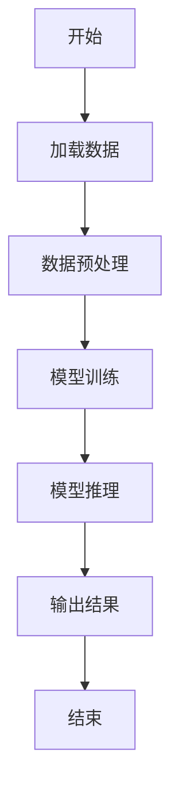
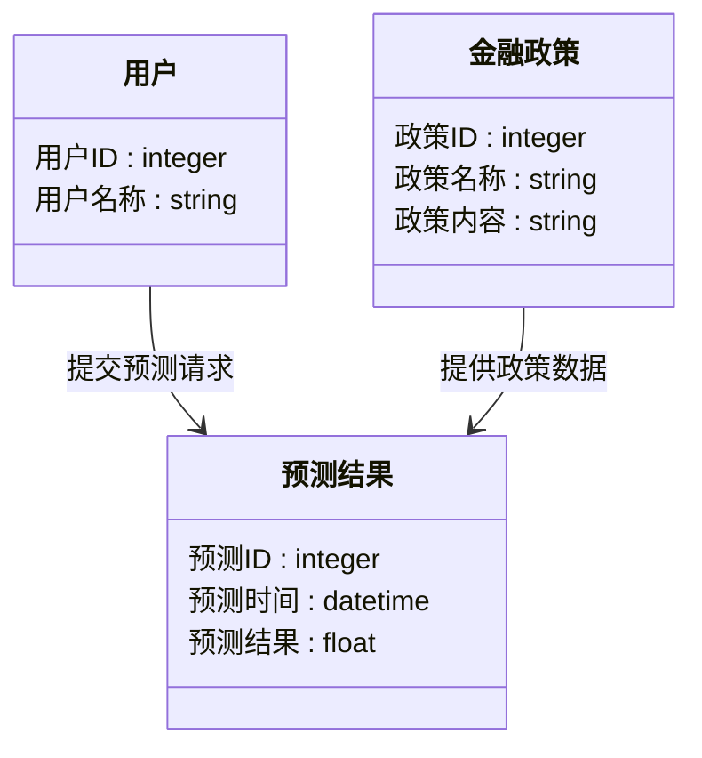
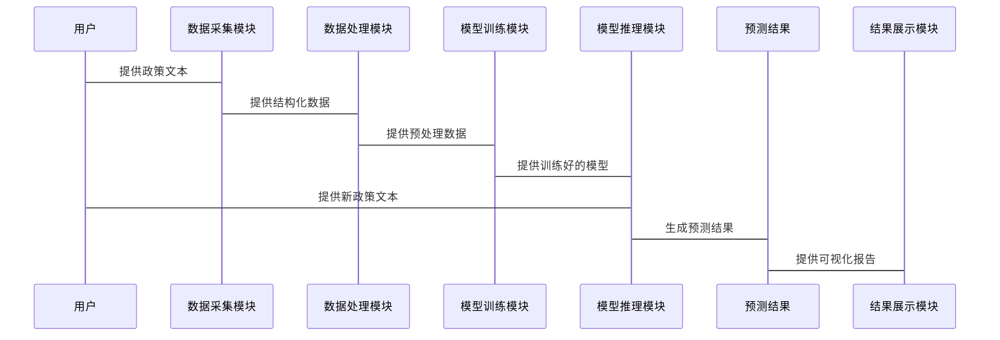

                 


# 开发基于大模型的金融政策执行效果预测器

## 关键词：大模型，金融政策，预测器，算法原理，系统架构

## 摘要：本文详细探讨了开发基于大模型的金融政策执行效果预测器的背景、核心概念、算法原理和系统架构。通过分析大模型技术的特点，结合金融政策执行效果预测的实际需求，提出了一种基于大模型的预测方法，并通过系统架构设计和具体案例分析，展示了该预测器的实现过程和应用价值。

---

# 第一部分: 开发基于大模型的金融政策执行效果预测器概述

## 第1章: 金融政策执行效果预测器的背景与需求

### 1.1 金融政策执行效果预测的背景

#### 1.1.1 金融政策执行的现状与挑战
金融政策是国家或组织为了实现特定经济目标而制定的规则和措施。然而，政策的执行效果往往受到多种复杂因素的影响，如市场环境、政策执行者的主观判断等。传统的政策评估方法依赖于事后分析，难以实时预测政策执行的效果。

#### 1.1.2 大模型技术在金融领域的应用前景
大模型（如GPT、BERT等）在自然语言处理、数据分析和预测方面表现出色。金融领域的复杂性和不确定性为大模型的应用提供了广阔的空间。

#### 1.1.3 金融政策执行效果预测的必要性
实时预测政策执行效果可以帮助政策制定者快速调整策略，避免潜在风险，提高政策执行效率。

### 1.2 问题背景与需求分析

#### 1.2.1 金融政策执行效果的定义与内涵
金融政策执行效果是指政策在实际执行过程中对经济、市场和社会产生的实际影响。这些影响可以通过多种指标（如GDP增长率、市场波动率等）来衡量。

#### 1.2.2 传统预测方法的局限性
传统预测方法依赖于线性回归、时间序列分析等技术，难以捕捉复杂金融系统的非线性关系和不确定性。

#### 1.2.3 基于大模型的预测优势
大模型具有强大的特征学习和非线性建模能力，能够处理海量数据，捕捉复杂的金融关系，从而提高预测的准确性。

### 1.3 案例分析：政策执行效果对市场的影响
以某国减税政策为例，通过大模型预测政策执行后的市场反应，帮助政策制定者提前做好准备。

## 1.4 本章小结
本章介绍了金融政策执行效果预测的背景、挑战和必要性，并分析了大模型技术在这一领域的优势。

---

## 第2章: 基于大模型的金融政策执行效果预测器的核心概念

### 2.1 大模型技术的核心原理

#### 2.1.1 大模型的基本概念
大模型是一种基于深度学习的自然语言处理模型，具有强大的特征提取和生成能力。

#### 2.1.2 大模型的主要技术特点
- **大规模参数**：模型参数量通常在 billions 级别。
- **多任务学习**：能够处理多种类型的数据和任务。
- **自监督学习**：通过预训练任务（如掩盖词任务）学习语言的规律。

#### 2.1.3 大模型在金融领域的应用优势
- **处理复杂关系**：能够捕捉金融数据中的复杂关系。
- **实时更新**：可以实时更新模型，适应快速变化的金融环境。

### 2.2 金融政策执行效果预测器的系统架构

#### 2.2.1 系统的整体架构设计
- **数据采集模块**：收集政策文本、市场数据等。
- **数据处理模块**：清洗、预处理数据。
- **模型训练模块**：基于大模型训练预测器。
- **模型推理模块**：输入政策文本，输出预测效果。
- **结果展示模块**：可视化预测结果。

#### 2.2.2 各模块的功能与交互关系
- 数据采集模块向数据处理模块提供原始数据。
- 数据处理模块为模型训练模块提供结构化数据。
- 模型训练模块生成训练好的大模型。
- 模型推理模块基于新政策文本生成预测结果。

#### 2.2.3 系统的输入输出与数据流
- **输入**：政策文本、市场数据、历史政策执行效果。
- **输出**：政策执行效果预测结果。

### 2.3 核心概念的ER实体关系图

```mermaid
erDiagram
    user : 用户
    policy : 金融政策
    prediction : 预测结果
    user --> prediction : 提交预测请求
    policy --> prediction : 提供政策数据
```

## 2.4 本章小结
本章详细介绍了大模型技术的核心原理和金融政策执行效果预测器的系统架构，明确了各模块的功能和交互关系。

---

## 第3章: 大模型算法原理与数学模型

### 3.1 大模型的基本算法原理

#### 3.1.1 大模型的训练流程
- **预训练**：使用大规模文本数据进行无监督学习。
- **微调**：在特定任务（如金融政策预测）上进行有监督训练。

#### 3.1.2 大模型的推理机制
- **编码器-解码器结构**：将输入文本编码为向量，解码器生成输出。
- **注意力机制**：关注输入文本中重要的部分。

#### 3.1.3 大模型的优化策略
- **学习率调整**：使用Adam优化器。
- **正则化**：防止过拟合。

### 3.2 金融政策执行效果预测的数学模型

#### 3.2.1 预测模型的输入输出关系
- **输入**：政策文本、市场数据。
- **输出**：预测效果指标（如政策效果评分）。

#### 3.2.2 预测模型的数学表达式
$$
y = f(x) + \epsilon
$$
其中，\( y \) 是预测结果，\( x \) 是输入特征，\( f(x) \) 是模型函数，\( \epsilon \) 是噪声。

#### 3.2.3 模型的优化与调参
- **损失函数**：使用均方误差（MSE）。
- **优化算法**：Adam优化器。
- **超参数调优**：学习率、批量大小等。

### 3.3 基于大模型的预测算法流程图



## 3.4 本章小结
本章详细讲解了大模型的算法原理和数学模型，并通过流程图展示了预测算法的执行过程。

---

## 第4章: 金融政策执行效果预测器的系统架构设计

### 4.1 系统功能模块划分

#### 4.1.1 数据采集模块
- **功能**：收集政策文本、市场数据。
- **输入**：政策文本文件、市场数据文件。
- **输出**：结构化数据。

#### 4.1.2 数据处理模块
- **功能**：清洗、预处理数据。
- **输入**：原始数据。
- **输出**：标准化数据。

#### 4.1.3 模型训练模块
- **功能**：训练大模型。
- **输入**：预处理后的数据。
- **输出**：训练好的模型。

#### 4.1.4 模型推理模块
- **功能**：基于新政策文本生成预测结果。
- **输入**：新政策文本。
- **输出**：预测效果评分。

#### 4.1.5 结果展示模块
- **功能**：可视化预测结果。
- **输入**：预测结果。
- **输出**：可视化报告。

### 4.2 系统架构的类图设计



### 4.3 系统架构的交互设计



## 4.4 本章小结
本章详细设计了金融政策执行效果预测器的系统架构，明确了各模块的功能和交互关系。

---

## 第5章: 项目实战

### 5.1 环境安装与配置

#### 5.1.1 安装Python环境
- 使用Anaconda安装Python 3.8以上版本。

#### 5.1.2 安装必要的库
- `pip install numpy pandas scikit-learn transformers`

### 5.2 系统核心实现源代码

#### 5.2.1 数据预处理代码

```python
import pandas as pd
import numpy as np

def preprocess_data(data):
    # 假设data是包含政策文本和市场数据的DataFrame
    # 数据清洗：去掉空值
    data = data.dropna()
    # 数据标准化
    from sklearn.preprocessing import StandardScaler
    scaler = StandardScaler()
    scaled_data = scaler.fit_transform(data[['市场数据字段']])
    return scaled_data
```

#### 5.2.2 模型训练代码

```python
from transformers import AutoTokenizer, AutoModelForCausalLM
import torch

def train_model(train_data):
    # 加载大模型
    model_name = 'gpt2'
    tokenizer = AutoTokenizer.from_pretrained(model_name)
    model = AutoModelForCausalLM.from_pretrained(model_name)
    # 定义训练函数
    def train_step(batch):
        inputs = tokenizer(batch['输入'], padding=True, return_tensors='pt')
        labels = tokenizer(batch['输出'], padding=True, return_tensors='pt')
        outputs = model(**inputs, labels=labels['input_ids'].to('cuda'))
        return outputs.loss
    # 开始训练
    optimizer = torch.optim.Adam(model.parameters(), lr=1e-5)
    for epoch in range(10):
        for batch in train_data:
            optimizer.zero_grad()
            loss = train_step(batch)
            loss.backward()
            optimizer.step()
    return model
```

#### 5.2.3 模型推理代码

```python
def predict_policy_effect(policy_text):
    model_name = 'gpt2'
    tokenizer = AutoTokenizer.from_pretrained(model_name)
    model = AutoModelForCausalLM.from_pretrained(model_name)
    inputs = tokenizer(policy_text, padding=True, return_tensors='pt')
    with torch.no_grad():
        outputs = model(**inputs)
    # 提取预测结果
    prediction = outputs.last_layer[0, 0].item()
    return prediction
```

### 5.3 案例分析与结果解读

#### 5.3.1 案例分析
以某国减税政策为例，输入政策文本，模型输出预测效果评分。

#### 5.3.2 结果解读
- 预测评分：0.85（满分1）
- 说明：政策执行效果较好。

### 5.4 本章小结
本章通过实际案例展示了如何安装环境、实现模型训练和推理，并通过代码示例解释了每一步的操作。

---

## 第6章: 最佳实践与注意事项

### 6.1 最佳实践

#### 6.1.1 数据质量
确保数据的准确性和完整性。

#### 6.1.2 模型调优
通过超参数调优和模型优化提高预测精度。

#### 6.1.3 实时更新
定期更新模型，适应市场变化。

### 6.2 注意事项

#### 6.2.1 数据隐私
确保数据的安全性和隐私性。

#### 6.2.2 模型解释性
提高模型的可解释性，便于分析结果。

### 6.3 拓展阅读
推荐相关书籍和论文，进一步深入学习。

## 6.4 本章小结
本章总结了开发基于大模型的金融政策执行效果预测器的最佳实践和注意事项，并提供了拓展阅读的建议。

---

## 总结

本文详细探讨了开发基于大模型的金融政策执行效果预测器的背景、核心概念、算法原理和系统架构，并通过实际案例展示了如何实现该预测器。通过本文的学习，读者可以掌握大模型技术在金融领域的应用方法，并能够实际操作预测器的开发。

---

**结束**

