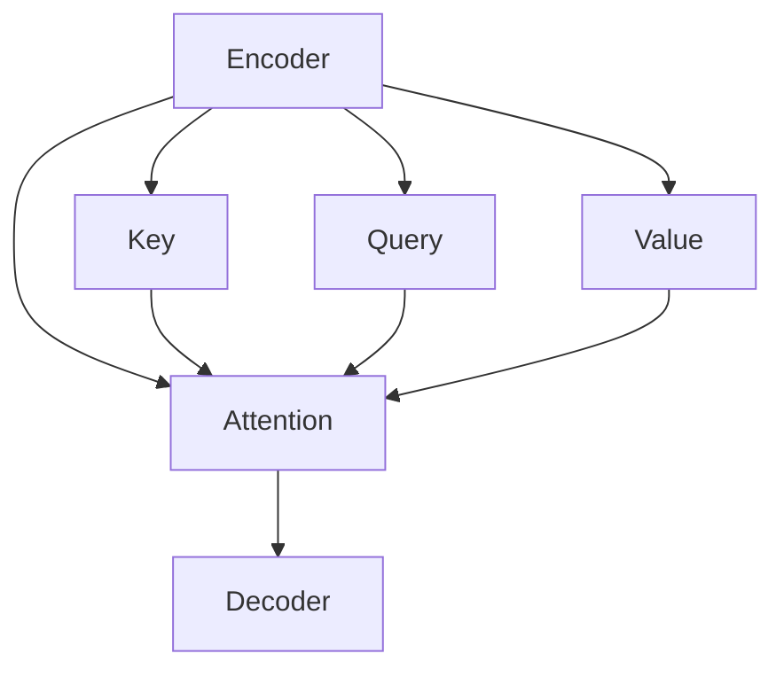
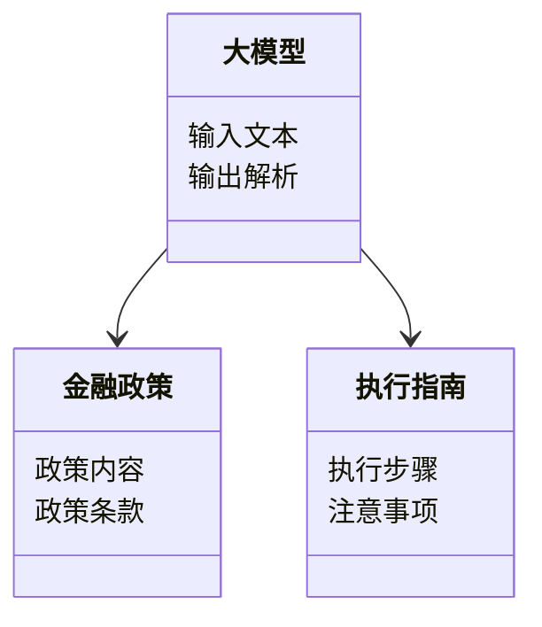
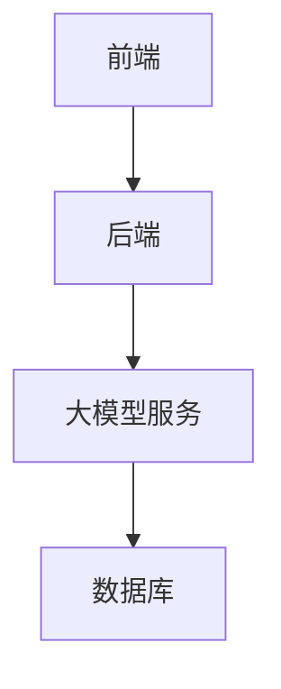
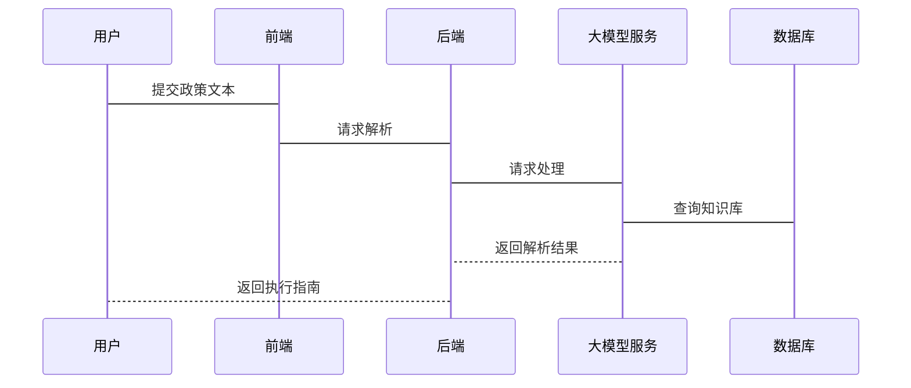

                 


# 开发基于大模型的金融政策解读与执行指南生成器

## 关键词
- 大模型
- 金融政策解读
- 执行指南生成器
- 自然语言处理
- 机器学习

## 摘要
随着人工智能技术的快速发展，大模型在金融领域的应用越来越广泛。本文将探讨如何利用大模型开发金融政策解读与执行指南生成器，通过分析系统背景、核心算法、架构设计及项目实战，详细阐述该系统的开发过程与实现细节。

---

# 第1章: 背景与概述

## 1.1 问题背景与挑战
### 1.1.1 金融政策解读的复杂性
金融政策文本通常语言复杂，涉及多个领域，解读难度大。传统的手动解读方式效率低，容易出错。

### 1.1.2 传统政策执行的痛点
政策执行过程中存在信息不对称、执行标准不统一等问题，影响政策效果。

### 1.1.3 大模型技术的潜在解决方案
大模型具备强大的自然语言处理能力，可以自动解析政策文本并生成执行指南，提高效率和准确性。

## 1.2 问题描述与目标
### 1.2.1 金融政策解读的核心任务
准确理解政策内容，识别关键条款，生成可执行的指南。

### 1.2.2 执行指南生成的关键问题
如何将政策内容转化为具体的执行步骤，确保指南的准确性和实用性。

### 1.2.3 项目目标与预期成果
开发一个基于大模型的系统，实现金融政策的自动解读与指南生成，提升政策执行效率。

## 1.3 问题解决与边界
### 1.3.1 大模型在金融领域的应用潜力
大模型可以处理大量金融文本，提取关键信息，辅助政策解读。

### 1.3.2 项目边界与功能范围
系统仅限于政策解读与指南生成，不涉及政策制定或实时市场数据处理。

### 1.3.3 解决方案的可行性分析
基于现有大模型技术，结合金融领域的知识库，解决方案在技术上是可行的。

## 1.4 概念结构与核心要素
### 1.4.1 核心概念的定义
- **大模型**：基于深度学习的自然语言处理模型，如GPT。
- **金融政策**：政府发布的经济管理文件。
- **执行指南**：指导如何具体落实政策的步骤说明。

### 1.4.2 概念属性特征对比表格
| 概念 | 属性 | 特征 |
|------|------|------|
| 大模型 | 输入 | 文本数据 |
|       | 输出 | 解析结果 |
| 金融政策 | 类型 | 法律文本 |
|         | 特性 | 专业性强 |

### 1.4.3 ER实体关系图架构
```mermaid
erd
    节点 大模型 {
        属性: 输入文本、输出解析
    }
    节点 金融政策 {
        属性: 政策内容、政策条款
    }
    节点 执行指南 {
        属性: 执行步骤、注意事项
    }
    关系: 大模型 -> 金融政策 (处理)
    关系: 大模型 -> 执行指南 (生成)
```

---

# 第2章: 大模型技术基础

## 2.1 大模型的核心原理
### 2.1.1 大模型的定义与特点
大模型是一种基于深度学习的自然语言处理模型，具有强大的上下文理解和生成能力。

### 2.1.2 大模型的训练机制
大模型通过大量的文本数据进行预训练，采用自监督学习，优化模型参数。

### 2.1.3 大模型的推理过程
输入文本经过编码器生成固定长度的向量，解码器根据向量生成输出。

## 2.2 大模型的算法原理
### 2.2.1 神经网络结构
- **编码器**：将输入文本转换为向量表示。
- **解码器**：根据向量生成输出文本。

### 2.2.2 注意力机制


### 2.2.3 梯度下降与优化算法
优化算法用于调整模型参数，最小化预测误差。

$$\text{损失函数} = \sum_{i=1}^{n} (y_i - \hat{y_i})^2$$
$$\text{优化目标} = \min L$$

## 2.3 大模型的数学模型
### 2.3.1 概率论基础
概率论是大模型的基础，用于计算文本生成的概率。

### 2.3.2 线性代数与矩阵运算
矩阵运算用于表示文本的向量表示和变换。

### 2.3.3 优化算法的数学推导
$$\text{梯度下降} = \alpha \cdot \frac{\partial L}{\partial \theta}$$
其中，$\alpha$ 是学习率，$\theta$ 是模型参数。

---

# 第3章: 金融政策解读的系统分析

## 3.1 问题场景介绍
### 3.1.1 金融政策解读的典型场景
解读复杂的金融政策文本，如货币政策、税收政策。

### 3.1.2 政策执行的常见问题
执行过程中信息不明确，导致错误或延迟。

### 3.1.3 用户需求分析
用户需要快速理解政策内容，并生成可操作的执行指南。

## 3.2 项目介绍与目标
### 3.2.1 项目背景与意义
利用大模型提升金融政策解读的效率和准确性。

### 3.2.2 项目目标与范围
开发一个基于大模型的金融政策解读系统，生成执行指南。

### 3.2.3 项目团队与分工
团队成员包括数据工程师、算法工程师和金融专家。

## 3.3 系统功能设计
### 3.3.1 领域模型类图


### 3.3.2 系统架构设计


### 3.3.3 系统接口设计
- 输入接口：接受政策文本。
- 输出接口：返回解析结果和执行指南。

### 3.3.4 系统交互流程


---

# 第4章: 大模型在金融领域的应用

## 4.1 金融政策解读的自然语言处理
### 4.1.1 文本预处理与特征提取
预处理步骤包括分词、去除停用词等。

### 4.1.2 大模型的文本生成能力
大模型可以生成自然流畅的执行指南。

### 4.1.3 政策文本的语义分析
通过语义分析理解政策的核心内容。

## 4.2 金融政策执行的自动

---

# 第5章: 项目实战

## 5.1 环境安装
- 安装Python、TensorFlow、Keras等依赖库。

## 5.2 系统核心实现
### 5.2.1 大模型的训练代码
```python
import tensorflow as tf
from tensorflow.keras import layers

model = tf.keras.Sequential([
    layers.Embedding(input_dim=10000, output_dim=100),
    layers.LSTM(64, return_sequences=True),
    layers.Dense(10, activation='softmax')
])
model.compile(optimizer='adam', loss='sparse_categorical_crossentropy')
```

### 5.2.2 政策解析的实现
```python
def parse_policy(text):
    model.predict(text)
```

## 5.3 案例分析
### 5.3.1 案例背景
解读某金融政策文本，生成执行指南。

### 5.3.2 数据处理
预处理政策文本，提取关键信息。

### 5.3.3 代码实现
调用模型生成执行指南。

## 5.4 项目小结
项目成功实现了基于大模型的金融政策解读系统，为后续优化奠定了基础。

---

# 第6章: 最佳实践与小结

## 6.1 最佳实践
- 数据清洗与特征工程是关键。
- 模型调参可以提升性能。

## 6.2 小结
本文详细介绍了基于大模型的金融政策解读系统的开发过程，涵盖背景、技术、系统设计和项目实战。

## 6.3 注意事项
确保数据安全，避免模型过拟合。

## 6.4 拓展阅读
推荐学习大模型的最新进展和金融领域的应用案例。

---

通过以上步骤，我们可以开发出一个高效、准确的金融政策解读与执行指南生成器，为金融领域带来显著的效率提升。

