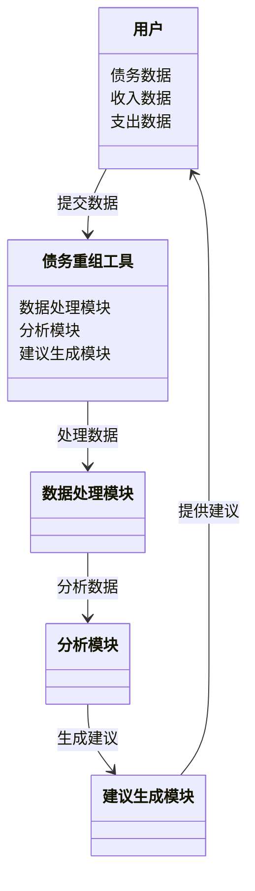
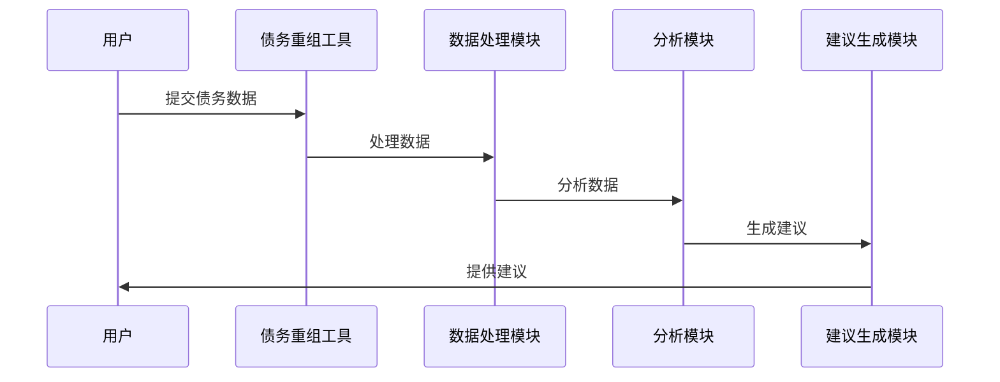

                 


# 开发智能化的个人债务重组建议工具

## 关键词：个人债务重组，人工智能，债务管理，机器学习，智能化工具

## 摘要：本文详细探讨了开发智能化的个人债务重组建议工具的过程，包括问题背景、核心概念、算法原理和系统架构设计。通过结合数学建模和机器学习算法，本文提出了基于AI的债务重组解决方案，并通过实际案例展示了工具的实现和应用。

---

# 第一部分: 个人债务重组建议工具的背景与核心概念

## 第1章: 个人债务重组问题背景

### 1.1 个人债务重组的定义与问题背景

#### 1.1.1 个人债务重组的定义
个人债务重组是指个人通过调整其债务结构、还款计划和债权人之间的关系，以达到优化债务负担、降低还款压力的目标。这一过程通常涉及与债权人协商，重新制定还款方案。

#### 1.1.2 当前个人债务重组的主要问题
- **信息不对称**：个人难以全面了解自己的债务状况和最佳还款方案。
- **复杂性**：债务重组涉及多个债权人和复杂的法律、财务问题。
- **效率低下**：传统债务重组过程繁琐，耗时长，且缺乏个性化解决方案。

#### 1.1.3 通过智能化工具解决债务重组问题的必要性
智能化工具可以通过数据分析和机器学习算法，快速提供个性化、最优的债务重组建议，帮助个人更高效地管理债务。

### 1.2 个人债务重组的核心概念

#### 1.2.1 债务重组的核心要素
- **债务总额**：所有债务的总和。
- **还款能力**：个人的收入和支出情况。
- **债权人**：债务涉及的债权人信息。
- **还款期限**：债务的还款时间安排。

#### 1.2.2 债务重组的边界与外延
- **边界**：仅考虑个人债务，不包括企业债务。
- **外延**：涉及信用评分、财务规划等领域。

#### 1.2.3 债务重组的流程与关键环节
1. 收集债务信息。
2. 分析财务状况。
3. 生成多种重组方案。
4. 评估方案可行性。
5. 提出最佳建议。

## 第2章: 个人债务重组工具的核心概念与联系

### 2.1 AI在个人债务重组中的应用原理

#### 2.1.1 AI在债务重组中的核心作用
- **数据分析**：通过机器学习算法分析债务数据，识别潜在风险。
- **预测模型**：预测还款能力，制定最优还款计划。
- **个性化建议**：根据个人情况提供定制化债务重组方案。

#### 2.1.2 基于AI的债务重组工具的工作原理
1. 收集和整理债务数据。
2. 使用机器学习模型分析数据。
3. 生成并评估多个重组方案。
4. 提供最优建议。

#### 2.1.3 AI算法在债务重组中的具体应用
- **聚类分析**：将债务分为不同类别，便于管理。
- **回归分析**：预测未来还款能力。

### 2.2 核心概念对比分析

#### 2.2.1 不同债务重组方法的对比分析
| 方法 | 优点 | 缺点 |
|------|------|------|
| 传统协商 | 简单易行 | 耗时长，缺乏个性化 |
| 机器学习模型 | 高效准确 | 需要大量数据支持 |

#### 2.2.2 AI算法在债务重组中的优势与劣势
- **优势**：快速处理大量数据，提供精准建议。
- **劣势**：依赖高质量数据，可能受到模型偏差影响。

#### 2.2.3 基于AI的债务重组工具与其他工具的对比
- **传统工具**：手动计算，效率低。
- **AI工具**：自动化、智能化，效率高。

### 2.3 债务重组工具的ER实体关系图

```mermaid
er
    actor: 用户
    tool: 债务重组工具
    debt_data: 债务数据
    recommendation: 建议方案
    relation: 用户与工具的交互
    relation: 工具与债务数据的处理
    relation: 工具与建议方案的生成
```

---

# 第二部分: 基于AI的债务重组工具算法原理

## 第3章: 基于AI的债务重组算法原理

### 3.1 债务重组问题的数学建模

#### 3.1.1 债务重组问题的数学模型
目标函数：最大化债务偿还效率，最小化还款压力。
约束条件：收入、支出、债务总额等。

#### 3.1.2 债务重组问题的约束条件
- 还款能力 ≥ 债务总额
- 还款期限 ≥ 最小还款期限

#### 3.1.3 债务重组问题的优化目标
最小化还款压力，最大化信用评分。

### 3.2 基于机器学习的债务重组算法

#### 3.2.1 机器学习在债务重组中的应用
- **监督学习**：分类债务风险。
- **无监督学习**：聚类分析债务结构。

#### 3.2.2 常见的债务重组算法选择
- **线性回归**：预测还款能力。
- **决策树**：分类债务风险。

#### 3.2.3 基于线性回归的债务重组算法实现
$$ y = \beta_0 + \beta_1x + \epsilon $$
其中，$y$是还款能力，$x$是收入，$\beta_0$和$\beta_1$是系数。

#### 3.2.4 基于决策树的债务重组算法实现
决策树通过特征分裂，分类债务风险。

### 3.3 算法原理的详细讲解

#### 3.3.1 线性回归算法的数学模型
$$ \text{最小化} \sum_{i=1}^{n} (y_i - (\beta_0 + \beta_1x_i))^2 $$

#### 3.3.2 决策树算法的工作原理
1. 选择最优特征分裂数据。
2. 递归分割数据，形成树结构。
3. 剪枝避免过拟合。

#### 3.3.3 算法实现的具体步骤
1. 数据预处理。
2. 训练模型。
3. 评估模型。
4. 应用模型生成建议。

---

## 第4章: 基于AI的债务重组工具的数学模型与公式

### 4.1 债务重组问题的数学模型

#### 4.1.1 债务重组问题的变量定义
- $D$：债务总额
- $I$：收入
- $E$：支出
- $R$：信用评分

#### 4.1.2 债务重组问题的目标函数
最大化信用评分：$$ \max R $$
最小化还款压力：$$ \min (I - E - D) $$

#### 4.1.3 债务重组问题的约束条件
- $I - E \geq 0$
- $D \geq 0$

### 4.2 基于AI的债务重组算法的数学公式

#### 4.2.1 线性回归算法的数学公式
$$ y = \beta_0 + \beta_1x + \epsilon $$

#### 4.2.2 决策树算法的数学表达
- 使用信息增益或基尼指数选择分裂特征。

### 4.3 算法的举例说明

#### 4.3.1 线性回归算法的实例分析
假设用户收入为5000元，债务总额为20000元，支出为3000元。线性回归模型预测其还款能力为2000元/月。

#### 4.3.2 决策树算法的实例分析
通过决策树分类，用户被分为高风险和低风险，提供不同的还款方案。

---

# 第三部分: 智能化个人债务重组工具的系统架构设计

## 第5章: 系统分析与架构设计方案

### 5.1 问题场景介绍
用户希望通过智能化工具优化债务管理，减少还款压力。

### 5.2 项目介绍

#### 5.2.1 系统功能设计

##### 5.2.1.1 领域模型mermaid类图


#### 5.2.1.2 系统架构设计mermaid架构图


#### 5.2.1.3 系统接口设计
- 用户接口：提交数据、查看建议。
- 服务器接口：处理数据、运行算法。

#### 5.2.1.4 系统交互mermaid序列图


### 5.3 项目实战

#### 5.3.1 环境安装
- Python 3.8+
- 机器学习库（如scikit-learn）
- 数据库（如MySQL）

#### 5.3.2 系统核心实现源代码

##### 5.3.2.1 数据处理模块
```python
import pandas as pd

def process_data(data):
    # 数据清洗和预处理
    data.dropna(inplace=True)
    data['还款能力'] = data['收入'] - data['支出']
    return data
```

##### 5.3.2.2 分析模块
```python
from sklearn.linear_model import LinearRegression

def analyze_data(data):
    model = LinearRegression()
    model.fit(data[['收入', '支出']], data['还款能力'])
    return model
```

##### 5.3.2.3 建议生成模块
```python
def generate_recommendation(model, data):
    recommendation = []
    for index, row in data.iterrows():
        predict = model.predict([[row['收入'], row['支出']]])
        recommendation.append({'预测还款能力': predict[0]})
    return recommendation
```

#### 5.3.3 代码应用解读与分析
通过上述代码，系统可以处理债务数据，训练模型，并生成个性化的还款建议。

#### 5.3.4 实际案例分析
以一个用户为例，假设其收入为5000元，支出为3000元，债务总额为20000元。模型预测其还款能力为2000元/月，建议制定分5个月还款计划。

### 5.4 项目小结
通过系统的实现，用户可以快速获得个性化的债务重组建议，显著提高效率。

---

## 第6章: 最佳实践与总结

### 6.1 最佳实践 tips
- 数据质量至关重要。
- 定期更新模型，适应变化。

### 6.2 小结
智能化的个人债务重组工具通过AI算法，帮助用户高效优化债务管理。

### 6.3 注意事项
- 保护用户隐私。
- 确保算法的准确性。

### 6.4 拓展阅读
- 探索更复杂的AI算法。
- 研究用户行为分析。

---

# 结语

开发智能化的个人债务重组建议工具是一项复杂的系统工程，需要结合数学建模、机器学习和系统架构设计。通过本文的详细讲解，读者可以深入了解开发过程，并实际应用这些技术，帮助个人更好地管理债务。

--- 

希望这篇文章能满足您的需求！如果需要进一步修改或补充，请随时告知。

