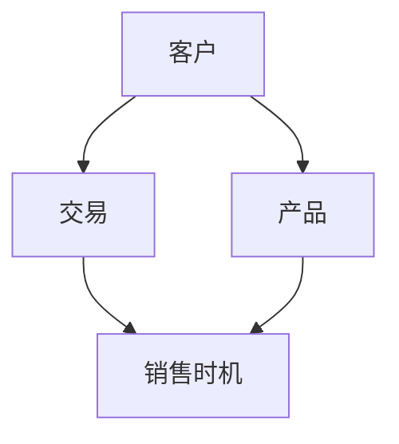
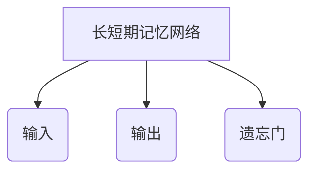
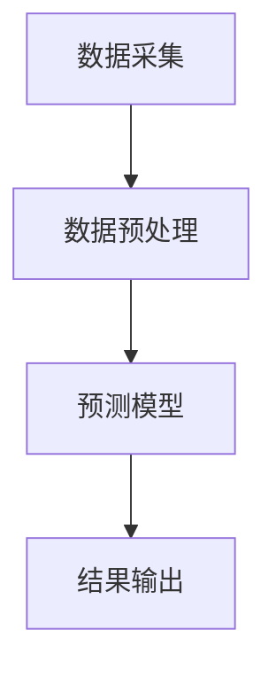
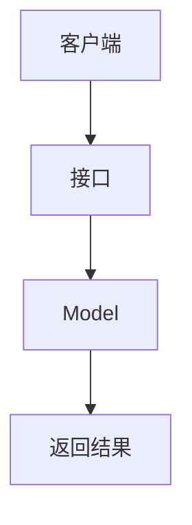

                 


# 开发智能化的金融产品交叉销售时机预测引擎

> 关键词：金融产品，交叉销售，时机预测，智能化引擎，机器学习，时间序列分析，系统架构

> 摘要：本文详细介绍了开发智能化的金融产品交叉销售时机预测引擎的核心概念、算法原理、系统架构设计及实现方案。通过分析金融交叉销售的核心问题，结合时间序列分析和机器学习技术，提出了一种基于数据驱动的预测模型，并给出了系统实现的具体步骤和代码示例。

---

# 第1章: 问题背景与描述

## 1.1 问题背景

### 1.1.1 金融产品交叉销售的定义

金融产品交叉销售是指在同一客户或客户群体中，销售多种金融产品或服务。例如，银行可能向同一客户销售存款、贷款和投资理财产品。

### 1.1.2 交叉销售在金融业务中的重要性

- 提高客户满意度和忠诚度
- 增加收入来源
- 优化资源配置
- 提升客户生命周期价值

### 1.1.3 当前交叉销售面临的挑战

- 客户行为复杂且难以预测
- 数据量大且类型多样
- 传统预测方法精度不足

## 1.2 问题描述

### 1.2.1 交叉销售时机预测的核心问题

- 如何准确预测客户购买金融产品的最佳时机
- 如何利用历史数据和实时数据进行预测

### 1.2.2 数据驱动的交叉销售预测需求

- 数据多样性：包括客户行为数据、市场数据、产品数据等
- 数据实时性：需要实时捕捉市场变化和客户行为
- 数据准确性：确保数据质量以支持精准预测

### 1.2.3 智能化预测引擎的必要性

- 提高预测效率和精度
- 实现实时预测和动态调整
- 支持复杂场景下的预测需求

## 1.3 问题解决与边界

### 1.3.1 智能化预测引擎的目标

- 提供准确的交叉销售时机预测
- 支持多种金融产品的交叉销售预测
- 实现实时预测和动态调整

### 1.3.2 边界与外延

- 系统不直接处理客户的具体交易操作
- 系统不涉及金融产品的具体定价策略
- 系统仅提供预测结果，不直接决定销售策略

### 1.3.3 核心要素组成

- 数据采集模块：收集客户行为、市场数据等
- 预测模型：基于机器学习和时间序列分析的模型
- 输出模块：将预测结果输出给业务系统

---

# 第2章: 核心概念与联系

## 2.1 引擎核心概念原理

### 2.1.1 数据驱动的预测模型

- 基于客户行为数据和市场数据，利用机器学习算法进行预测
- 数据特征：客户资产规模、交易频率、产品持有情况等

### 2.1.2 机器学习在交叉销售中的应用

- 使用分类和回归算法预测客户购买时机
- 示例：随机森林和XGBoost算法用于分类问题

### 2.1.3 时间序列分析与客户行为预测

- 利用时间序列数据预测客户行为变化
- 示例：ARIMA模型和LSTM网络用于时间序列预测

## 2.2 核心概念属性对比表

### 表2.1: 不同预测模型的特征对比

| 模型名称   | 输入数据类型 | 预测目标 | 优点 | 缺点 |
|------------|--------------|----------|------|------|
| ARIMA      | 时间序列     | 时间点   | 简单 | 对非线性数据拟合效果差 |
| LSTM       | 时间序列     | 时间点   | 捕捉长序列依赖 | 计算复杂度高 |
| XGBoost    | 标签数据     | 分类/回归 | 高精度 | 对特征工程依赖较高 |

## 2.3 ER实体关系图



---

# 第3章: 算法原理与数学模型

## 3.1 时间序列分析

### 3.1.1 时间序列预测的基本原理

时间序列预测通过分析过去的数据模式，预测未来的趋势。常用模型包括ARIMA和LSTM。

### 3.1.2 ARIMA模型

ARIMA（自回归积分滑动平均模型）适用于线性时间序列数据。

$$ARIMA(p, d, q)$$

其中，p为自回归阶数，d为差分阶数，q为移动平均阶数。

### 3.1.3 LSTM网络

LSTM（长短期记忆网络）通过记忆单元捕捉长期依赖关系。



## 3.2 机器学习模型

### 3.2.1 线性回归模型

线性回归用于预测连续型变量。

$$y = \beta_0 + \beta_1x_1 + \beta_2x_2 + \dots + \beta_nx_n$$

### 3.2.2 支持向量机

SVM用于分类和回归问题，适用于小数据集。

### 3.2.3 随机森林

随机森林通过集成学习提高模型鲁棒性。

### 3.2.4 XGBoost

XGBoost是一种高效梯度提升算法。

```python
import xgboost as xgb
model = xgb.XGBRegressor(n_estimators=100, learning_rate=0.05)
model.fit(X_train, y_train)
```

## 3.3 数学模型与公式

### 3.3.1 ARIMA模型公式

$$ARIMA(p, d, q)$$

### 3.3.2 LSTM模型公式

$$f(t) = \alpha \cdot f(t-1) + (1-\alpha) \cdot x_t$$

---

# 第4章: 系统分析与架构设计

## 4.1 问题场景介绍

### 4.1.1 金融产品交叉销售的典型场景

- 客户购买行为分析
- 市场波动对销售时机的影响
- 客户资产配置调整

### 4.1.2 引擎的应用场景

- 银行客户的产品交叉销售
- 保险产品的精准营销
- 投资理财产品的推荐

### 4.1.3 系统目标与功能

- 实现实时预测
- 提供可视化结果
- 支持多种金融产品预测

## 4.2 系统功能设计

### 4.2.1 数据采集模块

- 采集客户交易数据、市场数据和产品数据

### 4.2.2 预测模型模块

- 实现多种算法的预测功能
- 支持模型调优和部署

### 4.2.3 结果输出模块

- 将预测结果输出给业务系统

## 4.3 系统架构设计



## 4.4 接口设计与交互



---

# 第5章: 项目实战

## 5.1 环境安装与配置

- 安装Python、Pandas、Scikit-learn、XGBoost、Mermaid等工具

## 5.2 核心代码实现

### 5.2.1 数据预处理代码

```python
import pandas as pd
data = pd.read_csv('sales_data.csv')
data.head()
```

### 5.2.2 模型训练代码

```python
from sklearn.ensemble import RandomForestRegressor
model = RandomForestRegressor(n_estimators=100)
model.fit(X_train, y_train)
```

## 5.3 实际案例分析

### 5.3.1 数据分析与特征工程

- 数据清洗
- 特征选择
- 数据增强

### 5.3.2 模型训练与评估

- 训练模型
- 评估模型性能
- 调优模型参数

## 5.4 代码应用解读与分析

- 解释代码实现的每个步骤
- 分析模型的优缺点
- 提供改进建议

---

# 第6章: 最佳实践与注意事项

## 6.1 最佳实践

- 数据清洗与特征工程的重要性
- 模型调优与选择
- 系统部署与维护

## 6.2 小结

- 强调系统架构设计的重要性
- 提醒读者注意数据隐私和安全

## 6.3 注意事项

- 数据质量和完整性
- 模型的实时更新
- 系统的可扩展性

## 6.4 拓展阅读

- 推荐相关书籍和论文
- 提供在线资源和工具

---

# 结语

通过本文的详细讲解，读者可以全面了解开发智能化金融产品交叉销售时机预测引擎的核心概念、算法原理和系统架构设计。希望本文能为金融行业的技术从业者提供有价值的参考和启发。

--- 

以上是文章的完整目录大纲，涵盖了从背景介绍到系统实现的全部内容。如果需要进一步扩展某个部分的内容，请随时告知！

