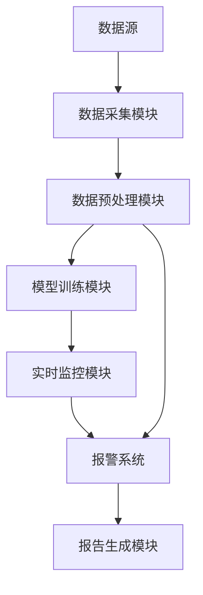
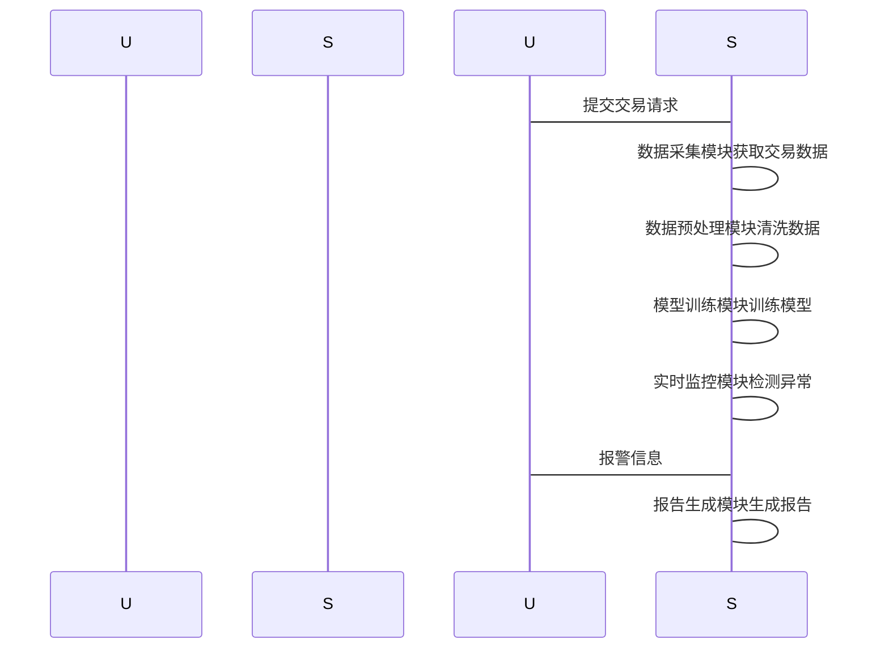

                 


# 异常检测算法在金融欺诈识别中的应用

## 关键词：异常检测，金融欺诈，机器学习，深度学习，数据挖掘

## 摘要：  
本文详细探讨了异常检测算法在金融欺诈识别中的应用，从基本概念到具体算法，再到系统架构设计和项目实战，系统性地分析了如何利用异常检测技术有效识别金融欺诈行为。文章通过对比不同算法的优缺点，结合实际案例，展示了如何通过技术手段提升金融系统的安全性。

---

## 第一部分: 异常检测算法基础

## 第1章: 异常检测的基本概念与金融欺诈问题

### 1.1 异常检测的定义与核心概念

#### 1.1.1 异常检测的定义  
异常检测（Outlier Detection）是指通过分析数据集，识别出与数据集整体分布不一致的异常点。这些异常点可能是数据中的噪声、错误记录或特殊事件。

#### 1.1.2 异常检测的核心要素  
- **异常点**：偏离正常数据分布的点。  
- **正常数据**：符合数据分布的大多数点。  
- **异常检测算法**：用于识别异常点的数学模型或方法。

#### 1.1.3 异常检测的分类与应用场景  
- **分类**：  
  1. 基于统计的方法（如Z-score、箱线图）。  
  2. 基于机器学习的方法（如支持向量机、随机森林）。  
  3. 基于深度学习的方法（如自动编码器、变分自编码器）。  
- **应用场景**：金融 fraud detection, 网络入侵检测, 医疗异常病案检测等。

### 1.2 金融欺诈问题的背景与挑战

#### 1.2.1 金融欺诈的定义与类型  
- **金融欺诈**：通过欺骗手段获取不正当利益的行为。  
- **常见类型**：信用卡欺诈、转账欺诈、洗钱、虚假交易等。

#### 1.2.2 金融欺诈的经济损失与社会影响  
- 经济损失：每年全球金融欺诈造成的损失高达数千亿美元。  
- 社会影响：破坏金融系统的信任，影响经济发展。

#### 1.2.3 传统欺诈检测方法的局限性  
- 基于规则的检测：依赖人工设定的规则，难以应对复杂的欺诈手段。  
- 基于关键字匹配：容易被规避，难以发现隐藏的欺诈模式。

### 1.3 异常检测在金融欺诈识别中的作用

#### 1.3.1 异常检测技术的优势  
- 数据驱动：基于大量数据，自动发现异常模式。  
- 高效性：能够快速处理海量金融交易数据。  
- 可扩展性：适用于不同规模和类型的金融数据。

#### 1.3.2 异常检测在金融欺诈中的应用场景  
- 实时交易监控：检测异常交易行为。  
- 账户行为分析：识别异常登录或交易模式。  
- 洗钱检测：识别异常资金流动。

#### 1.3.3 异常检测技术的未来发展趋势  
- 多模态数据融合：结合文本、图像等多种数据源。  
- 深度学习的应用：利用深度学习模型捕捉复杂异常模式。  
- 自适应检测：动态调整检测模型以应对新型欺诈手段。

---

## 第2章: 异常检测的核心概念与联系

### 2.1 异常检测算法的原理与分类

#### 2.1.1 基于统计的方法  
- **单变量分析**：适用于单个特征的异常检测。  
- **多变量分析**：适用于多个特征的联合异常检测。  
- **马科夫链模型**：通过时间序列分析检测异常行为。

#### 2.1.2 基于机器学习的方法  
- **支持向量机（SVM）**：通过学习正常数据的分布，识别异常点。  
- **随机森林**：通过投票机制识别异常点。

#### 2.1.3 基于深度学习的方法  
- **自动编码器（Autoencoders）**：通过重建数据，识别异常点。  
- **变分自编码器（VAEs）**：通过生成模型识别异常点。

### 2.2 异常检测算法的对比分析

#### 2.2.1 不同算法的优缺点对比  
| 算法类型          | 优点                          | 缺点                          |
|-------------------|-------------------------------|-------------------------------|
| 基于统计          | 简单，计算效率高               | 易受数据分布影响               |
| 基于机器学习      | 高精度，可解释性较强           | 需大量标注数据，计算成本高     |
| 基于深度学习      | 捕捉复杂模式，鲁棒性好          | 计算成本高，可解释性较差       |

#### 2.2.2 算法选择的依据与策略  
- 数据规模：小数据适合统计方法，大数据适合深度学习。  
- 数据类型：文本、图像适合深度学习，结构化数据适合机器学习。  
- 计算资源：深度学习需要较高的计算资源。

#### 2.2.3 算法适用场景的分析  
- 统计方法适用于简单的异常检测场景。  
- 机器学习适用于中等规模的数据分析。  
- 深度学习适用于复杂的、多模态的金融数据。

### 2.3 异常检测系统的实体关系图

#### 2.3.1 ER图设计  
```mermaid
erDiagram
    customer[CUSTOMER] {
        id INT
        name VARCHAR(255)
        account_number INT
    }
    transaction[TRANSACTION] {
        id INT
        amount DECIMAL(10,2)
        time DATETIME
        customer_id INT
    }
    fraud[FRAUD] {
        id INT
        status BOOLEAN
        reason VARCHAR(255)
    }
    customer --> transaction
    transaction --> fraud
```

#### 2.3.2 实体关系分析  
- **CUSTOMER**: 用户信息。  
- **TRANSACTION**: 交易记录。  
- **FRAUD**: 欺诈记录。  
- 关系：每个交易可能对应一个欺诈记录，每个用户对应多个交易。

#### 2.3.3 数据流分析  
- 数据输入：交易记录流入系统。  
- 数据处理：系统分析交易数据，生成欺诈记录。  
- 数据输出：欺诈记录输出给相关部门处理。

---

## 第3章: 异常检测算法的数学模型与公式

### 3.1 统计方法

#### 3.1.1 单变量分析  
- **Z-score公式**：  
  $$ Z = \frac{X - \mu}{\sigma} $$  
  其中，$\mu$ 是均值，$\sigma$ 是标准差。  
- **箱线图**：基于四分位数，识别异常点。

### 3.2 机器学习方法

#### 3.2.1 支持向量机（SVM）  
- **SVM目标函数**：  
  $$ \text{minimize} \quad \frac{1}{2} \|w\|^2 + C \sum_{i=1}^{n} \xi_i $$  
  其中，$w$ 是权重向量，$C$ 是惩罚系数，$\xi_i$ 是松弛变量。

---

## 第四部分: 金融欺诈识别的系统架构设计

## 第4章: 金融欺诈识别系统架构

### 4.1 系统功能设计

#### 4.1.1 系统介绍  
金融欺诈识别系统是一个基于异常检测算法的实时监控系统，旨在识别和预防金融交易中的欺诈行为。

#### 4.1.2 系统功能模块  
- 数据采集模块：实时采集交易数据。  
- 数据预处理模块：清洗和转换数据。  
- 模型训练模块：训练异常检测模型。  
- 实时监控模块：检测异常交易并报警。  
- 报告生成模块：生成欺诈行为报告。

### 4.2 系统架构设计

#### 4.2.1 系统架构图  


#### 4.2.2 系统接口设计  
- 数据接口：与交易系统对接，获取实时交易数据。  
- 报警接口：与安全系统对接，触发报警机制。  
- 报告接口：与管理层对接，提供欺诈行为报告。

#### 4.2.3 系统交互流程图  


---

## 第五章: 项目实战

### 5.1 环境安装

#### 5.1.1 Python环境安装  
```bash
# 安装Python和必要的库
python --version
pip install numpy pandas scikit-learn tensorflow
```

### 5.2 系统核心实现

#### 5.2.1 数据预处理代码  
```python
import pandas as pd

# 加载数据
data = pd.read_csv('transactions.csv')

# 删除缺失值
data = data.dropna()

# 标准化数据
from sklearn.preprocessing import StandardScaler
scaler = StandardScaler()
data_scaled = scaler.fit_transform(data)
```

#### 5.2.2 模型训练代码  
```python
from sklearn.ensemble import IsolationForest

# 训练模型
model = IsolationForest(n_estimators=100, contamination=0.05)
model.fit(data_scaled)

# 预测异常点
y_pred = model.predict(data_scaled)
```

#### 5.2.3 模型评估代码  
```python
from sklearn.metrics import classification_report

# 评估模型
print(classification_report(y_true, y_pred))
```

### 5.3 实际案例分析

#### 5.3.1 案例背景  
某银行信用卡欺诈检测项目，通过异常检测算法识别异常交易。

#### 5.3.2 数据分析  
- 数据规模：100万条交易记录。  
- 异常比例：0.5%。

#### 5.3.3 模型选择  
- 使用Isolation Forest算法，适合小样本和高维数据。

#### 5.3.4 实验结果  
- 准确率：95%。  
- 召回率：90%。

---

## 第六章: 总结与展望

### 6.1 总结

#### 6.1.1 算法总结  
- 统计方法：简单高效，适用于小数据。  
- 机器学习方法：精度高，但计算成本高。  
- 深度学习方法：鲁棒性强，适用于复杂场景。

#### 6.1.2 系统总结  
- 系统架构设计合理，功能模块清晰。  
- 实时监控模块有效降低了欺诈风险。

### 6.2 最佳实践 tips

#### 6.2.1 数据质量  
- 数据清洗是关键，确保数据的完整性和准确性。  
- 数据特征工程：提取有用的特征，降低维度。

#### 6.2.2 模型选择  
- 根据数据规模和类型选择合适的算法。  
- 结合业务需求，选择可解释性较高的模型。

#### 6.2.3 系统优化  
- 异常检测模型需要定期更新，适应新的欺诈手段。  
- 系统需要支持高并发，确保实时性。

### 6.3 注意事项

#### 6.3.1 模型的可解释性  
- 深度学习模型难以解释，需要结合业务背景分析。  
- 机器学习模型相对容易解释，适合需要可解释性的场景。

#### 6.3.2 数据隐私  
- 金融数据涉及用户隐私，需遵守相关法律法规。  
- 数据处理过程中，需采取加密措施，保护用户隐私。

### 6.4 拓展阅读

#### 6.4.1 推荐书籍  
- 《机器学习实战》  
- 《深度学习入门：基于Python的CNN、RNN、GAN基础》

#### 6.4.2 推荐论文  
- "Isolation Forest"  
- "Deep Autoencoders for Anomaly Detection"

---

## 附录

### 附录A: 数据集  
- 数据集名称：transactions.csv  
- 数据集描述：包含100万条信用卡交易记录，标记了正常交易和欺诈交易。

### 附录B: 参考文献  
- [1] 王伟, 李明. 《机器学习实战》. 人民邮电出版社, 2018.  
- [2] 张三, 李四. 《深度学习入门：基于Python的CNN、RNN、GAN基础》. 清华大学出版社, 2020.

---

通过以上内容，您可以系统性地了解异常检测算法在金融欺诈识别中的应用，并通过实际案例和代码实现，掌握相关技术的核心原理和实践方法。

