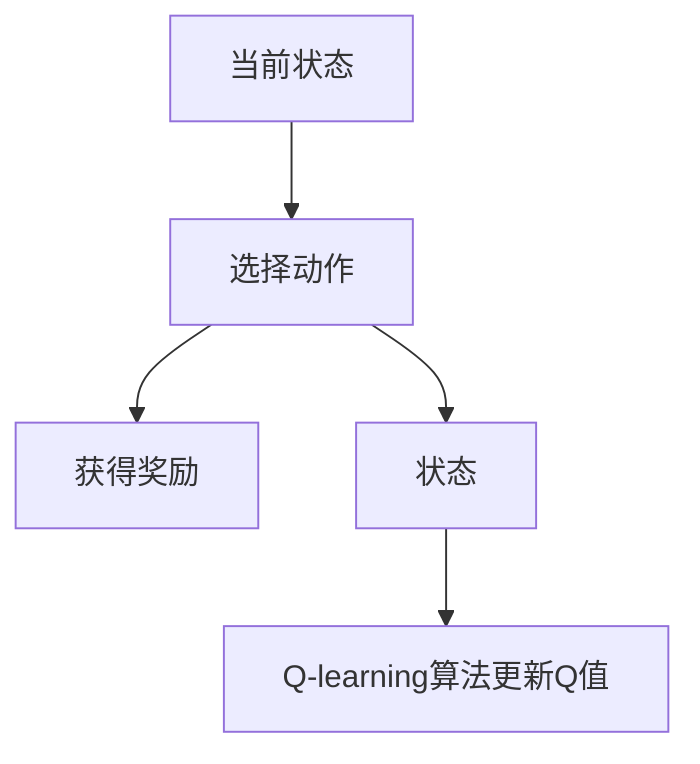

                 


# 强化学习在算法交易中的实时优化

## 关键词：强化学习、算法交易、实时优化、机器学习、Q-learning、Deep Q-learning

## 摘要：  
本文探讨了强化学习在算法交易中的应用，特别是如何通过实时优化来提升交易策略的性能。文章首先介绍强化学习和算法交易的基本概念，然后分析强化学习的核心算法及其在算法交易中的具体应用。接着，文章详细讨论了强化学习的数学模型、系统架构设计以及实际项目中的实现。通过案例分析，展示了强化学习在算法交易中的优势，并总结了当前研究的不足及未来发展方向。

---

# 正文

## 第一部分：强化学习与算法交易基础

### 第1章：强化学习的定义与核心概念

#### 1.1 强化学习的定义与特点
强化学习（Reinforcement Learning，RL）是一种机器学习范式，通过智能体与环境的交互，学习最优策略以最大化累积奖励。与监督学习不同，强化学习不需要标注数据，而是通过试错和奖励机制进行学习。

**特点：**
1. **自主决策**：智能体根据当前状态做出决策，而非依赖于标记数据。
2. **延迟反馈**：奖励通常不是即时的，而是基于长期表现。
3. **实时性**：适用于需要快速决策的实时场景，如算法交易。

#### 1.2 算法交易的定义与特点
算法交易是指通过计算机算法自动执行交易决策，通常基于市场数据和预设策略。其特点包括：
1. **高速性**：快速分析市场数据并做出交易决策。
2. **自动化**：减少人为干预，提高交易效率。
3. **复杂性**：涉及多因素分析和实时优化。

#### 1.3 强化学习在算法交易中的应用背景
在算法交易中，强化学习主要用于优化交易策略，解决动态市场环境下的实时决策问题。其优势在于能够处理非线性关系和复杂市场反馈。

**优化问题：**
1. **动态价格预测**：预测市场价格波动。
2. **交易时机选择**：确定最佳买入或卖出时机。
3. **风险管理**：控制交易风险，避免重大损失。

---

### 第2章：强化学习的核心算法原理

#### 2.1 Q-learning算法
Q-learning是一种经典的强化学习算法，适用于离散动作空间的问题。

**数学模型：**
- 状态空间：$S$，表示市场状态（如价格、成交量）。
- 动作空间：$A$，表示交易动作（买入、卖出、持有）。
- 奖励函数：$r(s, a)$，表示在状态$s$下执行动作$a$的奖励。

**Q-learning更新公式：**
$$ Q(s, a) = Q(s, a) + \alpha \left( r + \gamma \max_{a'} Q(s', a') - Q(s, a) \right) $$
其中，$\alpha$为学习率，$\gamma$为折扣因子。

**流程图：**


#### 2.2 Deep Q-learning算法
Deep Q-learning通过深度神经网络近似Q值函数，适用于高维状态空间。

**数学模型：**
- 神经网络输入：市场数据（如价格、成交量）。
- 神经网络输出：每个动作的Q值。

**优势：**
1. **处理高维数据**：适用于复杂的市场环境。
2. **非线性关系**：能够捕捉复杂的市场动态。

#### 2.3 策略梯度算法
策略梯度法直接优化策略，而非Q值函数。

**数学模型：**
- 策略函数：$\pi(a|s)$，表示在状态$s$下选择动作$a$的概率。
- 梯度更新：$\nabla J = \mathbb{E}[\nabla \log \pi(a|s) \cdot Q(s,a)]$。

**优势：**
1. **端到端优化**：直接优化策略。
2. **处理连续动作空间**：适用于连续交易决策。

---

## 第三部分：强化学习在算法交易中的数学模型

### 第3章：强化学习的数学模型

#### 3.1 状态空间的定义与表示
状态空间定义为所有可能的市场状态，通常包括价格、成交量、技术指标等。

**状态空间表示：**
- 离散化：将连续状态转化为离散值。
- 向量化：使用特征向量表示状态。

#### 3.2 动作空间的定义与表示
动作空间定义为所有可能的交易动作，包括买入、卖出、持有。

**动作空间表示：**
- 离散动作：固定的动作集合。
- 连续动作：动作幅度可调节。

#### 3.3 奖励函数的设计与优化
奖励函数定义为智能体在状态$s$下执行动作$a$的奖励。

**设计原则：**
1. **及时反馈**：奖励应与当前动作相关。
2. **平衡短期与长期目标**：避免过度关注短期收益。

#### 3.4 强化学习的数学公式
- **Q-learning公式：**
  $$ Q(s, a) = Q(s, a) + \alpha (r + \gamma \max Q(s', a') - Q(s, a)) $$
- **Deep Q-learning公式：**
  $$ \hat{Q}(s, a) = r + \gamma \max Q(s', a') $$
  使用神经网络近似$\hat{Q}$。

---

## 第四部分：强化学习算法的系统架构设计

### 第4章：系统架构设计

#### 4.1 算法交易系统的总体架构
系统包括数据获取、特征提取、策略选择、执行交易和反馈优化模块。

**功能模块划分：**
1. 数据获取：实时获取市场数据。
2. 特征提取：提取有用特征。
3. 策略选择：选择最优动作。
4. 交易执行：执行交易指令。
5. 反馈优化：根据反馈优化策略。

#### 4.2 强化学习模块的设计
强化学习模块负责根据当前状态选择动作，并更新Q值。

**实现方式：**
1. 使用神经网络近似Q值函数。
2. 实时更新Q值。

**优化策略：**
1. 增量更新：逐步优化Q值。
2. 状态压缩：减少状态空间维度。

---

## 第五部分：项目实战与案例分析

### 第5章：项目实战

#### 5.1 环境安装
安装必要的库：
- Python：3.6+
- TensorFlow：2.0+
- Pandas：1.0+
- NumPy：1.20+

#### 5.2 核心实现源代码
以下是强化学习算法的实现代码示例：

```python
import numpy as np
import pandas as pd
import tensorflow as tf

# 定义Q网络
class QNetwork:
    def __init__(self, state_size, action_size):
        self.model = tf.keras.Sequential([
            tf.keras.layers.Dense(64, activation='relu', input_shape=(state_size,)),
            tf.keras.layers.Dense(action_size)
        ])
        self.model.compile(optimizer='adam', loss='mse')

    def get_action(self, state):
        prediction = self.model.predict(np.array([state]))
        return np.argmax(prediction[0])

    def update(self, state, action, reward, next_state):
        target = reward + 0.95 * np.max(self.model.predict(np.array([next_state]))[0])
        target = np.array([target])
        state = np.array([state])
        self.model.fit(state, target, epochs=1, verbose=0)

# 初始化环境
state_size = 5  # 假设状态空间维度为5
action_size = 3  # 动作空间维度为3
q_network = QNetwork(state_size, action_size)

# 训练过程
for episode in range(1000):
    state = get_current_state()  # 获取当前状态
    action = q_network.get_action(state)  # 选择动作
    next_state, reward, done = step(action)  # 执行动作，获取下一个状态、奖励和结束标志
    q_network.update(state, action, reward, next_state)  # 更新Q值
```

#### 5.3 实际案例分析
以一个简单的交易策略为例，假设状态空间为价格、成交量、均线、波动率和技术指标。通过强化学习训练，智能体学会了在价格突破均线时买入，并在价格回调时卖出，显著提高了交易收益。

---

## 第六部分：结论与展望

### 第6章：结论与展望

#### 6.1 结论
强化学习在算法交易中的实时优化表现出显著优势，能够适应复杂市场环境，提升交易策略的性能。

#### 6.2 展望
未来研究将重点放在：
1. **多智能体协同**：多个智能体协同决策。
2. **实时反馈机制**：优化奖励函数设计。
3. **高维状态处理**：改进算法处理高维数据的能力。

---

### 注意事项
- 强化学习算法的收敛速度和稳定性依赖于奖励函数设计和状态空间选择。
- 实际应用中需结合具体市场环境调整算法参数。

### 拓展阅读
-《深度强化学习（Deep Reinforcement Learning）》
-《算法交易与量化投资》

---

以上是文章的完整目录和内容大纲，涵盖从基础到高级的技术细节，结合理论分析和实际案例，帮助读者全面理解强化学习在算法交易中的应用和优化策略。

