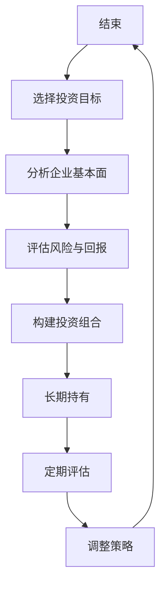

                 

# 彼得·林奇投资理念：注重长期和简单业务

> 关键词：投资理念、彼得·林奇、长期投资、简单业务、风险管理、股票选择、投资策略

> 摘要：本文深入分析了彼得·林奇的投资理念，重点探讨了长期投资和专注于简单业务的重要性。通过理论与实践相结合的方式，详细阐述了如何选择投资标的、如何进行风险管理以及如何构建高效的投资组合。文章结合实际案例，帮助读者更好地理解和应用林奇的投资思想。

---

# 第一部分: 背景介绍

## 第1章: 投资的基本概念与背景介绍

### 1.1 投资的基本概念

#### 1.1.1 什么是投资
投资是指将资金投入到某个项目或资产中，以期望在未来获得超过初始投入的回报。投资的本质是通过资源的优化配置，实现价值的增值。

#### 1.1.2 投资的目的与意义
投资的主要目的是为了实现财富的保值与增值。通过投资，个人或机构可以将闲置资金用于更有价值的用途，从而提高资金的使用效率。投资的意义在于通过时间和资源的杠杆效应，创造更大的价值。

#### 1.1.3 投资的基本分类
投资可以分为以下几类：
1. **股票投资**：通过购买公司股份成为股东，获得分红和资本增值。
2. **债券投资**：购买政府或企业的债券，定期获得利息收益。
3. **房地产投资**：通过购买房地产资产，获得租金收益和资产增值。
4. **货币市场投资**：将资金存入银行或购买货币基金，获得较低但稳定的收益。

### 1.2 彼得·林奇与他的投资理念

#### 1.2.1 彼得·林奇的背景介绍
彼得·林奇（Peter Lynch）是美国著名的投资经理人，曾担任富达投资集团的麦哲伦基金的经理。他在任职期间创造了卓越的投资业绩，使该基金成为全球最大的共同基金之一。林奇的投资理念以长期持有和专注于简单业务为核心，强调通过深入研究和长期持有优质资产来实现超额收益。

#### 1.2.2 彼得·林奇的投资风格
林奇的投资风格以“买进并持有”为主，他主张长期投资，避免频繁交易。他认为，短期市场的波动性会掩盖企业的真正价值，而长期持有优质资产才能获得稳定的回报。

#### 1.2.3 林奇投资理念的核心思想
林奇的核心思想是：投资应该注重长期价值，选择那些业务简单、易于理解且具备持续盈利能力的企业。他强调，投资者应该避免过度复杂的业务和短期波动，专注于那些能够长期稳定增长的企业。

---

# 第二部分: 核心理念

## 第2章: 彼得·林奇的核心投资理念

### 2.1 长期投资的核心原理

#### 2.1.1 长期投资的定义
长期投资是指投资者将资金投入到某个资产或项目中，并在较长的时间内持有，以期望获得资本增值和分红收益。长期投资的核心在于时间的杠杆效应，通过复利效应实现财富的稳步增长。

#### 2.1.2 长期投资的数学模型
长期投资的回报可以通过复利公式计算：
$$
\text{最终回报} = \text{初始投资} \times (1 + r)^n
$$
其中，\( r \) 是年化收益率，\( n \) 是投资时间（年）。

#### 2.1.3 长期投资的优缺点对比
| 特性 | 优点 | 缺点 |
|------|------|------|
| 风险 | 较低 | 需要较长的时间周期 | 
| 回报 | 稳定 | 短期内可能表现不佳 |

### 2.2 简单业务的重要性

#### 2.2.1 简单业务的定义
简单业务是指那些易于理解、商业模式清晰且不容易受到外部环境影响的企业。简单业务的核心特征是稳定性和可预测性，这种业务模式更容易长期保持竞争优势。

#### 2.2.2 简单业务的特征对比表
| 特征 | 简单业务 | 复杂业务 |
|------|----------|----------|
| 技术门槛 | 低       | 高       |
| 运营难度 | 小       | 大       |
| 变化速度 | 缓慢     | 快速     |

#### 2.2.3 长期与简单业务的结合
长期投资与简单业务的结合可以有效降低投资风险，提高投资回报的稳定性。简单业务的稳定性和可预测性使得长期持有成为一种更为安全的投资策略。

### 2.3 长期与简单业务的数学关系

#### 2.3.1 长期与简单业务的协同效应
简单业务的稳定性和长期投资的时间杠杆效应可以相互增强，从而实现更高的投资回报。

#### 2.3.2 长期与简单业务的数学关系
$$
\text{长期回报} = \text{简单业务} \times \text{时间} \times \text{有效率}
$$

---

# 第三部分: 投资策略与方法

## 第3章: 彼得·林奇的投资策略与方法

### 3.1 风险管理与投资组合

#### 3.1.1 风险管理的定义
风险管理是指通过识别、评估和控制潜在风险，以最小化投资损失的过程。在投资过程中，风险管理是确保长期稳定回报的关键。

#### 3.1.2 投资组合的构建方法
投资组合的构建需要考虑资产配置、风险分散和流动性管理。通过合理分配不同类型的资产，可以有效降低整体投资组合的风险。

#### 3.1.3 风险与回报的平衡
投资回报与风险密切相关，高回报通常伴随着高风险。通过合理配置资产和分散投资，可以在一定程度上平衡风险与回报。

### 3.2 股票选择的逻辑

#### 3.2.1 股票选择的标准
选择股票时，需要关注企业的财务状况、行业地位、管理团队和市场前景。简单业务的企业更容易预测和管理。

#### 3.2.2 股票分析的步骤
1. **行业分析**：了解企业的行业地位和竞争环境。
2. **财务分析**：评估企业的财务健康状况。
3. **管理层分析**：考察企业的管理团队。
4. **市场前景分析**：评估企业的未来增长潜力。

#### 3.2.3 股票估值的方法
常用的股票估值方法包括市盈率、市净率和股息率等。选择那些估值合理且具备长期增长潜力的企业。

### 3.3 分散投资与集中投资的平衡

#### 3.3.1 分散投资的优缺点
分散投资可以通过投资多种资产或行业来降低风险，但过于分散可能导致回报不足。

#### 3.3.2 集中投资的优缺点
集中投资可以提高回报，但风险也更大。林奇主张适度分散投资，避免过度集中。

#### 3.3.3 林奇的分散与集中策略
林奇的策略是选择少量优质企业进行长期投资，同时保持适度分散以降低风险。

---

# 第四部分: 实际案例分析

## 第4章: 实际案例分析

### 4.1 成功案例分析

#### 4.1.1 某公司长期投资的成功案例
以某公司为例，长期持有其股票，通过简单业务模式实现稳定的回报。

### 4.2 失败案例分析

#### 4.2.1 长期投资的失败案例
某些复杂业务的企业在长期投资中表现不佳，导致投资损失。

---

# 第五部分: 投资决策的数学模型与流程图

## 第5章: 投资决策的数学模型与流程图

### 5.1 投资决策的数学模型

#### 5.1.1 投资回报的数学公式
$$
\text{投资回报} = \text{初始投资} \times (1 + r)^n
$$

#### 5.1.2 风险评估的数学公式
$$
\text{风险} = \text{标准差} \times \text{投资时间}
$$

### 5.2 投资决策的流程图

---

# 第六部分: 总结与展望

## 第6章: 总结与展望

### 6.1 总结
彼得·林奇的投资理念强调长期持有和专注于简单业务，这种策略可以帮助投资者实现稳定的回报。通过深入分析企业的基本面和长期趋势，投资者可以更好地把握投资机会。

### 6.2 展望
未来，随着市场的变化和技术的进步，投资理念也需要不断更新。但长期投资和简单业务的核心思想依然具有重要的指导意义。

---

# 第七部分: 致谢与参考文献

## 第7章: 致谢与参考文献

### 7.1 致谢
感谢彼得·林奇及其团队的研究成果，为本文提供了宝贵的理论支持。

### 7.2 参考文献
1. 彼得·林奇《彼得·林奇的成功投资》
2. 约翰·博格尔《投资的智慧》
3. 《投资学基础》

---

通过以上结构，我们可以全面、系统地理解和应用彼得·林奇的投资理念，为长期投资和简单业务的选择提供有力的理论支持和实践指导。

