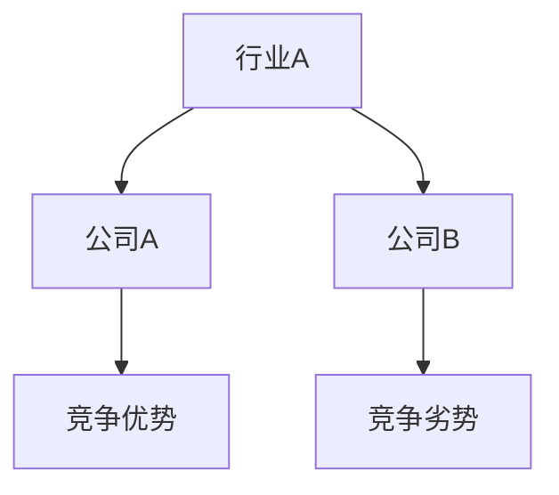
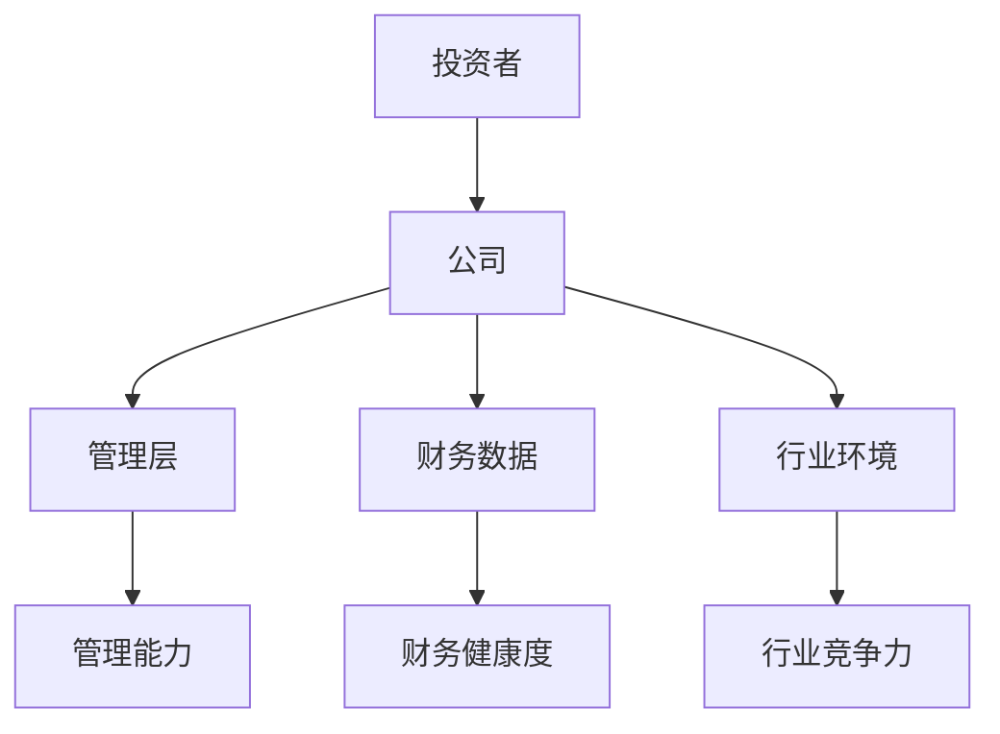
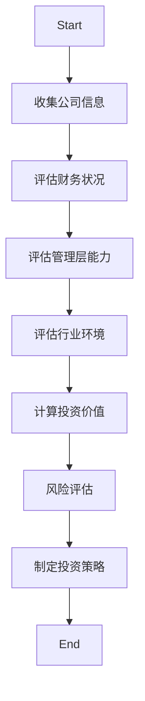
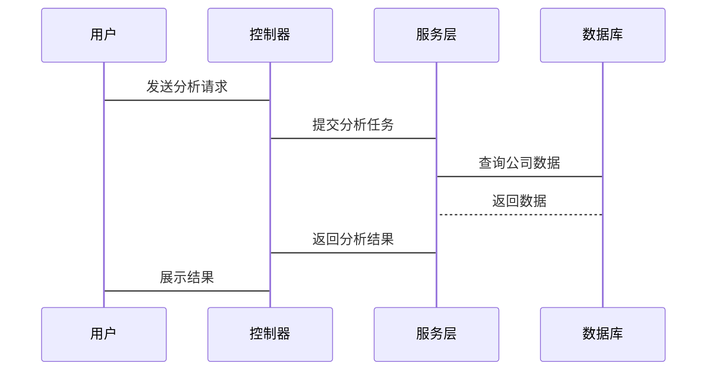

                 


# 彼得·林奇的实地调研投资法

## 关键词：彼得·林奇、实地调研、投资方法、基本面分析、风险管理

## 摘要：彼得·林奇作为投资界的重要人物，其实地调研投资法强调通过深入研究公司基本面来进行投资决策。本文详细介绍了该方法的核心概念、算法原理、系统架构及项目实战，帮助读者理解如何通过实地调研来优化投资策略。

---

## 第一部分：背景介绍

### 第1章：彼得·林奇投资法的背景与核心理念

#### 1.1 投资界的传奇：彼得·林奇的生平与成就
彼得·林奇是美国著名投资经理人，曾管理富达麦哲伦基金，创造了辉煌的投资业绩。他的投资哲学强调深入研究公司基本面，尤其是通过实地调研来评估公司的健康状况和未来潜力。林奇的成功使他成为投资界的传奇人物，其方法论对后来的投资者产生了深远影响。

#### 1.2 实地调研投资法的定义与特点
实地调研投资法是指投资者通过亲自走访公司，与管理层、员工和客户交流，收集一手信息，评估公司的财务状况、管理能力及行业地位。这种方法不同于依赖市场数据或财务报表的传统投资方法，强调实地考察的真实性和全面性。

#### 1.3 实地调研投资法的适用场景与边界
实地调研适用于需要深入了解公司基本面的情况，尤其在评估中小型企业或新兴行业时更为有效。然而，该方法也存在耗时长、成本高的缺点，因此在应用时需结合其他投资策略，避免过度依赖单一方法。

---

## 第2章：实地调研投资法的核心概念与联系

### 2.1 实地调研的核心概念
实地调研的核心在于通过多维度分析评估公司的投资价值。首先，公司基本面分析包括财务数据、行业地位等；其次，管理层评估关注管理团队的能力和决策风格；最后，行业分析帮助理解公司所处的竞争环境。

### 2.2 实地调研的核心要素对比
通过对比不同公司的财务数据、管理能力和行业竞争力，投资者可以更清晰地评估投资目标。例如，使用表格对比公司收入增长、利润率及管理团队的稳定性。

#### 2.2.1 公司财务数据对比表
| 公司名称 | 收入增长率 | 利润率 | 债务比率 |
|----------|------------|--------|----------|
| 公司A    | 15%        | 10%    | 30%      |
| 公司B    | 20%        | 8%     | 25%      |

#### 2.2.2 管理层能力评估表
| 公司名称 | CEO背景 | 管理团队稳定性 | 战略决策能力 |
|----------|----------|---------------|--------------|
| 公司A    | 有经验    | 稳定           | 良好          |
| 公司B    | 新手      | 不稳定         | 一般          |

#### 2.2.3 行业竞争格局对比图


### 2.3 实地调研的ER实体关系图


---

## 第3章：实地调研投资法的算法原理

### 3.1 投资决策模型的构建
实地调研投资法可以通过构建多因素分析模型和风险评估模型来优化投资决策。这些模型结合定量分析和定性评估，帮助投资者做出更为科学的投资决策。

#### 3.1.1 多因素分析模型
多因素分析模型综合考虑公司的财务状况、管理能力和行业竞争力。公式如下：
$$
\text{投资价值} = \text{财务评分} \times 0.4 + \text{管理评分} \times 0.3 + \text{行业评分} \times 0.3
$$

#### 3.1.2 风险评估模型
风险评估模型用于衡量投资的风险程度，公式如下：
$$
\text{风险等级} = \begin{cases}
低 & \text{若财务健康，管理稳定，行业风险低} \\
中 & \text{若财务稳健，管理一般，行业风险中等} \\
高 & \text{若财务恶化，管理不善，行业风险高}
\end{cases}
$$

### 3.2 投资决策模型的数学公式
#### 3.2.1 风险调整后的回报公式
$$
\text{风险调整回报} = \text{预期回报} - \text{风险溢价}
$$

#### 3.2.2 投资组合优化公式
$$
\text{最优投资组合} = \argmin_{w} \left( w^T \Sigma w - \lambda w^T \mathbf{1} \right)
$$
其中，$\Sigma$为协方差矩阵，$w$为投资权重向量，$\lambda$为风险厌恶系数。

### 3.3 投资决策流程图


---

## 第4章：实地调研投资法的系统分析与架构设计

### 4.1 系统功能设计
投资管理系统需要具备数据采集、分析评估、策略制定等功能。系统功能模块包括：
- 数据采集模块：收集公司财务数据、管理层信息等。
- 分析评估模块：评估公司基本面、管理能力和行业竞争力。
- 投资策略模块：基于评估结果制定投资策略。

### 4.2 系统架构设计


### 4.3 系统接口设计
系统提供RESTful API接口，方便与其他投资平台集成。主要接口包括：
- GET /companies：获取公司列表
- POST /analyze：提交分析请求
- GET /results：获取分析结果

### 4.4 系统交互流程


---

## 第5章：实地调研投资法的项目实战

### 5.1 环境安装与配置
为了进行实地调研分析，需安装必要的工具和库，包括Python、Pandas、Matplotlib等。

### 5.2 核心代码实现
以下是投资分析系统的Python代码示例：

```python
import pandas as pd

def analyze_company(finance_data, management_score, industry_score):
    investment_value = (finance_data['revenue_growth'] * 0.4 +
                        management_score * 0.3 +
                        industry_score * 0.3)
    return investment_value

# 示例数据
finance_data = {
    'revenue_growth': 0.2,
    'profit_margin': 0.15
}
management_score = 0.7  # 管理评分，0-1之间
industry_score = 0.6    # 行业评分，0-1之间

result = analyze_company(finance_data, management_score, industry_score)
print(f"投资价值：{result}")
```

### 5.3 实际案例分析
以一家中型制造企业为例，分析其投资价值：
- 财务数据：收入增长20%，利润率15%，债务比率40%
- 管理团队：经验丰富，团队稳定
- 行业环境：行业增长潜力大，竞争适度

计算投资价值：
$$
\text{投资价值} = 0.2 \times 0.4 + 0.7 \times 0.3 + 0.6 \times 0.3 = 0.08 + 0.21 + 0.18 = 0.47
$$
投资价值评分为0.47，属于中等偏高，建议关注。

---

## 第6章：实地调研投资法的最佳实践与小结

### 6.1 小结
实地调研投资法通过全面分析公司基本面，帮助投资者做出更为明智的投资决策。结合定量分析和定性评估，该方法在评估公司价值时具有独特的优势。

### 6.2 注意事项
- 实地调研耗时较长，需合理规划时间
- 需结合其他投资策略，避免单一化
- 保持持续学习，更新行业知识

### 6.3 拓展阅读
- 彼得·林奇的书籍：《彼得·林奇的成功投资》
- 相关投资策略：价值投资、成长投资

---

## 结语
通过系统地学习和实践，投资者可以掌握彼得·林奇的实地调研投资法，提升投资决策的科学性和准确性。未来，随着投资环境的变化，这一方法仍将是投资者的重要工具之一。

