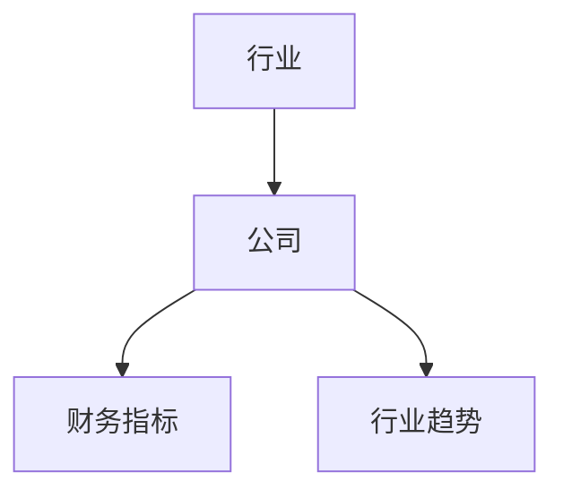
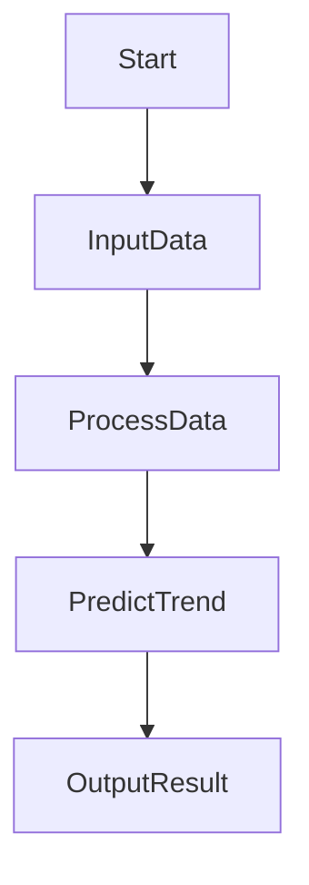
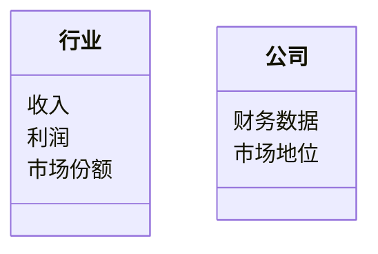
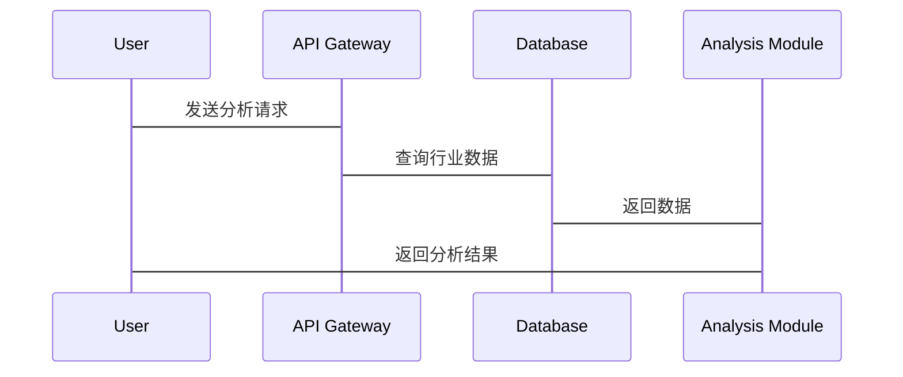

                 


# 彼得·林奇的行业分析方法论

> 关键词：彼得·林奇，行业分析，投资策略，基本面分析，趋势预测，数学模型，系统架构

> 摘要：本文深入探讨彼得·林奇的行业分析方法论，从行业分析的基本概念、核心指标、趋势预测方法、数学模型、系统架构设计到实战案例，全面解析其行业分析的策略和技巧。通过详细讲解基本面分析、行业趋势预测、数学模型的构建和系统架构设计，本文旨在帮助读者掌握彼得·林奇的行业分析方法，并将其应用于实际投资中。

---

# 第1章: 行业分析与投资概述

## 1.1 行业分析的重要性

### 1.1.1 什么是行业分析
行业分析是通过对某个行业的市场结构、竞争格局、发展趋势和财务数据进行研究，以评估行业内公司的投资价值。彼得·林奇认为，成功的投资不仅需要分析公司本身，还需要深入研究其所处的行业环境。

### 1.1.2 行业分析在投资中的作用
行业分析能够帮助投资者：
1. 识别行业内的优势企业。
2. 判断行业的成长潜力。
3. 评估行业风险。
4. 优化投资组合。

### 1.1.3 彼得·林奇的行业分析方法论
彼得·林奇强调，行业分析是投资决策的基础。他通过分析行业的基本面、竞争格局和未来趋势，来选择具有长期增长潜力的行业和公司。

---

## 1.2 彼得·林奇的背景与投资理念

### 1.2.1 彼得·林奇的生平简介
彼得·林奇（Peter Lynch）是美国著名的投资经理，以其在富达基金（Fidelity Funds）的卓越表现而闻名。他被誉为“共同基金先生”，曾管理麦哲伦基金（Magellan Fund），取得了令人瞩目的投资业绩。

### 1.2.2 林奇的投资哲学
林奇的投资哲学主要包括：
1. 长期投资：关注公司和行业的长期增长潜力。
2. 基本面分析：通过分析公司的财务数据和行业趋势，寻找低估的投资机会。
3. 分散投资：避免过度集中于某一行业或公司。

### 1.2.3 林奇对行业分析的重视
林奇认为，行业分析是投资决策的核心。他通过分析行业的财务指标、市场地位和竞争优势，来判断行业的投资价值。

---

## 1.3 本章小结
本章介绍了行业分析的重要性，以及彼得·林奇的行业分析方法论。行业分析是投资决策的基础，而林奇的投资哲学为行业分析提供了重要的指导。

---

# 第2章: 行业分析的核心概念与联系

## 2.1 核心概念：基本面分析

### 2.1.1 什么是基本面分析
基本面分析是通过对公司的财务数据、行业地位和市场环境进行分析，评估其内在价值。基本面分析的核心指标包括市盈率（PE）、市净率（PB）、股息率等。

### 2.1.2 行业基本面的核心指标
行业基本面的核心指标包括：
1. 收入和利润：行业的收入和利润增长率。
2. 市场份额：行业内主要公司的市场份额。
3. 行业集中度：行业内主要企业的数量及其市场占有率。

### 2.1.3 行业与公司基本面的关系
行业基本面影响公司的基本面。例如，一个高增长的行业可能带动行业内公司的业绩增长。

---

## 2.2 行业趋势分析

### 2.2.1 行业生命周期理论
行业生命周期包括导入期、成长期、成熟期和衰退期。不同阶段的行业具有不同的投资价值。

### 2.2.2 行业发展趋势的判断方法
行业发展趋势的判断方法包括：
1. 市场需求分析：通过研究市场需求的变化，判断行业的未来趋势。
2. 技术进步：技术进步可能改变行业的竞争格局。
3. 政策影响：政策变化对行业的影响。

### 2.2.3 彼得·林奇的行业趋势分析框架
林奇通过分析行业的市场需求、技术进步和政策变化，判断行业的未来趋势。

---

## 2.3 核心概念对比表格

### 表2-1：不同行业的核心指标对比

| 行业 | 收入增长率 | 利润率 | 市场份额 | 行业集中度 |
|------|------------|--------|----------|------------|
| 高 tech | 20% | 15% | 30% | 高       |
| 零售   | 5% | 8% | 20% | 中       |

---

## 2.4 行业实体关系图

### Mermaid 图


---

## 2.5 本章小结
本章介绍了基本面分析和行业趋势分析的核心概念，并通过对比表格和Mermaid图展示了行业与公司的关系。

---

# 第3章: 行业分析的算法原理

## 3.1 基于基本面的行业分析模型

### 3.1.1 模型概述
基于基本面的行业分析模型通过分析行业的财务指标，评估行业的投资价值。

### 3.1.2 模型输入与输出
- 输入：行业的财务数据、市场数据。
- 输出：行业的投资价值评分。

### 3.1.3 模型的数学公式
$$ PE = \frac{P}{E} $$
其中，P为股票价格，E为每股收益。

---

## 3.2 行业趋势预测算法

### 3.2.1 时间序列分析
时间序列分析通过研究历史数据，预测未来的行业趋势。

### 3.2.2 算法实现
```python
import pandas as pd
import numpy as np

def calculate_pe(stock_price, earnings):
    return stock_price / earnings

def calculate_peg(pe, growth_rate):
    return pe / growth_rate
```

### 3.2.3 算法流程图


---

## 3.4 本章小结
本章介绍了基于基本面的行业分析模型和时间序列分析算法，并通过Python代码展示了算法的实现。

---

# 第4章: 数学模型与公式详解

## 4.1 常用行业分析指标

### 4.1.1 市盈率（PE）

市盈率是衡量股票价值的重要指标，公式为：
$$ PE = \frac{P}{E} $$

---

## 4.2 市盈率增长比（PEG）

市盈率增长比是市盈率与公司盈利增长率的比率，公式为：
$$ PEG = \frac{PE}{Growth \ Rate} $$

---

## 4.3 本章小结
本章详细讲解了市盈率和市盈率增长比的公式，并通过实例展示了其应用。

---

# 第5章: 系统分析与架构设计方案

## 5.1 问题场景介绍
本文构建一个行业分析系统，帮助投资者分析不同行业的投资价值。

## 5.2 系统功能设计

### 5.2.1 领域模型


### 5.2.2 系统架构设计
```mermaid
graph TD
    User --> API Gateway
    API Gateway --> Database
    Database --> Analysis Module
    Analysis Module --> Result
```

---

## 5.3 系统接口设计
系统接口包括数据输入、分析请求和结果输出。

---

## 5.4 系统交互序列图


---

## 5.5 本章小结
本章介绍了行业分析系统的架构设计和接口设计。

---

# 第6章: 项目实战

## 6.1 环境安装
安装必要的Python库：
```bash
pip install pandas numpy
```

## 6.2 核心代码实现

### 6.2.1 行业分析代码
```python
import pandas as pd
import numpy as np

def calculate_pe(stock_price, earnings):
    return stock_price / earnings

def calculate_peg(pe, growth_rate):
    return pe / growth_rate

# 示例数据
data = {
    '公司': ['A', 'B', 'C'],
    '股价': [100, 80, 120],
    '每股收益': [20, 15, 30],
    '增长率': [0.2, 0.15, 0.25]
}

df = pd.DataFrame(data)

pe_values = []
peg_values = []

for i in range(len(df)):
    pe = calculate_pe(df['股价'][i], df['每股收益'][i])
    peg = calculate_peg(pe, df['增长率'][i])
    pe_values.append(pe)
    peg_values.append(peg)

df['PE'] = pe_values
df['PEG'] = peg_values

print(df)
```

## 6.3 案例分析
以科技行业为例，分析公司的PE和PEG值，判断其投资价值。

---

## 6.4 本章小结
本章通过实际案例展示了行业分析系统的实现过程。

---

# 第7章: 最佳实践与总结

## 7.1 最佳实践
- 定期更新行业数据。
- 结合多种分析方法进行综合判断。

## 7.2 小结
彼得·林奇的行业分析方法论为投资者提供了重要的指导。通过基本面分析和趋势预测，投资者可以更好地评估行业的投资价值。

## 7.3 注意事项
- 数据来源的可靠性。
- 分析模型的局限性。

## 7.4 拓展阅读
建议阅读彼得·林奇的《彼得·林奇的成功投资》。

---

# 附录: 参考文献

1. 彼得·林奇. 《彼得·林奇的成功投资》
2. 股票投资分析手册

---

# 结语

通过本文的详细讲解，读者可以掌握彼得·林奇的行业分析方法论，并将其应用于实际投资中。

