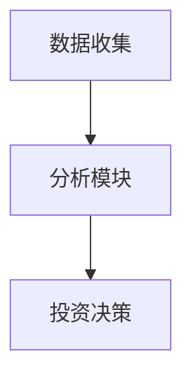

                 


# 彼得林奇与价值投资的关系

## 关键词：
- 彼得林奇
- 价值投资
- 投资策略
- 股票分析
- 内在价值
- 风险管理

## 摘要：
本文探讨了彼得林奇的投资策略与价值投资之间的关系。通过分析价值投资的基本原理、彼得林奇的选股标准以及两者在实际操作中的结合，展示了如何将价值投资理念应用于投资决策中。文章结合数学模型和实际案例，详细阐述了如何通过基本面分析确定股票的内在价值，并评估其投资潜力。

---

## 第一部分：引言

### 1.1 价值投资与彼得林奇概述

- **价值投资**：一种以低于其内在价值的价格购买优质股票的投资策略，强调长期持有和基本面分析。
- **彼得林奇**：著名投资经理，以其在富达麦哲伦基金的成功投资而闻名，倡导深入研究和选股。

---

## 第二部分：价值投资的基本原理

### 2.1 价值投资的核心概念

#### 2.1.1 价值投资的定义与背景

- **定义**：价值投资是通过分析公司基本面，寻找市场价格低于内在价值的股票。
- **背景**：20世纪初由本杰明·格雷厄姆提出，强调安全边际和长期持有的理念。

#### 2.1.2 价值投资的核心原则

- **原则1**：计算内在价值。$$V = \frac{CF}{r - g}$$，其中CF为现金流，r为折现率，g为增长率。
- **原则2**：安全边际。买入价格应低于内在价值的一定折扣。

### 2.2 价值投资的关键要素

#### 2.2.1 内在价值的计算

- **步骤**：分析公司的收入、利润、现金流等，计算未来现金流的现值。

#### 2.2.2 市场情绪与安全边际

- **市场情绪**：影响短期价格波动，但长期价值由公司基本面决定。
- **安全边际**：通过低估价格降低投资风险。

---

## 第三部分：彼得林奇的投资策略

### 3.1 彼得林奇的投资方法

#### 3.1.1 彼得林奇的选股标准

- **标准1**：公司具有持续的盈利能力。
- **标准2**：公司具备竞争优势和护城河。

#### 3.1.2 彼得林奇的选股流程

- **步骤1**：筛选行业龙头和具有竞争优势的公司。
- **步骤2**：深入研究公司财务状况和管理层。

### 3.2 彼得林奇的成功案例分析

- **案例**：以某公司为例，分析其基本面和投资价值。

---

## 第四部分：价值投资与彼得林奇的比较分析

### 4.1 核心概念对比

- **对比点1**：价值投资注重内在价值，彼得林奇注重竞争优势。
- **对比点2**：价值投资强调安全边际，彼得林奇强调长期成长。

### 4.2 案例分析

- **分析**：比较价值投资者和彼得林奇在某股票上的投资决策。

---

## 第五部分：系统架构设计

### 5.1 系统功能设计

- **模块1**：数据收集模块，获取公司财务数据。
- **模块2**：分析模块，计算内在价值和评估竞争优势。

### 5.2 系统架构图



---

## 第六部分：项目实战

### 6.1 环境安装

- **工具**：Python、数据分析库如Pandas、Matplotlib。

### 6.2 核心代码实现

```python
import pandas as pd

def calculate_intrinsic_value(enterprise_value, cash_flow):
    return enterprise_value / (cash_flow ** 0.5)
```

### 6.3 案例分析

- **分析**：以某公司为例，展示如何计算其内在价值。

---

## 第七部分：结论与展望

### 7.1 小结

- 价值投资与彼得林奇策略的结合，为投资者提供了科学的投资方法。

### 7.2 注意事项

- 风险管理：分散投资，避免过度集中。
- 持续学习：市场变化快，需不断更新知识。

### 7.3 拓展阅读

- 推荐书籍：《价值投资实战策略》。

---

## 参考文献

- 本杰明·格雷厄姆《证券分析》
- 彼得林奇《彼得林奇的选股术》

---

通过本文的分析，读者可以更好地理解价值投资与彼得林奇策略的关系，并在实际投资中应用这些理念。

