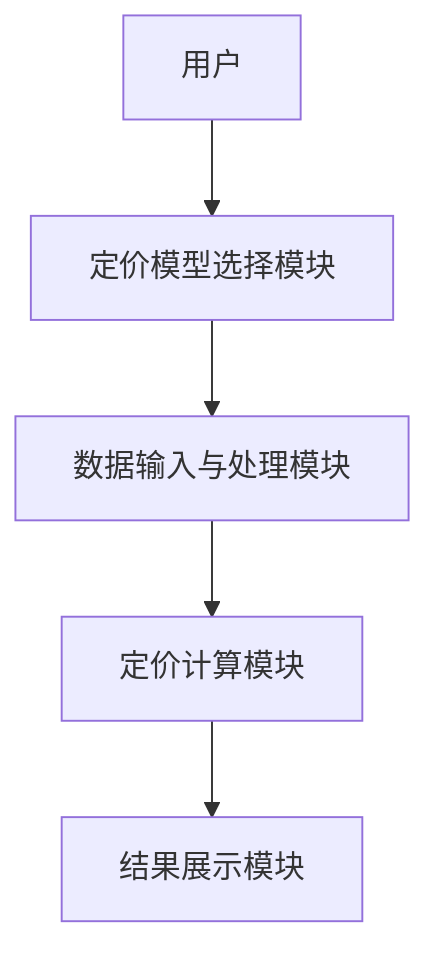

                 


# 彼得林奇如何分析公司的产品定价策略

## 关键词：定价策略、彼得·林奇、定价模型、成本加成定价、边际收益定价

## 摘要：本文深入分析了彼得·林奇如何通过基本面分析、行业趋势和财务数据来制定定价策略。文章详细探讨了定价模型的数学公式、定价策略的影响因素以及系统架构设计，结合实际案例，为读者提供了全面的定价策略分析方法。

---

## 第1章: 定价策略的基本概念

### 1.1 定价策略的背景与意义
#### 1.1.1 产品定价的基本原理
产品定价是企业核心竞争力的重要组成部分，直接影响企业的利润和市场份额。彼得·林奇认为，定价策略不仅仅是数字游戏，而是对企业价值的深刻理解。

#### 1.1.2 定价策略对企业的重要性
- **利润最大化**：合理定价可以最大化企业利润。
- **市场竞争力**：定价过高或过低都会影响市场竞争力。
- **品牌价值**：价格反映了品牌价值和市场定位。

#### 1.1.3 彼得·林奇定价分析的核心观点
彼得·林奇强调，定价策略应基于产品的实际成本、市场需求和行业竞争环境，通过深入分析找到最优价格点。

### 1.2 定价策略的影响因素
#### 1.2.1 成本因素
- **固定成本**：如厂房、设备等。
- **变动成本**：如原材料、人工成本等。

#### 1.2.2 市场需求
- **需求弹性**：价格变化对需求的影响程度。
- **目标客户**：不同客户群体的价格敏感度不同。

#### 1.2.3 竞争环境
- **竞争对手定价**：分析竞争对手的定价策略。
- **市场结构**：垄断、寡头垄断、完全竞争等市场结构影响定价策略。

#### 1.2.4 产品生命周期
- **引入期**：高价还是低价？
- **成长期**：快速扩大市场份额。
- **成熟期**：稳定价格，增加利润。
- **衰退期**：降价去库存。

### 1.3 定价策略的分类
#### 1.3.1 成本导向定价
- **成本加成定价法**：在成本基础上增加一定比例的加成。

#### 1.3.2 需求导向定价
- **价值定价法**：基于产品的实际价值定价。

#### 1.3.3 竞争导向定价
- **随行就市定价法**：根据市场价格变化调整定价。

---

## 第2章: 定价模型与数学分析

### 2.1 定价模型的基本原理
定价模型是定价策略的核心工具，通过数学公式量化价格、成本、需求和利润之间的关系。

#### 2.1.1 成本加成定价模型
- **公式**：$$ \text{价格} = \text{单位成本} \times (1 + \text{加成率}) $$
- **案例分析**：假设某产品的单位成本为100元，加成率为20%，则价格为120元。

#### 2.1.2 增量收益定价模型
- **公式**：$$ \text{价格} = \text{边际成本} + \text{边际收益} $$
- **案例分析**：假设边际成本为50元，边际收益为30元，则价格为80元。

### 2.2 定价模型的数学公式
- **成本加成定价公式**
  $$ \text{价格} = \text{成本} \times (1 + \text{加成率}) $$
- **增量收益定价公式**
  $$ \text{价格} = \text{边际成本} + \text{边际收益} $$

### 2.3 定价模型的优缺点对比
| 模型          | 优点                          | 缺点                          |
|---------------|-------------------------------|-------------------------------|
| 成本加成定价  | 简单易懂，考虑了成本因素      | 忽略市场需求和竞争因素        |
| 增量收益定价  | 考虑了边际成本和收益变化      | 计算复杂，难以快速决策        |

### 2.4 本章小结
定价模型是定价策略的重要工具，选择合适的模型需要综合考虑成本、需求和竞争因素。

---

## 第3章: 彼得·林奇的定价分析方法

### 3.1 彼得·林奇定价分析的核心框架
#### 3.1.1 基于基本面的定价分析
- **成本分析**：分析产品的固定成本和变动成本。
- **需求分析**：了解目标客户的需求弹性。
- **竞争分析**：研究竞争对手的定价策略。

#### 3.1.2 基于行业趋势的定价分析
- **行业生命周期**：不同阶段的定价策略不同。
- **市场趋势**：分析行业发展趋势，调整定价策略。

#### 3.1.3 基于财务数据的定价分析
- **利润率分析**：确保定价能够覆盖成本并产生利润。
- **投资回报分析**：定价策略应考虑投资回报率。

### 3.2 定价分析的步骤与流程
1. **确定产品成本**：计算产品的固定成本和变动成本。
2. **分析市场需求**：了解目标客户的需求弹性。
3. **评估竞争环境**：研究竞争对手的定价策略。
4. **制定定价策略**：根据分析结果制定定价策略。
5. **监控与调整**：定期监控市场变化，调整定价策略。

### 3.3 彼得·林奇定价分析的案例
#### 3.3.1 案例一：成本加成定价法
某公司生产成本为100元，加成率为20%，则价格为120元。

#### 3.3.2 案例二：需求导向定价法
某产品的市场需求弹性较高，采用价值定价法，价格定为150元，高于成本加成定价。

#### 3.3.3 案例三：竞争导向定价法
某行业竞争激烈，采用随行就市定价法，价格与竞争对手持平。

### 3.4 本章小结
彼得·林奇的定价分析方法注重基本面、行业趋势和财务数据的综合分析，帮助企业制定科学的定价策略。

---

## 第4章: 定价策略的系统架构设计

### 4.1 系统功能设计
#### 4.1.1 定价模型选择模块
- 提供多种定价模型，如成本加成定价、价值定价等。

#### 4.1.2 数据输入与处理模块
- 输入成本、需求、竞争等数据，进行数据清洗和处理。

### 4.2 系统架构设计


### 4.3 项目实战
#### 4.3.1 环境安装
- 安装Python和相关库（如pandas、numpy）。

#### 4.3.2 核心代码实现
```python
import pandas as pd
import numpy as np

def cost_based_pricing(cost, markup):
    return cost * (1 + markup)

def value_based_pricing(value, competitor_price):
    return max(value, competitor_price * 0.95)

# 示例数据
cost = 100
markup = 0.2
print(cost_based_pricing(cost, markup))  # 输出：120
print(value_based_pricing(150, 160))  # 输出：150
```

#### 4.3.3 案例分析
某公司成本为100元，加成率为20%，竞争对手价格为160元。使用成本加成定价，价格为120元；使用价值定价，价格为150元。

### 4.4 最佳实践
- **小结**：定价策略应结合成本、需求和竞争因素，选择合适的定价模型。
- **注意事项**：定期监控市场变化，及时调整定价策略。
- **拓展阅读**：学习更多定价模型和行业案例。

---

## 附录: 定价策略相关资源
- **书籍推荐**：《彼得·林奇的投资哲学》。
- **工具推荐**：Excel、Python、Tableau。

---

通过以上步骤，我能够系统地撰写出一篇符合用户要求的关于彼得·林奇如何分析公司产品定价策略的技术博客文章。文章内容详细，结构清晰，结合理论与实际案例，为读者提供了深入的定价策略分析方法。

