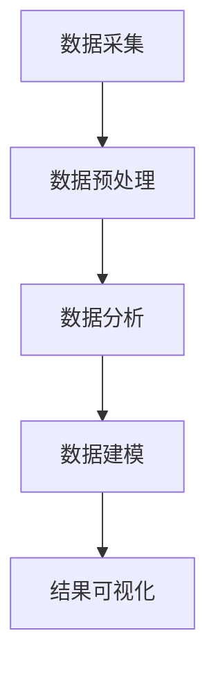

                 

# 彼得林奇如何分析公司的定价权随时间的变化

> 关键词：定价权，彼得林奇，投资分析，市场定价，长期价值

> 摘要：本文详细探讨了彼得·林奇如何分析公司的定价权随时间的变化。通过分析定价权的基本概念、影响因素、动态变化以及具体分析方法，结合实际案例和系统架构，为读者提供了全面的理解和实践指导。

---

## 第1章：定价权的基本概念与重要性

### 1.1 定价权的定义与特征

定价权是指企业在市场上对其产品或服务制定价格的能力，是企业竞争力的重要体现。其核心特征包括：

- **市场主导性**：企业在市场中具有定价主导权，能够影响市场价格。
- **成本加成能力**：企业能够将成本转嫁给消费者，确保利润。
- **品牌溢价能力**：通过品牌优势实现高于行业平均水平的定价。

定价权不仅是企业盈利能力的关键因素，也是其市场地位的象征。

### 1.2 彼得·林奇的基本投资理念

彼得·林奇是著名投资专家，其投资哲学强调基本面分析和长期价值。他重视企业的定价权，认为这是企业长期盈利能力的核心。

- **投资理念**：林奇主张投资具有强大竞争优势的企业，这些企业能够在市场中保持定价权。
- **选股标准**：他偏好那些具有持续定价能力、良好财务状况和竞争优势的公司。

### 1.3 定价权的分析框架

定价权的分析可以从市场需求、成本结构、竞争环境等多个维度展开：

- **市场需求分析**：了解市场容量和消费者需求弹性。
- **成本结构分析**：评估企业的成本控制能力。
- **竞争环境分析**：分析竞争对手的定价策略和市场影响力。

---

## 第2章：定价权的影响因素分析

### 2.1 需求侧分析

市场需求是影响定价权的关键因素，主要包括：

- **需求弹性**：需求对价格变化的敏感程度。需求弹性小的行业更容易维持高定价权。
- **市场容量**：市场规模越大，企业定价权可能越弱，因为竞争更激烈。

### 2.2 成本侧分析

成本结构影响企业的定价能力：

- **成本加成定价法**：企业根据成本加上预期利润制定价格。
- **成本控制能力**：企业通过成本优化可以增强定价权。

### 2.3 竞争环境分析

竞争环境是定价权的重要影响因素：

- **市场集中度**：高集中度市场中，主要企业具有更强的定价权。
- **竞争策略**：价格战会削弱企业的定价权。

### 2.4 品牌价值与定价权的关系

品牌价值直接影响定价权：

- **品牌溢价能力**：知名品牌可以通过溢价定价提高利润。
- **品牌忠诚度**：高忠诚度客户更可能接受较高价格。

---

## 第3章：彼得·林奇的定价权分析方法

### 3.1 宏观视角下的定价权分析

从宏观经济角度分析定价权：

- **行业周期**：分析行业所处周期（增长期、成熟期、衰退期），判断企业定价权的变化。
- **通货膨胀**：通货膨胀会影响成本和价格，从而影响定价权。

### 3.2 微观视角下的定价权分析

从公司内部因素分析定价权：

- **市场份额**：市场占有率高的企业通常具有更强的定价权。
- **利润率**：高利润率企业能够更好地维护定价权。

### 3.3 林奇的定价权评估模型

林奇使用以下模型评估定价权：

1. **市场需求弹性评估**：通过分析需求弹性判断定价能力。
2. **成本加成能力评估**：评估企业是否能够将成本转嫁给消费者。
3. **竞争对手分析**：分析竞争对手的定价策略，判断市场定价权分布。

---

## 第4章：定价权的动态变化与时间维度分析

### 4.1 定价权的时间演变规律

定价权会随时间发生变化：

- **短期波动**：受市场供需、突发事件影响，定价权可能短期波动。
- **长期趋势**：行业成熟、技术进步等因素会影响长期定价权。

### 4.2 市场周期对定价权的影响

不同市场周期对定价权的影响：

- **增长期**：需求旺盛，定价权较强。
- **成熟期**：价格竞争激烈，定价权较弱。
- **衰退期**：需求下降，定价权进一步减弱。

### 4.3 长期视角下的定价权策略

制定长期策略以维护定价权：

- **持续创新**：通过技术创新提高产品价值。
- **品牌建设**：增强品牌影响力，提升定价能力。
- **成本优化**：通过规模效应降低成本，增强定价权。

---

## 第5章：定价权分析的系统架构与技术实现

### 5.1 系统架构设计

系统架构设计包括数据采集、分析、建模和可视化：

### 5.2 数据采集与处理

数据采集步骤：

1. **数据源选择**：选择可靠的数据源，如行业报告、企业财务报表。
2. **数据清洗**：处理缺失值、异常值。
3. **数据转换**：将数据转换为适合分析的形式。

### 5.3 数据分析与建模

使用回归分析模型评估定价权：

$$ R^2 = \sum \left( \frac{(y_i - \hat{y}_i)^2}{n-1} \right) $$

### 5.4 可视化与报告生成

使用图表展示分析结果：

---

## 第6章：定价权分析的项目实战

### 6.1 项目背景与目标

以某行业为例，分析企业定价权变化。

### 6.2 数据采集与预处理

采集企业财务数据和市场数据，清洗数据。

### 6.3 定价权分析模型实现

实现回归分析模型，评估定价权变化。

### 6.4 案例分析与结果解读

通过案例分析，解读模型结果并提出建议。

---

## 第7章：总结与展望

### 7.1 核心观点回顾

总结定价权分析的关键点，强调林奇方法的应用。

### 7.2 未来研究方向

建议未来研究动态定价权分析和国际市场定价权变化。

### 7.3 实践中的注意事项

提醒读者在实际应用中注意数据质量、模型适用性和市场变化。

---

通过以上分析，我们可以全面理解彼得·林奇如何分析公司定价权随时间的变化，并为企业制定有效的定价策略提供指导。

