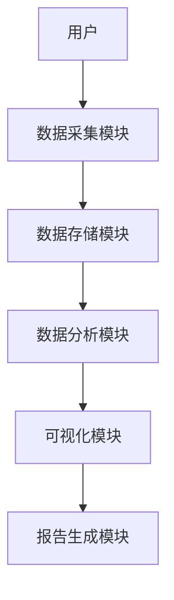
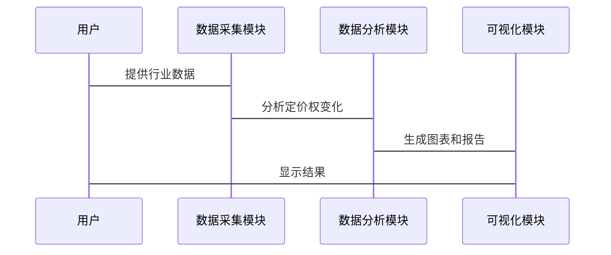

                 


# 彼得林奇如何分析公司的定价权随行业周期的变化

## 关键词：定价权，行业周期，彼得·林奇，数据分析，投资策略

## 摘要：本文将探讨彼得·林奇如何分析公司在不同行业周期中的定价权变化。通过详细分析定价权的核心概念、行业周期的影响以及数学模型的应用，本文为读者提供一套系统的分析方法，帮助投资者更好地评估公司在不同市场环境下的定价能力。

---

## 第1章：定价权的核心概念

### 1.1 定价权的定义与特征

#### 1.1.1 定价权的定义
定价权是指企业在市场中对产品或服务制定价格的能力，反映了企业的市场地位和竞争力。定价能力强的公司能够在市场中根据需求和成本调整价格，从而实现更高的利润。

#### 1.1.2 定价权的核心特征
- 市场主导性：企业能够影响市场价格，而不是被动接受。
- 产品差异化：通过独特的产品或服务吸引客户，降低价格敏感性。
- 成本控制：有效的成本管理使企业能够在价格调整中保持盈利能力。

#### 1.1.3 定价权的衡量指标
- 利润率：净利润率和毛利润率反映了定价能力。
- 价格弹性：需求对价格变化的敏感度，弹性小说明定价权强。
- 市场份额：较大的市场份额通常意味着更强的定价权。

### 1.2 彼得·林奇的定价权分析方法

#### 1.2.1 定价权的来源
- 品牌影响力：知名品牌通常具有较强的定价能力。
- 市场垄断：在垄断市场中，企业可以制定高价。
- 产品独特性：独特的创新产品或技术赋予企业定价权。

#### 1.2.2 定价权的行业影响
- 在高增长行业，定价权强的企业能快速扩展市场。
- 在成熟行业，定价权的微小变化可能影响整体利润。

#### 1.2.3 定价权的动态变化
- 行业周期波动会影响定价权：在繁荣期，企业可能提升价格；在衰退期，价格压力增大。
- 竞争格局变化：新竞争者进入或现有竞争者退出会影响定价权。

---

## 第2章：行业周期的基本概念

### 2.1 行业周期的定义
行业周期是指一个行业在经济发展过程中经历的扩张和收缩的循环，通常分为复苏、增长、成熟和衰退四个阶段。

### 2.2 行业周期阶段对定价权的影响

| 阶段       | 定价权特征                     |
|------------|-------------------------------|
| 复苏阶段   | 企业逐步恢复定价能力，需求上升 |
| 增长阶段   | 定价权增强，市场扩张迅速       |
| 成熟阶段   | 定价权稳定，竞争加剧           |
| 衰退阶段   | 定价权受限，需求下降           |

### 2.3 行业周期对定价权的具体影响

#### 2.3.1 行业周期与定价权的因果关系
行业周期的变化直接影响企业的定价能力。例如，在衰退阶段，企业可能需要降价以维持市场份额，从而削弱定价权。

#### 2.3.2 行业周期与定价权的互动关系
定价权强的企业在行业周期波动中更具灵活性，能够更好地应对市场变化。

---

## 第3章：彼得·林奇的定价权分析方法

### 3.1 分析框架

#### 3.1.1 宏观经济分析
- 检查整体经济状况，判断行业所处周期阶段。
- 考虑通货膨胀、利率等宏观经济因素对定价权的影响。

#### 3.1.2 行业结构分析
- 分析行业竞争格局，判断市场集中度。
- 评估行业内主要竞争对手的定价策略。

#### 3.1.3 企业财务分析
- 通过利润率、成本结构等财务指标评估企业的定价能力。
- 分析企业的成本控制能力和价格弹性。

### 3.2 分析步骤

#### 3.2.1 确定行业周期阶段
- 通过行业数据和宏观经济指标判断行业所处阶段。

#### 3.2.2 评估企业的定价能力
- 分析企业的利润率、市场份额和品牌影响力。

#### 3.2.3 预测定价权的变化趋势
- 根据行业周期变化预测企业的定价能力变化。

### 3.3 案例分析

#### 3.3.1 案例：科技行业中的定价权变化
- 在行业增长阶段，技术创新企业能够提高定价权。
- 在衰退阶段，价格压力增大，企业需要调整定价策略。

#### 3.3.2 案例：消费品行业的定价权分析
- 品牌影响力强的企业在成熟阶段仍能保持较高定价权。

---

## 第4章：定价权与行业周期的数学模型

### 4.1 定价权指数模型

#### 4.1.1 定价权指数的构建
- $$ 定价权指数 = \sum (市场份额 \times 利润率 \times 产品差异化) $$

#### 4.1.2 定价权指数与行业周期的关系
- 在不同行业周期阶段，定价权指数呈现不同的变化趋势。

### 4.2 行业周期阶段的数学分类

#### 4.2.1 行业周期的数学划分
- 使用时间序列分析将行业周期划分为复苏、增长、成熟和衰退阶段。

#### 4.2.2 定价权变化的数学预测
- $$ 预测定价权变化 = f(行业周期阶段, 宏观经济指标, 企业财务指标) $$

---

## 第5章：系统架构与设计

### 5.1 系统功能设计

#### 5.1.1 功能模块
- 数据采集模块：收集行业数据和企业财务数据。
- 数据分析模块：应用数学模型进行定价权分析。
- 可视化模块：生成定价权变化的图表和报告。

### 5.2 系统架构设计

#### 5.2.1 架构图


### 5.3 系统接口设计

#### 5.3.1 数据接口
- 数据接口用于与外部数据源（如行业报告、财务报表）交互。

#### 5.3.2 用户接口
- 提供用户友好的界面，方便输入数据和查看分析结果。

### 5.4 系统交互流程



---

## 第6章：项目实战

### 6.1 环境安装

#### 6.1.1 安装Python
- 安装Anaconda或Miniconda，选择Python 3.x版本。

#### 6.1.2 安装必要的库
- 使用pip安装numpy、pandas、matplotlib、scikit-learn等库。

### 6.2 系统核心实现

#### 6.2.1 数据处理代码
```python
import pandas as pd
import numpy as np

# 加载数据
data = pd.read_csv('industry_data.csv')

# 数据清洗
data = data.dropna()
data = data[~data['行业周期阶段'].isnull()]
```

#### 6.2.2 定价权指数计算
```python
def calculate_pricing_power(data):
    data['定价权指数'] = data['市场份额'] * data['利润率'] * data['产品差异化']
    return data

result = calculate_pricing_power(data)
```

#### 6.2.3 可视化代码
```python
import matplotlib.pyplot as plt

plt.figure(figsize=(10,6))
plt.plot(result['时间'], result['定价权指数'], 'b-', label='定价权指数')
plt.xlabel('时间')
plt.ylabel('定价权指数')
plt.title('定价权指数变化趋势')
plt.legend()
plt.show()
```

### 6.3 案例分析

#### 6.3.1 案例：科技行业的定价权分析
- 分析某科技公司在不同行业周期阶段的定价权变化。
- 使用上述代码生成定价权指数变化图，观察其变化趋势。

### 6.4 项目小结
通过实战项目，读者可以掌握如何使用Python进行定价权分析，理解数学模型的应用，并能够实际操作数据分析过程。

---

## 第7章：最佳实践与总结

### 7.1 小结
彼得·林奇的定价权分析方法结合了行业周期和企业基本面分析，帮助投资者识别定价能力强的公司，从而制定有效的投资策略。

### 7.2 实用技巧
- 定期更新行业数据，保持分析的准确性。
- 结合宏观经济指标，全面评估定价权变化。
- 使用可视化工具，直观展示分析结果。

### 7.3 注意事项
- 数据来源要可靠，避免分析偏差。
- 模型假设要合理，避免过度简化或复杂化。
- 定期回顾和调整分析方法，适应市场变化。

### 7.4 拓展阅读
推荐阅读彼得·林奇的书籍，深入理解他的投资策略和分析方法。同时，学习时间序列分析和机器学习在定价权预测中的应用。

---

## 结语
通过本文的分析，读者可以系统地掌握彼得·林奇的定价权分析方法，理解定价权与行业周期的关系，并能够应用数学模型和系统架构进行实际分析。希望这些内容能够帮助投资者在复杂的市场环境中做出更明智的决策。

