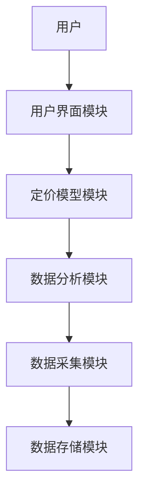
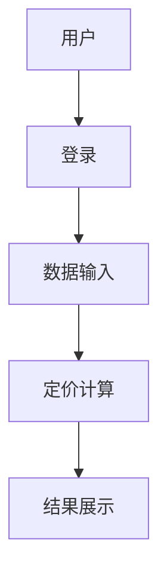

                 


---

# 彼得林奇如何分析公司的定价策略演变

> 关键词：定价策略演变，彼得·林奇，定价模型，定价系统，价值投资

> 摘要：本文详细探讨了彼得·林奇如何分析公司的定价策略演变，从定价策略的核心概念、数学模型、算法原理、系统架构到项目实战，全面分析了定价策略的演变过程及其在实际中的应用。

---

## 第一部分: 背景介绍与核心概念

### 第1章: 定价策略演变的背景与重要性

#### 1.1 定价策略的基本概念

##### 1.1.1 定价策略的定义

定价策略是指企业在制定产品或服务价格时所采用的策略，旨在实现企业目标和市场定位。定价策略直接影响企业的收入、利润和市场竞争力，是企业战略管理的重要组成部分。

##### 1.1.2 定价策略的核心要素

定价策略的核心要素包括成本、市场需求、竞争环境、产品价值以及企业目标。这些要素相互作用，决定了价格的制定和调整。

##### 1.1.3 定价策略的分类与特点

定价策略可以分为成本导向定价、需求导向定价、竞争导向定价和价值导向定价。每种策略都有其特点和适用场景，例如成本导向定价注重成本控制，而价值导向定价注重创造价值。

#### 1.2 定价策略演变的背景

##### 1.2.1 经济环境的变化对定价策略的影响

经济环境的变化，如通货膨胀、经济危机等，直接影响企业的成本和市场需求，从而推动定价策略的演变。企业需要根据经济环境调整定价策略，以应对市场变化。

##### 1.2.2 市场竞争格局的演变

市场竞争格局的变化，如新竞争者的加入、现有竞争者的策略调整，也会影响定价策略。企业需要通过定价策略来维护市场份额或提高竞争力。

##### 1.2.3 消费者行为的变化与定价策略的调整

消费者行为的变化，如对价格敏感度的提高、对产品价值的关注增加，促使企业调整定价策略。例如，从单纯的低价竞争转向提供更高价值的产品或服务。

---

### 第2章: 彼得·林奇与定价策略分析

#### 2.1 彼得·林奇的投资者背景

##### 2.1.1 彼得·林奇的生平简介

彼得·林奇是美国著名投资者，曾担任富达麦哲伦基金的经理，创造了卓越的投资业绩。他的投资理念以价值投资为核心，注重分析企业的基本面。

##### 2.1.2 彼得·林奇的投资理念与方法

彼得·林奇强调深入分析企业的财务状况、市场地位和竞争优势。他关注企业的定价策略，认为合理的定价是企业盈利能力的重要保障。

##### 2.1.3 彼得·林奇对定价策略的研究与贡献

彼得·林奇通过分析企业的定价策略，揭示了定价策略对企业价值的影响。他提出了一些定价策略的分析框架，帮助投资者更好地理解企业的定价策略。

#### 2.2 彼得·林奇定价策略分析的核心思想

##### 2.2.1 价值投资与定价策略的关系

价值投资强调以低于市场价值的价格买入优质资产。彼得·林奇认为，合理的定价策略是实现价值投资的重要手段。

##### 2.2.2 彼得·林奇对定价策略演变的洞察

彼得·林奇观察到，定价策略的演变反映了企业的市场定位和竞争策略的变化。他强调，定价策略不仅是成本和需求的函数，还包括企业对产品价值的理解。

##### 2.2.3 彼得·林奇定价策略分析的框架与方法

彼得·林奇提出了一个定价策略分析的框架，包括分析企业的成本结构、市场需求、竞争环境和产品价值。这种方法帮助投资者全面评估定价策略的合理性。

---

### 第3章: 定价策略演变的核心概念与联系

#### 3.1 定价策略的核心概念

##### 3.1.1 成本导向定价法

成本导向定价法以企业的成本为基础，确保价格能够覆盖成本并获得合理利润。这种方法适用于市场垄断或竞争不充分的情况。

##### 3.1.2 需求导向定价法

需求导向定价法以市场需求为基础，通过分析需求弹性来确定价格。这种方法适用于竞争激烈的市场，强调价格对需求的影响。

##### 3.1.3 竞争导向定价法

竞争导向定价法以竞争对手的价格为基础，通过跟随或差异化策略来制定价格。这种方法适用于高度竞争的市场，强调价格的相对竞争力。

##### 3.1.4 价值导向定价法

价值导向定价法以产品或服务的价值为基础，通过提供独特价值来制定价格。这种方法适用于创新或高端市场，强调通过价值实现溢价。

#### 3.2 定价策略的核心要素对比

##### 3.2.1 成本导向定价法与需求导向定价法的对比

成本导向定价法注重成本控制，而需求导向定价法注重市场需求的满足。两者在定价目标和适用场景上有明显差异。

##### 3.2.2 竞争导向定价法与价值导向定价法的对比

竞争导向定价法注重价格的相对竞争力，而价值导向定价法注重产品的独特价值。两者在定价策略的选择上需要根据市场环境和企业目标进行权衡。

#### 3.3 定价策略的演变阶段与特点

##### 3.3.1 传统定价阶段

传统定价阶段以成本导向定价为主，注重价格的最低可行性。这种方法在市场垄断或竞争不充分的情况下有效。

##### 3.3.2 现代定价阶段

现代定价阶段强调需求导向和竞争导向定价，注重价格对市场需求的响应。这种方法适用于竞争激烈的市场环境。

##### 3.3.3 智能定价阶段

智能定价阶段以价值导向定价为主，结合大数据和人工智能技术，通过精准分析市场需求和产品价值来制定价格。这种方法适用于创新和高端市场，强调通过价值实现溢价。

---

## 第二部分: 算法原理与数学模型

### 第4章: 定价策略的数学模型与算法原理

#### 4.1 定价策略的数学模型

##### 4.1.1 成本加成定价模型

成本加成定价模型是一种简单有效的定价方法。公式如下：

$$
P = C \times (1 + m)
$$

其中，P为价格，C为单位成本，m为成本加成率。

##### 4.1.2 边际成本定价模型

边际成本定价模型是一种基于边际成本的定价方法，适用于边际成本递增的情况。公式如下：

$$
P = MC
$$

其中，P为价格，MC为边际成本。

##### 4.1.3 价值定价模型

价值定价模型是一种基于产品或服务价值的定价方法，公式如下：

$$
P = V \times (1 + m)
$$

其中，P为价格，V为产品或服务的价值，m为价值加成率。

#### 4.2 定价策略的算法原理

##### 4.2.1 基于成本的定价算法

基于成本的定价算法通过分析企业的总成本和目标利润，确定产品的价格。具体步骤如下：

1. 计算单位产品的总成本。
2. 确定目标利润。
3. 计算价格，确保价格能够覆盖成本和利润。

##### 4.2.2 基于需求的定价算法

基于需求的定价算法通过分析需求弹性来确定价格。具体步骤如下：

1. 确定需求函数。
2. 计算价格弹性。
3. 根据需求弹性调整价格，以最大化收入或利润。

##### 4.2.3 基于竞争的定价算法

基于竞争的定价算法通过分析竞争对手的价格和市场地位来制定价格。具体步骤如下：

1. 分析竞争对手的价格。
2. 评估自身产品的竞争优势。
3. 根据竞争优势调整价格。

---

## 第三部分: 系统分析与架构设计

### 第5章: 定价系统的系统分析与架构设计

#### 5.1 定价系统的需求分析

##### 5.1.1 问题场景介绍

定价系统需要满足企业在不同市场环境下制定合理价格的需求。企业需要根据成本、市场需求和竞争环境等因素调整价格。

##### 5.1.2 项目介绍

本项目旨在开发一个智能化的定价系统，帮助企业在复杂多变的市场环境中制定合理的定价策略。

##### 5.1.3 系统功能设计

系统功能设计包括成本分析、需求预测、竞争分析和价格优化等功能。

##### 5.1.4 系统架构设计

系统架构设计采用模块化设计，包括数据采集、数据分析、定价模型和用户界面等模块。

##### 5.1.5 系统接口设计

系统接口设计包括数据接口和用户接口。数据接口用于与其他系统的数据交互，用户接口提供友好的操作界面。

##### 5.1.6 系统交互设计

系统交互设计包括用户登录、数据输入、定价计算和结果展示等交互流程。

#### 5.2 定价系统的架构设计

##### 5.2.1 系统功能模块划分

系统功能模块包括数据采集模块、数据分析模块、定价模型模块和用户界面模块。

##### 5.2.2 系统架构图



##### 5.2.3 系统交互流程图



---

## 第四部分: 项目实战

### 第6章: 定价策略的项目实战

#### 6.1 环境安装与配置

##### 6.1.1 开发环境搭建

开发环境包括编程语言（如Python）、开发工具（如PyCharm）和数据处理工具（如Pandas）。

##### 6.1.2 工具安装与配置

安装必要的工具和库，如Python、Pandas、NumPy和Scikit-learn。

##### 6.1.3 数据准备与处理

收集和整理相关数据，如成本数据、市场需求数据和竞争数据。

#### 6.2 系统核心实现

##### 6.2.1 定价模型的实现

实现成本加成定价模型、边际成本定价模型和价值定价模型。

##### 6.2.2 算法实现与优化

优化定价算法，提高计算效率和准确性。

##### 6.2.3 系统功能模块实现

实现数据采集、数据分析和定价计算等功能模块。

#### 6.3 代码应用解读与分析

##### 6.3.1 核心代码解读

以下是成本加成定价模型的Python代码：

```python
def cost_plus_pricing(cost, markup):
    return cost * (1 + markup)
```

##### 6.3.2 代码实现的优化与改进

优化代码，提高计算效率和准确性。例如，使用并行计算或更高效的算法。

##### 6.3.3 代码实现的测试与验证

测试定价模型的准确性，验证代码的正确性和稳定性。

#### 6.4 案例分析与详细讲解

通过实际案例分析定价策略的演变，如某企业的定价策略调整对市场份额的影响。

---

## 第五部分: 最佳实践与小结

### 第7章: 定价策略的最佳实践与小结

#### 7.1 最佳实践 tips

##### 7.1.1 定价策略的制定与实施中的注意事项

在制定和实施定价策略时，需要注意市场环境的变化和消费者行为的变化。

##### 7.1.2 定价策略的动态调整与优化

定期评估和优化定价策略，以适应市场变化和企业目标的调整。

##### 7.1.3 定价策略的监控与评估

建立监控机制，定期评估定价策略的效果，并根据评估结果进行调整。

#### 7.2 项目小结

##### 7.2.1 项目总结

通过本项目，我们深入分析了定价策略的演变过程，提出了基于价值导向的定价策略，并通过实际案例验证了其有效性。

##### 7.2.2 未来展望

未来，随着大数据和人工智能技术的发展，定价策略将更加智能化和个性化。企业需要结合技术创新，进一步优化定价策略，提升市场竞争力。

---

# 结语

通过本文的分析，我们全面探讨了彼得·林奇如何分析公司的定价策略演变，从定价策略的核心概念、数学模型、算法原理、系统架构到项目实战，深入剖析了定价策略的演变过程及其在实际中的应用。未来，定价策略将继续演变，企业需要结合市场环境和技术创新，制定更加科学和有效的定价策略，以实现可持续发展。

--- 

以上为完整的文章大纲，如需撰写完整文章，请根据上述大纲逐步展开。

