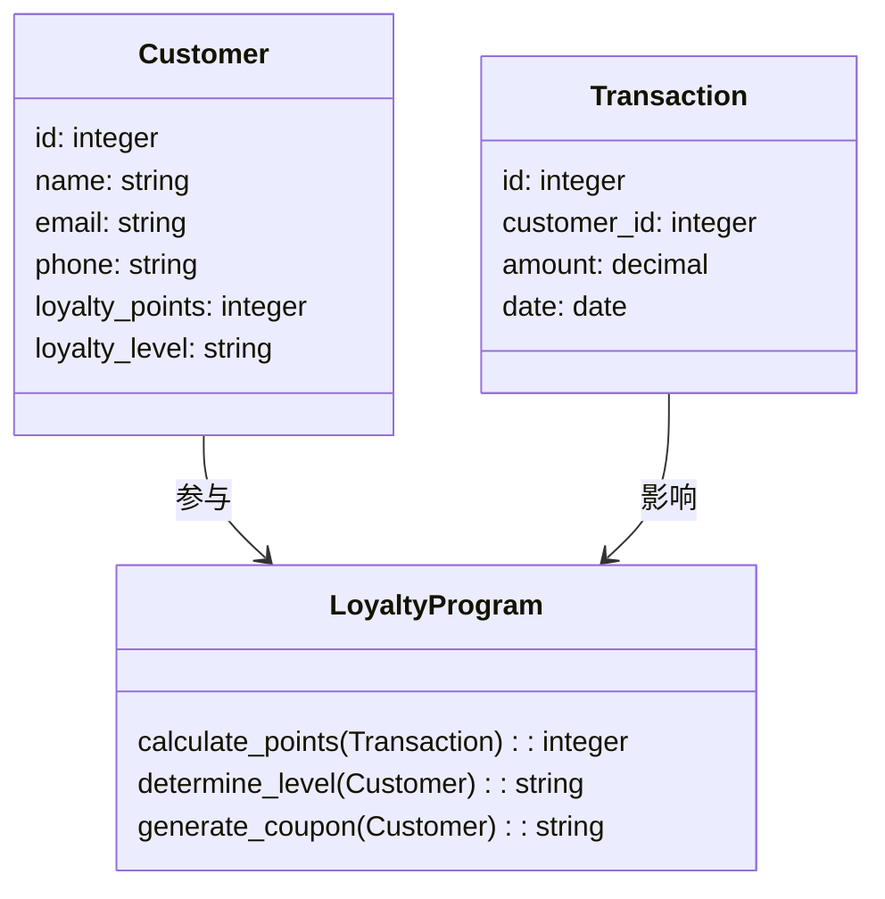
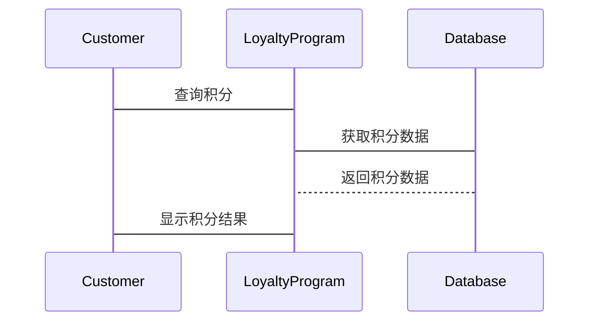

                 


# 彼得林奇如何分析公司的客户忠诚度程序

> 关键词：客户忠诚度程序，彼得林奇，客户分析，商业策略，软件架构，数据模型

> 摘要：本文从彼得·林奇的视角出发，系统分析公司客户忠诚度程序的构建、评估和优化方法。通过背景介绍、核心概念解析、分析方法探讨、系统架构设计、项目实战分析等多维度展开，结合数学模型、领域模型和系统架构图，详细解读客户忠诚度程序在企业中的应用和价值。文章最后给出了最佳实践建议、小结和注意事项，为读者提供全面的分析框架和实践指导。

---

## # 引言

客户忠诚度程序是企业维系客户关系的重要工具，通过积分、优惠、会员等级等方式，激励客户持续消费，提升客户粘性和企业收益。彼得·林奇作为投资专家，提出了独特的客户忠诚度程序分析方法，强调从客户行为数据和商业价值角度出发，评估程序的有效性和潜在风险。

本文将从理论到实践，系统阐述如何分析和优化客户忠诚度程序，为企业的客户关系管理提供参考。

---

## # 第1章: 客户忠诚度程序的定义与背景

### ## 1.1 客户忠诚度程序的定义

客户忠诚度程序是一种通过积分、优惠券、会员等级等方式，鼓励客户重复购买、增加消费的客户管理工具。其核心目标是提升客户忠诚度，增加客户生命周期价值。

#### ### 1.1.1 什么是客户忠诚度程序
客户忠诚度程序通过积分机制、等级制度等手段，将客户行为转化为可量化的数据，帮助企业识别高价值客户，制定针对性的营销策略。

#### ### 1.1.2 客户忠诚度程序的核心要素
- **积分规则**：消费金额、频率、时间等影响积分的计算方式。
- **兑换规则**：积分可兑换商品、服务或优惠券。
- **客户等级**：根据积分或消费金额划分客户等级，提供差异化服务。

#### ### 1.1.3 客户忠诚度程序的分类
- **通用积分型**：适用于所有客户的通用积分规则。
- **定制型**：针对特定客户群体设计的积分规则。
- **混合型**：结合通用积分和定制规则的综合型程序。

### ## 1.2 客户忠诚度程序的背景与重要性

在当前竞争激烈的市场环境中，客户忠诚度是企业核心竞争力的重要组成部分。客户忠诚度程序通过数据驱动的方式，帮助企业识别高价值客户，优化营销策略，提升客户满意度和忠诚度。

#### ### 1.2.1 当前市场环境下的客户忠诚度挑战
- 客户选择多样，忠诚度难以维系。
- 数据孤岛问题，难以整合客户信息。
- 客户期望越来越高，程序设计需更具个性化。

#### ### 1.2.2 客户忠诚度程序在企业中的作用
- **提升客户粘性**：通过积分、优惠等手段，激励客户持续消费。
- **增加客户生命周期价值**：识别高价值客户，制定精准营销策略。
- **优化客户体验**：通过数据分析，提升客户满意度和忠诚度。

#### ### 1.2.3 客户忠诚度程序与企业长期发展的关系
客户忠诚度程序是企业长期发展的基石，通过程序的优化和创新，企业可以建立稳定的客户基础，增强市场竞争力。

### ## 1.3 客户忠诚度程序的边界与外延

#### ### 1.3.1 客户忠诚度程序的边界
- 客户忠诚度程序仅关注客户的忠诚度，不涉及客户 acquisition（获取）阶段的营销活动。
- 程序的边界在于客户行为数据的收集和分析，不涉及客户隐私以外的其他数据。

#### ### 1.3.2 客户忠诚度程序的外延
- 客户忠诚度程序可以与其他客户管理工具（如CRM系统）集成，提供更全面的客户管理功能。
- 程序的外延还包括客户忠诚度的评估和优化，即通过数据分析，不断改进程序的设计和执行。

#### ### 1.3.3 客户忠诚度程序与其他客户管理工具的区别
- **CRM系统**：侧重于客户信息的存储和管理，提供客户关系管理功能。
- **客户忠诚度程序**：侧重于通过积分、优惠等手段，激励客户忠诚度。

---

## # 第2章: 客户忠诚度程序的核心概念与联系

### ## 2.1 核心概念原理

客户忠诚度程序的核心概念包括客户忠诚度、客户满意度和客户生命周期价值。这些概念相互关联，共同构成客户忠诚度程序的理论基础。

#### ### 2.1.1 客户忠诚度程序的核心要素
- **积分规则**：消费金额、频率、时间等影响积分的计算方式。
- **兑换规则**：积分可兑换商品、服务或优惠券。
- **客户等级**：根据积分或消费金额划分客户等级，提供差异化服务。

#### ### 2.1.2 客户忠诚度程序的运行机制
- **数据收集**：收集客户的消费记录、积分累积情况等数据。
- **积分计算**：根据消费数据计算客户积分。
- **积分兑换**：客户通过积分兑换商品或服务。
- **客户等级评定**：根据积分或消费金额评定客户等级。
- **优惠券发放**：根据客户等级发放不同的优惠券。

#### ### 2.1.3 客户忠诚度程序与客户满意度的关系
客户满意度是客户忠诚度的重要影响因素。高满意度的客户更可能参与积分兑换活动，提升客户忠诚度。

### ## 2.2 核心概念属性特征对比表格

表2-1: 客户忠诚度程序与客户满意度的属性对比

| 属性               | 客户忠诚度程序       | 客户满意度           |
|--------------------|--------------------|--------------------|
| 目标               | 提升客户忠诚度       | 提升客户满意度       |
| 实施方式           | 积分、优惠券等       | 调查问卷、反馈机制   |
| 数据来源           | 消费记录、积分数据   | 客户反馈、评分       |
| 评估方法           | 积分累积、兑换情况   | 调查结果、评分统计   |

### ## 2.3 ER实体关系图架构

```mermaid
erd
    customer [客户]
    program [客户忠诚度程序]
    transaction [交易记录]
    customer --> transaction: 参与
    program --> transaction: 影响
```

---

## # 第3章: 客户忠诚度程序的分析方法

### ## 3.1 客户忠诚度程序的分析框架

#### ### 3.1.1 分析框架的构建
客户忠诚度程序的分析框架包括数据收集、数据分析、程序优化三个阶段。

#### ### 3.1.2 分析框架的适用范围
适用于所有需要优化客户忠诚度程序的企业。

#### ### 3.1.3 分析框架的优缺点
- **优点**：系统性强，能够全面分析客户忠诚度程序的各个方面。
- **缺点**：实施成本较高，需要企业具备一定的技术能力和数据处理能力。

### ## 3.2 客户忠诚度程序的分析步骤

#### ### 3.2.1 确定分析目标
明确分析目标，如提升客户忠诚度、优化积分规则等。

#### ### 3.2.2 收集相关数据
收集客户的消费记录、积分数据、兑换记录等。

#### ### 3.2.3 建立分析模型
根据收集的数据，建立客户忠诚度指数模型、客户生命周期价值模型等。

#### ### 3.2.4 验证与优化
根据分析结果，优化客户忠诚度程序的设计。

### ## 3.3 客户忠诚度程序的数学模型与公式

#### ### 3.3.1 客户忠诚度指数计算公式
$$
L = \frac{C}{N} \times T
$$
其中，L为忠诚度指数，C为忠诚客户数，N为总客户数，T为时间周期。

#### ### 3.3.2 客户生命周期价值计算公式
$$
CLV = \frac{R}{1 - (1 - \delta)^{n}}
$$
其中，R为单个客户的年收入，δ为客户流失率，n为时间周期数。

---

## # 第4章: 客户忠诚度程序的系统分析与架构设计

### ## 4.1 项目介绍

客户忠诚度程序的系统分析与架构设计包括系统功能设计、系统架构设计、系统接口设计和系统交互设计四个部分。

### ## 4.2 系统功能设计

#### ### 4.2.1 领域模型（Mermaid类图）



### ## 4.3 系统架构设计

#### ### 4.3.1 系统架构图（Mermaid架构图）


### ## 4.4 系统接口设计

系统接口包括前端接口和后端接口。前端接口用于客户积分查询、优惠券兑换等功能；后端接口用于积分计算、客户等级评定等功能。

### ## 4.5 系统交互设计

#### ### 4.5.1 系统交互流程（Mermaid序列图）



---

## # 第5章: 项目实战

### ## 5.1 环境安装

需要安装的环境包括数据库（MySQL）、开发工具（IDE）、编程语言（Python）等。

### ## 5.2 系统核心实现源代码

以下是客户忠诚度程序的核心实现代码：

```python
class Customer:
    def __init__(self, id, name, email, phone):
        self.id = id
        self.name = name
        self.email = email
        self.phone = phone
        self.loyalty_points = 0
        self.loyalty_level = "basic"

    def update_loyalty_points(self, points):
        self.loyalty_points += points
        self._update_loyalty_level()

    def _update_loyalty_level(self):
        if self.loyalty_points >= 1000:
            self.loyalty_level = "gold"
        elif self.loyalty_points >= 500:
            self.loyalty_level = "silver"
        else:
            self.loyalty_level = "basic"

class Transaction:
    def __init__(self, id, customer_id, amount, date):
        self.id = id
        self.customer_id = customer_id
        self.amount = amount
        self.date = date

class LoyaltyProgram:
    def __init__(self, database):
        self.database = database

    def calculate_points(self, transaction):
        points = int(transaction.amount * 0.01)
        return points

    def determine_level(self, customer):
        if customer.loyalty_level == "gold":
            return "Gold"
        elif customer.loyalty_level == "silver":
            return "Silver"
        else:
            return "Basic"

    def generate_coupon(self, customer):
        if customer.loyalty_level == "gold":
            coupon_value = 50
        elif customer.loyalty_level == "silver":
            coupon_value = 25
        else:
            coupon_value = 10
        return f"Coupon: {coupon_value}"
```

### ## 5.3 代码应用解读与分析

客户忠诚度程序的核心实现包括客户信息管理、积分计算、客户等级评定等功能。通过上述代码，可以实现客户积分的自动计算和客户等级的动态更新。

### ## 5.4 实际案例分析和详细讲解剖析

以某超市的客户忠诚度程序为例，分析程序的设计和优化过程。

---

## # 第6章: 最佳实践 tips、小结、注意事项、拓展阅读

### ## 6.1 最佳实践 tips

- **数据驱动**：通过数据分析，优化客户忠诚度程序的设计。
- **客户为中心**：根据客户需求，设计个性化的积分规则。
- **持续优化**：定期评估客户忠诚度程序的效果，持续优化。

### ## 6.2 小结

通过本文的分析和实践，我们了解了彼得·林奇如何分析和优化客户忠诚度程序。从理论到实践，我们系统探讨了客户忠诚度程序的构建、评估和优化方法，为企业提供了全面的分析框架和实践指导。

### ## 6.3 注意事项

- **数据隐私**：在设计客户忠诚度程序时，需注意客户数据的隐私保护。
- **程序公平性**：确保积分规则和兑换规则的公平性，避免客户投诉。
- **程序灵活性**：根据市场变化和客户需求，及时调整程序的设计。

### ## 6.4 拓展阅读

建议读者进一步阅读《彼得林奇选股术》等书籍，深入理解彼得·林奇的客户分析方法。

---

## # 结论

通过本文的系统分析，我们了解了彼得·林奇如何从客户行为数据和商业价值的角度，评估和优化客户忠诚度程序。从理论到实践，我们探讨了客户忠诚度程序的构建、评估和优化方法，为企业提供了全面的分析框架和实践指导。未来，随着数据科学和人工智能技术的发展，客户忠诚度程序将更加智能化和个性化，为企业创造更大的价值。

--- 

**文章结束**

