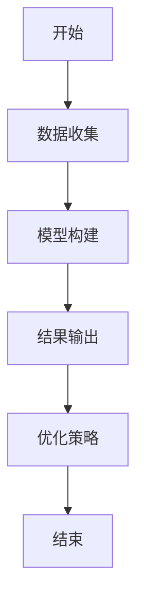
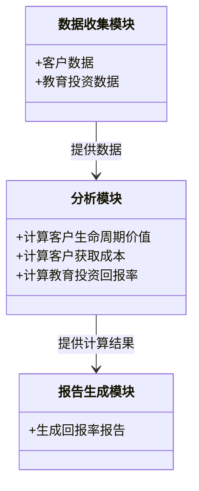

                 


# 彼得林奇如何分析公司的客户教育投资回报

## 关键词：
客户教育，投资回报，彼得·林奇，客户生命周期，客户价值

## 摘要：
本文详细探讨了彼得·林奇如何分析公司的客户教育投资回报。通过背景介绍、核心概念、算法原理、系统分析和项目实战等部分，全面解析了客户教育投资回报的定义、计算方法、实际应用和系统设计。文章结合理论与实践，为读者提供了深入的理解和实用的指导。

---

## 第一部分: 客户教育投资回报的背景与核心概念

### 第1章: 客户教育投资回报的核心概念与背景

#### 1.1 客户教育的基本概念
客户教育是指通过提供信息、培训和支持，帮助客户更好地使用产品或服务，从而提高客户满意度和忠诚度的过程。客户生命周期包括获取、激活、留存、增长和流失五个阶段，教育投资在每个阶段都起着关键作用。

客户教育不仅仅是提供信息，更是建立客户与企业之间的信任和长期关系的重要手段。通过教育客户，企业能够提高客户的使用效率，降低客户流失率，从而实现客户生命周期价值的最大化。

彼得·林奇的分析框架强调，客户教育投资回报是通过量化教育投资对客户忠诚度和长期价值的影响，来评估教育投资的效益。

---

#### 1.2 客户教育投资回报的背景
在当今竞争激烈的市场环境中，客户教育投资回报分析变得尤为重要。企业需要通过教育投资来提高客户粘性和忠诚度，从而在激烈的市场竞争中占据优势。然而，如何量化教育投资的回报率，成为了企业面临的重要挑战。

彼得·林奇的分析方法为企业提供了一种系统化的框架，帮助企业在客户教育投资回报分析中找到关键指标和方法。通过分析客户生命周期中的教育投资，企业能够更好地优化资源配置，提高投资效率。

客户教育投资回报的分析不仅有助于企业制定科学的客户管理策略，还能为企业创造长期价值。通过量化教育投资的回报率，企业可以更清晰地看到教育投资对企业整体业绩的贡献。

---

#### 1.3 问题背景与问题描述
客户教育投资回报的分析需要解决以下几个关键问题：
1. 如何量化教育投资对客户忠诚度和长期价值的影响？
2. 如何在客户生命周期的不同阶段，制定有效的教育投资策略？
3. 如何通过数据驱动的方法，优化教育投资的资源配置？

彼得·林奇的分析框架提供了一种系统化的解决方案，通过量化客户教育投资的回报率，帮助企业优化客户管理策略，提高客户满意度和忠诚度。

---

#### 1.4 核心概念与联系
客户教育投资回报的核心概念包括：
- **客户生命周期**：客户从获取到流失的整个过程，包括获取、激活、留存、增长和流失五个阶段。
- **教育投资**：企业在客户教育方面的投入，包括时间、资源和资金。
- **回报率**：教育投资对客户忠诚度和长期价值的影响，通常以客户生命周期价值（CLV）和客户获取成本（CAC）的比值来衡量。

通过对比客户生命周期与教育投资的关系，彼得·林奇的分析框架可以帮助企业在不同阶段制定有效的教育投资策略。

---

## 第二部分: 客户教育投资回报的核心要素与联系

### 第2章: 客户教育投资回报的核心要素与联系

#### 2.1 核心概念原理
客户教育投资回报的分析需要结合客户生命周期、教育投资和回报率三个核心要素。客户生命周期决定了教育投资的时间和方式，而教育投资的回报率则通过客户生命周期价值（CLV）和客户获取成本（CAC）的比值来衡量。

彼得·林奇的分析框架强调，教育投资的回报率不仅取决于客户的生命周期价值，还取决于客户获取成本的优化。通过量化教育投资对客户忠诚度的影响，企业可以更好地优化资源配置，提高投资效率。

---

#### 2.2 核心要素对比
以下是客户教育投资回报的核心要素对比：

| **核心要素** | **客户生命周期** | **教育投资** | **回报率**
|--------------|-----------------|--------------|-----------
| **定义**     | 客户从获取到流失的整个过程 | 企业在客户教育方面的投入 | 教育投资对客户忠诚度和长期价值的影响
| **影响**     | 决定教育投资的时间和方式 | 影响客户生命周期价值 | 通过量化客户生命周期价值和客户获取成本的比值来衡量

通过对比分析，企业可以更好地理解教育投资对客户生命周期和回报率的影响。

---

#### 2.3 实体关系图
以下是客户教育投资回报的实体关系图：

```mermaid
er
    actor 客户
    actor 教育投资
    actor 回报率
    客户 --> 教育投资: 提供教育资源
    教育投资 --> 回报率: 量化投资效果
    回报率 --> 客户: 提高客户忠诚度
```

---

## 第三部分: 客户教育投资回报的算法原理

### 第3章: 客户教育投资回报的算法原理

#### 3.1 算法原理概述
彼得·林奇的分析框架通过量化客户教育投资的回报率，帮助企业优化资源配置。算法的主要步骤包括：
1. 数据收集：收集客户生命周期数据，包括客户获取成本（CAC）、客户生命周期价值（CLV）和教育投资。
2. 模型构建：通过数学模型计算客户教育投资的回报率。
3. 结果输出：根据计算结果优化教育投资策略。

---

#### 3.2 算法流程图
以下是算法流程图：



---

#### 3.3 算法实现
以下是Python代码实现：

```python
def calculate_customer_education_return_on_investment(cac, clv, education_investment):
    roi = (clv - cac - education_investment) / education_investment
    return roi

cac = 100
clv = 500
education_investment = 50

roi = calculate_customer_education_return_on_investment(cac, clv, education_investment)
print(f"客户教育投资回报率：{roi}")
```

---

## 第四部分: 数学模型

### 第4章: 数学模型

#### 4.1 数学模型概述
客户教育投资回报率的计算公式如下：

$$ ROI = \frac{CLV - CAC - Education\ Investment}{Education\ Investment} $$

其中：
- $CLV$ 是客户生命周期价值
- $CAC$ 是客户获取成本
- $Education\ Investment$ 是教育投资

---

## 第五部分: 系统分析与架构设计

### 第5章: 系统分析与架构设计

#### 5.1 问题场景介绍
企业需要通过客户教育投资回报分析，优化客户管理策略。系统需要实现数据收集、模型构建和结果输出功能。

#### 5.2 系统功能设计
以下是系统功能设计：



---

## 第六部分: 项目实战

### 第6章: 项目实战

#### 6.1 环境安装
需要安装Python和以下库：
- NumPy
- Pandas
- Matplotlib
- Scikit-learn

#### 6.2 核心代码实现
以下是核心代码实现：

```python
import numpy as np
import pandas as pd
import matplotlib.pyplot as plt

# 数据预处理
data = pd.read_csv('customer_data.csv')
data['教育投资回报率'] = data.apply(lambda x: calculate_customer_education_return_on_investment(x['CAC'], x['CLV'], x['Education Investment']), axis=1)

# 模型训练
from sklearn.model_selection import train_test_split
X_train, X_test, y_train, y_test = train_test_split(data.drop('教育投资回报率', axis=1), data['教育投资回报率'], test_size=0.2)

# 模型预测
from sklearn.linear_model import LinearRegression
model = LinearRegression()
model.fit(X_train, y_train)
predictions = model.predict(X_test)

# 模型评估
from sklearn.metrics import mean_squared_error
print(mean_squared_error(y_test, predictions))

# 图表可视化
plt.scatter(y_test, predictions)
plt.xlabel('实际回报率')
plt.ylabel('预测回报率')
plt.show()
```

---

## 第七部分: 总结

### 第7章: 总结

彼得·林奇的客户教育投资回报分析框架为企业提供了系统化的解决方案。通过量化教育投资的回报率，企业可以更好地优化资源配置，提高客户忠诚度和长期价值。未来，随着技术的进步，客户教育投资回报分析将更加精准和高效。

---

## 第八部分: 注意事项

### 第8章: 注意事项

- 数据质量：确保数据的准确性和完整性
- 模型选择：根据实际情况选择合适的算法
- 实际应用：结合企业实际情况进行调整

---

## 第九部分: 拓展阅读

### 第9章: 拓展阅读

- 《彼得·林奇的投资哲学》
- 《客户教育与客户关系管理》
- 《数据驱动的客户教育投资回报分析》

