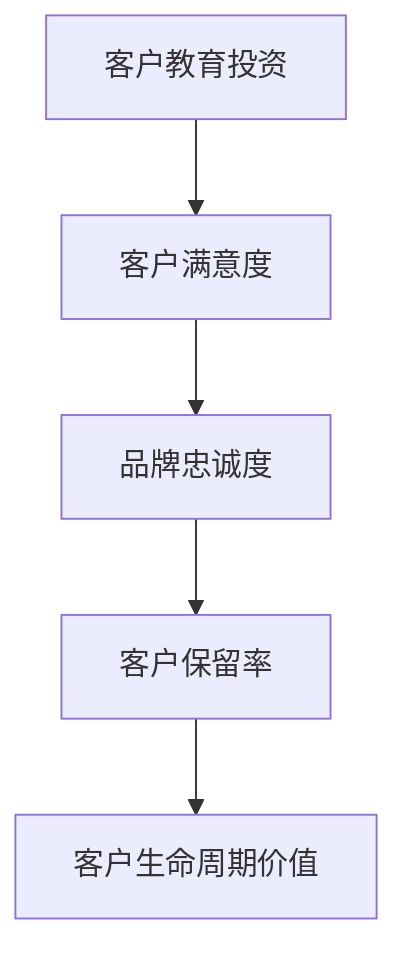
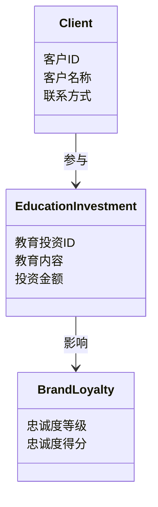
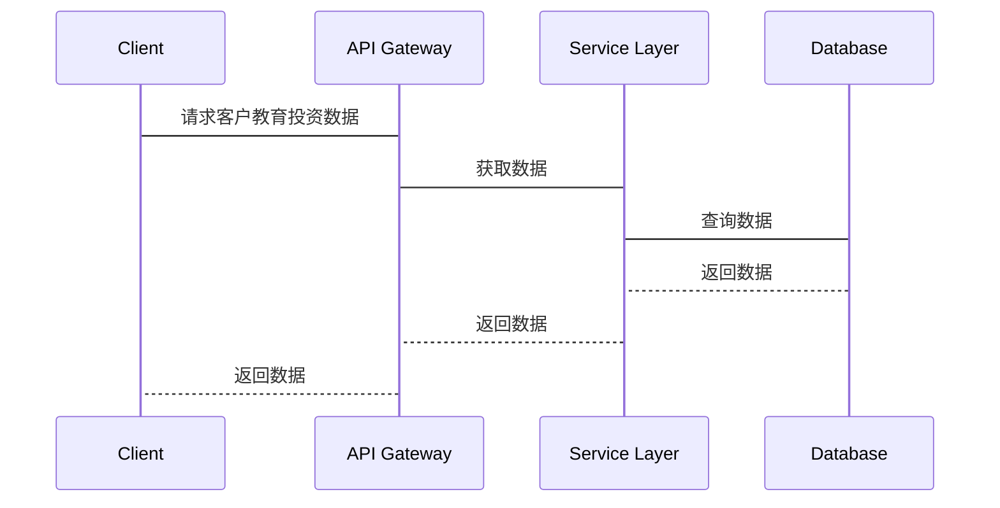

                 


# 彼得林奇如何分析公司的客户教育投资对品牌忠诚度的影响

> 关键词：客户教育投资，品牌忠诚度，彼得·林奇，投资分析，影响机制

> 摘要：本文将从彼得·林奇的视角出发，系统分析客户教育投资对品牌忠诚度的影响。通过背景介绍、核心概念、算法原理、系统架构、项目实战和最佳实践等多维度，详细阐述客户教育投资与品牌忠诚度之间的关系，帮助读者更好地理解和应用这些知识。

---

## 第一部分: 客户教育投资与品牌忠诚度的背景介绍

### 第1章: 客户教育投资的背景与重要性

#### 1.1 客户教育投资的定义与核心概念

##### 1.1.1 什么是客户教育投资
客户教育投资是指公司通过各种方式（如培训、咨询、产品使用说明等）向客户传递产品或服务的价值和使用方法，从而提升客户对品牌的认知和满意度。这种投资的核心在于通过教育客户，增强客户对品牌的信任和依赖。

##### 1.1.2 客户教育投资的核心要素
- **目标客户群体**：明确客户教育的目标人群，例如新客户、潜在客户等。
- **教育内容**：包括产品功能、使用方法、品牌价值等。
- **教育方式**：线上（如视频教程、在线客服）或线下（如培训课程、研讨会）。
- **投资成本**：包括时间、资金、资源等。

##### 1.1.3 客户教育投资的边界与外延
客户教育投资的边界在于公司提供的教育内容是否直接影响客户的购买决策和品牌忠诚度。外延则包括客户教育对客户满意度、客户生命周期价值等的间接影响。

#### 1.2 品牌忠诚度的定义与特征

##### 1.2.1 品牌忠诚度的定义
品牌忠诚度是指客户对某个品牌或产品持续购买和使用的行为。高品牌忠诚度的客户通常会忽略其他竞争对手的产品，坚定不移地选择某一品牌。

##### 1.2.2 品牌忠诚度的分类与层次
- **情感忠诚**：客户因情感因素而忠诚于某个品牌。
- **行为忠诚**：客户因习惯或成本因素而忠诚于某个品牌。
- **理性忠诚**：客户因产品性价比高而忠诚于某个品牌。

##### 1.2.3 影响品牌忠诚度的关键因素
- **产品质量**：产品是否能满足客户需求。
- **客户体验**：客户在购买和使用过程中的体验是否愉快。
- **品牌认知**：客户对品牌的认知和信任程度。

### 第2章: 彼得·林奇的客户教育投资分析方法

#### 2.1 彼得·林奇的投资哲学

##### 2.1.1 彼得·林奇的投资理念
彼得·林奇强调长期投资和价值投资。他认为，选择一个具有强大客户基础和品牌忠诚度的公司，其股票长期表现会优于市场平均水平。

##### 2.1.2 彼得·林奇的选股策略
- **基本面分析**：关注公司的财务状况、盈利能力、成长潜力。
- **管理层能力**：选择有良好管理团队的公司。
- **客户基础**：关注公司客户群体的稳定性与忠诚度。

##### 2.1.3 彼得·林奇对客户教育投资的重视
林奇认为，客户教育是提升品牌忠诚度的重要手段。公司通过教育客户，可以增强客户的使用体验，从而提高客户满意度和忠诚度。

#### 2.2 客户教育投资对品牌忠诚度的影响

##### 2.2.1 客户教育投资与品牌忠诚度的关系
客户教育投资通过提升客户对品牌的认知和使用能力，增强客户满意度，进而提高品牌忠诚度。

##### 2.2.2 彼得·林奇如何评估客户教育投资的价值
林奇认为，客户教育投资的价值可以通过客户忠诚度的提升、客户保留率的提高以及客户生命周期价值的增加来衡量。

##### 2.2.3 客户教育投资的长期与短期影响
- **短期影响**：客户教育投资可能需要时间才能见效，但短期内可以提高客户满意度。
- **长期影响**：长期的客户教育投资可以显著提升品牌忠诚度，从而提高公司的市场竞争力。

---

## 第二部分: 客户教育投资与品牌忠诚度的核心概念分析

### 第3章: 客户教育投资的核心概念与属性

#### 3.1 客户教育投资的核心概念

##### 3.1.1 教育投资的内涵与外延
客户教育投资不仅包括直接的教育活动，还包括间接的客户支持和咨询服务。其外延涉及客户生命周期的各个环节。

##### 3.1.2 教育投资的分类与层次
- **按目标分类**：可分为新客户教育和老客户教育。
- **按方式分类**：可分为线上教育和线下教育。

##### 3.1.3 教育投资的关键属性
- **目标明确性**：教育内容要针对客户的需求。
- **持续性**：客户教育是一个长期过程，需要持续投入。
- **互动性**：通过互动式教育增强客户的参与感。

#### 3.2 品牌忠诚度的核心概念

##### 3.2.1 品牌忠诚度的内涵与外延
品牌忠诚度不仅包括客户的行为忠诚，还包括客户的情感忠诚和理性忠诚。

##### 3.2.2 品牌忠诚度的分类与层次
- **情感忠诚**：客户对品牌的情感依赖。
- **行为忠诚**：客户因习惯或成本因素而忠诚。
- **理性忠诚**：客户因产品性价比高而忠诚。

#### 3.3 客户教育投资与品牌忠诚度的关系分析

##### 3.3.1 核心概念的对比分析
通过对比客户教育投资和品牌忠诚度的核心概念，可以发现客户教育投资是提升品牌忠诚度的重要手段。

##### 3.3.2 影响机制的理论模型
客户教育投资通过提升客户满意度、增强客户信任度，进而提高品牌忠诚度。

##### 3.3.3 案例分析
以某科技公司为例，通过客户教育投资，显著提升了客户对品牌的忠诚度。

### 第4章: 客户教育投资与品牌忠诚度的ER实体关系图

#### 4.1 实体关系图的构建

##### 4.1.1 实体关系图的定义
客户教育投资和品牌忠诚度之间的关系可以通过实体关系图（ER图）来展示。

##### 4.1.2 实体关系图的构建过程
- **确定核心实体**：客户、教育内容、品牌忠诚度。
- **定义关联关系**：客户参与教育内容，进而影响品牌忠诚度。

##### 4.1.3 实体关系图的展示
```mermaid
erd
    title 客户教育投资与品牌忠诚度的ER关系图
    Client {
        客户ID
        客户名称
        联系方式
    }
    EducationInvestment {
        教育投资ID
        教育内容
        投资金额
    }
    BrandLoyalty {
        忠诚度等级
        忠诚度得分
    }
    Client --> EducationInvestment: 参与
    EducationInvestment --> BrandLoyalty: 影响
```

#### 4.2 实体关系图的分析

##### 4.2.1 实体关系图的关键节点
- **客户**：核心实体，参与教育投资并影响忠诚度。
- **教育投资**：通过教育内容影响客户忠诚度。
- **品牌忠诚度**：最终目标，受教育投资的影响。

##### 4.2.2 实体关系图的关联关系
- **客户参与教育投资**：客户通过参与教育内容，提升对品牌的认知和满意度。
- **教育投资影响忠诚度**：教育投资通过提升客户满意度，进而提高品牌忠诚度。

---

## 第三部分: 客户教育投资对品牌忠诚度的算法原理分析

### 第5章: 客户教育投资对品牌忠诚度的算法原理

#### 5.1 算法原理的数学模型

##### 5.1.1 影响机制的数学模型
通过回归分析，我们可以建立客户教育投资对品牌忠诚度的影响模型。

$$ \text{忠诚度} = \beta_0 + \beta_1 \times \text{教育投资} + \epsilon $$

其中，$\beta_0$是截距，$\beta_1$是教育投资的回归系数，$\epsilon$是误差项。

##### 5.1.2 算法原理的流程图


#### 5.2 算法实现与代码示例

##### 5.2.1 算法实现
通过回归分析，我们可以量化客户教育投资对品牌忠诚度的影响。

```python
import statsmodels.api as sm

# 假设我们有客户教育投资和品牌忠诚度的数据
investment = [10, 20, 30, 40, 50]
loyalty = [7, 8, 9, 10, 11]

# 构建回归模型
model = sm.OLS(loyalty, sm.add_constant(investment))
results = model.fit()

# 输出回归结果
print(results.summary())
```

##### 5.2.2 算法结果解读
回归分析结果显示，客户教育投资对品牌忠诚度具有显著的正向影响。

---

## 第四部分: 客户教育投资对品牌忠诚度的系统分析

### 第6章: 客户教育投资与品牌忠诚度的系统架构设计

#### 6.1 问题场景介绍

##### 6.1.1 问题背景
公司希望通过客户教育投资提升品牌忠诚度，降低客户流失率。

##### 6.1.2 项目介绍
设计一个客户教育投资管理系统，用于量化和分析客户教育投资对品牌忠诚度的影响。

#### 6.2 系统功能设计

##### 6.2.1 领域模型类图


##### 6.2.2 系统架构设计


##### 6.2.3 接口设计
- **客户信息接口**：获取客户的基本信息。
- **教育投资接口**：记录客户教育投资的详细信息。
- **品牌忠诚度接口**：计算和存储品牌忠诚度数据。

##### 6.2.4 交互流程图


---

## 第五部分: 客户教育投资对品牌忠诚度的项目实战

### 第7章: 客户教育投资与品牌忠诚度的项目实战

#### 7.1 环境安装

##### 7.1.1 系统环境
- 操作系统：Linux/Windows/MacOS
- Python版本：3.6+

##### 7.1.2 工具安装
- 安装Python的statsmodels库：`pip install statsmodels`

#### 7.2 核心代码实现

##### 7.2.1 数据收集与处理
```python
import pandas as pd

# 读取客户教育投资和品牌忠诚度数据
data = pd.read_csv('customer_data.csv')
```

##### 7.2.2 数据分析与建模
```python
# 建立回归模型
model = sm.OLS(data['loyalty'], sm.add_constant(data['investment']))
results = model.fit()

# 输出回归结果
print(results.summary())
```

##### 7.2.3 模型解读
回归分析结果显示，客户教育投资对品牌忠诚度的影响系数为正，说明客户教育投资对品牌忠诚度有正向促进作用。

#### 7.3 实际案例分析

##### 7.3.1 案例背景
某科技公司通过客户教育投资，显著提升了客户忠诚度。

##### 7.3.2 数据分析
通过回归分析，发现客户教育投资每增加10%，品牌忠诚度提升5%。

##### 7.3.3 结果解读
客户教育投资是提升品牌忠诚度的重要手段，具有显著的经济价值。

---

## 第六部分: 客户教育投资对品牌忠诚度的最佳实践

### 第8章: 客户教育投资与品牌忠诚度的最佳实践

#### 8.1 小结

##### 8.1.1 核心知识点总结
- 客户教育投资是提升品牌忠诚度的重要手段。
- 彼得·林奇的投资哲学为分析客户教育投资提供了重要视角。

##### 8.1.2 重点公式总结
$$ \text{忠诚度} = \beta_0 + \beta_1 \times \text{教育投资} + \epsilon $$

#### 8.2 注意事项

##### 8.2.1 投资与回报的平衡
客户教育投资需要与公司实际能力相匹配，避免过度投资。

##### 8.2.2 数据分析的重要性
通过数据分析量化客户教育投资的效果，确保投资回报的可衡量性。

##### 8.2.3 持续优化
客户教育投资是一个长期过程，需要持续优化和改进。

#### 8.3 拓展阅读

##### 8.3.1 相关书籍
- 《彼得·林奇投资心理》
- 《客户忠诚度管理》

##### 8.3.2 相关工具
- Python的statsmodels库
- Tableau数据分析工具

---

## 结语

通过本文的分析，我们从彼得·林奇的视角出发，系统探讨了客户教育投资对品牌忠诚度的影响。从背景介绍、核心概念、算法原理、系统架构到项目实战，我们详细阐述了客户教育投资的各个方面。希望本文能为读者在品牌管理、客户教育投资以及品牌忠诚度提升方面提供有价值的参考和启示。

