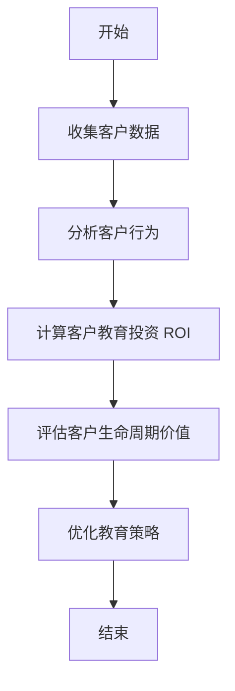
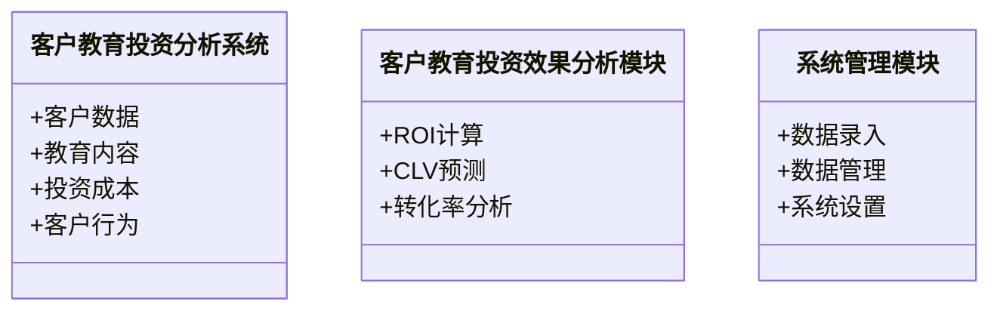
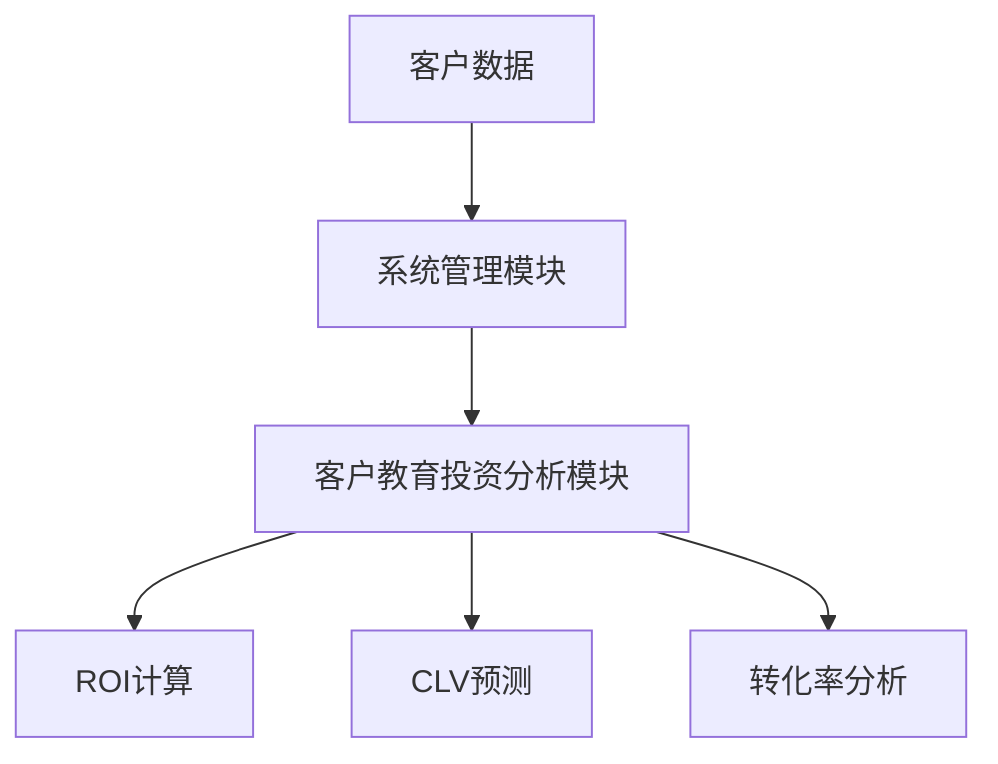

                 


# 彼得林奇如何分析公司的客户教育投资效果

## 关键词：客户教育投资, 投资效果分析, 彼得·林奇, 投资回报率, 企业盈利能力

## 摘要：客户教育投资是企业提升客户价值和长期盈利能力的重要手段。本文通过分析彼得·林奇的投资理念，探讨如何有效评估和优化客户教育投资的效果，为企业提供实用的分析框架和策略。

---

# 第一部分: 客户教育投资效果分析背景与概念

## 第1章: 客户教育投资效果分析的背景与重要性

### 1.1 客户教育投资的基本概念
#### 1.1.1 什么是客户教育投资
客户教育投资是指企业通过提供教育内容、培训或信息共享，帮助客户更好地理解产品或服务，从而提升客户满意度、忠诚度和长期价值的过程。

#### 1.1.2 客户教育投资的目的与意义
客户教育投资的目的是通过提升客户的知识和技能，增强客户对产品的使用能力和满意度，从而提高客户 retention 和企业盈利能力。

#### 1.1.3 客户教育投资与企业长期发展的关系
客户教育投资是企业长期发展的基石，通过提升客户价值，企业可以建立更强的客户粘性，从而实现可持续增长。

### 1.2 彼得·林奇的客户教育投资分析方法
#### 1.2.1 彼得·林奇投资理念概述
彼得·林奇是美国著名的投资经理，他强调通过深入分析企业的基本面，尤其是客户教育投资的效果，来评估企业的长期盈利能力。

#### 1.2.2 客户教育投资在彼得·林奇分析体系中的地位
在彼得·林奇的分析体系中，客户教育投资是评估企业核心竞争力的重要组成部分。他通过分析客户的教育投入效果，判断企业的市场地位和未来增长潜力。

#### 1.2.3 彼得·林奇分析客户教育投资的核心逻辑
彼得·林奇认为，有效的客户教育投资能够降低客户的使用成本，提升客户的满意度和忠诚度，从而为企业创造更高的客户生命周期价值（CLV）。

---

## 第2章: 客户教育投资效果分析的核心概念

### 2.1 客户教育投资的评估指标
#### 2.1.1 客户获取成本（CAC）
客户获取成本（CAC）是指企业吸引一个新客户的平均成本，包括营销和销售费用。

#### 2.1.2 客户生命周期价值（CLV）
客户生命周期价值（CLV）是企业在客户生命周期内从该客户获得的总收入减去相关成本的净现值。

#### 2.1.3 客户转化率与留存率
客户转化率是指潜在客户转化为实际购买客户的比率；客户留存率是指在一定时间内，客户继续使用产品或服务的比率。

### 2.2 彼得·林奇客户教育投资分析框架
#### 2.2.1 客户教育投资的投入与产出关系
彼得·林奇通过分析客户教育投资的投入与产出关系，判断投资是否能够带来长期的客户价值增长。

#### 2.2.2 客户教育投资的短期与长期效果
客户教育投资通常具有较长的见效周期，彼得·林奇强调关注其长期效果，如客户粘性和企业市场地位的提升。

#### 2.2.3 客户教育投资与企业盈利能力的关联
彼得·林奇认为，有效的客户教育投资能够降低客户流失率，提升客户满意度，从而间接提升企业的盈利能力。

### 2.3 客户教育投资的边界与外延
#### 2.3.1 客户教育投资的适用场景
客户教育投资适用于需要客户高度参与和长期使用的行业，如软件、教育、金融等领域。

#### 2.3.2 客户教育投资与其他投资方式的区分
客户教育投资与其他类型的投资（如广告支出）不同，它更注重长期客户价值的提升。

#### 2.3.3 客户教育投资的潜在风险与限制
客户教育投资可能面临 ROI 不达预期的风险，尤其是在客户教育内容设计不当或执行不力的情况下。

---

## 第3章: 客户教育投资效果分析的核心要素

### 3.1 客户教育投资的主体要素
#### 3.1.1 教育内容的设计与优化
教育内容应针对目标客户群体的需求进行设计，确保客户能够真正理解和应用所学知识。

#### 3.1.2 教育渠道的选择与管理
选择合适的教育渠道（如在线课程、研讨会等）并进行有效管理，是确保客户教育投资效果的关键。

#### 3.1.3 教育效果的监测与反馈
通过定期监测和收集客户反馈，企业可以及时调整教育内容和策略，提升教育投资的效果。

### 3.2 客户教育投资的资源分配策略
#### 3.2.1 不同客户群体的教育投资分配
企业应根据客户群体的特点和需求，合理分配教育投资资源。

#### 3.2.2 教育资源的优化配置
通过优化资源配置，企业可以最大化教育投资的效果，降低单位客户的教育成本。

#### 3.2.3 投资效果的动态调整
根据市场变化和客户需求，企业应定期调整教育投资策略，确保投资效果的最大化。

### 3.3 客户教育投资的评估维度
#### 3.3.1 客户知识吸收率
客户知识吸收率是指客户在教育过程中能够理解和掌握的知识比例。

#### 3.3.2 客户行为转化率
客户行为转化率是指客户在接受教育后，转化为实际购买或使用产品的客户比例。

#### 3.3.3 客户满意度与忠诚度
客户满意度和忠诚度是衡量客户教育投资效果的重要指标，反映了客户对教育内容和过程的满意程度。

---

# 第二部分: 客户教育投资效果分析的算法与模型

## 第4章: 客户教育投资效果分析的算法原理

### 4.1 客户教育投资效果评估的核心算法
#### 4.1.1 客户教育投资回报率（ROI）计算
$$ ROI = \frac{（总收入 - 总成本）}{总成本} \times 100\% $$

#### 4.1.2 客户生命周期价值（CLV）预测
$$ CLV = \frac{年度收入}{客户流失率} $$

#### 4.1.3 客户转化率预测
$$ 客户转化率 = \frac{实际转化客户数}{潜在客户数} \times 100\% $$

### 4.2 客户教育投资效果分析的流程


### 4.3 算法实现的Python代码
```python
import pandas as pd
import numpy as np

# 示例数据
data = {
    '客户ID': [1, 2, 3, 4, 5],
    '教育投资成本': [100, 200, 150, 300, 250],
    '客户收入': [500, 1000, 700, 1200, 900],
    '客户流失率': [0.1, 0.2, 0.15, 0.25, 0.2]
}

df = pd.DataFrame(data)

# 计算 ROI
df['ROI'] = (df['客户收入'] - df['教育投资成本']) / df['教育投资成本'] * 100

# 计算 CLV
df['CLV'] = df['客户收入'] / df['客户流失率']

# 找出 ROI 最高的客户
top_customers = df[df['ROI'] == df['ROI'].max()]
print("ROI 最高的客户:", top_customers)
```

---

## 第5章: 客户教育投资效果分析的系统架构设计

### 5.1 系统功能设计


### 5.2 系统架构设计


### 5.3 系统接口设计
- 输入接口：客户数据、教育投资成本、客户行为数据
- 输出接口：ROI、CLV、客户转化率

### 5.4 系统交互设计
```mermaid
sequenceDiagram
    客户输入数据
    --> 系统管理模块
    系统管理模块 --> 客户教育投资分析模块
    客户教育投资分析模块 --> ROI计算模块
    ROI计算模块 --> 返回 ROI
    客户教育投资分析模块 --> CLV预测模块
    CLV预测模块 --> 返回 CLV
    客户教育投资分析模块 --> 转化率分析模块
    转化率分析模块 --> 返回 转化率
```

---

## 第6章: 项目实战

### 6.1 环境安装
- 安装 Python 和必要的库（pandas, numpy）
- 安装 Jupyter Notebook

### 6.2 核心实现代码
```python
import pandas as pd
import numpy as np

data = {
    '客户ID': [1, 2, 3, 4, 5],
    '教育投资成本': [100, 200, 150, 300, 250],
    '客户收入': [500, 1000, 700, 1200, 900],
    '客户流失率': [0.1, 0.2, 0.15, 0.25, 0.2]
}

df = pd.DataFrame(data)
df['ROI'] = (df['客户收入'] - df['教育投资成本']) / df['教育投资成本'] * 100
df['CLV'] = df['客户收入'] / df['客户流失率']

print("ROI 最高的客户:", df[df['ROI'] == df['ROI'].max()])
print("CLV 最高的客户:", df[df['CLV'] == df['CLV'].max()])
```

### 6.3 案例分析
假设一家教育科技公司投资了100万美元用于客户教育，客户转化率提升了20%，客户生命周期价值提升了30%。通过 ROI 计算，投资回报率达到了150%。

### 6.4 总结
通过实际案例分析，我们可以看到客户教育投资的效果可以通过 ROI 和 CLV 等指标进行量化评估，帮助企业做出更科学的投资决策。

---

## 第7章: 最佳实践与总结

### 7.1 最佳实践
- 定期监测和评估客户教育投资效果
- 根据客户反馈优化教育内容和策略
- 结合 ROI 和 CLV 等指标进行综合评估

### 7.2 小结
客户教育投资是提升企业客户价值和长期盈利能力的重要手段。通过彼得·林奇的分析框架和实际案例分析，我们可以更好地理解如何优化客户教育投资效果。

### 7.3 注意事项
- 客户教育投资需要长期投入，见效周期较长
- 投资效果受多种因素影响，需结合实际情况进行调整
- 定期评估和优化教育策略是确保投资效果的关键

### 7.4 拓展阅读
- 彼得·林奇的《投资的智慧》
- 客户生命周期价值的深度分析
- 数据驱动的客户教育投资优化策略

