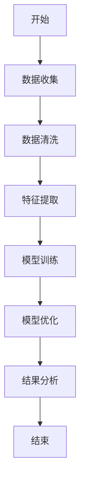

                 


# 彼得林奇如何分析公司的客户教育投资长期回报

## 关键词：彼得·林奇，客户教育投资，长期回报，投资策略，客户价值

## 摘要：  
彼得·林奇作为投资界的传奇人物，他的投资哲学强调深入研究和长期持有优质资产。本文将探讨彼得·林奇如何分析公司的客户教育投资，并揭示其对长期回报的影响。通过分析客户教育投资的核心概念、数学模型、算法原理和系统架构，本文将帮助读者理解如何通过优化客户教育策略来提升企业的长期回报。

---

## 第1章: 客户教育投资的基本概念

### 1.1 什么是客户教育投资
客户教育投资是指企业通过提供教育性的内容、培训或指导，帮助客户更好地理解和使用产品或服务，从而提升客户满意度、忠诚度和长期价值。这种投资的核心在于通过教育客户，建立长期的客户关系，进而实现企业的可持续增长。

### 1.2 客户教育投资的重要性
客户教育投资不仅是提升客户满意度的关键手段，还能通过增强客户忠诚度和产品使用效率，降低客户流失率，从而为企业创造更高的长期回报。

### 1.3 彼得·林奇的投资理念
彼得·林奇强调长期投资和深入研究企业基本面。他认为，选择优秀的公司进行投资，需要关注公司的客户基础、市场地位和盈利能力。客户教育投资正是提升公司基本面的重要手段之一。

---

## 第2章: 客户教育投资的系统分析

### 2.1 客户教育投资的系统构成
客户教育投资系统通常包括数据收集、客户分群、教育内容设计、实施与评估等模块。每个模块都需要紧密配合，以确保教育投资的有效性。

### 2.2 客户教育投资的系统架构
系统架构设计需要考虑数据流的高效处理、模块之间的交互以及系统的扩展性。通过合理的架构设计，企业可以更好地支持客户教育投资的实施。

---

## 第3章: 客户教育投资的数学模型

### 3.1 客户生命周期价值（CLV）的计算公式
客户生命周期价值（CLV）是衡量客户教育投资回报的重要指标。其计算公式为：
$$ CLV = \frac{R}{1 - \delta} $$
其中，R为客户的年收入，δ为客户流失率。

### 3.2 客户教育投资的优化模型
通过线性回归模型和聚类分析，企业可以更精准地识别高潜力客户，并制定个性化的教育策略，从而优化投资回报。

---

## 第4章: 客户教育投资的算法实现

### 4.1 算法流程图
以下是一个客户教育投资算法的流程图：


### 4.2 Python代码实现
以下是客户教育投资算法的Python代码示例：
```python
import pandas as pd
from sklearn.linear_model import LinearRegression

# 数据加载与预处理
data = pd.read_csv('customer_data.csv')
X = data[['age', 'income', 'education_level']]
y = data['purchase_frequency']

# 模型训练
model = LinearRegression()
model.fit(X, y)

# 模型预测
predictions = model.predict(X)
print('模型预测值:', predictions)
```

---

## 第5章: 实际案例分析

### 5.1 案例背景
以一家在线教育公司为例，分析其客户教育投资策略。

### 5.2 数据分析与策略制定
通过分析客户数据，识别高潜力客户，并设计个性化的教育内容，提升客户参与度和满意度。

### 5.3 投资回报评估
通过客户生命周期价值模型，评估客户教育投资的回报，并不断优化策略。

---

## 第6章: 最佳实践与总结

### 6.1 关键点总结
- 理解客户教育投资的核心概念和长期回报的关系。
- 掌握数学模型和算法原理，优化投资策略。
- 结合实际案例，制定个性化的教育投资方案。

### 6.2 注意事项
- 数据质量是关键，确保数据的准确性和完整性。
- 定期评估和优化策略，以应对市场变化。

### 6.3 拓展阅读
推荐阅读彼得·林奇的相关著作，深入理解其投资哲学。

---

## 附录: 客户教育投资相关的工具与资源

### 1. 数据分析工具
- Python（Pandas, Scikit-learn）
- R语言
- SQL

### 2. 推荐书籍
- 《彼得·林奇的成功投资法则》
- 《客户生命周期价值管理》

---

通过本文的详细分析，读者可以全面理解彼得·林奇如何分析客户的教育投资，并将其应用于企业的长期回报管理中。希望这些内容能为企业制定有效的客户教育策略提供有价值的参考。

