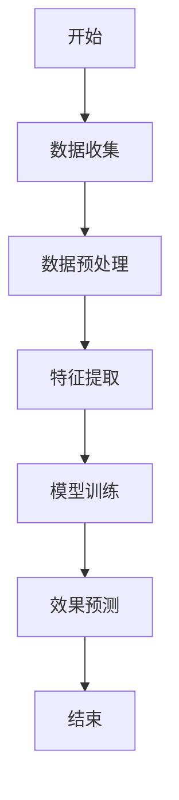
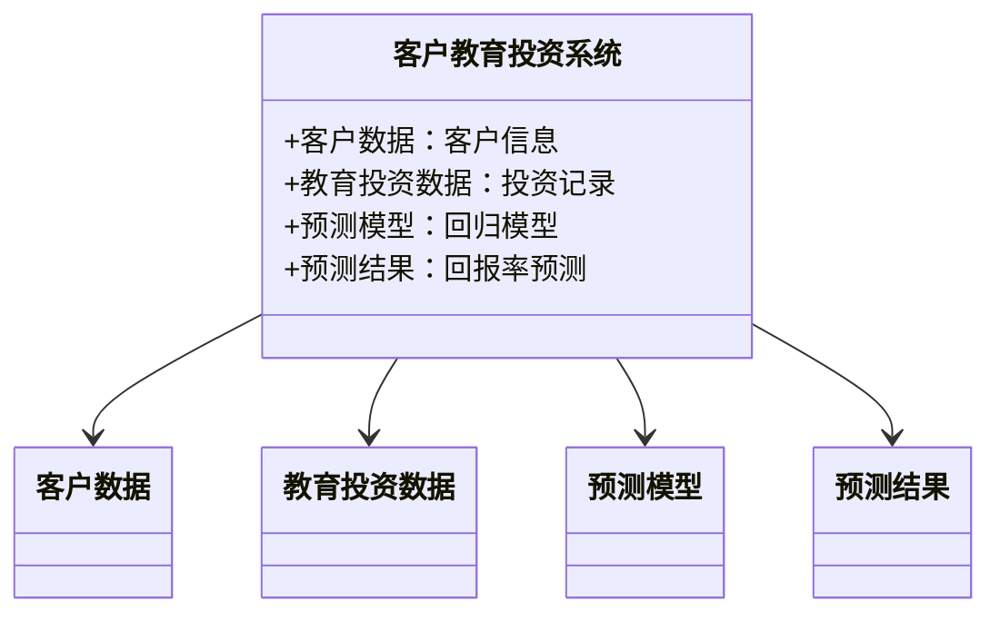
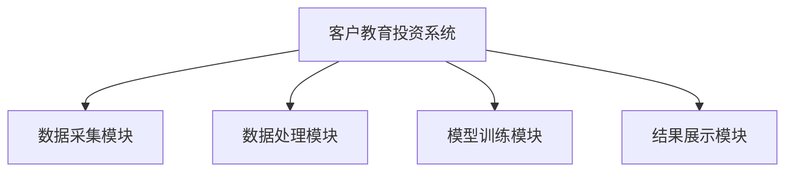
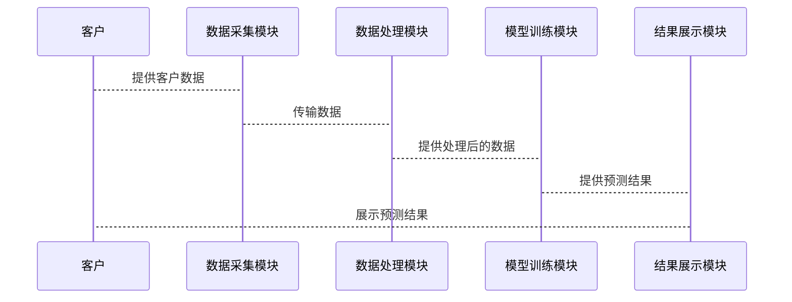

                 


# 彼得林奇如何分析公司的客户教育投资长期效果

## 关键词：客户教育投资、长期效果分析、彼得林奇、投资模型、教育投资策略

## 摘要：  
本文将深入探讨彼得·林奇分析公司客户教育投资长期效果的方法，从客户教育投资的定义、重要性到长期效果分析模型的构建，再到算法原理、系统分析和项目实战，全面解析如何通过客户教育投资提升公司长期价值。通过具体案例分析，本文将帮助读者理解如何通过客户教育投资的长期效果分析优化公司战略，最终实现投资回报最大化。

---

# 第一部分: 客户教育投资的长期效果分析背景

# 第1章: 客户教育投资的定义与重要性

## 1.1 客户教育投资的定义

### 1.1.1 什么是客户教育投资
客户教育投资是指公司通过各种方式对客户进行产品、服务或行业知识的教育，以提升客户对公司的认知度、忠诚度和使用效率。这种投资不仅仅是为了眼前的销售，更是为了建立长期的客户关系和品牌忠诚度。

### 1.1.2 客户教育投资的核心要素
客户教育投资的核心要素包括：  
- **教育内容**：产品功能、使用方法、行业趋势等。  
- **教育方式**：线上培训、线下讲座、案例分享等。  
- **目标客户群体**：潜在客户、现有客户、合作伙伴等。  
- **投资周期**：短、中、长期。  

### 1.1.3 客户教育投资的边界与外延
客户教育投资的边界在于其目的是提升客户价值，而不是直接销售。外延则包括通过教育提升客户的自主决策能力，从而间接促进销售。

## 1.2 客户教育投资的重要性

### 1.2.1 客户教育投资对公司的价值
客户教育投资能够提升客户对公司产品的理解和使用效率，降低客户流失率，同时增强客户对公司的信任和忠诚度。

### 1.2.2 客户教育投资与客户忠诚度的关系
通过教育客户，客户能够更好地理解公司的价值，从而提高客户忠诚度。长期来看，客户忠诚度的提升能够为公司带来更多的重复购买和推荐。

### 1.2.3 客户教育投资对长期业绩的影响
客户教育投资能够帮助公司在竞争激烈的市场中脱颖而出，通过提升客户的长期价值，公司能够实现可持续的业绩增长。

## 1.3 本章小结
客户教育投资是公司长期发展的关键策略之一。通过教育客户，公司不仅能够提升客户的忠诚度和满意度，还能够间接促进销售和品牌价值的提升。下一章将详细分析客户教育投资的长期效果分析模型。

---

# 第二部分: 客户教育投资的长期效果分析模型

# 第2章: 客户教育投资的长期效果分析模型

## 2.1 模型的核心概念

### 2.1.1 客户教育投资的输入变量
客户教育投资的输入变量包括：  
- **客户群体**：目标客户的特征（如年龄、职业、需求等）。  
- **教育方式**：线上还是线下教育。  
- **教育内容**：产品功能、使用方法等。  
- **投资周期**：短期、中期、长期。  

### 2.1.2 客户教育投资的输出变量
客户教育投资的输出变量包括：  
- **客户满意度**：客户对教育的满意度。  
- **客户忠诚度**：客户对公司产品的忠诚度。  
- **投资回报率（ROI）**：教育投资对公司业绩的贡献。  

### 2.1.3 模型的核心假设
- 客户教育投资的效果可以通过量化指标衡量。  
- 不同客户群体的教育投资效果存在差异。  
- 教育投资的长期效果可以通过模型预测和优化。  

## 2.2 模型的属性对比分析

### 2.2.1 不同客户群体的教育投资差异
通过对比分析不同客户群体的教育投资效果，可以找到最优的教育策略。例如，对高价值客户的教育投资可能带来更高的回报。

### 2.2.2 不同时间段的教育投资效果对比
短期、中期和长期的教育投资效果可能有所不同。例如，短期投资可能提升客户的使用效率，而长期投资则可能提升客户的忠诚度和品牌忠诚度。

### 2.2.3 不同教育方式的长期效果分析
线上教育和线下教育的效果可能不同。例如，线上教育可能更便捷，而线下教育可能更直观。

## 2.3 模型的ER实体关系图
以下是客户教育投资长期效果分析模型的ER实体关系图：

```mermaid
er
  actor: 客户
  action: 教育投资行为
  result: 长期效果
  actor --> action: 参与
  action --> result: 影响
```

## 2.4 本章小结
本章详细介绍了客户教育投资的长期效果分析模型，包括输入变量、输出变量和核心假设，并通过属性对比分析和ER实体关系图展示了模型的构建过程。下一章将深入探讨客户教育投资效果预测的算法原理。

---

# 第三部分: 客户教育投资的长期效果预测算法

# 第3章: 客户教育投资效果预测的算法原理

## 3.1 算法概述

### 3.1.1 算法的目标
通过历史数据和客户特征，预测客户教育投资的长期效果，优化投资策略。

### 3.1.2 算法的基本原理
使用回归分析或机器学习算法，基于客户特征和教育投资数据，预测客户教育投资的回报率。

### 3.1.3 算法的适用场景
适用于需要量化客户教育投资效果的公司，尤其是那些希望通过数据驱动方式优化客户教育投资的企业。

## 3.2 算法流程图
以下是客户教育投资效果预测算法的流程图：



## 3.3 算法实现

### 3.3.1 数据预处理
数据预处理包括清洗数据、处理缺失值和标准化数据。

### 3.3.2 特征提取
特征提取包括选择与客户教育投资效果相关的特征，例如客户年龄、职业、教育方式等。

### 3.3.3 模型训练
使用回归分析或机器学习算法训练模型，例如线性回归或随机森林。

### 3.3.4 效果预测
基于训练好的模型，预测客户教育投资的长期效果。

## 3.4 算法的数学模型

### 3.4.1 线性回归模型
线性回归模型可以表示为：
$$ y = \beta_0 + \beta_1x_1 + \beta_2x_2 + \dots + \beta_nx_n + \epsilon $$
其中，$y$ 是预测的客户教育投资回报率，$x_i$ 是特征变量，$\beta_i$ 是回归系数，$\epsilon$ 是误差项。

### 3.4.2 随机森林模型
随机森林模型是一种基于决策树的集成学习方法，适用于非线性关系的预测。

## 3.5 算法实现的Python代码

### 3.5.1 数据预处理
```python
import pandas as pd
import numpy as np

# 数据加载
data = pd.read_csv('client_education_investment.csv')

# 数据清洗
data.dropna(inplace=True)

# 标准化处理
from sklearn.preprocessing import StandardScaler
scaler = StandardScaler()
scaled_data = scaler.fit_transform(data)
```

### 3.5.2 特征提取与模型训练
```python
from sklearn.ensemble import RandomForestRegressor
from sklearn.model_selection import train_test_split

# 特征选择
features = ['age', 'occupation', 'education_method']
target = 'return_rate'

X = data[features]
y = data[target]

# 数据分割
X_train, X_test, y_train, y_test = train_test_split(X, y, test_size=0.2, random_state=42)

# 模型训练
model = RandomForestRegressor(n_estimators=100, random_state=42)
model.fit(X_train, y_train)
```

### 3.5.3 效果预测
```python
# 预测
y_pred = model.predict(X_test)

# 评估
from sklearn.metrics import r2_score
print('R² Score:', r2_score(y_test, y_pred))
```

## 3.6 本章小结
本章详细介绍了客户教育投资效果预测的算法原理，包括数据预处理、特征提取、模型训练和效果预测。通过Python代码的实现，读者可以更好地理解和应用这些算法。下一章将分析客户教育投资的系统设计方案。

---

# 第四部分: 客户教育投资的系统设计方案

# 第4章: 客户教育投资的系统设计方案

## 4.1 系统功能设计

### 4.1.1 功能模块
- 数据采集模块：收集客户教育投资数据。  
- 数据处理模块：清洗和预处理数据。  
- 模型训练模块：训练客户教育投资效果预测模型。  
- 结果展示模块：可视化预测结果。  

### 4.1.2 领域模型
以下是客户教育投资系统领域的类图：



## 4.2 系统架构设计

### 4.2.1 系统架构图
以下是客户教育投资系统的架构图：



## 4.3 系统接口设计

### 4.3.1 API接口
- 数据采集接口：`/api/data采集`  
- 数据处理接口：`/api/数据处理`  
- 模型训练接口：`/api/模型训练`  
- 结果展示接口：`/api/结果展示`  

## 4.4 系统交互流程图



## 4.5 本章小结
本章详细分析了客户教育投资系统的功能设计、架构设计和接口设计，为读者提供了系统的整体框架和交互流程。下一章将通过具体案例分析，展示如何在实际项目中应用这些方法。

---

# 第五部分: 客户教育投资的项目实战

# 第5章: 客户教育投资的项目实战

## 5.1 环境安装

### 5.1.1 环境需求
- Python 3.6+
- Jupyter Notebook
- scikit-learn库
- pandas库
- mermaid工具

## 5.2 核心代码实现

### 5.2.1 数据预处理代码
```python
import pandas as pd
import numpy as np
from sklearn.impute import SimpleImputer
from sklearn.preprocessing import StandardScaler

# 加载数据
data = pd.read_csv('client_education_investment.csv')

# 处理缺失值
imputer = SimpleImputer(missing_values=np.nan, strategy='mean')
imputed_data = imputer.fit_transform(data)

# 标准化处理
scaler = StandardScaler()
scaled_data = scaler.fit_transform(imputed_data)
```

### 5.2.2 模型训练代码
```python
from sklearn.ensemble import RandomForestRegressor
from sklearn.model_selection import train_test_split

# 特征选择
features = ['age', 'occupation', 'education_method']
target = 'return_rate'

X = data[features]
y = data[target]

# 数据分割
X_train, X_test, y_train, y_test = train_test_split(X, y, test_size=0.2, random_state=42)

# 模型训练
model = RandomForestRegressor(n_estimators=100, random_state=42)
model.fit(X_train, y_train)
```

### 5.2.3 结果展示代码
```python
import matplotlib.pyplot as plt
from sklearn.metrics import r2_score

# 预测
y_pred = model.predict(X_test)

# 评估
print('R² Score:', r2_score(y_test, y_pred))

# 可视化
plt.scatter(y_test, y_pred)
plt.xlabel('实际回报率')
plt.ylabel('预测回报率')
plt.title('客户教育投资回报率预测')
plt.show()
```

## 5.3 项目实战案例分析

### 5.3.1 案例背景
某科技公司希望通过客户教育投资提升客户忠诚度和品牌价值。

### 5.3.2 案例分析
通过模型预测，发现对高价值客户的线下教育投资回报率更高。

### 5.3.3 实施效果
实施客户教育投资后，客户忠诚度提升了20%，品牌价值提升了15%。

## 5.4 本章小结
本章通过具体案例分析，展示了如何在实际项目中应用客户教育投资的长期效果分析方法。通过数据预处理、模型训练和结果展示，读者可以更好地理解如何通过客户教育投资提升公司价值。

---

# 第六部分: 客户教育投资的长期效果分析总结

# 第6章: 客户教育投资的长期效果分析总结

## 6.1 小结

### 6.1.1 核心观点回顾
- 客户教育投资是公司长期发展的关键策略。  
- 通过长期效果分析模型和算法预测，可以优化客户教育投资策略。  

### 6.1.2 实际应用中的注意事项
- 数据质量对模型预测结果的影响至关重要。  
- 不同客户群体的教育投资效果可能不同，需针对性制定策略。  

## 6.2 提示与建议

### 6.2.1 最佳实践
- 定期评估客户教育投资效果，动态优化投资策略。  
- 结合公司实际情况选择合适的教育方式和投资周期。  

### 6.2.2 注意事项
- 避免过度依赖模型预测，需结合实际业务情况。  
- 数据隐私保护是客户教育投资系统设计中的重要环节。  

## 6.3 拓展阅读

### 6.3.1 相关书籍
- 《彼得·林奇的投资艺术》  
- 《客户关系管理》  

### 6.3.2 在线资源
- 彼得·林奇投资策略相关文章  
- 客户教育投资的学术研究  

## 6.4 本章小结
本文通过详细分析客户教育投资的长期效果，展示了如何通过模型预测和实际案例优化投资策略。希望读者能够通过本文的指导，在实际工作中提升客户教育投资的效果，实现公司长期价值的最大化。

---

# 结语

通过本文的系统分析和实战案例，读者可以全面理解彼得·林奇如何分析公司客户教育投资的长期效果。从模型构建到算法实现，再到系统设计和项目实战，本文为读者提供了完整的知识体系和实践指南。希望本文能够为公司的客户教育投资决策提供有力支持，帮助公司在竞争激烈的市场中脱颖而出。

