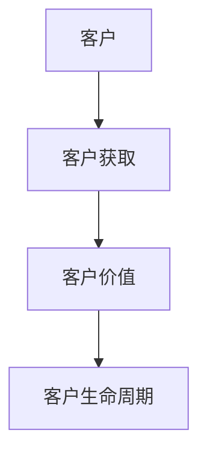
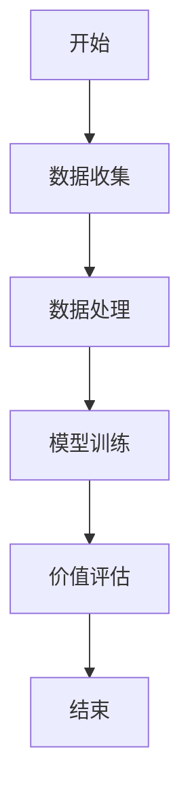
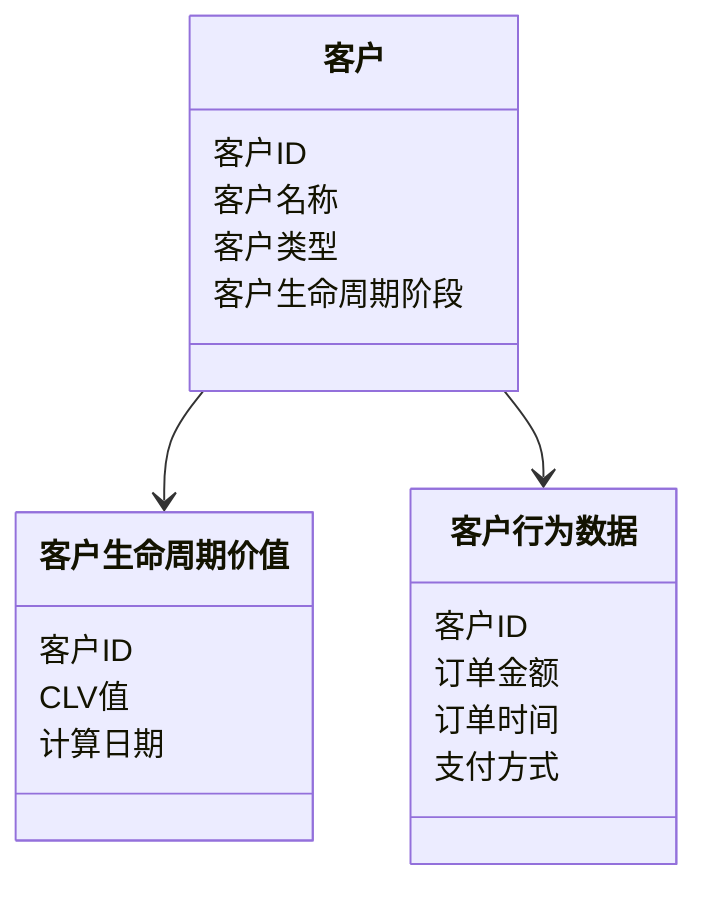
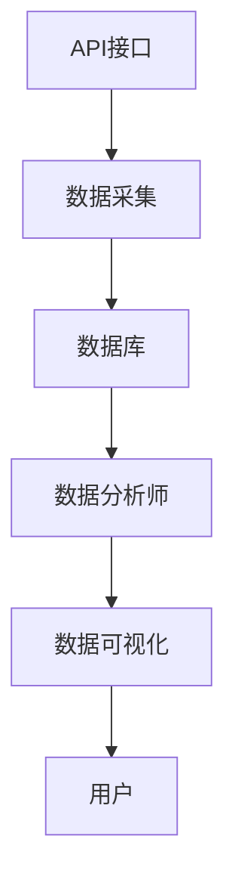
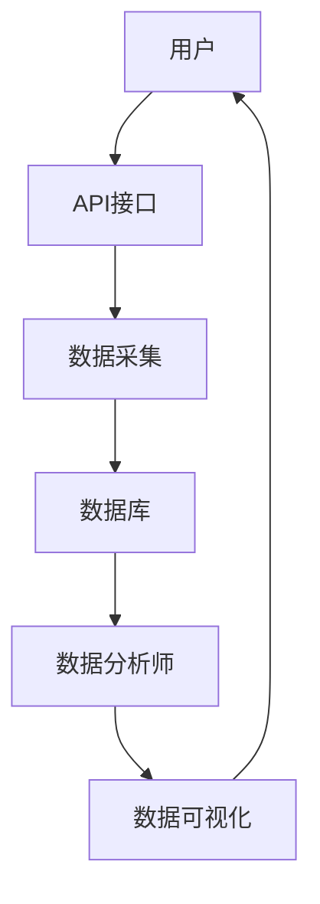

                 


# 彼得林奇如何分析公司的客户生命周期价值

## 关键词
客户生命周期价值、彼得林奇、投资分析、客户价值模型、数据驱动决策

## 摘要
客户生命周期价值（Customer Lifetime Value，简称CLV）是衡量客户为企业带来的长期价值的重要指标。本文以彼得·林奇的投资哲学为视角，深入分析如何通过客户生命周期价值模型评估客户的长期价值，帮助企业做出更明智的投资决策。文章将从客户生命周期价值的定义、核心概念、数学模型、系统分析与架构设计、项目实战等方面进行详细阐述，结合实际案例和代码实现，帮助读者全面理解并掌握客户生命周期价值的分析方法。

---

# 第1章: 客户生命周期价值的定义与重要性

## 1.1 客户生命周期价值的定义
### 1.1.1 客户生命周期的定义
客户生命周期是指客户与企业之间的关系从开始到结束的全过程，包括客户获取、客户互动、客户保留、客户流失等阶段。

### 1.1.2 客户生命周期价值的定义
客户生命周期价值（CLV）是指客户在其生命周期内为企业带来的净收益，综合考虑了客户的消费行为、留存时间和经济贡献。

### 1.1.3 客户生命周期价值的重要性
1. **优化投资决策**：通过分析客户生命周期价值，企业可以更精准地评估客户的长期价值，优化市场推广和客户服务的投入。
2. **提升客户留存率**：识别高价值客户，制定差异化的客户管理策略，提升客户忠诚度和留存率。
3. **降低客户获取成本**：通过预测客户生命周期价值，企业可以更精准地选择目标客户，降低无效客户的获取成本。

## 1.2 客户生命周期价值的核心要素
### 1.2.1 客户获取阶段的价值
1. **客户获取成本**：企业在吸引客户过程中所投入的营销成本、广告成本等。
2. **客户转化率**：潜在客户转化为实际客户的比例。

### 1.2.2 客户保留阶段的价值
1. **客户留存率**：客户在企业服务期间持续消费的概率。
2. **客户消费频率**：客户在生命周期内的消费次数。

### 1.2.3 客户流失阶段的价值
1. **客户流失率**：客户在某个阶段离开企业的概率。
2. **客户流失前的价值贡献**：客户在流失前为企业带来的收入和利润。

## 1.3 客户生命周期价值的分析方法
### 1.3.1 客户生命周期价值的计算公式
客户生命周期价值的计算公式可以表示为：
$$\text{CLV} = \text{客户平均收入} \times \text{客户生命周期长度}$$

### 1.3.2 客户生命周期价值的分析工具
1. **数据分析工具**：如Excel、Python、R等。
2. **客户关系管理（CRM）系统**：用于收集和管理客户数据。

---

# 第2章: 客户生命周期价值的核心概念与联系

## 2.1 客户生命周期价值的核心概念
### 2.1.1 客户生命周期价值的构成要素
1. **客户获取成本**：企业在吸引客户过程中投入的资源。
2. **客户消费价值**：客户在生命周期内为企业带来的收入和利润。
3. **客户流失风险**：客户在生命周期内流失的可能性。

### 2.1.2 客户生命周期价值的数学模型
客户生命周期价值的数学模型可以通过以下公式表示：
$$\text{CLV} = \sum_{t=1}^{n} \frac{\text{ARPU}_t}{(1 + r)^{t-1}}$$
其中，ARPU_t 是第 t 年的客户年收入，r 是贴现率。

### 2.1.3 客户生命周期价值的属性特征对比表格
以下是一些常见的客户生命周期价值属性特征的对比表格：

| 属性 | 特征 |
|------|------|
| 客户获取成本 | 投入的资源和时间 |
| 客户消费价值 | 客户的消费频率和金额 |
| 客户生命周期长度 | 客户从获取到流失的时间 |
| 客户流失率 | 客户在生命周期内流失的概率 |

### 2.2 客户生命周期价值的ER实体关系图
以下是一个简单的客户生命周期价值的ER实体关系图：



### 2.3 客户生命周期价值的算法原理
客户生命周期价值的算法原理可以通过以下流程图表示：



---

# 第3章: 客户生命周期价值的数学模型与公式

## 3.1 客户生命周期价值的计算公式
客户生命周期价值的计算公式可以表示为：
$$\text{CLV} = \text{客户平均收入} \times \text{客户生命周期长度}$$

## 3.2 客户生命周期价值的数学模型
客户生命周期价值的数学模型可以通过以下公式表示：
$$\text{CLV} = \sum_{t=1}^{n} \frac{\text{ARPU}_t}{(1 + r)^{t-1}}$$
其中，ARPU_t 是第 t 年的客户年收入，r 是贴现率。

## 3.3 客户生命周期价值的举例说明
假设某公司客户年收入为 $100，生命周期长度为 5 年，贴现率为 10%。则客户生命周期价值为：
$$\text{CLV} = \frac{100}{(1 + 0.1)^{0}} + \frac{100}{(1 + 0.1)^{1}} + \frac{100}{(1 + 0.1)^{2}} + \frac{100}{(1 + 0.1)^{3}} + \frac{100}{(1 + 0.1)^{4}}$$
计算结果为：
$$\text{CLV} = 100 + 90.91 + 82.64 + 75.13 + 68.30 ≈ 327.98$$

---

# 第4章: 客户生命周期价值的系统分析与架构设计

## 4.1 问题场景介绍
客户生命周期价值的分析需要企业具备完善的数据采集和处理能力，同时需要结合企业的业务特点和客户行为特征。

## 4.2 系统功能设计
### 4.2.1 领域模型设计
以下是一个客户生命周期价值的领域模型设计：



### 4.2.2 系统架构设计
以下是一个客户生命周期价值的系统架构设计：



### 4.2.3 系统接口设计
1. **数据接口**：用于采集客户行为数据和交易数据。
2. **计算接口**：用于计算客户生命周期价值。
3. **可视化接口**：用于展示客户生命周期价值的分析结果。

### 4.2.4 系统交互设计
以下是一个系统交互设计的流程图：



---

# 第5章: 客户生命周期价值的项目实战

## 5.1 环境安装
1. **Python环境**：安装Python和相关库（如Pandas、NumPy、Scikit-learn）。
2. **数据存储**：使用MySQL或MongoDB存储客户数据。

## 5.2 核心代码实现
以下是计算客户生命周期价值的核心代码：

```python
import pandas as pd
import numpy as np

def calculate_clv(customers, arpu, discount_rate):
    clv = []
    for customer in customers:
        clv_customer = 0
        for t in range(len(arpu)):
            clv_customer += arpu[t] / (1 + discount_rate) ** t
        clv.append(clv_customer)
    return clv

# 示例数据
customers = [1, 2, 3]
arpu = [100, 200, 150]
discount_rate = 0.1

# 计算客户生命周期价值
clv = calculate_clv(customers, arpu, discount_rate)
print(clv)
```

## 5.3 代码应用解读与分析
1. **数据输入**：读取客户数据和历史消费数据。
2. **计算客户生命周期价值**：使用上述代码计算客户的CLV值。
3. **结果分析**：根据CLV值对客户进行分层管理。

## 5.4 案例分析与详细讲解
以某电商平台为例，分析客户的CLV值，并根据CLV值制定差异化的营销策略。

---

# 第6章: 总结与展望

## 6.1 最佳实践 tips
1. **数据准确性**：确保客户数据的准确性和完整性。
2. **模型优化**：根据企业的实际情况不断优化CLV模型。
3. **客户分层管理**：根据CLV值对客户进行分层管理，制定差异化的营销策略。

## 6.2 未来研究方向
1. **动态CLV模型**：研究如何实时更新CLV值。
2. **机器学习应用**：探索机器学习在CLV预测中的应用。

---

通过以上内容，我们全面介绍了彼得·林奇如何分析公司的客户生命周期价值，并通过实际案例和代码实现，帮助读者更好地理解和应用这一方法。希望本文能够为企业的客户价值管理提供有价值的参考和指导。

