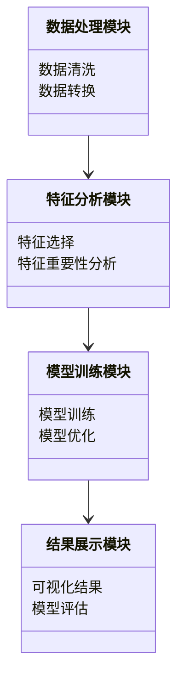

                 


# 彼得林奇如何分析公司的客户留存率

## 关键词：客户留存率，彼得林奇，公司价值，客户分析，投资策略，数据驱动决策

## 摘要：
本文深入探讨了彼得·林奇如何通过分析客户留存率来评估公司的价值和潜在投资机会。文章从客户留存率的定义和背景出发，逐步分析其核心概念、算法原理、系统设计和实际应用。通过详细的案例分析和代码示例，帮助读者理解如何利用客户留存率预测模型进行投资决策优化。

---

## 正文：

### 第一部分: 背景介绍

#### 第1章: 客户留存率的重要性

##### 1.1 客户留存率的定义与背景

客户留存率（Customer Retention Rate）是衡量企业在一定时间内保留现有客户的能力，通常以百分比表示。例如，若某公司上一季度有1000名客户，本季度保留了900名，则客户留存率为90%。

**客户留存率的重要性**：
- **客户留存率与公司利润密切相关**：高留存率意味着客户对公司产品或服务的高度满意，从而减少获取新客户的成本。
- **客户留存率与公司增长密切相关**：高留存率是公司持续增长的基础，因为现有客户更可能购买更多产品或服务，或推荐新客户。

**彼得·林奇对客户留存率的关注**：
彼得·林奇是著名投资家，他在评估公司时非常重视客户留存率，认为这是衡量公司长期价值的重要指标。他认为，一个公司如果能够持续保持高客户留存率，往往意味着其产品或服务具有强大的市场竞争力和客户满意度。

##### 1.2 彼得·林奇的客户留存率分析方法

**客户留存率与公司价值的关系**：
彼得·林奇认为，客户留存率高的公司通常具有更高的利润率和更低的营销成本，因为它们可以从现有客户中获得更多的收入，而不需要花费大量成本去获取新客户。

**彼得·林奇分析客户留存率的核心理念**：
- **客户留存率是公司竞争优势的体现**：高客户留存率意味着公司产品或服务具有独特的价值，能够满足客户的需求。
- **客户留存率是公司长期盈利能力的保障**：高客户留存率可以降低营销成本，提高客户生命周期价值。

##### 1.3 影响客户留存率的关键因素

**产品与服务的核心竞争力**：
- 产品或服务是否满足客户需求？
- 是否具有独特性或差异化？
- 是否提供良好的用户体验？

**客户满意度与忠诚度**：
- 客户是否满意？
- 客户是否忠诚？
- 客户是否愿意推荐给他人？

**市场环境与竞争态势**：
- 市场是否饱和？
- 竞争对手是否具有更强的竞争力？
- 是否存在替代品？

##### 1.4 数据收集与初步分析

**数据收集方法**：
- **客户数据**：包括客户ID、购买记录、投诉记录、客户反馈等。
- **市场数据**：包括行业趋势、竞争对手信息、市场增长率等。
- **财务数据**：包括收入、成本、利润等。

**数据清洗与预处理**：
- 去除重复数据
- 处理缺失值
- 标准化数据
- 数据归一化

**初步数据分析与可视化**：
- 使用柱状图、折线图等可视化工具展示客户留存率的变化趋势。
- 通过统计分析找出客户留存率的关键影响因素。

---

### 第二部分: 核心概念与联系

#### 第2章: 客户留存率的核心概念

##### 2.1 客户留存率的数学模型

客户留存率的计算公式为：

$$客户留存率 = \frac{期末留存客户数}{期初客户数} \times 100\%$$

其中：
- 期末留存客户数：在某一时间段结束时仍然保留的客户数量。
- 期初客户数：在某一时间段开始时的客户数量。

##### 2.2 客户留存率与公司价值的关系

客户留存率与公司价值之间的关系可以通过以下公式表示：

$$公司价值 = f(客户留存率, 净利润, 市场增长率)$$

其中：
- $客户留存率$：客户留存率的高低直接影响公司的收入和利润。
- $净利润$：公司盈利能力的直接体现。
- $市场增长率$：市场需求的增长速度影响公司的扩展能力。

##### 2.3 彼得·林奇客户留存率分析框架

**框架步骤**：
1. **数据收集**：收集客户数据、市场数据和财务数据。
2. **数据清洗**：处理数据中的缺失值和异常值。
3. **数据分析**：分析客户留存率的变化趋势及其影响因素。
4. **模型构建**：构建客户留存率预测模型。
5. **结果解读**：根据模型结果评估公司价值。

**框架优势**：
- **数据驱动**：基于数据分析结果进行投资决策，减少主观判断。
- **动态调整**：根据市场变化和客户反馈动态调整分析框架。

##### 2.4 客户留存率分析的ER实体关系图

```mermaid
er
  %%{init: 'flowchart'}%%
  classDiagram
      class 客户 {
          客户ID
          购买记录
          投诉记录
          客户反馈
      }
      class 产品 {
          产品ID
          产品名称
          产品价格
      }
      class 订单 {
          订单ID
          订单日期
          订单金额
      }
      class 客户留存率 {
          留存客户数
          期初客户数
          留存率
      }
      客户 --> 订单: 下单
      客户 --> 产品: 购买
```

---

### 第三部分: 算法原理

#### 第3章: 客户留存率预测模型

##### 3.1 算法选择与原理

**机器学习模型**：
- 使用逻辑回归或随机森林等算法进行客户留存率预测。

**算法原理**：
- **逻辑回归**：用于分类问题，预测客户是否留存。
- **随机森林**：用于特征重要性分析和分类。

##### 3.2 数据预处理与特征工程

**数据预处理**：
- 填充缺失值
- 标准化数据
- 分割数据集（训练集、验证集、测试集）

**特征工程**：
- 提取客户特征（如购买频率、购买金额、投诉次数等）
- 特征选择（如使用特征重要性分析）

##### 3.3 模型训练与优化

**模型训练**：
- 使用训练数据训练模型。
- 调整模型参数，优化模型性能。

**模型评估**：
- 使用验证集评估模型性能。
- 计算准确率、召回率、F1分数等指标。

##### 3.4 模型实现与代码示例

**Python代码示例**：

```python
import pandas as pd
from sklearn.model_selection import train_test_split
from sklearn.ensemble import RandomForestClassifier
from sklearn.metrics import accuracy_score, recall_score, f1_score

# 加载数据
data = pd.read_csv('customer.csv')

# 数据清洗
data.dropna(inplace=True)

# 特征工程
X = data[['购买频率', '购买金额', '投诉次数']]
y = data['是否留存']

# 数据分割
X_train, X_test, y_train, y_test = train_test_split(X, y, test_size=0.2, random_state=42)

# 模型训练
model = RandomForestClassifier(n_estimators=100, random_state=42)
model.fit(X_train, y_train)

# 模型预测
y_pred = model.predict(X_test)

# 模型评估
print("准确率:", accuracy_score(y_test, y_pred))
print("召回率:", recall_score(y_test, y_pred))
print("F1分数:", f1_score(y_test, y_pred))
```

---

### 第四部分: 系统分析与架构设计

#### 第4章: 客户留存率分析系统

##### 4.1 系统功能设计

**功能模块**：
- 数据导入与处理
- 特征分析与选择
- 模型训练与预测
- 结果展示与分析

**系统架构**：


##### 4.2 系统接口设计

**API接口**：
- 数据接口：用于数据导入和导出。
- 模型接口：用于模型训练和预测。
- 结果接口：用于结果展示和分析。

---

### 第五部分: 项目实战

#### 第5章: 项目实现与案例分析

##### 5.1 环境安装与配置

**安装Python环境**：
- 安装Python 3.8+
- 安装所需的Python库：pandas, scikit-learn, matplotlib

##### 5.2 数据预处理与特征选择

**数据预处理**：
- 去除缺失值
- 标准化数据

**特征选择**：
- 使用随机森林模型进行特征重要性分析。

##### 5.3 模型实现与优化

**模型实现**：
- 使用随机森林模型进行客户留存率预测。

**模型优化**：
- 调整模型参数（如n_estimators）以提高模型性能。

##### 5.4 结果评估与案例分析

**结果评估**：
- 计算准确率、召回率、F1分数等指标。

**案例分析**：
- 分析客户留存率高的客户特征，优化公司产品和服务。

---

### 第六部分: 最佳实践

#### 第6章: 投资决策中的客户留存率分析

##### 6.1 关键点总结

- **数据驱动决策**：基于数据分析结果进行投资决策。
- **动态调整策略**：根据市场变化和客户反馈动态调整分析框架。
- **模型优化**：不断优化模型以提高预测准确性。

##### 6.2 注意事项

- **数据质量问题**：确保数据准确性和完整性。
- **模型选择**：选择适合的模型进行预测。
- **结果解读**：正确解读模型结果，避免误判。

##### 6.3 拓展阅读

- 彼得·林奇的其他投资策略。
- 客户留存率分析的其他方法和工具。

---

通过以上步骤，我们可以全面理解彼得·林奇如何分析公司的客户留存率，并将其应用于实际投资决策中。希望本文对读者在客户留存率分析和投资决策优化方面有所帮助。

