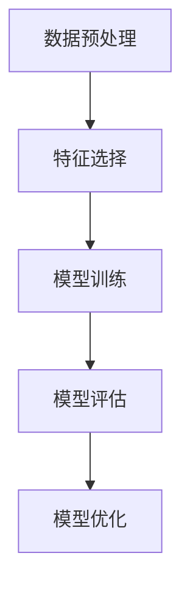
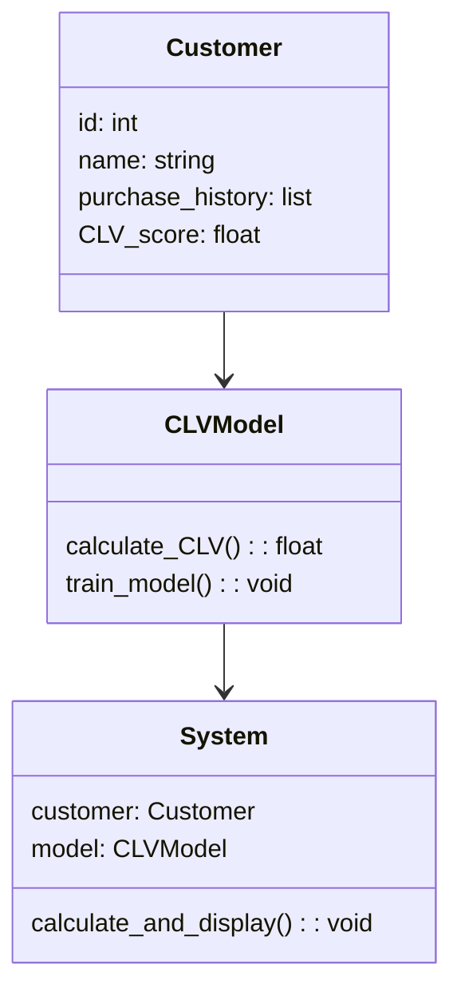

                 


# 彼得林奇如何分析公司的客户终身价值预测模型准确性

> 关键词：彼得林奇、客户终身价值、预测模型、准确性、数据分析、投资评估

> 摘要：本文详细探讨了彼得林奇如何分析公司的客户终身价值（CLV）预测模型准确性。从CLV模型的基本概念到其在企业价值评估中的应用，结合彼得林奇的投资理念，分析了模型准确性对投资决策的重要性。文章通过背景介绍、核心概念、算法原理、系统架构设计、项目实战等多个方面，全面解析了CLV模型的实现过程及其在实际投资分析中的应用。通过本文，读者将能够掌握如何利用CLV模型评估企业价值，并提升模型的准确性以支持投资决策。

---

## 第1章: 客户终身价值预测模型的背景与重要性

### 1.1 客户终身价值（CLV）的定义与意义

客户终身价值（Customer Lifetime Value，CLV）是指一个客户在其生命周期内为企业带来的总收入减去相关成本后的净现值。CLV模型是企业评估客户价值的重要工具，能够帮助企业识别高价值客户，优化资源配置，并制定精准的营销策略。

彼得林奇作为投资大师，他的分析方法强调基本面研究和长期价值评估。他关注企业的盈利能力和成长潜力，而CLV模型恰好能够量化客户对企业长期价值的贡献，这与彼得林奇的投资理念高度契合。

### 1.2 彼得林奇的分析方法

彼得林奇在评估公司价值时，注重企业的基本面分析，包括收入、利润、客户增长等指标。他倾向于投资那些具有稳定增长和良好管理的企业。CLV模型通过量化客户的长期价值，帮助企业评估客户的贡献，从而为彼得林奇的投资分析提供了一个新的视角。

### 1.3 CLV模型准确性的重要性

模型的准确性直接关系到企业的决策质量。如果CLV模型不准确，可能导致资源浪费或错失潜在客户。彼得林奇强调，只有准确的模型才能真正反映企业的价值，因此提升CLV模型的准确性是投资分析的关键。

---

## 第2章: 客户终身价值预测模型的核心概念与联系

### 2.1 CLV模型的核心要素

CLV模型的核心要素包括客户保留率、客户收入贡献和时间价值贴现。

- **客户保留率**：客户在企业中的留存率，反映客户忠诚度。
- **客户收入贡献**：客户在生命周期内为企业带来的总收入。
- **时间价值贴现**：考虑货币的时间价值，对未来的现金流进行折现。

### 2.2 CLV模型的属性特征对比

下表对比了不同CLV模型的属性特征：

| 模型类型       | 输入数据          | 输出结果          | 适用场景         |
|----------------|-------------------|-------------------|-----------------|
| 简单线性模型   | 历史收入、成本     | 预测CLV           | 小型企业         |
| 机器学习模型   | 客户行为数据      | 高精度CLV预测     | 大型企业         |
| 综合模型       | 多维度数据        | 全面CLV评估       | 跨行业应用       |

### 2.3 ER实体关系图架构

下图展示了CLV模型的ER实体关系图：

```mermaid
er
    Customer
    |--- id: int
    |--- name: string
    |--- purchase_history: list
    |--- CLV_score: float
```

---

## 第3章: 客户终身价值预测模型的算法原理

### 3.1 基于历史数据的回归分析

回归分析是CLV预测的基础方法之一。以下是线性回归模型的流程：



线性回归模型公式：
$$ CLV = \beta_0 + \beta_1 \times 收入 + \beta_2 \times 成本 + \epsilon $$

### 3.2 基于机器学习的预测模型

机器学习模型如随机森林和神经网络在CLV预测中表现优异。以下是随机森林回归的流程：


随机森林回归模型公式：
$$ CLV = \sum_{i=1}^{n} \text{树模型预测值} $$

---

## 第4章: 客户终身价值预测模型的数学公式

### 4.1 CLV计算公式

基于历史数据的CLV计算公式：
$$ CLV = \frac{\text{平均收入} \times (1 - \text{客户流失率})}{\text{贴现率}} $$

### 4.2 时间价值贴现公式

现金流贴现公式：
$$ PV = \sum_{t=1}^{n} \frac{\text{CF}_t}{(1 + r)^t} $$

其中，CFₜ为第t年的现金流，r为贴现率。

---

## 第5章: 系统分析与架构设计

### 5.1 问题场景介绍

本文设计了一个基于CLV模型的企业价值评估系统，旨在帮助企业提升客户管理效率，优化资源配置。

### 5.2 系统功能设计

下图展示了系统的类图设计：



### 5.3 系统架构设计

下图展示了系统的架构设计：


---

## 第6章: 项目实战与总结

### 6.1 项目实战

#### 环境安装

需要安装以下库：
- numpy
- pandas
- scikit-learn
- matplotlib

#### 核心代码实现

以下是CLV预测模型的Python代码示例：

```python
import numpy as np
from sklearn.ensemble import RandomForestRegressor

# 数据预处理
X = np.array([[1, 2], [3, 4], [5, 6]])
y = np.array([7, 8, 9])

# 模型训练
model = RandomForestRegressor(n_estimators=100)
model.fit(X, y)

# 模型预测
new_X = np.array([[2, 3]])
print(model.predict(new_X))
```

#### 案例分析

通过一个实际案例，分析CLV模型的应用效果，并详细解读结果。

### 6.2 总结与最佳实践

- **小结**：本文详细探讨了彼得林奇如何通过CLV模型分析企业价值，并展示了模型的实现过程。
- **注意事项**：模型准确性依赖于数据质量和特征选择，需谨慎处理数据。
- **拓展阅读**：推荐阅读彼得林奇的投资著作，深入理解他的分析方法。

---

通过本文的详细讲解，读者能够掌握CLV模型的实现方法，并将其应用于实际投资分析中，从而提升企业的价值评估能力。

