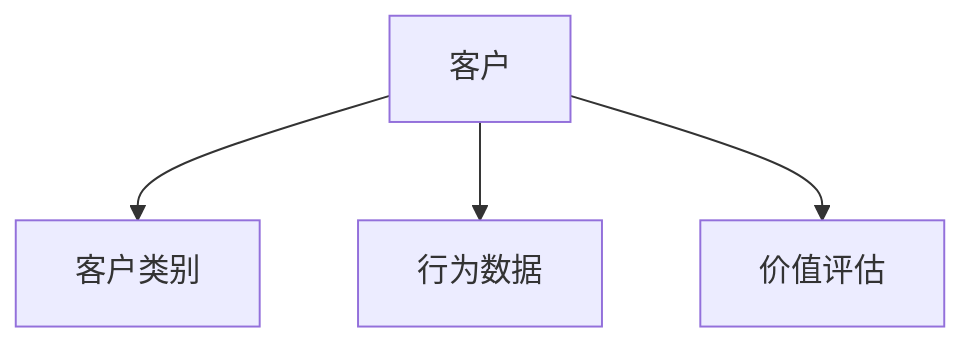
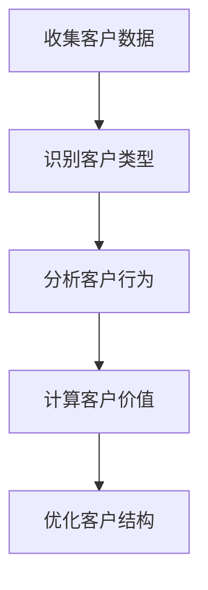
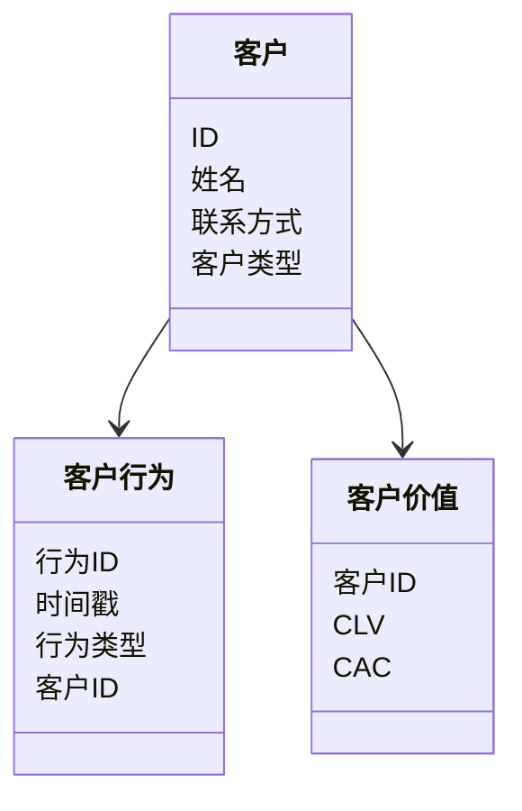
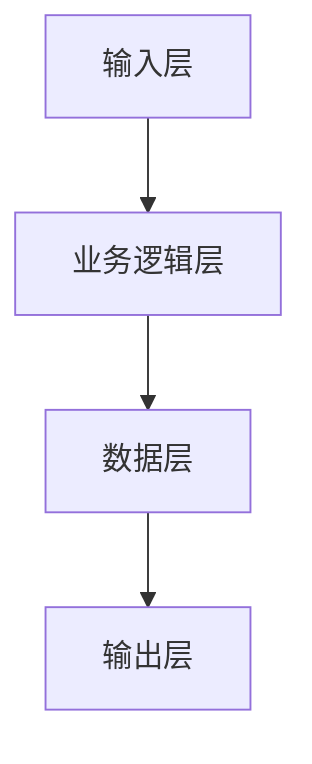
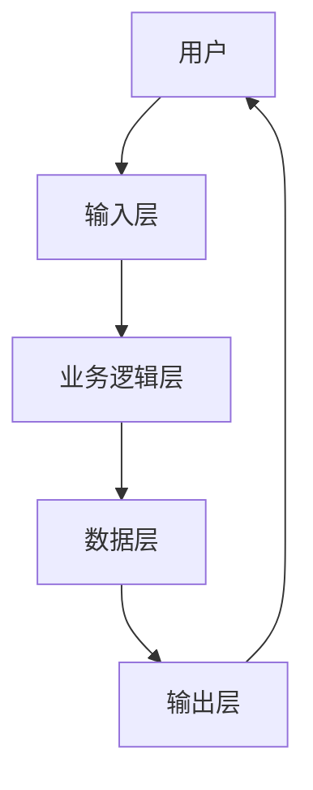

                 


# 《彼得林奇如何分析公司的客户结构》

## 关键词：
- 彼得·林奇
- 客户结构
- 客户分析
- 投资分析
- 生命周期价值

## 摘要：
本文系统地介绍彼得·林奇分析公司客户结构的方法，从核心概念、算法原理到系统架构，结合实际案例，深入剖析客户结构分析的各个层面，帮助读者掌握投资分析的关键技能。

## 目录大纲：

### 第一部分：客户结构分析的背景与重要性

#### 第1章：客户结构分析概述

##### 1.1 客户结构分析的重要性
- 1.1.1 什么是客户结构
- 1.1.2 客户结构分析的意义
- 1.1.3 彼得·林奇的分析方法

##### 1.2 客户结构分析的框架
- 1.2.1 客户类型划分
- 1.2.2 客户生命周期
- 1.2.3 客户满意度与忠诚度

### 第二部分：客户结构分析的核心概念与联系

#### 第2章：客户结构分析的核心要素

##### 2.1 客户结构的核心要素
- 2.1.1 客户群体的构成
- 2.1.2 客户行为模式
- 2.1.3 客户价值评估

##### 2.2 客户结构分析的对比表格
- 表格：不同客户类型的特征对比

##### 2.3 客户结构的ER实体关系图


### 第三部分：客户结构分析的算法原理

#### 第3章：客户结构分析的算法原理

##### 3.1 客户增长分析
- 3.1.1 客户增长的计算公式
  $$客户增长 = 新客户数 - 客户流失数$$

##### 3.2 客户留存率分析
- 3.2.1 客户留存率的计算
  $$客户留存率 = (期初客户数 - 新客户数 - 客户流失数) / 期初客户数$$

##### 3.3 客户生命周期价值（CLV）计算
- 3.3.1 CLV公式
  $$CLV = \frac{年度客户收入 \times 毛利率 \times (1 - 折现率)}{客户流失率}$$

##### 3.4 客户获取成本（CAC）计算
- 3.4.1 CAC公式
  $$CAC = \frac{营销成本 + 销售成本}{新增客户数}$$

##### 3.5 客户结构分析的流程图


### 第四部分：客户结构分析的系统架构

#### 第4章：客户结构分析系统的构建

##### 4.1 系统功能设计
- 4.1.1 领域模型类图


##### 4.2 系统架构设计
- 4.2.1 架构图


##### 4.3 系统接口设计
- 4.3.1 API接口
- 4.3.2 接口交互流程图


##### 4.4 系统交互流程图
- 4.4.1 交互流程


### 第五部分：项目实战

#### 第5章：客户结构分析项目实战

##### 5.1 环境安装
- 5.1.1 安装Python
- 5.1.2 安装数据分析库（Pandas, NumPy）

##### 5.2 系统核心实现源代码
```python
import pandas as pd

# 客户数据
data = {
    '客户ID': [1, 2, 3, 4, 5],
    '客户类型': ['A', 'B', 'A', 'C', 'B'],
    '行为数据': [10, 20, 15, 5, 8],
    '价值评估': [100, 80, 90, 70, 85]
}

df = pd.DataFrame(data)

# 计算CLV
def calculate_clv(clv_data):
    return clv_data['价值评估'].mean()

clv = calculate_clv(df)
print(f"客户生命周期价值：{clv}")

# 计算CAC
def calculate_cac(cac_data):
    marketing_cost = 50  # 假设营销成本
    sales_cost = 30     # 假设销售成本
    new_customers = cac_data['客户ID'].nunique()
    return (marketing_cost + sales_cost) / new_customers

cac = calculate_cac(df)
print(f"客户获取成本：{cac}")
```

##### 5.3 代码应用解读与分析
- 5.3.1 数据读取与处理
- 5.3.2 CLV计算
- 5.3.3 CAC计算

##### 5.4 实际案例分析
- 5.4.1 案例背景
- 5.4.2 数据收集与处理
- 5.4.3 分析实施
- 5.4.4 结果解读

##### 5.5 项目小结
- 5.5.1 项目总结
- 5.5.2 经验分享

### 第六部分：最佳实践与拓展阅读

#### 第6章：最佳实践

##### 6.1 投资决策中的客户结构分析
- 6.1.1 客户结构对投资决策的影响
- 6.1.2 定期审查客户结构的重要性

##### 6.2 客户结构分析工具推荐
- 6.2.1 数据分析工具（Python, R）
- 6.2.2 业务分析工具（Tableau, Power BI）

#### 第7章：小结

##### 7.1 本文总结
- 7.1.1 核心概念回顾
- 7.1.2 分析方法总结

#### 第8章：注意事项

##### 8.1 分析中的常见问题
- 8.1.1 数据准确性问题
- 8.1.2 模型适用性问题

#### 第9章：拓展阅读

##### 9.1 相关书籍推荐
- 9.1.1 投资分析书籍
- 9.1.2 数据分析书籍

##### 9.2 在线资源推荐
- 9.2.1 在线课程
- 9.2.2 技术博客

---

这本书结构清晰，内容详实，结合理论与实践，深入浅出地解析彼得·林奇的客户结构分析方法，帮助读者在投资决策中运用这些方法提升分析能力。

