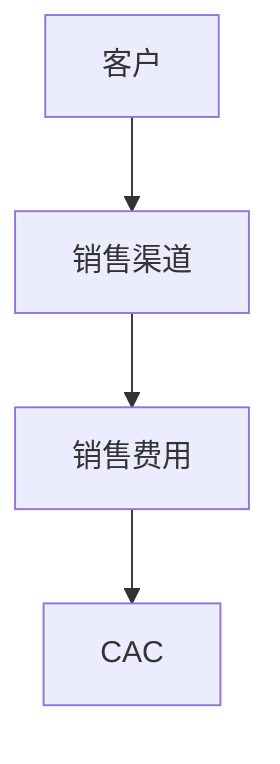
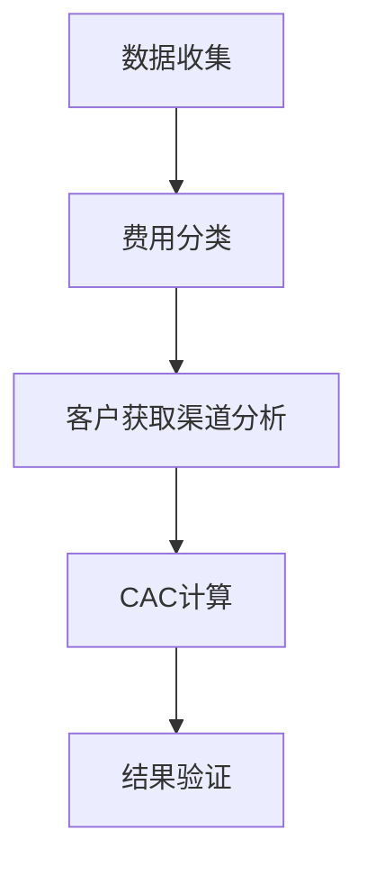
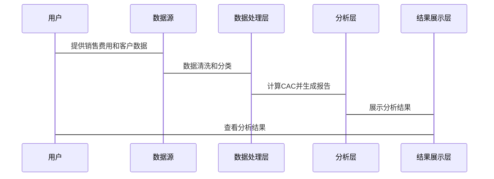

                 


# 彼得·林奇如何分析公司的客户获取成本

> 关键词：客户获取成本（CAC）、彼得·林奇、投资分析、企业价值评估、数字营销

> 摘要：本文深入探讨了彼得·林奇在分析公司客户获取成本（CAC）方面的独特见解和方法。通过分析CAC的核心概念、算法原理、系统架构以及实际案例，本文为读者提供了如何在投资决策中有效运用CAC分析的详细指导。

---

# 第一部分：客户获取成本（CAC）分析的背景与重要性

## 第1章：客户获取成本（CAC）的基本概念

### 1.1 客户获取成本（CAC）的定义与重要性

#### 1.1.1 什么是客户获取成本（CAC）
客户获取成本（Customer Acquisition Cost，CAC）是指企业为吸引一位新客户所花费的总费用。CAC的计算公式为：

$$ CAC = \frac{\text{总销售费用}}{\text{新增客户数}} $$

CAC是企业评估客户获取效率和营销投入回报率的重要指标。

#### 1.1.2 CAC在企业价值评估中的作用
CAC能够帮助投资者评估企业的营销效率和客户获取能力。通过对比CAC与客户生命周期价值（CLV），可以判断企业是否能够从客户中获得足够的收益来覆盖获取成本。

#### 1.1.3 彼得·林奇对CAC的重视
彼得·林奇在其投资策略中非常重视对CAC的分析。他认为，如果企业的CAC低于客户生命周期价值（CLV），则该企业具有可持续的竞争优势。

### 1.2 客户获取成本分析的核心要素

#### 1.2.1 客户获取渠道
客户获取渠道包括线上广告、搜索引擎优化、社交媒体营销、内容营销等。每种渠道的CAC可能不同，因此需要分别分析。

#### 1.2.2 客户获取成本的构成
CAC的构成包括广告费用、销售团队费用、渠道佣金等。通过分解这些费用，可以识别出哪些渠道的CAC较低，从而优化营销预算分配。

#### 1.2.3 客户生命周期价值（CLV）
CLV是指企业在客户生命周期内从该客户获得的总收入。CLV与CAC的比率（即CAC倍数）是衡量企业营销效率的重要指标。

## 第2章：CAC分析的背景与现状

### 2.1 当前企业客户获取的挑战

#### 2.1.1 数字营销时代的CAC变化
在数字营销时代，CAC的计算变得更加复杂，因为企业需要考虑线上和线下的多种渠道。同时，数据驱动的分析方法使得CAC的计算更加精确。

#### 2.1.2 竞争加剧对企业CAC的影响
随着市场竞争的加剧，获取客户的成本也在上升。企业需要通过优化营销策略和提高客户转化率来降低CAC。

#### 2.1.3 数据驱动的CAC分析趋势
现代CAC分析越来越依赖于数据驱动的方法。通过收集和分析客户获取的各个环节的数据，企业可以更精准地计算CAC并优化营销策略。

### 2.2 彼得·林奇投资理念中的CAC分析

#### 2.2.1 彼得·林奇的投资哲学
彼得·林奇认为，企业的价值不仅仅体现在财务报表上，还体现在其商业模式和客户获取能力上。他特别关注企业的CAC和CLV的比率，以判断企业的可持续盈利能力。

#### 2.2.2 CAC在彼得·林奇投资策略中的地位
在林奇的投资策略中，CAC是一个关键的分析指标。他倾向于投资那些CAC低于CLV的企业，因为这些企业具有长期的盈利能力。

#### 2.2.3 彼得·林奇对CAC的深入分析方法
林奇通过分析企业的销售渠道、客户获取成本构成以及客户生命周期价值，来评估企业的CAC是否合理。他特别关注那些能够通过优化营销策略降低CAC的企业。

---

# 第二部分：客户获取成本（CAC）的核心概念与分析框架

## 第3章：CAC的核心概念与计算公式

### 3.1 CAC的定义与计算公式

#### 3.1.1 CAC的数学模型
$$ CAC = \frac{\text{总销售费用}}{\text{新增客户数}} $$

CAC的计算需要明确区分总销售费用和新增客户数。总销售费用包括广告费用、销售团队费用、渠道佣金等，而新增客户数则是企业在一定时间内通过各种渠道获取的客户数量。

#### 3.1.2 CAC的属性特征对比表格
以下是CAC的属性特征对比：

| 属性 | 特征 |
|------|------|
| 计算公式 | $$ CAC = \frac{\text{总销售费用}}{\text{新增客户数}} $$ |
| 输入 | 总销售费用、新增客户数 |
| 输出 | 客户获取成本 |
| 单位 | 货币单位（如美元、人民币） |
| 相关指标 | CLV、CAC倍数 |

#### 3.1.3 CAC的ER实体关系图


在ER图中，客户通过销售渠道与销售费用相关联，最终形成客户获取成本（CAC）。

### 3.2 CAC与客户生命周期价值（CLV）的关系

#### 3.2.1 CLV的定义与计算公式
客户生命周期价值（CLV）是指企业在客户生命周期内从该客户获得的总收入。CLV的计算公式为：

$$ CLV = \frac{\text{年收入}}{\text{客户流失率}} $$

#### 3.2.2 CAC与CLV的比率分析
CAC与CLV的比率（即CAC倍数）是衡量企业营销效率的重要指标。如果CAC倍数大于1，说明企业从客户获取中的投入能够收回成本并带来利润。以下是CAC倍数的计算公式：

$$ \text{CAC倍数} = \frac{CLV}{CAC} $$

### 3.3 CAC的ER实体关系图


---

## 第4章：CAC分析的算法原理

### 4.1 CAC计算的算法流程

#### 4.1.1 数据收集
需要收集以下数据：
- 总销售费用
- 新增客户数
- 客户生命周期价值（CLV）
- 客户流失率

#### 4.1.2 费用分类
将销售费用按渠道进行分类，以便计算每个渠道的CAC。

#### 4.1.3 客户获取渠道分析
分析不同渠道的CAC，识别出CAC最低的渠道。

#### 4.1.4 CAC计算
使用公式 $$ CAC = \frac{\text{总销售费用}}{\text{新增客户数}} $$ 计算整体CAC。

#### 4.1.5 结果验证
对比不同渠道的CAC，验证计算结果的准确性。

### 4.2 CAC计算的Python实现

#### 4.2.1 算法流程图


#### 4.2.2 Python代码实现

```python
def calculate_cac(sales_cost, new_customers):
    cac = sales_cost / new_customers
    return cac

# 示例数据
sales_cost = 100000  # 总销售费用
new_customers = 500   # 新增客户数
cac = calculate_cac(sales_cost, new_customers)
print(f"客户获取成本（CAC）为：${cac:.2f}")
```

#### 4.2.3 代码解读与分析
上述代码定义了一个计算CAC的函数，输入总销售费用和新增客户数，输出计算得到的CAC值。通过调整输入参数，可以计算不同场景下的CAC。

---

## 第5章：系统架构与CAC分析框架

### 5.1 系统功能设计

#### 5.1.1 领域模型
```mermaid
classDiagram
    class 客户 {
        id
        姓名
        购买记录
    }
    class 销售渠道 {
        id
        渠道名称
        销售费用
    }
    class CAC分析模块 {
        计算CAC
        分析渠道CAC
        输出结果
    }
    客户 -->|属于|销售渠道
    销售渠道 -->|输入|CAC分析模块
```

#### 5.1.2 系统架构设计


#### 5.1.3 系统接口设计
- 数据源：提供销售费用和客户数据
- 数据处理层：对数据进行清洗和分类
- 分析层：计算CAC并生成报告
- 结果展示层：以可视化形式展示分析结果

#### 5.1.4 系统交互


---

## 第6章：项目实战——基于彼得·林奇方法的CAC分析

### 6.1 环境安装与数据准备

#### 6.1.1 环境安装
- 安装Python和相关库（如Pandas、Matplotlib）

#### 6.1.2 数据准备
- 销售费用数据
- 新增客户数数据
- 客户生命周期价值（CLV）数据
- 客户流失率数据

### 6.2 核心实现源代码

#### 6.2.1 计算CAC
```python
import pandas as pd
import matplotlib.pyplot as plt

# 数据准备
data = {
    '销售渠道': ['广告', 'SEO', '内容营销', '社交媒体'],
    '销售费用': [50000, 30000, 20000, 40000],
    '新增客户数': [1000, 800, 600, 500]
}

df = pd.DataFrame(data)

# 计算CAC
df['CAC'] = df['销售费用'] / df['新增客户数']

# 绘制柱状图
plt.figure(figsize=(10, 6))
plt.bar(df['销售渠道'], df['CAC'])
plt.title('不同销售渠道的CAC')
plt.xlabel('销售渠道')
plt.ylabel('CAC（美元）')
plt.show()
```

#### 6.2.2 分析CLV与CAC倍数
```python
def calculate_clv(yearly_revenue, customer_churn_rate):
    clv = yearly_revenue / customer_churn_rate
    return clv

# 示例数据
yearly_revenue = 1000000  # 年收入
customer_churn_rate = 0.2  # 客户流失率
clv = calculate_clv(yearly_revenue, customer_churn_rate)
cac = calculate_cac(100000, 500)
cac_multiple = clv / cac

print(f"客户生命周期价值（CLV）为：${clv:.2f}")
print(f"CAC倍数为：{cac_multiple:.2f}")
```

### 6.3 案例分析与结果解读

#### 6.3.1 案例背景
假设我们有一家互联网公司，年收入为100万美元，客户流失率为20%。销售费用为10万美元，新增客户数为500人。

#### 6.3.2 计算结果
- CAC = 100,000 / 500 = 200美元
- CLV = 1,000,000 / 0.2 = 5,000美元
- CAC倍数 = 5,000 / 200 = 25

这意味着企业的CAC倍数为25，表明企业的营销效率非常高，每投入1美元的CAC，可以带来25美元的CLV。

### 6.4 项目小结

通过上述案例分析，我们可以看到，彼得·林奇的CAC分析方法在实际应用中具有很强的指导意义。通过计算CAC和CLV，企业可以更好地优化营销策略，降低客户获取成本，提高客户生命周期价值。

---

## 第7章：总结与最佳实践

### 7.1 本章总结

通过本文的分析，我们可以得出以下结论：
1. CAC是企业评估客户获取效率的重要指标。
2. 彼得·林奇的投资理念中，CAC分析是评估企业价值的重要组成部分。
3. 通过优化营销策略和数据分析，企业可以有效降低CAC，提高客户生命周期价值。

### 7.2 最佳实践 tips

- **数据驱动决策**：通过收集和分析客户获取的各个环节的数据，优化营销策略。
- **多渠道分析**：识别不同渠道的CAC，优化预算分配。
- **持续监控**：定期计算CAC和CLV，确保企业的营销效率和盈利能力。

### 7.3 注意事项

- 在计算CAC时，需要确保数据的准确性和完整性。
- CAC分析需要结合企业的实际情况，不能孤立地看待。
- 在实际应用中，还需要考虑其他因素，如客户满意度和忠诚度。

### 7.4 拓展阅读

- 《彼得·林奇的成功投资策略》
- 《客户生命周期价值的深度分析》
- 《数字营销与CAC优化》

---

通过本文的详细分析，我们不仅了解了彼得·林奇如何分析客户的获取成本，还掌握了如何在实际工作中运用这些方法。希望本文能够为读者在投资分析和企业价值评估方面提供有价值的参考和指导。

