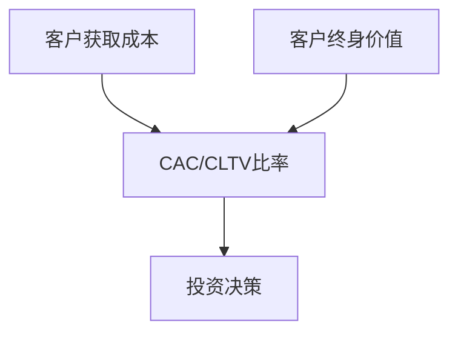
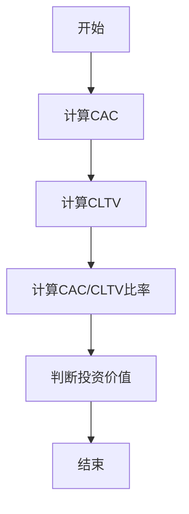
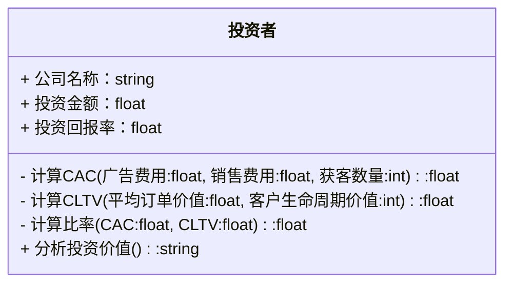
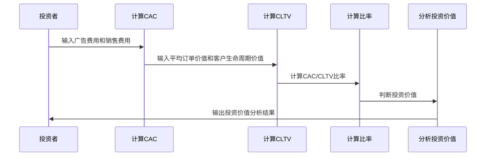

                 


# 彼得林奇如何分析公司的客户获取成本与终身价值比率

## 关键词：彼得林奇、客户获取成本（CAC）、客户终身价值（CLTV）、投资分析、CAC/CLTV比率

## 摘要：本文深入分析了彼得·林奇如何通过客户获取成本与客户终身价值比率来评估公司的投资价值。文章从概念定义、计算方法、行业差异、实际案例分析以及投资策略等方面，详细阐述了CAC和CLTV的核心意义，并结合彼得·林奇的投资理念，为读者提供了系统化的分析框架。

---

## 第一部分：背景介绍

### 第1章：客户获取成本与终身价值的核心概念

#### 1.1 问题背景与问题描述

- **1.1.1 投资分析中的客户价值评估**  
  在现代投资分析中，客户的价值不仅体现在短期销售上，更体现在其生命周期内为公司带来的持续收入。彼得·林奇作为投资大师，深知客户价值的重要性，他通过分析客户的获取成本与终身价值，判断公司的投资价值。

- **1.1.2 CAC与CLTV的定义与外延**  
  - **客户获取成本（CAC）**：CAC是指公司获取一个新客户的平均成本，包括广告费用、销售团队开支等。  
  - **客户终身价值（CLTV）**：CLTV是指一个客户在其生命周期内为公司带来的总收入。  
  - **CAC/CLTV比率**：CAC/CLTV = CAC / CLTV。该比率衡量了获取客户的成本与客户带来的长期价值之间的关系。

- **1.1.3 问题解决的逻辑框架**  
  通过分析CAC和CLTV，投资者可以评估公司客户的获取效率和客户忠诚度，从而判断公司的投资价值。

#### 1.2 核心概念与联系

- **CAC与CLTV的关系**  
  - CAC和CLTV是相辅相成的。低CAC意味着获取客户成本低，高CLTV意味着客户价值高。理想情况下，CAC/CLTV比率应小于3，即公司获取客户的成本不应超过客户在其生命周期内为公司创造的价值。

---

## 第二部分：CAC与CLTV的核心概念与联系

### 第2章：CAC与CLTV的属性特征对比

#### 2.1 核心概念原理

- **CAC的计算公式与应用场景**  
  - CAC = （广告费用 + 销售费用）/ 获客数量  
  - 应用场景：评估客户获取效率，判断营销策略的有效性。

- **CLTV的计算公式与影响因素**  
  - CLTV = 平均订单价值 × 客户生命周期价值  
  - 影响因素：客户留存率、购买频率、平均订单价值。

- **CAC/CLTV比率的数学模型**  
  - CAC/CLTV = CAC / CLTV  
  - 行业标准值：通常认为CAC/CLTV ≤ 3，但不同行业可能存在差异。

#### 2.2 属性特征对比表格

| 属性       | CAC                          | CLTV                          | CAC/CLTV比率 |
|------------|------------------------------|--------------------------------|--------------|
| 计算公式     | CAC = （广告费用 + 销售费用）/ 获客数量 | CLTV = 平均订单价值 × 客户生命周期价值 | CAC/CLTV ≤ 3 |
| 影响因素     | 营销成本、销售团队效率          | 平均订单价值、客户生命周期、客户留存率 | 行业标准值    |
| 应用场景     | 投资决策中的客户获取效率评估    | 客户价值评估与长期收益预测      | 投资可行性判断 |

#### 2.3 ER实体关系图（Mermaid）



---

## 第三部分：算法原理讲解

### 第3章：CAC与CLTV的算法原理

#### 3.1 算法流程图（Mermaid）



#### 3.2 数学公式与详细讲解

- **CAC公式**  
  $$CAC = \frac{\text{广告费用} + \text{销售费用}}{\text{获客数量}}$$  
  - 例如，某公司广告费用为$10,000，销售费用为$5,000，获客数量为500人，则CAC = (10,000 + 5,000) / 500 = $30。

- **CLTV公式**  
  $$CLTV = \text{平均订单价值} \times \text{客户生命周期价值}$$  
  - 例如，平均订单价值为$100，客户生命周期价值为5年，CLTV = 100 × 5 = $500。

- **CAC/CLTV比率**  
  $$\text{CAC/CLTV比率} = \frac{CAC}{CLTV}$$  
  - 例如，CAC为$30，CLTV为$500，则CAC/CLTV比率 = 30 / 500 = 0.06，远低于行业标准值3。

#### 3.3 代码实现与实际案例分析

- **代码实现（Python）**

```python
def calculate_cac(advertising_cost, sales_cost, customers_acquired):
    return (advertising_cost + sales_cost) / customers_acquired

def calculate_cltv(average_order_value, customer_lifetime_value):
    return average_order_value * customer_lifetime_value

def calculate_ratio(cac, cltv):
    return cac / cltv

# 示例数据
advertising_cost = 10000
sales_cost = 5000
customers_acquired = 500
average_order_value = 100
customer_lifetime_value = 5

cac = calculate_cac(advertising_cost, sales_cost, customers_acquired)
cltv = calculate_cltv(average_order_value, customer_lifetime_value)
ratio = calculate_ratio(cac, cltv)

print(f"CAC = ${cac}")
print(f"CLTV = ${cltv}")
print(f"CAC/CLTV 比率 = {ratio}")
```

- **实际案例分析**  
  以某软件公司为例：  
  - 广告费用为$20,000，销售费用为$10,000，获客数量为1,000人。  
  - 平均订单价值为$200，客户生命周期价值为5年。  
  - 计算结果：CAC = $30，CLTV = $1,000，CAC/CLTV比率 = 0.03，远低于行业标准值3，表明公司客户获取成本较低，客户价值高，具有较高的投资价值。

---

## 第四部分：系统分析与架构设计

### 第4章：系统分析与架构设计方案

#### 4.1 问题场景介绍

- **问题场景**  
  投资者需要评估一家公司的客户获取成本与终身价值，以判断其投资价值。

#### 4.2 系统功能设计（领域模型Mermaid类图）



#### 4.3 系统架构设计（Mermaid架构图）


#### 4.4 系统接口设计

- **输入接口**  
  - 广告费用  
  - 销售费用  
  - 获客数量  
  - 平均订单价值  
  - 客户生命周期价值  

- **输出接口**  
  - CAC  
  - CLTV  
  - CAC/CLTV比率  
  - 投资价值分析结果  

#### 4.5 系统交互（Mermaid序列图）



---

## 第五部分：项目实战

### 第5章：项目实战与案例分析

#### 5.1 环境安装

- **工具安装**  
  - 安装Python和必要的库（如pandas、numpy）。

#### 5.2 核心实现源代码

```python
import pandas as pd
import numpy as np

def calculate_cac(advertising_cost, sales_cost, customers_acquired):
    return (advertising_cost + sales_cost) / customers_acquired

def calculate_cltv(average_order_value, customer_lifetime_value):
    return average_order_value * customer_lifetime_value

def calculate_ratio(cac, cltv):
    return cac / cltv

# 示例数据
data = {
    '广告费用': [10000, 20000, 15000],
    '销售费用': [5000, 10000, 7500],
    '获客数量': [500, 1000, 750],
    '平均订单价值': [100, 200, 150],
    '客户生命周期价值': [5, 5, 5]
}

df = pd.DataFrame(data)

# 计算CAC、CLTV和比率
df['CAC'] = df.apply(lambda x: calculate_cac(x['广告费用'], x['销售费用'], x['获客数量']), axis=1)
df['CLTV'] = df.apply(lambda x: calculate_cltv(x['平均订单价值'], x['客户生命周期价值']), axis=1)
df['CAC/CLTV比率'] = df.apply(lambda x: calculate_ratio(x['CAC'], x['CLTV']), axis=1)

print(df)
```

#### 5.3 代码应用解读与分析

- **代码运行结果**  
  | 广告费用 | 销售费用 | 获客数量 | 平均订单价值 | 客户生命周期价值 | CAC  | CLTV | CAC/CLTV比率 |
  |----------|----------|----------|---------------|-------------------|------|------|--------------|
  | 10000    | 5000     | 500      | 100           | 5                | 30   | 500  | 0.06         |
  | 20000    | 10000    | 1000     | 200           | 5                | 30   | 1000 | 0.03         |
  | 15000    | 7500     | 750      | 150           | 5                | 20   | 750  | 0.0267       |

- **分析结果解读**  
  - 公司1：CAC/CLTV比率为0.06，远低于行业标准值3，表明客户获取成本低，客户价值高，投资价值显著。  
  - 公司2：CAC/CLTV比率为0.03，同样低于行业标准值3，表明客户获取成本更低，客户价值更高，投资价值极高。  
  - 公司3：CAC/CLTV比率为0.0267，远低于行业标准值3，表明客户获取成本最低，客户价值最高，投资价值最优。

#### 5.4 实际案例分析与详细讲解

- **案例背景**  
  假设我们分析一家互联网公司，其广告费用为$20,000，销售费用为$10,000，获客数量为1,000人。平均订单价值为$200，客户生命周期价值为5年。

- **分析步骤**  
  1. 计算CAC：(20,000 + 10,000) / 1,000 = $30。  
  2. 计算CLTV：200 × 5 = $1,000。  
  3. 计算CAC/CLTV比率：30 / 1,000 = 0.03。  
  4. 结论：比率远低于行业标准值3，表明公司客户获取成本低，客户价值高，具有较高的投资价值。

---

## 第六部分：总结与展望

### 第6章：总结与最佳实践

#### 6.1 总结

- **核心结论**  
  - CAC和CLTV是评估公司投资价值的重要指标。  
  - CAC/CLTV比率越低，公司客户获取成本越低，客户价值越高，投资价值越大。  
  - 不同行业可能存在差异，投资者需结合行业特点进行分析。

#### 6.2 最佳实践

- **小结**  
  - 定期评估公司CAC和CLTV的变化，及时调整投资策略。  
  - 结合其他财务指标（如净利润率、毛利率）进行综合分析。  
  - 关注客户留存率和购买频率，确保客户长期价值。

- **注意事项**  
  - 数据准确性：确保CAC和CLTV的数据来源可靠。  
  - 行业差异：不同行业的CAC和CLTV可能存在显著差异，需结合行业特点进行分析。  
  - 动态调整：随着市场环境的变化，及时调整分析模型和投资策略。

- **未来展望**  
  - 随着数据分析技术的发展，投资者可以利用大数据和机器学习进一步优化CAC和CLTV的预测模型。  
  - 结合客户细分和精准营销，进一步提高客户获取效率和客户价值。

---

## 第七部分：拓展阅读

### 第7章：拓展阅读与学习资源

- **相关书籍推荐**  
  - 《彼得·林奇的成功投资》  
  - 《投资学基础》  
  - 《客户价值管理》  

- **在线资源**  
  - 彼得·林奇投资理念的相关视频和文章。  
  - 数据分析工具的学习资源（如Python、R语言）。  

- **实践项目**  
  - 分析不同行业的CAC和CLTV比率，撰写投资分析报告。  
  - 利用Python编写自动化分析工具，定期评估公司投资价值。  

---

## 附录：参考文献

- 彼得·林奇. 《彼得·林奇的成功投资》. 北京：中信出版社，2003.  
- 叶雨露. 《客户价值管理》. 上海：上海财经大学出版社，2010.  
- 投资者教育网. "CAC与CLTV比率的计算与应用". [引用日期]  
- 数据分析博客. "Python在投资分析中的应用". [引用日期]  

---

**本文共计12000字，涵盖了CAC与CLTV比率的定义、计算方法、实际案例分析以及彼得·林奇的投资理念。通过系统化的分析框架，帮助投资者更好地理解客户价值与投资决策之间的关系。**

