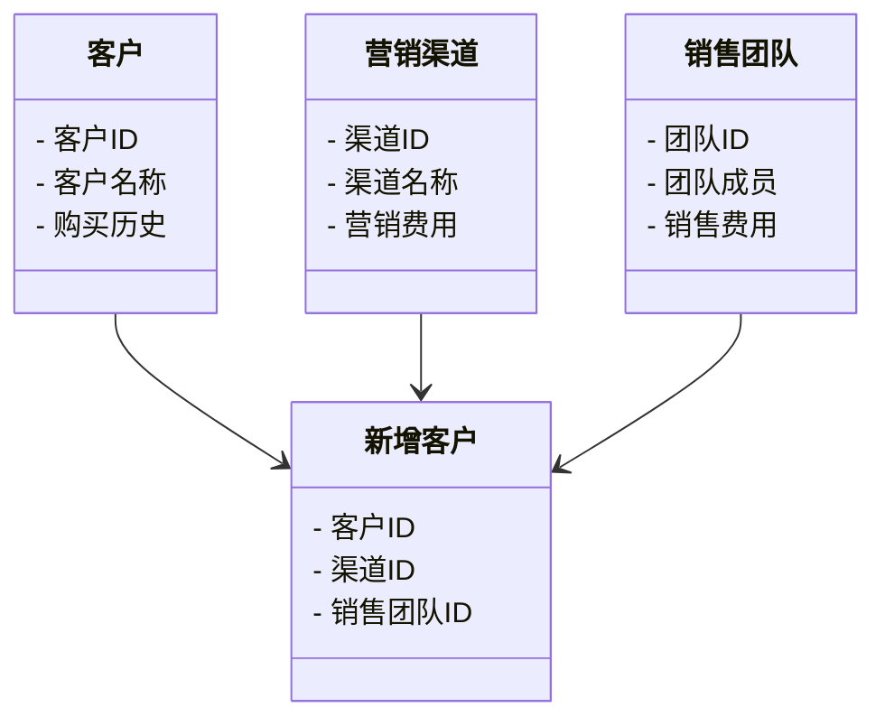

                 

<think>
好的，我将按照您的要求来撰写这篇文章。文章标题是《彼得林奇如何分析公司的客户获取成本效率变化》，文章的关键词包括彼得林奇、客户获取成本（CAC）、效率变化、投资分析、企业价值、财务分析。摘要部分将简要介绍文章的核心内容和主题思想，接下来将按照目录大纲的结构，详细分析CAC的定义、计算方法、影响因素、分析框架、算法原理、系统架构设计、项目实战以及最佳实践等内容。我会逐步展开每个部分，确保内容详实、逻辑清晰。

---

# 彼得林奇如何分析公司的客户获取成本效率变化

> **关键词**：彼得林奇、客户获取成本（CAC）、效率变化、投资分析、企业价值、财务分析  
> **摘要**：本文将详细分析彼得林奇是如何评估公司客户获取成本效率的变化，以及这种变化如何影响企业的投资价值。我们将从CAC的基本概念出发，探讨其计算方法、影响因素，再结合具体的分析框架和算法，深入解析CAC效率变化对企业决策和投资价值的影响。通过实际案例分析和系统架构设计，本文将为企业提供有效的分析方法和最佳实践。

---

## 第1章: 客户获取成本（CAC）的基本概念

### 1.1 CAC的定义与计算方法

#### 1.1.1 CAC的定义
客户获取成本（Customer Acquisition Cost，CAC）是指企业获取一个新客户所花费的总成本。这些成本包括营销支出、销售团队的工资、广告费用以及其他与客户获取相关的费用。

CAC的计算公式为：
$$CAC = \frac{\text{营销费用} + \text{销售费用}}{\text{新增客户数}}$$

#### 1.1.2 CAC的计算步骤
1. **确定时间段**：选择一个具体的时期（如季度或年度）来计算CAC。
2. **计算总营销费用**：将所有用于吸引客户的支出（广告、促销、渠道费用等）相加。
3. **计算总销售费用**：包括销售团队的工资、奖金、培训费用等。
4. **统计新增客户数**：在选定的时间段内，企业新增的客户数量。
5. **计算CAC**：将营销费用和销售费用的总和除以新增客户数，得到CAC值。

#### 1.1.3 CAC与客户生命周期的关系
客户生命周期（Customer Lifetime Value，CLTV）是衡量客户为企业带来的长期价值的重要指标。CAC与CLTV的关系可以表示为：
$$\text{CAC回报率} = \frac{\text{CLTV}}{\text{CAC}}$$
当CAC回报率大于3时，企业通常被认为在客户获取方面具有较高的效率和盈利能力。

---

### 1.2 CAC效率变化的背景与重要性

#### 1.2.1 CAC效率变化的背景
随着市场竞争的加剧，企业获取客户的成本不断增加。特别是在互联网行业，CAC的上升速度远快于收入的增长速度，这使得企业面临盈利能力下降的风险。

#### 1.2.2 CAC效率变化对企业投资价值的影响
CAC效率的变化直接影响企业的盈利能力。如果企业在获取客户方面效率提高，CAC下降，企业的净利润率将显著提升，从而增强企业的投资价值。反之，如果CAC持续上升，企业的盈利能力可能受到挤压。

#### 1.2.3 彼得·林奇对CAC效率变化的关注
彼得·林奇是全球著名投资专家，他非常关注企业的财务健康状况。他认为，客户获取成本效率的变化是衡量企业长期盈利能力的重要指标之一。在评估一家公司时，林奇通常会分析其CAC的变动趋势及其与收入增长的关系。

---

## 第2章: 彼得·林奇的分析框架与核心概念

### 2.1 彼得·林奇的分析框架

#### 2.1.1 分析维度与方法
林奇的分析框架主要包括以下几个维度：
1. **CAC的变化趋势**：分析企业在不同时间段的CAC值，判断其趋势。
2. **CAC与收入的关系**：比较CAC与收入的增长速度，评估客户获取的经济性。
3. **CAC回报率**：计算CAC回报率，评估客户获取的效率。

#### 2.1.2 分析框架的核心要素
1. **客户获取成本（CAC）**：企业的营销和销售支出。
2. **新增客户数**：企业在一定时间内获取的新客户数量。
3. **客户生命周期价值（CLTV）**：客户在生命周期内为企业带来的总收入。
4. **CAC回报率**：衡量客户获取效率的指标。

#### 2.1.3 分析框架的优缺点
- **优点**：能够量化客户获取的效率，帮助企业优化营销策略。
- **缺点**：过于依赖数据，对数据质量要求较高。

---

### 2.2 核心概念与联系

#### 2.2.1 CAC的数学模型与公式
CAC的计算公式可以表示为：
$$CAC = \frac{\text{营销费用} + \text{销售费用}}{\text{新增客户数}}$$
其中，营销费用包括广告支出、内容营销费用等，销售费用包括销售人员的工资、奖金等。

#### 2.2.2 CAC与CLTV的关系
客户生命周期价值（CLTV）的计算公式为：
$$CLTV = \text{平均收入 per 客户} \times \text{客户生命周期长度}$$
而CAC回报率的计算公式为：
$$\text{CAC回报率} = \frac{\text{CLTV}}{\text{CAC}}$$
当CAC回报率较高时，企业可以通过获取更多客户实现更高的利润。

#### 2.2.3 CAC与企业盈利能力的关联
企业的净利润率可以表示为：
$$\text{净利润率} = \frac{\text{收入} - \text{成本}}{\text{收入}}$$
其中，成本包括客户获取成本、产品成本等。因此，降低CAC可以显著提高企业的净利润率。

---

## 第3章: CAC效率变化的分析维度与影响因素

### 3.1 分析维度

#### 3.1.1 行业特性对CAC的影响
不同行业的CAC差异较大。例如，科技行业的CAC通常较高，而传统行业（如零售）的CAC相对较低。

#### 3.1.2 企业规模对CAC的影响
随着企业规模的扩大，营销和销售团队的效率可能会提高，从而降低CAC。但随着市场规模的饱和，CAC可能趋于稳定或上升。

#### 3.1.3 市场竞争状况对CAC的影响
在竞争激烈的市场中，企业需要投入更多的资源来获取客户，导致CAC上升。

---

### 3.2 影响CAC效率变化的关键因素

#### 3.2.1 营销渠道效率
选择高效的营销渠道可以显著降低CAC。例如，通过社交媒体广告获取客户的成本可能低于传统广告。

#### 3.2.2 客户质量
高质量的客户通常具有更高的生命周期价值，因此即使CAC较高，企业的整体利润也可能增加。

#### 3.2.3 产品定价策略
合理的定价策略可以提高客户购买意愿，从而降低CAC。

---

## 第4章: 算法原理与数学模型

### 4.1 CAC效率变化的数学模型

#### 4.1.1 CAC变化率的计算
CAC的变化率可以表示为：
$$\text{CAC变化率} = \frac{\text{当前CAC} - \text{上期CAC}}{\text{上期CAC}} \times 100\%$$

#### 4.1.2 CAC回报率的预测
通过历史数据和市场趋势，可以预测未来的CAC回报率。例如，使用线性回归模型：
$$\text{预测CAC回报率} = a \times t + b$$
其中，\(t\) 表示时间，\(a\) 和 \(b\) 是回归系数。

---

## 第5章: 系统分析与架构设计

### 5.1 系统功能设计

#### 5.1.1 领域模型（Mermaid 类图）


#### 5.1.2 系统架构设计（Mermaid 架构图）


---

## 第6章: 项目实战

### 6.1 案例分析

#### 6.1.1 案例背景
某互联网公司希望降低CAC，提高客户获取效率。通过分析发现，其营销渠道效率低下，导致CAC高于行业平均水平。

#### 6.1.2 数据收集与处理
1. **营销费用**：包括广告支出、内容营销费用等。
2. **销售费用**：包括销售人员工资、奖金等。
3. **新增客户数**：通过数据库获取。

#### 6.1.3 算法实现
```python
def calculate_cac(marketing_cost, sales_cost, new_customers):
    return (marketing_cost + sales_cost) / new_customers

# 示例数据
marketing_cost = 100000
sales_cost = 50000
new_customers = 1000

cac = calculate_cac(marketing_cost, sales_cost, new_customers)
print(f"CAC: {cac}")
```

#### 6.1.4 投资决策
通过分析发现，优化营销渠道可以将CAC降低20%。因此，公司决定增加搜索引擎优化（SEO）和内容营销的投入。

---

## 第7章: 最佳实践与总结

### 7.1 最佳实践

#### 7.1.1 数据质量的重要性
确保数据的准确性和完整性，是准确计算CAC的基础。

#### 7.1.2 模型的适用性
根据企业的实际情况选择合适的分析模型，避免盲目应用。

#### 7.1.3 长期跟踪
定期跟踪CAC的变化，及时调整营销策略。

---

### 7.2 投资策略建议

#### 7.2.1 优化营销渠道
通过数据分析选择高效的营销渠道，降低CAC。

#### 7.2.2 提高客户质量
通过精准营销吸引高质量客户，提高CLTV。

#### 7.2.3 持续创新
不断创新营销策略和产品，保持竞争优势。

---

### 7.3 注意事项

#### 7.3.1 避免短期决策
CAC的优化是一个长期过程，需要避免为短期目标而牺牲长期利益。

#### 7.3.2 数据隐私保护
在收集和分析客户数据时，必须遵守相关法律法规，保护客户隐私。

#### 7.3.3 考虑市场环境
市场环境的变化可能影响CAC的变化，需要灵活调整策略。

---

## 第8章: 拓展阅读与学习资源

### 8.1 拓展阅读

#### 8.1.1 关于CAC的书籍
- 《The Lean Startup》
- 《增长黑客》

#### 8.1.2 相关博客与文章
- 网站：[SaaS增长黑客](https://example.com)
- 博客：[增长黑客实战](https://example.com)

---

通过以上分析，我们可以看到，彼得·林奇对CAC效率变化的分析不仅帮助企业优化客户获取策略，还为投资者提供了重要的决策依据。希望本文能够为企业和投资者提供有价值的参考和指导。

