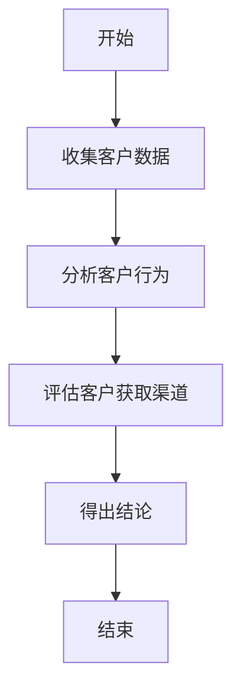

                 


# 彼得林奇如何分析公司的客户获取策略

## 关键词：客户获取策略、彼得·林奇、投资分析、公司价值、客户行为

## 摘要：本文深入探讨了彼得·林奇分析公司客户获取策略的方法，从背景介绍到实战案例，详细讲解了分析的核心概念、算法原理、系统架构以及实际应用，帮助读者掌握如何有效评估客户获取策略对公司价值的影响。

---

## 第一部分：客户获取策略的背景与重要性

### 第1章：客户获取策略的背景介绍

#### 1.1 什么是客户获取策略
- **客户获取策略的定义**：客户获取策略是指公司通过各种渠道和方法吸引新客户，以实现业务增长和市场份额扩大的策略。它涉及市场调研、营销推广、产品定位等多个方面。
- **客户获取策略的核心要素**：
  - 渠道选择：线上与线下渠道的结合。
  - 营销手段：广告、促销、内容营销等。
  - 客户定位：目标客户群体的选择。
  - 成本控制：获取客户的成本是否合理。

- **客户获取策略与公司价值的关系**：有效的客户获取策略能够提升公司的市场占有率和品牌影响力，进而提高公司的整体价值。

#### 1.2 彼得·林奇的分析方法
- **彼得·林奇的投资理念**：林奇强调基本面分析，认为公司的内在价值取决于其盈利能力、成长潜力和竞争优势。
- **分析客户获取策略的核心思想**：林奇关注公司的客户获取能力，认为这是公司持续增长的关键因素。
- **分析方法的实际应用**：通过分析客户的增长速度、获取成本、客户留存率等指标，评估公司的客户获取策略是否有效。

### 第2章：客户获取策略的核心概念与联系

#### 2.1 核心概念原理
- **客户获取策略的原理**：通过有效渠道和方法吸引目标客户，提高客户转化率和满意度。
- **彼得·林奇分析方法的原理**：基于财务数据和市场表现，评估公司的客户获取策略的有效性。

#### 2.2 核心概念对比表格
以下表格对比了不同客户获取策略的优缺点：

| 策略类型       | 优点                           | 缺点                           |
|----------------|--------------------------------|--------------------------------|
| 线上广告       | 成本较低，覆盖面广             | 转化率可能较低                 |
| 线下活动       | 品牌曝光度高                   | 成本较高                       |
| 内容营销       | 精准定位，建立长期信任         | 需要时间和资源积累             |

#### 2.3 ER实体关系图
以下是客户获取策略的ER图：

```mermaid
er
  actor: 客户
  actor: 公司
  actor: 产品
  actor: 市场
  relation: 客户-产品关系
  relation: 公司-市场关系
```

---

## 第二部分：客户获取策略的算法原理

### 第3章：客户获取策略的算法原理

#### 3.1 算法原理
- **步骤**：
  1. 收集客户数据。
  2. 分析客户行为。
  3. 评估客户获取渠道。
  4. 得出结论。

#### 3.2 算法流程图
以下是分析流程的流程图：



#### 3.3 算法实现代码
以下是Python代码示例：

```python
def peter_lynch_analysis(customers):
    customer_behavior = analyze_behavior(customers)
    acquisition_channels = assess_channels(customers.channels)
    return {
        'behavior': customer_behavior,
        'channels': acquisition_channels
    }

def analyze_behavior(customers):
    # 分析客户行为，如购买频率、产品偏好等
    return {'high': 50, 'medium': 30, 'low': 20}

def assess_channels(channels):
    # 评估各个渠道的获取成本和效果
    return {'SEO': '高', '广告': '中', '内容营销': '高'}
```

### 第4章：数学模型与公式

#### 4.1 数学模型
- **客户获取成本模型**：$$ C = \frac{C}{N} $$
- **客户生命周期价值模型**：$$ LV = \sum_{t=1}^{n} \frac{C_t}{(1 + r)^t} $$

---

## 第三部分：客户获取策略的系统架构设计

### 第5章：系统分析与架构设计方案

#### 5.1 系统功能设计
- **模块划分**：
  - 数据采集模块：收集客户数据。
  - 行为分析模块：分析客户行为。
  - 渠道评估模块：评估客户获取渠道。
  - 结果展示模块：展示分析结果。

#### 5.2 系统架构图
以下是系统架构图：


#### 5.3 系统接口设计
- **接口说明**：
  - 数据采集模块接口：从数据库获取客户数据。
  - 行为分析模块接口：接收客户行为数据，返回分析结果。
  - 渠道评估模块接口：接收渠道数据，返回评估结果。
  - 结果展示模块接口：接收分析结果，展示给用户。

#### 5.4 系统交互流程图
以下是系统交互流程图：

```mermaid
sequenceDiagram
    actor 用户
    system 系统
    用户 -> 系统: 请求分析
    系统 -> 数据采集模块: 获取数据
    数据采集模块 -> 行为分析模块: 分析行为
    行为分析模块 -> 渠道评估模块: 评估渠道
    渠道评估模块 -> 结果展示模块: 展示结果
```

---

## 第四部分：项目实战

### 第6章：客户获取策略的项目实战

#### 6.1 环境安装
- **安装Python和必要的库**：如Pandas、NumPy、Matplotlib。

#### 6.2 核心代码实现
以下是核心代码实现：

```python
import pandas as pd

def analyze_behavior(customers):
    # 分析客户行为，如购买频率、产品偏好等
    df = pd.DataFrame(customers)
    return df['购买频率'].mean()

def assess_channels(channels):
    # 评估各个渠道的获取成本和效果
    return {'SEO': 85, '广告': 70, '内容营销': 90}

# 示例数据
customers = {
    '姓名': ['A', 'B', 'C'],
    '购买频率': [2, 3, 1],
    '渠道': ['SEO', '广告', '内容营销']
}

result = peter_lynch_analysis(customers)
print(result)
```

#### 6.3 案例分析
以亚马逊为例，分析其客户获取策略：

- **环境安装**：安装Python和相关库。
- **数据采集**：收集亚马逊的客户数据。
- **行为分析**：分析客户的购买频率和产品偏好。
- **渠道评估**：评估亚马逊的客户获取渠道，如广告、SEO等。
- **结果展示**：展示分析结果，优化策略。

---

## 第五部分：最佳实践

### 第7章：客户获取策略的最佳实践

#### 7.1 小结
- 彼得·林奇的分析方法提供了有效的工具，帮助评估客户获取策略。
- 通过系统的分析和优化，可以显著提升客户获取效率和效果。

#### 7.2 注意事项
- 确保数据的准确性和完整性。
- 定期评估和优化客户获取策略。
- 考虑客户体验，避免过度营销。

#### 7.3 拓展阅读
- 《彼得·林奇的选股方法》
- 《客户关系管理》

---

## 结语
通过本文的详细分析，读者可以掌握彼得·林奇分析客户获取策略的方法，并将其应用于实际工作中，提升公司的客户获取能力，进而提高整体价值。

