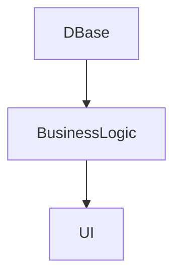

                 


# 彼得林奇如何分析公司的市场占有率

## 关键词
- 彼得·林奇
- 市场占有率
- 投资分析
- 市场竞争
- 企业价值

## 摘要
本文将深入探讨彼得·林奇分析公司市场占有率的方法和逻辑。通过分析市场占有率的核心概念、影响因素、数学模型以及实际案例，详细解读彼得·林奇的投资哲学。本文结合理论与实践，为投资者和企业管理者提供切实可行的分析工具和方法。

---

## 第1章: 市场占有率的核心概念与背景

### 1.1 市场占有率的基本定义

#### 1.1.1 什么是市场占有率
市场占有率是指一家公司在某个特定市场中所占的销售量、销售额或用户数量的相对比例。它是衡量一家公司市场地位的重要指标，通常用公式表示为：

$$市场占有率 = \frac{公司销售额}{行业总销售额} \times 100\%$$

市场占有率越高，说明公司在市场中的影响力越大。

#### 1.1.2 市场占有率的计算公式
市场占有率的计算需要明确的市场定义（如地理区域、产品类型等）。例如：

$$公司市场占有率 = \frac{公司产品销量}{市场总销量} \times 100\%$$

#### 1.1.3 市场占有率的重要性
市场占有率直接影响公司的盈利能力、品牌影响力和市场竞争力。高市场占有率通常意味着更强的议价能力和更大的市场影响力。

---

### 1.2 彼得·林奇的市场占有率分析方法

#### 1.2.1 彼得·林奇的背景与投资理念
彼得·林奇是美国著名的投资专家，以其独特的投资哲学闻名。他认为，分析市场占有率是评估公司投资价值的关键因素之一。

#### 1.2.2 市场占有率在投资分析中的地位
市场占有率是衡量公司竞争优势的重要指标。林奇认为，高市场占有率通常意味着公司具有更强的定价能力和成本优势。

#### 1.2.3 彼得·林奇分析市场占有率的独特视角
林奇注重分析市场占有率的变化趋势，而非单一数据点。他强调，市场占有率的增长反映了公司的市场扩展能力和产品竞争力。

---

## 第2章: 彼得·林奇市场占有率分析的核心要素

### 2.1 影响市场占有率的关键因素

#### 2.1.1 产品竞争力
产品的质量和创新性直接影响市场占有率。例如，一家公司推出创新产品，可能会迅速抢占市场份额。

#### 2.1.2 市场定位
正确的市场定位能够帮助公司精准满足目标客户的需求，从而提高市场占有率。

#### 2.1.3 价格策略
合理的价格策略可以吸引更多的消费者，从而提高市场占有率。例如，采用价格折扣策略可能会增加销量。

#### 2.1.4 品牌影响力
强大的品牌影响力可以提高消费者对公司的信任度，从而增强市场竞争力。

#### 2.1.5 行业竞争格局
行业内的竞争状况直接影响市场占有率。如果行业集中度高，前几名公司通常会占据较大的市场份额。

---

### 2.2 彼得·林奇分析模型的构建

#### 2.2.1 市场占有率分析的核心要素
市场占有率分析需要考虑以下要素：

| 要素 | 描述 |
|------|------|
| 产品竞争力 | 产品的质量和创新性 |
| 市场定位 | 公司在市场中的定位 |
| 价格策略 | 价格策略的有效性 |
| 品牌影响力 | 品牌的知名度和美誉度 |
| 行业竞争格局 | 行业内的竞争情况 |

#### 2.2.2 彼得·林奇分析模型的逻辑框架
分析市场占有率时，彼得·林奇通常会从以下几个步骤入手：

1. **行业分析**：了解行业整体规模和增长趋势。
2. **竞争对手分析**：评估主要竞争对手的市场占有率和竞争优势。
3. **公司分析**：分析公司在市场中的定位、产品竞争力和品牌影响力。
4. **市场占有率预测**：基于以上分析，预测未来市场占有率的变化趋势。

#### 2.2.3 模型的输入与输出
- **输入**：行业数据、公司财务数据、竞争对手信息。
- **输出**：公司市场占有率的预测值和投资建议。

---

## 第3章: 彼得·林奇市场占有率分析的数学模型

### 3.1 市场占有率的数学表达

#### 3.1.1 市场占有率的计算公式
市场占有率的计算需要明确的市场定义。例如，假设行业总销售额为 $S$，公司销售额为 $C$，则市场占有率 $M$ 为：

$$M = \frac{C}{S} \times 100\%$$

#### 3.1.2 市场占有率与企业价值的关系
市场占有率与企业价值密切相关。通常情况下，市场占有率越高，企业价值越大。但需要注意的是，过高的市场占有率可能会引发反垄断调查。

#### 3.1.3 市场占有率的动态变化模型
市场占有率的变化可以用以下公式表示：

$$\Delta M = \frac{\Delta C}{S} \times 100\%$$

其中，$\Delta C$ 是公司销售额的变化量，$S$ 是行业总销售额。

---

### 3.2 彼得·林奇分析模型的数学推导

#### 3.2.1 市场占有率的分解公式
市场占有率可以分解为以下几部分：

$$M = \frac{C}{S} = \frac{C}{C + \sum_{i=1}^{n} C_i}$$

其中，$C$ 是公司销售额，$C_i$ 是竞争对手销售额。

#### 3.2.2 市场占有率与企业利润的关系
市场占有率与企业利润的关系可以用以下公式表示：

$$\text{利润} = (C - \text{成本}) \times M$$

#### 3.2.3 市场占有率变化的预测模型
基于历史数据，市场占有率的变化可以用线性回归模型预测：

$$\hat{M}_t = a + bt$$

其中，$t$ 是时间，$a$ 是截距，$b$ 是回归系数。

---

## 第4章: 彼得·林奇市场占有率分析的系统架构

### 4.1 系统分析框架

#### 4.1.1 问题场景介绍
系统需要帮助投资者分析公司市场占有率，预测市场趋势，并提供投资建议。

#### 4.1.2 系统功能设计
- 数据收集模块：收集行业数据和公司财务数据。
- 数据分析模块：计算市场占有率，分析竞争对手情况。
- 结果展示模块：以图表形式展示分析结果。

#### 4.1.3 系统架构设计
- 数据库层：存储行业数据和公司数据。
- 业务逻辑层：实现数据分析和预测功能。
- 用户界面层：展示分析结果。

### 4.2 系统架构图


---

## 第5章: 彼得·林奇市场占有率分析的项目实战

### 5.1 环境安装与数据准备

#### 5.1.1 环境配置
- 操作系统：Windows 10 或 macOS 10.15
- 开发工具：Jupyter Notebook
- 数据库：SQLite 或 MySQL

#### 5.1.2 数据来源与处理
- 数据来源：行业报告、公司财报。
- 数据清洗：去除缺失值和异常值。

#### 5.1.3 数据清洗与预处理
- 数据标准化：统一数据格式。
- 数据分组：按行业分类数据。

### 5.2 核心代码实现

#### 5.2.1 数据分析代码
```python
import pandas as pd

# 读取数据
data = pd.read_csv('market_share.csv')

# 计算市场占有率
market_share = data['销售额'] / data['行业总销售额'] * 100
print('市场占有率:', market_share.mean())
```

#### 5.2.2 模型训练代码
```python
from sklearn.linear_model import LinearRegression

# 数据准备
X = pd.DataFrame(data['时间'])
y = pd.DataFrame(data['市场占有率'])

# 训练模型
model = LinearRegression()
model.fit(X, y)

# 预测市场占有率
print('预测市场占有率:', model.predict(X))
```

#### 5.2.3 结果可视化代码
```python
import matplotlib.pyplot as plt

plt.plot(data['时间'], data['市场占有率'], label='实际市场占有率')
plt.plot(data['时间'], model.predict(X), label='预测市场占有率')
plt.xlabel('时间')
plt.ylabel('市场占有率')
plt.legend()
plt.show()
```

---

## 第6章: 最佳实践与注意事项

### 6.1 最佳实践
- **数据收集**：确保数据来源可靠，覆盖足够的时间范围。
- **模型选择**：根据具体情况选择合适的分析模型。
- **持续监测**：定期更新数据，重新评估市场占有率。

### 6.2 小结
彼得·林奇的市场占有率分析方法为我们提供了一个全面的框架。通过分析市场占有率的核心要素、构建数学模型，并结合实际案例，我们可以更好地评估公司的市场地位和投资价值。

### 6.3 注意事项
- **数据偏差**：注意数据来源的偏差，避免误导性结论。
- **模型局限性**：数学模型只是工具，需要结合实际情况灵活运用。
- **行业差异**：不同行业的市场分析方法可能有所不同，需根据具体情况进行调整。

### 6.4 拓展阅读
- 彼得·林奇的《投资最重要的事情》
- 克里斯托弗·布朗的《彼得·林奇的投资哲学》
- 投资分析相关的学术论文和案例研究

---

以上是文章的完整结构和内容。每一章都详细阐述了彼得·林奇分析市场占有率的方法，并结合实际案例和代码示例，帮助读者更好地理解和应用这些方法。希望这篇文章能为投资者和企业管理者提供有价值的参考。

