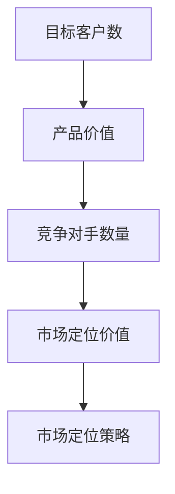

                 


# 彼得·林奇如何分析公司的市场定位策略

---

## 关键词：
彼得·林奇，市场定位，投资策略，竞争优势，商业模式，数学模型，系统架构

---

## 摘要：
本文详细分析了彼得·林奇如何通过市场定位策略来评估公司的投资价值。首先，我们从彼得·林奇的投资哲学出发，探讨市场定位策略的核心概念和其在企业竞争中的重要性。接着，我们深入分析了市场定位策略的算法原理，包括数学模型和实现代码。最后，通过实际案例和系统架构设计，展示了如何将市场定位策略应用于实际投资分析中。本文旨在为读者提供一个全面的视角，帮助他们在投资决策中更好地运用市场定位策略。

---

## 第一部分：彼得·林奇与市场定位策略的背景

### 第1章：彼得·林奇及其投资策略

#### 1.1 彼得·林奇的生平简介
彼得·林奇（Peter Lynch）是美国著名的投资专家，曾任富达投资集团麦哲伦基金经理，管理资产规模曾高达1400亿美元。他以卓越的投资业绩闻名，被誉为“股票投资专家”。

#### 1.2 彼得·林奇的投资哲学
彼得·林奇的投资哲学的核心在于寻找那些具有强大市场定位和竞争优势的公司。他认为，市场定位是决定公司能否在竞争中获胜的关键因素之一。

#### 1.3 彼得·林奇的成功案例
彼得·林奇成功投资了多个具有强大市场定位的公司，例如吉列刀片公司和麦当劳。这些公司通过明确的市场定位，在各自领域占据了领先地位。

---

### 第2章：市场定位策略的定义与重要性

#### 2.1 市场定位的定义
市场定位是指公司通过其产品或服务在目标市场中占据独特位置的过程。它涉及到对目标客户的需求、竞争对手的分析以及公司的核心竞争力的定位。

#### 2.2 市场定位在企业战略中的地位
市场定位是企业战略的核心部分，它决定了公司在市场中的发展方向和竞争优势。通过市场定位，公司可以更好地满足客户需求，提高市场占有率。

#### 2.3 彼得·林奇对市场定位的重视
彼得·林奇认为，市场定位是评估公司投资价值的重要指标。他强调，具有清晰市场定位的公司更容易在竞争中获胜。

---

## 第二部分：市场定位策略的核心概念

### 第3章：市场定位的要素与属性

#### 3.1 市场定位的核心要素
市场定位的核心要素包括目标客户、产品特点、竞争优势和市场范围。这些要素共同决定了公司在市场中的定位。

#### 3.2 市场定位的属性对比表
以下是市场定位的属性对比表：

| 要素 | 描述 |
|------|------|
| 目标客户 | 公司主要面向的客户群体 |
| 产品特点 | 产品的独特卖点 |
| 竞争优势 | 公司在竞争中的优势 |
| 市场范围 | 公司目标市场的范围 |

#### 3.3 市场定位的ER实体关系图
以下是市场定位的ER实体关系图：

```mermaid
erDiagram
    customer[客户] {
        +id: int
        +name: string
        +age: int
    }
    product[产品] {
        +id: int
        +name: string
        +features: string
    }
    competitor[竞争对手] {
        +id: int
        +name: string
        +market_share: float
    }
    market定位[市场定位] {
        +id: int
        +target_customer: int
        +product_features: int
        +competitive_advantage: int
        +market_range: int
    }
    market定位 --> customer: 面向客户
    market定位 --> product: 产品特点
    market定位 --> competitor: 竞争优势
    market定位 --> market_range: 市场范围
```

---

### 第4章：市场定位与企业竞争的关系

#### 4.1 市场定位与竞争战略的联系
市场定位是竞争战略的核心部分。通过市场定位，公司可以明确其在市场中的位置，并制定相应的竞争策略。

#### 4.2 市场定位在企业竞争中的作用
市场定位通过明确公司的目标客户和竞争优势，帮助公司在竞争中占据优势地位。它不仅有助于吸引目标客户，还能提高公司的市场占有率。

#### 4.3 市场定位与企业核心竞争力的构建
市场定位是构建企业核心竞争力的重要手段。通过明确市场定位，公司可以集中资源，开发具有竞争力的产品，从而在市场中立于不败之地。

---

## 第三部分：市场定位策略的算法原理

### 第5章：市场定位的数学模型

#### 5.1 市场定位的数学公式
市场定位可以通过以下数学公式进行评估：

$$
\text{市场定位价值} = \frac{\text{目标客户数} \times \text{产品价值}}{\text{竞争对手数量}}
$$

#### 5.2 市场定位的数学模型推导
市场定位的数学模型基于目标客户数、产品价值和竞争对手数量三个变量。通过分析这些变量的关系，可以评估公司的市场定位价值。

#### 5.3 市场定位的数学模型应用
以某公司为例，假设目标客户数为10000，产品价值为50，竞争对手数量为5。则市场定位价值为：

$$
\frac{10000 \times 50}{5} = 10000
$$

---

### 第6章：市场定位的算法流程

#### 6.1 算法的输入与输出
- 输入：目标客户数、产品价值、竞争对手数量
- 输出：市场定位价值

#### 6.2 算法的步骤分解
1. 收集目标客户数、产品价值和竞争对手数量。
2. 计算市场定位价值。
3. 输出结果。

#### 6.3 算法的实现代码
以下是Python实现的代码：

```python
def market定位价值计算(目标客户数, 产品价值, 竞争对手数量):
    市场定位价值 = (目标客户数 * 产品价值) / 竞争对手数量
    return 市场定位价值

# 示例
目标客户数 = 10000
产品价值 = 50
竞争对手数量 = 5
print(市场定位价值计算(目标客户数, 产品价值, 竞争对手数量))
```

---

## 第四部分：市场定位策略的系统分析

### 第7章：系统分析与架构设计

#### 7.1 系统分析的流程
1. 明确需求：确定市场定位的目标客户、产品特点和竞争优势。
2. 收集数据：收集目标客户、产品价值和竞争对手数量等数据。
3. 分析数据：通过数学模型计算市场定位价值。
4. 制定策略：根据分析结果制定市场定位策略。

#### 7.2 系统架构的设计
以下是系统架构设计的mermaid图：



#### 7.3 系统接口的设计
系统接口设计包括数据输入接口、数据处理接口和结果输出接口。

---

## 第五部分：项目实战

### 第8章：环境安装与系统核心实现

#### 8.1 环境安装
需要安装Python和相关库（如numpy、pandas）。

#### 8.2 系统核心实现
以下是Python实现的代码：

```python
import numpy as np
import pandas as pd

def 计算市场定位价值(目标客户数, 产品价值, 竞争对手数量):
    市场定位价值 = (目标客户数 * 产品价值) / 竞争对手数量
    return 市场定位价值

# 示例数据
data = {
    '目标客户数': [10000, 20000],
    '产品价值': [50, 60],
    '竞争对手数量': [5, 6]
}

df = pd.DataFrame(data)
df['市场定位价值'] = df.apply(lambda x: 计算市场定位价值(x['目标客户数'], x['产品价值'], x['竞争对手数量']), axis=1)

print(df)
```

---

## 第六部分：总结与展望

### 第9章：最佳实践与小结

#### 9.1 总结
通过本文的分析，我们可以看到彼得·林奇如何通过市场定位策略来评估公司的投资价值。市场定位是企业竞争的核心，只有明确市场定位，才能在竞争中立于不败之地。

#### 9.2 注意事项
在实际投资中，市场定位只是众多因素之一，还需要结合其他因素（如财务状况、行业趋势等）进行综合分析。

#### 9.3 拓展阅读
建议读者进一步阅读彼得·林奇的《彼得·林奇的投资哲学》以及相关市场定位策略的经典书籍。

---

希望这篇文章能为读者提供关于彼得·林奇如何分析公司市场定位策略的深入见解。

