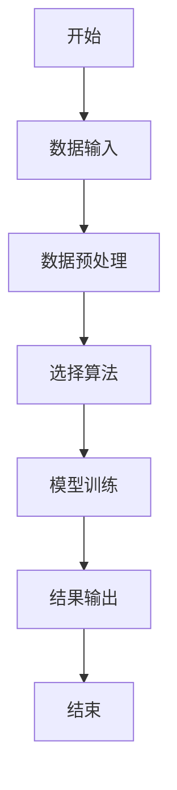
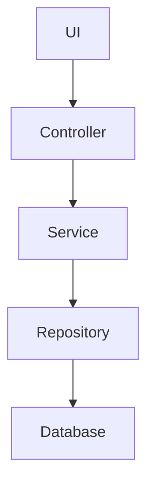
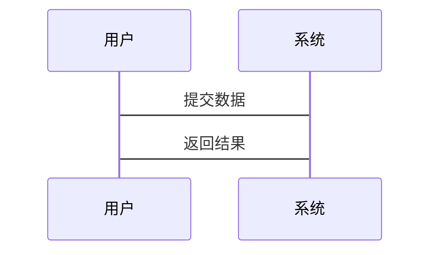

                 


### 第二部分: 核心概念与联系

# 第4章: 市场细分策略的核心概念与联系

## 4.1 市场细分策略的核心概念
### 4.1.1 市场细分的定义与分类
### 4.1.2 市场细分的关键属性
### 4.1.3 市场细分的核心要素

## 4.2 市场细分策略与投资决策的关系
### 4.2.1 市场细分策略对投资决策的影响
### 4.2.2 市场细分策略与投资收益的关系
### 4.2.3 市场细分策略的实施步骤

## 4.3 市场细分策略的ER实体关系图
```mermaid
erDiagram
    customer[顾客] {
        name : string
        age : integer
        location : string
        income : float
    }
    market_segment[市场细分] {
        id : integer
        name : string
        description : string
    }
    customer -->
    market_segment: belongs_to
```

## 4.4 市场细分策略的核心要素对比分析
| 核心要素 | 定义 | 重要性 | 示例 |
|----------|------|--------|------|
| 客户特征 | 顾客的属性，如年龄、收入、地理位置等 | 高 | 收入水平 |
| 需求差异 | 顾客对产品或服务的需求差异 | 高 | 品牌忠诚度 |
| 竞争状况 | 市场竞争情况 | 中 | 市场份额 |
| 可行性 | 细分市场的可行性 | 高 | 市场规模 |

## 4.5 市场细分策略的对比分析
### 4.5.1 对比不同市场细分策略的特点
### 4.5.2 彼得·林奇的市场细分策略的独特性
### 4.5.3 市场细分策略的优缺点分析

# 第5章: 算法原理讲解

## 5.1 算法原理概述
### 5.1.1 市场细分策略的算法基础
### 5.1.2 算法的核心思想
### 5.1.3 算法的数学模型

## 5.2 算法的数学模型
### 5.2.1 聚类分析模型
$$
\text{距离度量} = \sqrt{(x_i - x_j)^2 + (y_i - y_j)^2}
$$

### 5.2.2 聚类分析的实现步骤
1. 数据预处理
2. 选择距离度量方法
3. 初始化聚类中心
4. 计算每个数据点到聚类中心的距离
5. 聚类分配
6. 重新计算聚类中心
7. 重复步骤4-6直到收敛

## 5.3 算法的实现代码
```python
import numpy as np
from sklearn.cluster import KMeans

# 示例数据
X = np.array([[1, 2], [5, 8], [10, 13], [15, 20]])

# 初始化聚类中心
kmeans = KMeans(n_clusters=2, random_state=0)
kmeans.fit(X)

# 输出聚类结果
print(kmeans.labels_)
print(kmeans.cluster_centers_)
```

## 5.4 算法的应用实例
### 5.4.1 应用聚类分析进行市场细分
### 5.4.2 实例分析
### 5.4.3 结果解读

# 第6章: 系统分析与架构设计方案

## 6.1 问题场景介绍
### 6.1.1 问题背景
### 6.1.2 问题描述
### 6.1.3 问题解决

## 6.2 系统功能设计
### 6.2.1 系统功能模块划分
### 6.2.2 系统功能流程图


### 6.2.3 系统功能实现步骤

## 6.3 系统架构设计
### 6.3.1 系统架构图


### 6.3.2 系统架构实现
### 6.3.3 系统架构的优点

## 6.4 系统接口设计
### 6.4.1 接口定义
### 6.4.2 接口实现
### 6.4.3 接口调用

## 6.5 系统交互设计
### 6.5.1 交互流程图


### 6.5.2 交互实现
### 6.5.3 交互优化

# 第7章: 项目实战

## 7.1 环境安装
### 7.1.1 安装Python
### 7.1.2 安装必要的库
### 7.1.3 环境配置

## 7.2 系统核心实现
### 7.2.1 数据预处理代码
```python
import pandas as pd
data = pd.read_csv('data.csv')
```

### 7.2.2 聚类分析代码
```python
from sklearn.cluster import KMeans
model = KMeans(n_clusters=3)
model.fit(data)
```

### 7.2.3 结果可视化代码
```python
import matplotlib.pyplot as plt
plt.scatter(data.x, data.y, c=model.labels_)
plt.show()
```

## 7.3 代码应用解读与分析
### 7.3.1 代码实现的功能
### 7.3.2 代码的优缺点
### 7.3.3 代码的适用场景

## 7.4 实际案例分析
### 7.4.1 案例背景
### 7.4.2 数据收集与处理
### 7.4.3 分析过程与结果
### 7.4.4 结果解读与策略制定

## 7.5 项目小结
### 7.5.1 项目总结
### 7.5.2 经验分享
### 7.5.3 改进建议

# 第8章: 最佳实践与小结

## 8.1 小结
### 8.1.1 核心内容回顾
### 8.1.2 重点内容总结
### 8.1.3 个人感悟

## 8.2 注意事项
### 8.2.1 实施市场细分策略的关键点
### 8.2.2 数据分析中的常见问题
### 8.2.3 投资策略的风险管理

## 8.3 拓展阅读
### 8.3.1 相关书籍推荐
### 8.3.2 其他学习资源
### 8.3.3 进一步学习方向

---

### 关键词：
- 彼得·林奇
- 市场细分策略
- 投资分析
- 数据分析
- 聚类分析

### 摘要：
本文系统地介绍了彼得·林奇如何运用市场细分策略进行投资分析。通过背景介绍、核心概念、算法原理、系统分析、项目实战等部分，详细阐述了市场细分策略在投资决策中的重要性及其具体应用方法。同时，结合实际案例和代码实现，帮助读者更好地理解和掌握这一策略。

