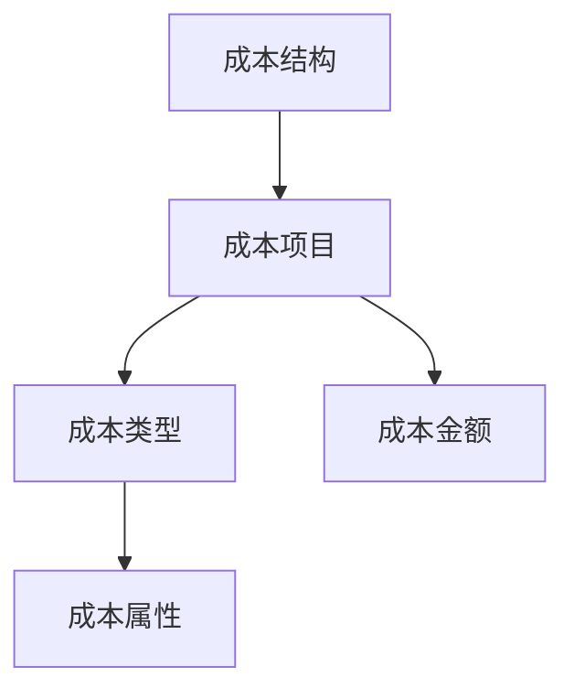
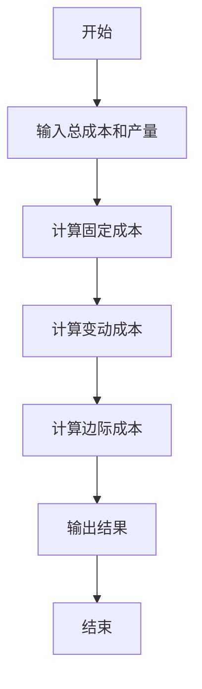
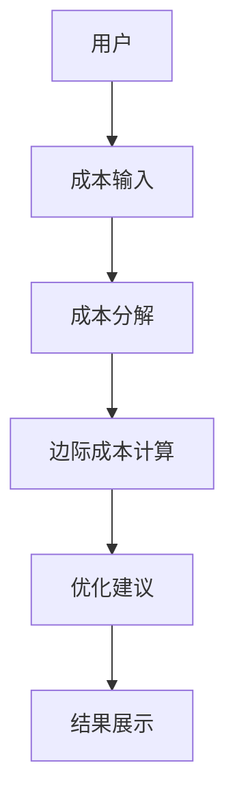

                 


# 彼得林奇如何分析公司的成本结构

## 关键词：彼得·林奇, 成本结构, 投资分析, 企业成本, 财务分析

## 摘要：  
彼得·林奇是全球著名投资专家，他以独特的方法分析公司成本结构，为企业投资者提供深刻的见解。本文将系统地介绍成本结构的基本概念、分析方法、算法原理、数学模型、系统架构设计以及实际案例，帮助读者全面理解彼得·林奇的成本结构分析策略，并在实际项目中应用这些方法。

---

# 第一部分: 背景介绍

## 第1章: 成本结构分析的背景与重要性

### 1.1 成本结构的基本概念  
成本结构是企业在生产或提供服务过程中所涉及的各种成本的总和，包括固定成本和变动成本。固定成本如租金、 salaries，变动成本如原材料、直接人工。成本结构直接关系到企业的盈利能力，影响定价策略和竞争优势。

### 1.2 彼得·林奇的分析方法  
彼得·林奇以价值投资闻名，他关注企业的基本面，尤其是成本结构。他通过分析企业的成本项目，判断其在行业中的竞争力。他的方法包括：  
- **固定成本与变动成本的区分**：理解成本的构成，优化成本结构。  
- **边际成本分析**：计算每增加一单位产品的成本，判断价格是否合理。  
- **成本与收入匹配**：分析收入与成本的关系，确保企业盈利。

### 1.3 成本结构与企业价值的关系  
成本结构影响企业的利润，进而影响股价。优化成本结构可以提高利润率，增强企业的市场竞争力。彼得·林奇通过分析成本结构，评估企业是否具有长期投资价值。

---

# 第二部分: 核心概念与联系

## 第2章: 成本结构的核心要素与分析方法

### 2.1 成本结构的核心要素  
- **固定成本**：如租金、设备折旧，不随产量变化。  
- **变动成本**：如原材料、直接人工，随产量变化。  
- **直接成本**：直接用于产品生产的成本。  
- **间接成本**：无法直接追溯到产品的成本，如管理费用。  
- **长期成本与短期成本**：长期成本可调整，短期成本较固定。

### 2.2 成本结构的属性特征对比  
以下表格展示了成本结构中不同成本类型的对比：

| 成本类型 | 定义 | 特点 | 示例 |
|----------|------|------|------|
| 固定成本 | 不随产量变化 | 稳定、可预测 | 租金、设备折旧 |
| 变动成本 | 随产量变化 | 不稳定、可变 | 原材料、直接人工 |
| 直接成本 | 直接用于产品 | 可追溯 | 原材料、直接人工 |
| 间接成本 | 难以追溯 | 不可追溯 | 管理费用、销售费用 |
| 长期成本 | 可调整 | 灵活性高 | 研发投入、市场推广 |

### 2.3 成本结构的ER实体关系图  
通过Mermaid图展示成本结构的实体关系：



---

# 第三部分: 算法原理讲解

## 第3章: 成本结构分析的算法原理

### 3.1 算法概述  
分析成本结构的算法包括：  
- **边际成本计算**：确定每增加一单位产品成本。  
- **成本分解**：将总成本分解为固定和变动成本。  
- **成本优化**：识别可以削减或优化的成本项目。

### 3.2 算法实现  
使用Python代码实现边际成本计算：

```python
def calculate_marginal_cost(units, total_cost):
    marginal_cost = (total_cost - fixed_cost) / units
    return marginal_cost

# 示例
fixed_cost = 1000
variable_cost_per_unit = 5
units = 100
total_cost = fixed_cost + (variable_cost_per_unit * units)
marginal_cost = calculate_marginal_cost(units, total_cost)
print(f"边际成本: {marginal_cost}")
```

### 3.3 算法流程图  


### 3.4 数学模型与公式  
边际成本公式：  
$$ \text{边际成本} = \frac{\text{变动成本}}{\text{产量}} $$

---

# 第四部分: 数学模型与公式

## 第4章: 成本结构分析的数学模型

### 4.1 边际成本公式  
$$ \text{边际成本} = \frac{\text{变动成本}}{\text{产量}} $$

### 4.2 实例分析  
假设某企业生产100个单位，变动成本为500，固定成本为200。  
边际成本 = 500 / 100 = 5。  
企业应确保售价高于5，以保证盈利。

---

# 第五部分: 系统分析与架构设计方案

## 第5章: 成本结构分析系统架构

### 5.1 问题场景介绍  
企业需要分析成本结构，优化成本，提高利润率。系统需支持成本项目分解、成本类型识别和成本优化建议。

### 5.2 系统功能设计  
- **成本输入**：用户输入固定成本、变动成本等。  
- **成本分析**：系统自动分解成本，计算边际成本。  
- **优化建议**：基于分析结果，提供建议。

### 5.3 系统架构图  


### 5.4 接口设计与交互  
- **API接口**：提供REST API，供其他系统调用。  
- **交互序列图**：展示用户与系统之间的交互流程。

---

# 第六部分: 项目实战

## 第6章: 成本结构分析项目实战

### 6.1 环境安装  
安装Python和相关库（如numpy、pandas）。  

### 6.2 核心代码实现  
实现成本分解和优化建议的代码：

```python
import pandas as pd

def analyze_cost_structure(data):
    fixed_cost = data['fixed_cost'].sum()
    variable_cost = data['variable_cost'].sum()
    total_cost = fixed_cost + variable_cost
    marginal_cost = variable_cost / data['units'].sum()
    return {
        'fixed_cost': fixed_cost,
        'variable_cost': variable_cost,
        'marginal_cost': marginal_cost
    }

# 示例数据
data = {
    'fixed_cost': [1000, 2000],
    'variable_cost': [500, 1000],
    'units': [100, 200]
}

result = analyze_cost_structure(data)
print(f"固定成本: {result['fixed_cost']}")
print(f"变动成本: {result['variable_cost']}")
print(f"边际成本: {result['marginal_cost']}")
```

### 6.3 案例分析  
分析某制造企业的成本结构，优化成本，提升利润率。

---

# 第七部分: 最佳实践

## 第7章: 成本结构分析总结与最佳实践

### 7.1 总结  
彼得·林奇的成本结构分析方法对企业投资者和管理者具有重要价值。通过优化成本结构，企业可以提高盈利能力，增强竞争力。

### 7.2 注意事项  
- 确保成本数据的准确性。  
- 定期审查成本结构，适应市场变化。  
- 结合其他财务指标，全面评估企业价值。

### 7.3 拓展阅读  
建议阅读彼得·林奇的书籍，深入理解他的投资理念和成本分析方法。

---

# 结语  
通过本文的详细讲解，读者可以全面理解彼得·林奇的成本结构分析方法，并在实际项目中应用这些策略。希望本文能为企业的成本优化和投资决策提供有价值的参考。

