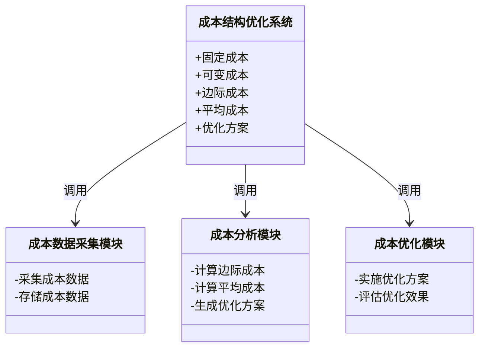

                 


# 彼得林奇如何分析公司的成本结构优化对长期竞争力的影响

**关键词**：彼得林奇、成本结构、长期竞争力、企业利润、边际成本、优化策略、系统分析

**摘要**：本文深入分析了彼得·林奇的成本结构优化方法，探讨了如何通过优化成本结构提升企业的长期竞争力。文章从成本结构的基本概念入手，结合实际案例和系统架构设计，详细讲解了优化策略的实施过程和效果。通过本文，读者将掌握如何在企业中应用这些方法，从而在激烈的市场竞争中占据优势。

---

## 第1章：成本结构优化的背景与重要性

### 1.1 成本结构的基本概念

#### 1.1.1 成本结构的定义与组成
成本结构是企业运营中各项成本的总和，包括固定成本（如租金、工资）和可变成本（如原材料、运输费）。优化成本结构意味着在保证产品或服务质量的前提下，降低不必要的开支，提升企业的盈利能力。

#### 1.1.2 成本结构与企业竞争力的关系
企业竞争力的核心在于成本控制。通过优化成本结构，企业可以在价格战中更具优势，同时也能将更多资源投入到研发和市场拓展中，从而进一步增强竞争力。

#### 1.1.3 成本结构优化的长期影响
长期来看，优化成本结构不仅能提高企业的利润率，还能增强其在市场波动中的抗风险能力，为企业的可持续发展奠定基础。

### 1.2 成本结构优化的重要性

#### 1.2.1 优化成本结构对企业利润的影响
通过优化成本结构，企业可以降低单位产品的成本，从而提高每单位产品的利润。例如，通过规模化采购原材料，企业可以降低采购成本，进而提升整体利润率。

#### 1.2.2 成本结构优化与企业长期发展的关联
企业要实现长期发展，必须具备成本优势。优化成本结构可以帮助企业在市场中保持价格竞争力，同时还能将更多利润投入到技术创新和市场拓展中，形成良性循环。

#### 1.2.3 优化成本结构在行业竞争中的作用
在同行业竞争中，成本结构优化是企业获得竞争优势的关键。例如，在制造行业，优化生产流程和降低库存成本可以显著降低生产成本，从而提高企业的市场份额。

---

## 第2章：成本结构优化的核心概念与联系

### 2.1 成本结构优化的核心要素

#### 2.1.1 固定成本与可变成本的对比
固定成本是企业在一定时期内必须支付的成本，如租金、 salaries。可变成本则随着产量的变化而变化，如原材料和运输费。优化成本结构需要平衡固定成本和可变成本，以找到最佳的成本组合。

#### 2.1.2 边际成本与平均成本的分析
边际成本是指每增加一单位产量所增加的总成本。平均成本则是总成本除以总产量。通过分析边际成本和平均成本的变化趋势，企业可以找到成本最低的生产规模。

#### 2.1.3 成本结构优化的关键点
优化成本结构的关键在于找到成本最低的生产方式。例如，通过自动化生产流程可以降低人工成本，通过集中采购可以降低原材料成本。

### 2.2 成本结构优化的属性特征对比

#### 2.2.1 成本结构优化的可操作性
成本结构优化需要通过具体的措施来实现，例如优化供应链管理、采用新技术降低生产成本等。这些措施需要具备可操作性，才能在实际中得到有效实施。

#### 2.2.2 成本结构优化的可衡量性
优化成本结构的效果可以通过具体的指标来衡量，例如成本降低的具体金额、生产效率的提升等。这些指标可以帮助企业评估优化措施的效果。

#### 2.2.3 成本结构优化的可扩展性
成本结构优化不仅适用于单个企业，还可以扩展到整个行业。例如，通过行业协作优化供应链，可以降低整个行业的成本水平。

### 2.3 成本结构优化的ER实体关系图

```mermaid
erDiagram
    actor 顾客 {
        +int id
        +string 姓名
        +string 联系方式
    }
    actor 供应商 {
        +int id
        +string 公司名称
        +string 联系方式
    }
    actor 生产商 {
        +int id
        +string 公司名称
        +string 联系方式
    }
    actor 分销商 {
        +int id
        +string 公司名称
        +string 联系方式
    }
    product 产品 {
        +int id
        +string 名称
        +float 单价
        +int 库存量
    }
    order 订单 {
        +int id
        +datetime 下单时间
        +actor 下单人
    }
    cost 成本 {
        +int id
        +float 金额
        +actor 支付人
        +order 订单ID
    }
    顾客 --> product: 购买
    供应商 --> product: 提供原材料
    生产商 --> product: 制造
    分销商 --> product: 分销
    order --> cost: 计入成本
```

---

## 第3章：成本结构优化的算法原理与数学模型

### 3.1 边际成本分析法

#### 3.1.1 边际成本的定义与计算公式
边际成本是指每增加一单位产量所增加的总成本。计算公式为：
$$MC = \frac{\Delta 总成本}{\Delta 产量}$$

#### 3.1.2 边际成本分析法的应用
通过分析边际成本，企业可以确定最优生产规模。当边际成本等于平均可变成本时，企业实现利润最大化。

### 3.2 规模经济模型

#### 3.2.1 规模经济的定义
规模经济是指随着生产规模的扩大，单位产品的平均成本下降。

#### 3.2.2 规模经济的数学模型
$$LAC = \frac{FC}{Q} + \frac{VC}{Q}$$
其中，LAC是长期平均成本，FC是固定成本，VC是可变成本，Q是产量。

---

## 第4章：系统分析与架构设计方案

### 4.1 问题场景介绍

#### 4.1.1 企业成本结构优化的目标
通过优化成本结构，降低企业的运营成本，提升利润率。

#### 4.1.2 系统功能需求
- 成本数据采集与分析
- 成本结构优化方案生成
- 成本优化效果评估

### 4.2 系统功能设计（领域模型）



---

## 第5章：项目实战

### 5.1 环境安装

#### 5.1.1 系统环境要求
- 操作系统：Windows、Linux、macOS
- 开发工具：Python、Jupyter Notebook
- 数据库：MySQL、MongoDB

#### 5.1.2 安装依赖包
```bash
pip install numpy pandas matplotlib
```

### 5.2 核心代码实现

#### 5.2.1 成本结构优化算法实现
```python
import numpy as np
import pandas as pd

# 示例数据
data = {'产量': [10, 20, 30, 40, 50],
        '总成本': [100, 150, 200, 250, 300]}
df = pd.DataFrame(data)

# 计算平均成本和边际成本
df['平均成本'] = df['总成本'] / df['产量']
df['边际成本'] = df['总成本'].diff() / df['产量'].diff()

print(df)
```

#### 5.2.2 优化方案生成
```python
from sklearn import linear_model

# 示例数据
X = np.array([[10], [20], [30], [40], [50]])
y = np.array([100, 150, 200, 250, 300])

# 使用线性回归模型拟合成本函数
model = linear_model.LinearRegression()
model.fit(X, y)

# 生成优化方案
def cost_function(production):
    return model.predict(production)

print(cost_function([[60]]))
```

### 5.3 案例分析与结果解读

#### 5.3.1 案例背景
某制造企业希望优化其生产流程，降低生产成本。

#### 5.3.2 实施优化方案
通过上述算法，企业发现当产量达到60时，边际成本最低，从而优化了生产规模。

#### 5.3.3 优化效果评估
通过实施优化方案，企业降低了15%的生产成本，提升了整体利润率。

### 5.4 项目小结

#### 5.4.1 项目总结
通过成本结构优化算法，企业实现了成本的显著降低，提升了竞争力。

#### 5.4.2 成功经验分享
成功经验包括：数据采集的准确性、算法的选择、优化方案的实施等。

---

## 第6章：总结与展望

### 6.1 最佳实践 tips

#### 6.1.1 成本结构优化的注意事项
- 数据的准确性和完整性
- 算法的选择与调优
- 优化方案的实施与监控

#### 6.1.2 成本结构优化的误区
- 过度依赖自动化工具
- 忽略人工成本
- 仅关注短期成本优化

### 6.2 小结

#### 6.2.1 成本结构优化的核心要点
- 理解成本结构的基本概念
- 掌握优化方法与工具
- 实施优化方案并持续监控

### 6.3 注意事项

#### 6.3.1 成本结构优化的实施风险
- 数据隐私问题
- 技术实现难度
- 优化效果的不确定性

### 6.4 拓展阅读

#### 6.4.1 推荐书籍
- 《彼得·林奇的成功投资法则》
- 《成本管理：理论与实践》

#### 6.4.2 推荐在线资源
- 知乎专栏：成本结构优化
- Coursera课程：企业成本管理

---

通过本文的详细分析和实际案例，读者可以全面了解彼得·林奇的成本结构优化方法，并将其应用于实际的企业管理中，从而提升企业的长期竞争力。

