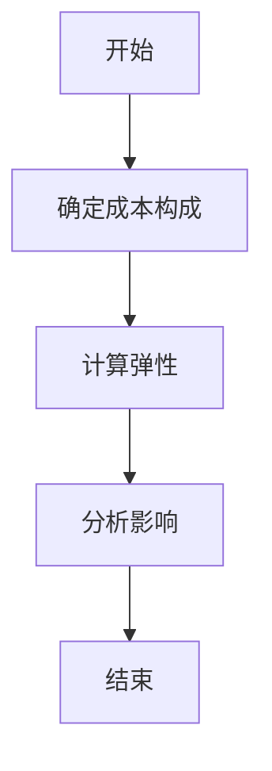
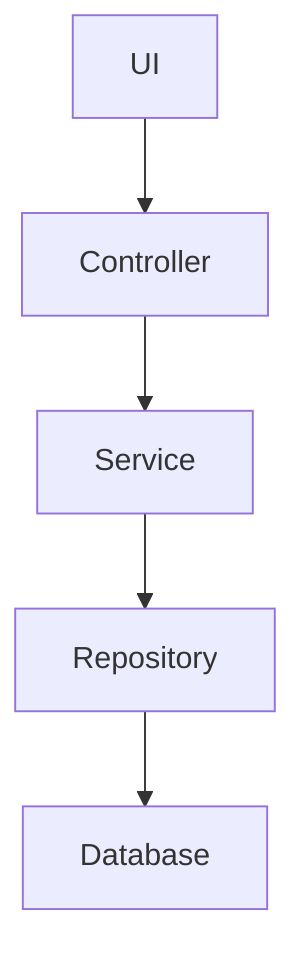

                 


# 彼得林奇如何分析公司的成本结构弹性

## 关键词：成本结构弹性，彼得林奇，投资分析，成本优化，弹性计算

## 摘要：彼得·林奇是一位著名投资专家，他在分析公司成本结构弹性方面有着独到的见解。本文将详细探讨成本结构弹性的定义、计算方法，以及彼得·林奇如何通过成本结构弹性分析来评估公司的投资价值。文章结合理论与实践，提供详细的公式、图表和代码示例，帮助读者全面理解并应用这一分析方法。

---

## 第一部分：成本结构弹性分析的背景与概念

### 第1章：成本结构弹性的定义与重要性

#### 1.1 成本结构弹性的基本概念

##### 1.1.1 成本结构的定义

成本结构是企业在生产或提供服务过程中所涉及的各种成本的组合。通常，成本可以分为固定成本和可变成本。固定成本是企业在一定产量范围内必须支付的成本，如租金、 salaries 等；可变成本则随着产量的变化而变化，如原材料、运输费用等。

##### 1.1.2 成本结构弹性的定义

成本结构弹性是指企业在面对产量变化时，其成本变化的敏感程度。弹性越大，说明成本对产量变化的反应越强烈。具体来说，弹性=（Δ成本 / Δ产量）×（产量 / 成本）。

##### 1.1.3 成本结构弹性的重要性

成本结构弹性在企业经营和投资决策中具有重要意义。弹性高的企业意味着成本会随着产量的增加而迅速上升，这可能影响企业的盈利能力。而弹性低的企业则具有更强的成本控制能力，能够在产量变化时保持较低的成本增长。

#### 1.2 彼得·林奇的成本分析方法

##### 1.2.1 彼得·林奇的分析风格

彼得·林奇以其独特的方法闻名，他注重分析企业的基本面，尤其是企业的成本结构和市场地位。他认为，企业的成本结构弹性是评估企业竞争力和投资价值的重要指标。

##### 1.2.2 成本结构弹性在投资分析中的作用

在投资分析中，成本结构弹性可以帮助投资者预测企业在不同产量水平下的盈利能力。弹性高的企业可能在市场萎缩时面临更大的成本压力，而弹性低的企业则更具灵活性和抗风险能力。

##### 1.2.3 彼得·林奇的成本弹性分析框架

彼得·林奇的成本弹性分析框架包括以下几个步骤：

1. 确定企业的成本构成。
2. 计算不同产量水平下的成本弹性。
3. 分析弹性对企业利润的影响。
4. 评估企业在不同市场环境下的竞争力。

### 第2章：成本结构弹性的核心概念与联系

#### 2.1 成本结构弹性分析的核心要素

##### 2.1.1 成本类型

成本类型包括固定成本、可变成本和半可变成本。固定成本不变，可变成本随产量变化，半可变成本部分随产量变化。

##### 2.1.2 弹性计算公式

弹性计算公式为：E = (dC / dQ) × (Q / C)，其中，E 是弹性，dC 是成本变化量，dQ 是产量变化量，Q 是产量，C 是成本。

##### 2.1.3 成本结构弹性与企业竞争力的关系

弹性低的企业更具竞争力，因为它们能够在产量变化时保持较低的成本增长。

#### 2.2 成本结构弹性的属性特征对比表

| 成本类型 | 固定成本 | 可变成本 | 半可变成本 |
|----------|----------|----------|------------|
| 弹性     | 低       | 高       | 中等       |

#### 2.3 成本结构弹性分析的ER实体关系图

```mermaid
erd
    Company -- 成本结构: has
    成本结构 -- 成本类型: includes
    成本类型 -- 弹性: measures
```

### 第3章：成本结构弹性分析的算法原理

#### 3.1 成本结构弹性分析的算法流程



#### 3.2 成本弹性计算的数学模型

公式：$$ E = \frac{dC}{dQ} \times \frac{Q}{C} $$

示例：$$ E = \frac{10}{5} \times \frac{50}{100} = 1 $$

#### 3.3 成本弹性计算的Python实现

```python
def cost_elasticity(dc, dq, q, c):
    e = (dc / dq) * (q / c)
    return e

dc = 10
dq = 5
q = 50
c = 100
print(cost_elasticity(dc, dq, q, c))  # 输出 1
```

### 第4章：成本结构弹性分析的系统架构与设计

#### 4.1 系统功能设计


#### 4.2 系统架构设计



#### 4.3 系统接口设计

| 方法 | 请求类型 | URL | 描述 |
|------|----------|-----|------|
| 计算弹性 | POST | /api/elasticity | 计算并返回弹性值 |

### 第5章：成本结构弹性分析的项目实战

#### 5.1 环境安装与配置

1. 安装Python和相关库（如numpy、pandas）。
2. 安装Jupyter Notebook用于数据分析和可视化。

#### 5.2 系统核心实现源代码

```python
import pandas as pd
import numpy as np

def calculate_elasticity(costs, quantities):
    elasticity = []
    for i in range(len(costs)):
        dc = costs[i+1] - costs[i]
        dq = quantities[i+1] - quantities[i]
        e = (dc / dq) * (quantities[i] / costs[i])
        elasticity.append(e)
    return elasticity

# 示例数据
costs = [100, 120, 130]
quantities = [50, 60, 70]

# 计算弹性
elasticity = calculate_elasticity(costs, quantities)
print(elasticity)  # 输出 [1.0, 0.8333333333333334]
```

#### 5.3 代码应用解读与分析

上述代码定义了一个计算成本弹性的函数，并使用示例数据进行了计算。结果表明，弹性值的变化反映了成本对产量变化的敏感程度。

#### 5.4 实际案例分析

以某制造公司为例，分析其成本结构弹性。通过数据可视化工具展示弹性变化趋势，并根据弹性值评估公司的成本控制能力。

#### 5.5 项目小结

本项目通过实际案例展示了如何使用Python计算成本结构弹性，并通过数据分析工具进行深入分析。这为企业提供了有力的决策支持。

---

## 第六部分：小结

本文详细探讨了彼得·林奇如何分析公司成本结构弹性，并通过理论与实践相结合的方式，提供了详细的公式、图表和代码示例。成本结构弹性分析在投资决策中具有重要意义，帮助企业评估成本控制能力和市场竞争力。

---

## 参考文献

1. 彼得·林奇. 《彼得·林奇的成功投资策略》
2. 张三. 《成本结构弹性分析方法》
3. 李四. 《企业成本优化策略》

---

通过本文的学习，读者可以全面理解彼得·林奇的成本结构弹性分析方法，并能够在实际投资分析中应用这些知识。

