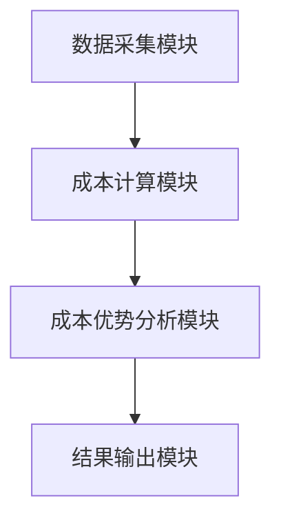

                 

# 彼得林奇如何分析公司的成本领导力

## 关键词：成本领导力、彼得林奇、投资分析、竞争优势、成本优势

## 摘要：  
彼得·林奇是全球著名的投资专家，他提出了成本领导力的概念，帮助企业通过优化成本结构、降低单位成本、提高成本优势来实现市场竞争优势。本文从成本领导力的核心概念出发，结合彼得林奇的投资分析方法，详细探讨如何通过成本领导力提升企业的竞争力。文章内容涵盖成本领导力的定义、分析框架、数学模型、系统架构设计以及实际案例分析，为读者提供全面的理论和实践指导。

---

## 第1章: 成本领导力的定义与背景

### 1.1 成本领导力的定义
#### 1.1.1 成本领导力的核心概念  
成本领导力是指企业在市场竞争中，通过优化成本结构、降低单位成本，从而在行业中获得成本优势的能力。它是企业实现长期竞争优势的重要手段之一。

#### 1.1.2 成本领导力的重要性  
在现代商业竞争中，成本领导力是企业盈利能力的关键因素。通过降低成本，企业可以提高产品价格竞争力，增加市场份额，同时增强抗风险能力。

#### 1.1.3 成本领导力的边界与外延  
成本领导力不仅关注企业内部的成本控制，还包括与供应商、客户以及竞争对手的成本关系。它的外延包括成本结构优化、成本优势的可持续性分析等。

### 1.2 成本领导力与竞争优势  
#### 1.2.1 成本优势的来源  
成本优势来源于企业的规模经济效应、供应链优化、技术创新和管理效率提升。这些因素共同作用，使企业能够以更低的成本提供高质量的产品或服务。

#### 1.2.2 成本领导力与企业盈利能力的关系  
成本领导力直接影响企业的利润率和投资回报率。通过降低单位成本，企业可以提高边际利润，从而增强盈利能力。

#### 1.2.3 成本领导力的可持续性分析  
成本领导力的可持续性取决于行业环境、竞争格局和企业自身的创新能力。企业需要通过持续优化成本结构来维持成本优势。

---

## 第2章: 成本领导力的核心要素与分析框架

### 2.1 成本结构分析
#### 2.1.1 成本结构的构成要素  
成本结构包括固定成本（如设备折旧）、变动成本（如原材料采购）和混合成本（如物流费用）。合理分配和优化这些成本是实现成本领导力的关键。

#### 2.1.2 成本结构的优化策略  
企业可以通过规模效应、技术创新和供应链管理来优化成本结构。例如，通过引入自动化技术降低生产成本，或者通过集中采购降低采购成本。

#### 2.1.3 成本结构对竞争力的影响  
成本结构的优化可以直接影响产品的市场价格和利润率。优化的成本结构使企业能够在价格战中占据优势。

### 2.2 成本优势的来源分析
#### 2.2.1 规模经济效应  
规模经济效应是指随着生产规模的扩大，单位产品的平均成本逐渐降低。这种效应是企业实现成本领导力的重要途径。

#### 2.2.2 供应链优化  
优化的供应链管理可以显著降低企业的采购成本和物流成本。例如，通过与供应商建立长期合作关系，企业可以获得价格优惠和优先供货权。

#### 2.2.3 技术创新与成本降低  
技术创新是降低成本的重要手段。例如，引入新的生产技术可以提高生产效率，从而降低单位产品的生产成本。

### 2.3 成本领导力的分析框架
#### 2.3.1 彼得林奇的成本分析模型  
彼得林奇提出的成本分析模型包括以下几个步骤：
1. 确定企业的成本结构。
2. 比较企业的单位成本与行业平均水平。
3. 分析成本优势的可持续性。
4. 评估成本优势对企业竞争力的影响。

#### 2.3.2 成本领导力的评估指标  
成本领导力的评估指标包括单位成本比（企业单位成本与行业平均单位成本的比值）、成本优势持续性、成本结构优化度等。

#### 2.3.3 成本领导力的动态变化分析  
成本领导力是一个动态变化的过程。企业需要通过持续优化成本结构来应对市场竞争的变化。

---

## 第3章: 彼得林奇的成本分析方法

### 3.1 彼得林奇投资理念概述
#### 3.1.1 彼得林奇的投资哲学  
彼得林奇认为，投资的核心是选择那些具有持续竞争优势的企业。他特别强调成本领导力在企业竞争优势中的重要性。

#### 3.1.2 成本领导力在彼得林奇投资策略中的地位  
在彼得林奇的投资策略中，成本领导力是评估企业竞争力的重要指标。他倾向于投资那些具有显著成本优势的企业。

### 3.2 彼得林奇的成本分析框架
#### 3.2.1 成本竞争力的评估维度  
彼得林奇的成本分析框架包括以下维度：
- 成本结构的合理性
- 成本优势的可持续性
- 成本优势对市场份额的影响

#### 3.2.2 成本优势的可持续性分析  
彼得林奇认为，成本优势的可持续性取决于企业的技术创新能力和管理效率。只有具备持续优化成本的能力，企业才能在竞争中保持优势。

#### 3.2.3 成本领导力的行业适用性  
彼得林奇的成本分析框架适用于所有行业。然而，不同行业的成本结构和竞争优势有所不同，需要根据具体情况调整分析方法。

---

## 第4章: 成本领导力的数学模型与算法原理

### 4.1 成本竞争力的量化模型
#### 4.1.1 成本竞争力的数学表达式  
成本竞争力可以通过以下公式量化：
$$ 成本竞争力 = \frac{企业单位成本}{行业平均单位成本} $$

#### 4.1.2 成本竞争力的计算步骤  
1. 收集企业的单位成本数据。
2. 收集行业平均单位成本数据。
3. 计算成本竞争力的比值。
4. 分析比值的含义，判断成本竞争力的强弱。

### 4.2 成本优势的动态分析模型
#### 4.2.1 成本变化的速率分析  
通过分析成本变化的速率，可以预测成本优势的可持续性。例如，如果企业的成本下降速度超过行业平均水平，说明企业具有较强的成本优势。

#### 4.2.2 成本优势的可持续性预测  
基于历史成本数据和行业趋势，可以预测未来成本优势的可持续性。例如，使用时间序列分析模型预测未来成本变化趋势。

#### 4.2.3 成本领导力的指数模型  
成本领导力的指数模型可以通过以下公式表示：
$$ 成本领导力指数 = \sum_{i=1}^{n} (权重_i \times 成本优势_i) $$

---

## 第5章: 成本领导力的系统分析与架构设计

### 5.1 系统分析框架
#### 5.1.1 成本领导力分析的系统构成  
成本领导力分析系统包括数据采集模块、成本计算模块、成本优势分析模块和结果输出模块。

#### 5.1.2 系统功能需求分析  
系统需要实现以下功能：
- 数据采集与存储
- 成本计算与分析
- 成本优势可视化
- 结果输出与报告生成

#### 5.1.3 系统边界与交互设计  
系统边界包括企业的财务数据、行业成本数据和市场数据。交互设计需要考虑用户界面的友好性和功能的易用性。

### 5.2 系统架构设计
#### 5.2.1 系统模块划分  
系统模块包括：
- 数据采集模块
- 成本计算模块
- 成本优势分析模块
- 结果输出模块

#### 5.2.2 系统架构的Mermaid图表示

---

## 第6章: 成本领导力的项目实战

### 6.1 项目背景与目标
#### 6.1.1 项目背景  
本文以某制造企业为例，分析其成本领导力。目标是通过优化成本结构，提升企业的市场竞争优势。

#### 6.1.2 项目目标  
- 优化企业的成本结构
- 提高企业的成本优势
- 提升企业的盈利能力

### 6.2 项目实施步骤
#### 6.2.1 数据采集与清洗  
收集企业的财务数据、行业成本数据和市场数据。清洗数据，确保数据的准确性和完整性。

#### 6.2.2 成本计算与分析  
使用成本竞争力公式计算企业的成本竞争力。通过比较企业单位成本与行业平均单位成本，判断成本竞争力的强弱。

#### 6.2.3 成本优势分析  
分析成本优势的可持续性。通过时间序列分析预测未来成本变化趋势，评估成本优势的持续性。

#### 6.2.4 结果输出与报告生成  
生成成本领导力分析报告，包括成本竞争力比值、成本优势分析和优化建议。

---

## 第7章: 总结与展望

### 7.1 成本领导力分析总结
彼得林奇的成本领导力分析方法为企业提供了重要的投资决策依据。通过优化成本结构，企业可以在竞争中占据优势。

### 7.2 成本领导力分析的展望
未来，成本领导力分析将更加依赖于大数据和人工智能技术。通过引入机器学习算法，可以更准确地预测成本变化趋势，优化成本结构。

### 7.3 最佳实践 tips
- 定期分析成本结构，优化成本优势。
- 关注行业趋势，预测成本变化。
- 引入技术创新，降低单位成本。

---

## 第8章: 小结

通过本文的分析，我们可以看到，成本领导力是企业实现市场竞争优势的重要手段。彼得林奇的成本分析方法为企业提供了系统的投资决策依据。未来，随着技术的进步，成本领导力分析将更加精准和高效。

---

## 参考文献

- 彼得·林奇.《彼得林奇投资哲学》
- 约翰·B·特雷纳.《成本管理》
- 克里斯·马特.《企业成本优化》

