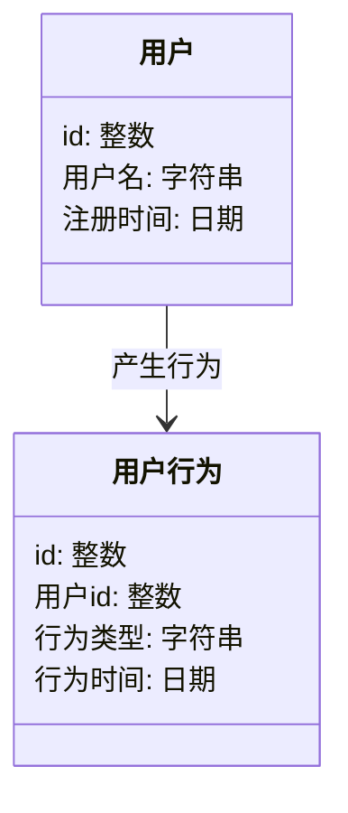
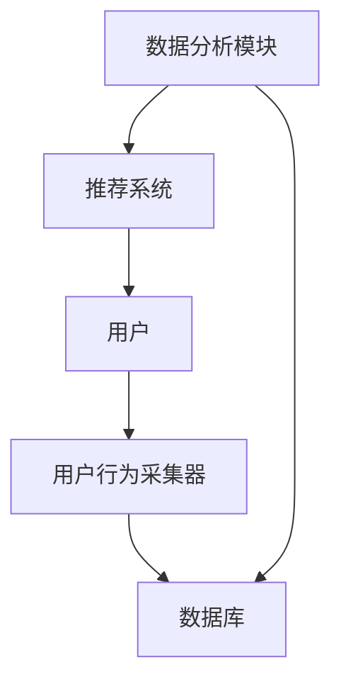

                 


# 彼得·林奇如何分析公司的用户增长策略

## 关键词：用户增长策略、彼得·林奇、用户增长、算法原理、系统架构、项目实战、用户留存

## 摘要：  
本文将深入分析彼得·林奇的用户增长策略，探讨其核心概念、算法原理、系统架构以及实际项目中的应用。通过对比用户增长与其他用户行为的联系，结合具体的算法实现和系统设计，帮助读者理解如何有效实施用户增长策略，提升用户留存和活跃度。

---

# 第一部分: 用户增长策略的背景与核心概念

## 第1章: 用户增长策略的背景与问题背景

### 1.1 什么是用户增长策略

#### 1.1.1 用户增长策略的定义  
用户增长策略是一种通过优化用户获取、激活、留存和增长的过程，以实现用户数量和质量双提升的策略。彼得·林奇的用户增长策略强调通过数据分析、用户行为分析和精准营销，实现用户规模的快速增长。

#### 1.1.2 用户增长策略的核心目标  
- 获取新用户  
- 提高用户活跃度  
- 增加用户留存率  
- 扩大用户生命周期价值  

#### 1.1.3 用户增长策略的边界与外延  
- 边界：专注于用户获取和留存，不涉及用户流失后的召回策略。  
- 外延：与用户生命周期管理、用户行为分析密切相关。

#### 1.1.4 彼得·林奇的用户增长策略  
彼得·林奇的策略强调通过数据分析和用户行为洞察，精准定位目标用户群体，制定个性化的营销策略，从而实现用户增长目标。

---

## 第2章: 用户增长策略的核心概念与联系

### 2.1 核心概念的定义与原理

#### 2.1.1 用户增长的定义  
用户增长是指通过各种手段，吸引新用户并促使现有用户保持活跃和留存的过程。

#### 2.1.2 用户增长的核心要素  
- 用户获取渠道  
- 用户行为分析  
- 用户分群与预测  
- 增长算法的实现  

#### 2.1.3 用户增长的驱动因素  
- 产品价值：用户是否认可产品的价值。  
- 营销策略：通过广告、优惠活动等吸引用户。  
- 用户体验：产品是否易用、是否能满足用户需求。  

### 2.2 核心概念的属性特征对比

#### 2.2.1 用户增长与用户留存的对比  
| 属性 | 用户增长 | 用户留存 |
|------|----------|----------|
| 定义 | 获取新用户 | 保持用户活跃 |
| 目标 | 扩大用户规模 | 提高用户生命周期价值 |
| 关键指标 | 注册率、转化率 | 活跃率、留存率 |

#### 2.2.2 用户增长与用户活跃度的对比  
| 属性 | 用户增长 | 用户活跃度 |
|------|----------|------------|
| 关注点 | 用户数量 | 用户行为频率 |
| 核心指标 | 新增用户数 | 日活跃用户数（DAU） |
| 实现手段 | 广告投放、内容营销 | 产品优化、个性化推荐 |

#### 2.2.3 用户增长与用户生命周期的对比  
用户生命周期包括获取、激活、留存、增长和流失五个阶段。用户增长策略主要关注获取和激活阶段，而用户生命周期管理则需要综合考虑所有阶段。

### 2.3 用户增长策略的ER实体关系图  
```mermaid
er
    entity 用户 {
        id: 整数
        用户名: 字符串
        注册时间: 日期
        上次登录时间: 日期
    }
    entity 用户行为 {
        id: 整数
        用户id: 整数
        行为类型: 字符串
        行为时间: 日期
    }
    entity 渠道 {
        id: 整数
        渠道名称: 字符串
        渠道类型: 字符串
    }
    用户 -> 用户行为: 用户行为记录
    用户 -> 渠道: 用户来源渠道
```

---

# 第二部分: 用户增长策略的算法原理与数学模型

## 第3章: 用户增长策略的算法原理

### 3.1 用户分群算法

#### 3.1.1 用户分群的定义  
用户分群是根据用户的行为特征、属性特征等将用户划分为不同的群体，以便制定个性化的增长策略。

#### 3.1.2 用户分群的算法流程  
1. 数据收集：收集用户的行为数据和属性数据。  
2. 数据预处理：清洗数据，处理缺失值和异常值。  
3. 特征提取：提取关键特征，如用户活跃度、购买频率等。  
4. 模型训练：使用聚类算法（如K-means）对用户进行分群。  
5. 群组分析：分析每个群组的特征，制定针对性的增长策略。

#### 3.1.3 用户分群的实现代码  
```python
from sklearn.cluster import KMeans
import pandas as pd

# 假设我们有一个用户行为数据表 behavior_df
# 包含特征：'login_freq', 'order_num', 'user_age'

# 数据预处理
behavior_df.dropna(inplace=True)

# 特征提取
features = behavior_df[['login_freq', 'order_num', 'user_age']]

# 模型训练
kmeans = KMeans(n_clusters=3, random_state=42)
kmeans.fit(features)

# 群组分析
behavior_df['cluster'] = kmeans.labels_
print(behavior_df.head())
```

#### 3.1.4 用户分群的数学模型  
用户分群的数学模型通常使用K-means算法，目标函数为：  
$$ \text{目标函数} = \sum_{i=1}^{k} \sum_{j=1}^{n_i} (x_j - c_i)^2 $$  
其中，\(k\) 是群组数，\(n_i\) 是第 \(i\) 个群组的样本数，\(x_j\) 是样本点，\(c_i\) 是第 \(i\) 个群组的中心点。

---

### 3.2 用户增长预测模型

#### 3.2.1 增长预测的定义  
通过历史数据和当前数据，预测未来用户增长的趋势和规模。

#### 3.2.2 增长预测的算法流程  
1. 数据收集：收集用户增长的历史数据。  
2. 数据预处理：清洗数据，处理缺失值和异常值。  
3. 特征提取：提取时间序列特征，如增长率、波动率等。  
4. 模型训练：使用时间序列模型（如ARIMA）进行预测。  
5. 结果分析：评估模型的准确性，调整参数。

#### 3.2.3 增长预测的实现代码  
```python
from statsmodels.tsa.arima_model import ARIMA
import pandas as pd

# 假设我们有一个用户增长数据表 growth_df
# 包含特征：'user_num', 'date'

# 数据预处理
growth_df = growth_df.set_index('date')

# 模型训练
model = ARIMA(growth_df['user_num'], order=(1, 1, 1))
model_fit = model.fit()

# 预测未来一周的用户数
future_forecast = model_fit.forecast(steps=7)
print(future_forecast)
```

#### 3.2.4 增长预测的数学模型  
ARIMA模型的数学公式为：  
$$ ARIMA(p, d, q) $$  
其中，\(p\) 是自回归阶数，\(d\) 是差分阶数，\(q\) 是移动平均阶数。

---

### 3.3 用户增长的推荐系统

#### 3.3.1 推荐系统的定义  
通过分析用户行为和偏好，推荐相关内容或产品，提高用户活跃度和留存率。

#### 3.3.2 推荐系统的算法流程  
1. 数据收集：收集用户行为数据。  
2. 特征提取：提取用户行为特征，如点击率、购买率等。  
3. 模型训练：使用协同过滤算法或深度学习算法推荐相关内容。  
4. 结果分析：评估推荐系统的准确性和召回率。

#### 3.3.3 推荐系统的实现代码  
```python
from sklearn.metrics.pairwise import cosine_similarity

# 假设我们有一个用户行为数据表 user_behavior
# 包含特征：'user_id', 'item_id', 'click_count'

# 计算用户-商品的相似性
cosine_sim = cosine_similarity(user_behavior[['user_id', 'item_id']], 
                               user_behavior[['user_id', 'item_id']])

# 推荐相似用户的商品
similar_users = user_behavior[user_behavior['user_id'] != target_user]
recommended_items = similar_users[click_count > 0]['item_id'].unique()
print(recommended_items)
```

#### 3.3.4 推荐系统的数学模型  
协同过滤算法的数学公式为：  
$$ \text{相似度} = \frac{\sum_{i=1}^{n} r_{ij} \cdot r_{ik}}{\sqrt{\sum_{i=1}^{n} r_{ij}^2} \cdot \sqrt{\sum_{i=1}^{n} r_{ik}^2}} $$  
其中，\(r_{ij}\) 和 \(r_{ik}\) 分别表示用户 \(j\) 和用户 \(k\) 对商品 \(i\) 的评分。

---

# 第三部分: 用户增长策略的系统架构与项目实战

## 第4章: 用户增长策略的系统分析与架构设计

### 4.1 问题场景介绍

#### 4.1.1 问题背景  
假设我们正在开发一个电子商务平台，希望通过用户增长策略提高新用户注册量和活跃用户数。

#### 4.1.2 问题描述  
- 当前用户增长速度缓慢，活跃用户比例低。  
- 用户留存率不足20%。  

#### 4.1.3 问题解决  
通过用户增长策略，优化用户获取和留存过程。

---

### 4.2 系统功能设计

#### 4.2.1 领域模型设计  


#### 4.2.2 系统架构设计  


---

### 4.3 系统接口设计

#### 4.3.1 用户接口  
- 注册接口：用户注册时记录用户信息。  
- 登录接口：用户登录时记录登录时间。  

#### 4.3.2 数据接口  
- 数据采集接口：采集用户行为数据。  
- 数据分析接口：分析用户行为数据，生成用户分群和推荐结果。  

---

## 第5章: 用户增长策略的项目实战

### 5.1 环境安装

#### 5.1.1 安装Python和相关库  
```bash
pip install numpy pandas scikit-learn statsmodels
```

### 5.2 系统核心实现

#### 5.2.1 用户分群实现  
```python
from sklearn.cluster import KMeans
import pandas as pd

# 读取用户行为数据
behavior_df = pd.read_csv('user_behavior.csv')

# 数据预处理
behavior_df.dropna(inplace=True)

# 特征提取
features = behavior_df[['login_freq', 'order_num', 'user_age']]

# 模型训练
kmeans = KMeans(n_clusters=3, random_state=42)
kmeans.fit(features)

# 添加群组标签
behavior_df['cluster'] = kmeans.labels_

# 保存结果
behavior_df.to_csv('user_cluster.csv', index=False)
```

#### 5.2.2 用户增长预测实现  
```python
from statsmodels.tsa.arima_model import ARIMA
import pandas as pd

# 读取用户增长数据
growth_df = pd.read_csv('user_growth.csv')

# 数据预处理
growth_df = growth_df.set_index('date')

# 模型训练
model = ARIMA(growth_df['user_num'], order=(1, 1, 1))
model_fit = model.fit()

# 预测未来一周的用户数
future_forecast = model_fit.forecast(steps=7)
print(future_forecast)
```

#### 5.2.3 推荐系统实现  
```python
from sklearn.metrics.pairwise import cosine_similarity

# 读取用户行为数据
user_behavior = pd.read_csv('user_behavior.csv')

# 计算用户-商品的相似性
cosine_sim = cosine_similarity(user_behavior[['user_id', 'item_id']], 
                               user_behavior[['user_id', 'item_id']])

# 推荐相似用户的商品
similar_users = user_behavior[user_behavior['user_id'] != target_user]
recommended_items = similar_users[click_count > 0]['item_id'].unique()
print(recommended_items)
```

---

## 第6章: 总结与展望

### 6.1 总结

#### 6.1.1 核心内容回顾  
- 用户增长策略的核心概念和实现方法。  
- 用户分群、增长预测和推荐系统的算法原理。  
- 系统架构设计和项目实战的具体实现。

#### 6.1.2 经验总结  
- 数据分析是用户增长策略的核心。  
- 个性化推荐能够显著提高用户活跃度和留存率。

---

### 6.2 未来展望

#### 6.2.1 技术发展  
- 更加智能的推荐算法（如深度学习）。  
- 多模态数据的整合与分析。  

#### 6.2.2 应用场景  
- 更多行业的用户增长策略应用。  
- 用户增长与用户生命周期管理的深度融合。

---

### 6.3 最佳实践 Tips

#### 6.3.1 数据驱动  
数据是用户增长策略的核心，必须重视数据的收集和分析。

#### 6.3.2 个性化推荐  
通过个性化推荐提高用户活跃度和留存率。

#### 6.3.3 持续优化  
根据用户反馈和数据变化，持续优化增长策略。

---

通过本文的详细分析，读者可以全面理解彼得·林奇的用户增长策略，并在实际项目中灵活运用这些策略，提升用户的获取和留存。

