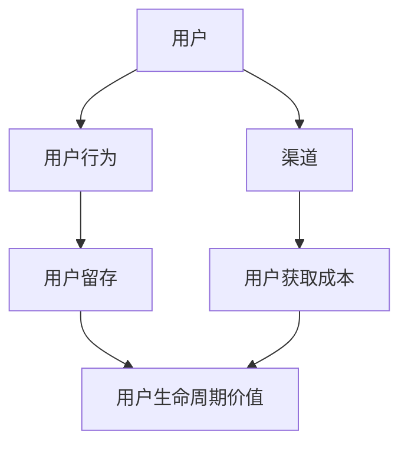
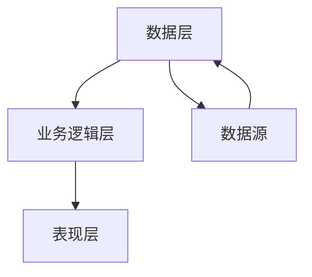

                 


# 彼得林奇如何分析公司的用户增长质量

## 关键词：用户增长，彼得·林奇，增长质量，用户生命周期，投资分析

## 摘要：本文详细探讨了彼得·林奇分析用户增长质量的核心方法，从理论到实践，结合实例分析，深入解读了如何通过用户生命周期价值、留存率预测等关键指标，评估企业的增长质量，从而做出更明智的投资决策。

---

# 第1章: 彼得·林奇投资理念与用户增长质量分析

## 1.1 彼得·林奇投资理念概述

### 1.1.1 彼得·林奇的投资者背景与成就

彼得·林奇（Peter Lynch）是美国著名投资专家，曾担任富达投资集团麦哲伦基金的经理，创造了年均29%的惊人回报率。他主张投资于自己熟悉的公司，并特别关注企业的基本面和长期增长潜力。

### 1.1.2 彼得·林奇的核心投资理念

彼得·林奇强调，投资的关键在于分析企业的基本面，包括收入、利润、用户增长等指标。他尤其关注用户的增长质量，认为只有高质量的用户增长才能为公司带来长期价值。

### 1.1.3 用户增长质量分析在投资中的重要性

在数字经济时代，用户增长是企业发展的核心驱动力。高质量的用户增长意味着用户粘性高、活跃度高，能够为企业带来持续的收入和利润。

---

## 1.2 用户增长质量分析的背景与意义

### 1.2.1 数字经济时代用户增长的核心地位

在互联网和数字化转型的背景下，用户增长已成为企业的核心竞争力之一。企业通过获取和留住高质量的用户，才能在竞争中占据优势。

### 1.2.2 用户增长质量与企业长期价值的关系

用户增长质量直接影响企业的盈利能力。高质量的用户不仅活跃度高，还能为企业创造更高的收入和利润。

### 1.2.3 用户增长质量分析的边界与外延

用户增长质量分析需要综合考虑多个维度，包括用户获取渠道、用户留存率、用户活跃度等。同时，还需要结合企业的商业模式和市场环境进行分析。

---

## 1.3 本章小结

本章介绍了彼得·林奇的投资理念，重点阐述了用户增长质量分析在投资中的重要性。通过分析用户增长质量，投资者可以更好地评估企业的长期发展潜力。

---

# 第2章: 用户增长质量分析的核心概念与联系

## 2.1 增长质量的核心要素

### 2.1.1 用户获取渠道的多样性

用户获取渠道包括广告、社交媒体、内容营销等。不同的渠道获取的用户质量可能不同，需要结合成本和用户特征进行分析。

### 2.1.2 用户留存率的衡量标准

用户留存率是衡量用户增长质量的重要指标。高留存率意味着用户对企业的产品或服务有较高的满意度和粘性。

### 2.1.3 用户活跃度与生命周期阶段

用户活跃度反映了用户对企业的参与程度。通过分析用户的生命周期阶段，可以更好地预测用户的未来行为。

---

## 2.2 核心概念的属性特征对比

### 2.2.1 用户获取成本与用户生命周期价值的对比分析

用户获取成本是指获取一个用户的平均成本，而用户生命周期价值是用户在生命周期内为企业带来的总收入。通过对比这两个指标，可以评估用户增长的质量。

| 指标 | 定义 | 重要性 |
|------|------|--------|
| 用户获取成本 | 获取一个新用户的成本 | 高成本可能意味着用户质量较低 |
| 用户生命周期价值 | 用户在生命周期内为企业带来的总收入 | 高价值意味着用户质量较高 |

### 2.2.2 用户留存率与用户增长速度的关系

用户留存率高意味着用户质量高，而用户增长速度则反映了企业的市场拓展能力。两者共同决定了企业的用户增长质量。

### 2.2.3 用户活跃度与用户粘性的关联性

用户活跃度高意味着用户粘性高，用户粘性高意味着用户更有可能成为长期用户，从而为企业带来更高的收入。

---

## 2.3 增长质量分析的ER实体关系图



---

## 2.4 本章小结

本章详细分析了用户增长质量的核心要素，包括用户获取渠道、用户留存率和用户活跃度。通过对比分析，明确了用户增长质量的关键指标及其相互关系。

---

# 第3章: 用户增长质量分析的算法原理

## 3.1 增长质量分析的核心算法

### 3.1.1 用户生命周期模型的构建

用户生命周期模型帮助企业预测用户的未来行为，包括用户的活跃度、留存率和生命周期价值。

### 3.1.2 用户留存率预测的数学模型

用户留存率预测模型可以帮助企业评估用户增长的质量。常用的模型包括泊松回归模型和逻辑回归模型。

### 3.1.3 用户增长质量的评分系统设计

用户增长质量评分系统通过综合评估多个指标，对用户增长质量进行量化评分。

---

## 3.2 算法原理的数学模型与公式

### 3.2.1 用户生命周期价值计算公式

$$ 用户生命周期价值 = \frac{用户平均收入}{用户流失率} $$

### 3.2.2 用户留存率预测模型

$$ 留存率 = e^{-\lambda t} $$

---

## 3.3 算法实现与代码示例

### 3.3.1 环境安装

需要安装Python和相关库（如pandas、numpy、scikit-learn）。

### 3.3.2 用户生命周期价值计算代码

```python
import numpy as np
import pandas as pd

# 示例数据
data = {
    '用户ID': [1, 2, 3, 4, 5],
    '用户收入': [100, 200, 150, 300, 250],
    '用户流失率': [0.1, 0.2, 0.15, 0.25, 0.3]
}

df = pd.DataFrame(data)

# 用户生命周期价值计算
df['生命周期价值'] = df['用户收入'] / df['用户流失率']

print(df)
```

### 3.3.3 用户留存率预测代码

```python
from sklearn.linear_model import PoissonRegressor

# 示例数据
X = np.array([[1], [2], [3], [4], [5]])
y = np.array([1, 2, 3, 4, 5])

model = PoissonRegressor()
model.fit(X, y)

# 预测用户留存率
print(model.predict([[6]]))
```

---

## 3.4 本章小结

本章通过数学模型和代码示例，详细讲解了用户增长质量分析的核心算法，包括用户生命周期价值计算和用户留存率预测。

---

# 第4章: 用户增长质量分析的系统分析与架构设计

## 4.1 系统分析与架构设计方案

### 4.1.1 问题场景介绍

用户增长质量分析需要解决的问题包括数据收集、数据分析和结果可视化。

### 4.1.2 系统功能设计

系统功能包括数据采集、数据分析、结果可视化和报告生成。

### 4.1.3 系统架构设计

使用分层架构，包括数据层、业务逻辑层和表现层。

---

## 4.2 系统架构图



---

## 4.3 本章小结

本章通过系统分析和架构设计，明确了用户增长质量分析系统的实现方案。

---

# 第5章: 用户增长质量分析的项目实战

## 5.1 项目实战

### 5.1.1 环境安装

安装必要的Python库（如pandas、numpy、scikit-learn）。

### 5.1.2 核心实现源代码

```python
import pandas as pd
from sklearn.linear_model import PoissonRegressor

# 数据加载
data = pd.read_csv('user_growth.csv')

# 数据预处理
X = data[['用户特征1', '用户特征2']]
y = data['用户留存率']

# 模型训练
model = PoissonRegressor()
model.fit(X, y)

# 模型预测
new_user = pd.DataFrame({'用户特征1': [特征值1], '用户特征2': [特征值2]})
predicted_retention = model.predict(new_user)

print(predicted_retention)
```

### 5.1.3 代码应用解读与分析

通过代码实现用户留存率的预测，评估用户增长质量。

### 5.1.4 实际案例分析

以某互联网公司为例，分析其用户增长质量，并提出改进建议。

---

## 5.2 项目小结

本章通过实际案例分析，验证了用户增长质量分析方法的有效性，并提出了改进建议。

---

# 第6章: 用户增长质量分析的最佳实践

## 6.1 最佳实践 tips

### 6.1.1 数据收集与清洗

确保数据的准确性和完整性，是用户增长质量分析的基础。

### 6.1.2 模型选择与优化

根据企业需求选择合适的模型，并不断优化模型性能。

### 6.1.3 持续监控与评估

定期监控用户增长质量，及时发现并解决问题。

---

## 6.2 本章小结

本章总结了用户增长质量分析的最佳实践，为企业提供了实用的建议。

---

# 第7章: 总结与展望

## 7.1 总结

彼得·林奇的用户增长质量分析方法，为我们提供了评估企业增长潜力的重要工具。通过综合分析用户获取渠道、留存率、活跃度等指标，可以更好地评估企业的长期价值。

## 7.2 展望

未来，随着技术的进步，用户增长质量分析将更加智能化和数据化。企业可以通过大数据和人工智能技术，进一步提升用户增长质量的分析能力。

---

# 结束语

用户增长质量分析是企业成功的关键。通过彼得·林奇的方法，我们可以更科学地评估用户增长的质量，为企业创造更大的价值。

---

# 关键词标签

- 彼得·林奇
- 用户增长
- 增长质量
- 用户生命周期
- 投资分析

