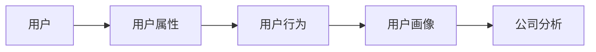
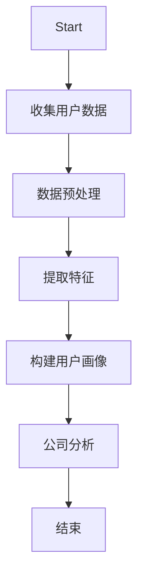
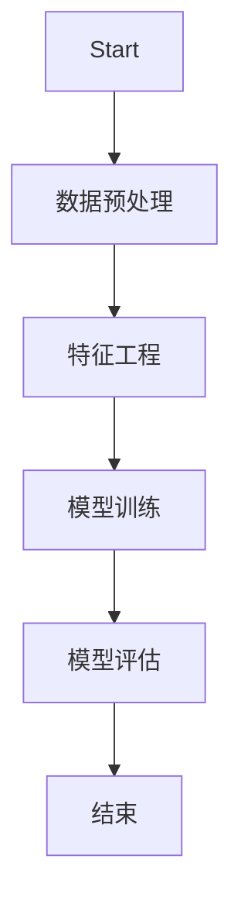

                 


# 彼得林奇如何分析公司的用户画像演变

> 关键词：彼得·林奇，用户画像，公司分析，数据分析，投资策略

> 摘要：本文深入探讨了投资大师彼得·林奇在分析公司时如何构建和演变用户画像，通过系统化的分析方法，结合实际案例，详细阐述了用户画像的核心要素、分析框架、算法原理以及系统架构，帮助读者全面理解彼得·林奇的投资策略和用户画像分析的实践应用。

---

## 第一部分：背景介绍

### 第1章：彼得·林奇与用户画像分析概述

#### 1.1 彼得·林奇的背景与投资理念

彼得·林奇是全球闻名的投资大师，曾任富达投资集团的基金经理，管理着世界上最大的共同基金——麦哲伦基金。他的投资哲学以基本面分析为核心，注重对公司内在价值的深入挖掘。林奇的成功不仅在于他对市场的深刻理解，更在于他对公司基本面的细致分析，尤其是对公司用户或客户群体的深入洞察。他认为，理解公司的用户画像能够帮助投资者更好地判断公司的市场定位、竞争优势和未来发展前景。

#### 1.2 用户画像的定义与演变

用户画像是对公司用户或客户的全面描述，包括用户的 demographics（人口统计特征）、psychographics（心理特征）、 behaviors（行为特征）和 preferences（偏好）等方面。用户画像是一个动态的概念，随着市场环境、公司战略和用户需求的变化而不断演变。从传统的静态画像到动态画像，再到基于大数据的实时画像，用户画像是公司分析中的重要工具。

#### 1.3 彼得·林奇视角下的用户画像分析

在彼得·林奇看来，用户画像是理解公司市场地位的关键。他通过分析用户的购买习惯、使用场景和反馈意见，深入挖掘用户需求，从而判断公司的产品是否能够满足市场的需求，以及公司在市场中的竞争优势。

---

### 第2章：用户画像分析的核心概念与联系

#### 2.1 核心概念原理

用户画像分析的核心在于将复杂的用户行为和需求转化为可量化的指标和特征。通过对这些特征的分析，投资者可以更好地理解用户的行为模式和偏好，从而为公司估值提供依据。例如，通过分析用户的购买频率、客单价和 churn rate（流失率），可以评估公司的客户忠诚度和盈利能力。

#### 2.2 核心概念对比分析

以下是用户画像分析与其他公司分析方法的对比：

| 方法 | 核心关注点 | 优点 | 缺点 |
|------|------------|------|------|
| 传统财务分析 | 财务指标（如收入、利润） | 数据来源可靠 | 忽略用户需求变化 |
| 用户画像分析 | 用户行为、偏好 | 深入理解市场需求 | 数据获取难度较高 |
| 竞争对手分析 | 市场份额、竞争策略 | 发现市场机会 | 需结合其他方法 |

#### 2.3 实体关系图与流程图

以下是用户画像分析的实体关系图和流程图：

**实体关系图：**


**流程图：**


---

### 第3章：用户画像分析的算法原理

#### 3.1 算法原理概述

用户画像分析通常涉及数据分析和机器学习算法。以下是常见的算法及其应用场景：

| 算法 | 应用场景 |
|------|----------|
| 线性回归 | 预测用户购买概率 |
| 决策树 | 分类用户群体 |
| 聚类分析 | 发现用户群体的细分市场 |

#### 3.2 算法流程图

以下是用户画像分析的算法流程图：



#### 3.3 数学模型与公式

以下是线性回归模型的公式：

$$ y = \beta_0 + \beta_1x_1 + \beta_2x_2 + \ldots + \beta_nx_n + \epsilon $$

其中：
- $y$ 是目标变量（如用户购买概率）
- $x_i$ 是自变量（如用户年龄、收入）
- $\beta_i$ 是回归系数
- $\epsilon$ 是误差项

---

### 第4章：用户画像分析的系统架构与设计

#### 4.1 系统分析

用户画像分析系统通常包括以下几个部分：

- **数据收集模块**：收集用户数据，如日志数据、问卷调查数据。
- **数据处理模块**：对数据进行清洗和预处理。
- **特征提取模块**：从数据中提取有意义的特征。
- **模型构建模块**：使用机器学习算法构建用户画像。
- **结果展示模块**：将分析结果以可视化的方式展示。

#### 4.2 系统架构图

以下是用户画像分析系统的架构图：


#### 4.3 系统接口设计

用户画像分析系统通常需要以下接口：

- 数据接口：用于连接数据源（如数据库、API）。
- 模型接口：用于调用机器学习模型。
- 展示接口：用于展示分析结果。

---

## 第五部分：项目实战

### 5.1 项目背景

假设我们是一家互联网公司，希望分析用户的购买行为，以优化市场策略。

### 5.2 环境安装

安装所需的工具和库：

```bash
pip install pandas numpy scikit-learn matplotlib
```

### 5.3 核心代码实现

以下是构建用户画像的Python代码：

```python
import pandas as pd
from sklearn.tree import DecisionTreeClassifier
from sklearn.metrics import accuracy_score

# 加载数据
data = pd.read_csv('user_data.csv')

# 数据预处理
data.dropna(inplace=True)

# 特征提取
X = data[['age', 'income', 'gender']]
y = data['purchase']

# 模型训练
model = DecisionTreeClassifier()
model.fit(X, y)

# 模型预测
predictions = model.predict(X)

# 模型评估
print(accuracy_score(y, predictions))
```

### 5.4 结果分析

通过上述代码，我们可以得到用户购买行为的准确率。这可以帮助我们更好地理解用户需求，优化市场策略。

---

## 第六部分：最佳实践

### 6.1 小结

用户画像是公司分析的重要工具，通过深入分析用户的行为和需求，可以帮助投资者更好地理解公司的市场定位和竞争优势。

### 6.2 注意事项

- 数据质量是用户画像分析的关键，确保数据的准确性和完整性。
- 在实际应用中，需要结合公司的实际情况选择合适的分析方法。
- 定期更新用户画像，以反映市场环境的变化。

### 6.3 拓展阅读

- 《彼得·林奇的成功投资》
- 《数据分析实战》

---

通过本文的详细分析，我们可以看到，彼得·林奇的用户画像分析方法不仅适用于投资领域，也可以广泛应用于其他行业的公司分析。希望本文能够为读者提供有价值的 insights，并帮助他们在实际工作中更好地应用用户画像分析。

