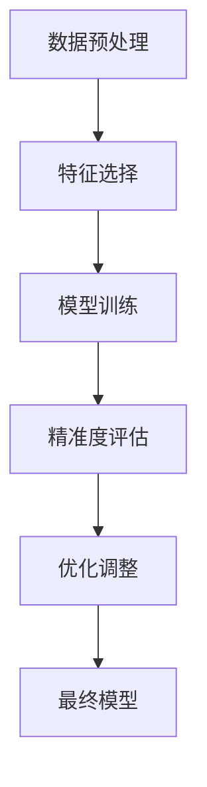
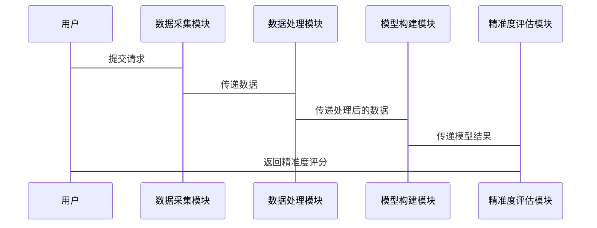

                 


```markdown
# 彼得林奇如何分析公司的用户画像精准度

## 关键词：用户画像，精准度，彼得·林奇，数据分析，投资策略，算法原理

## 摘要：本文将深入探讨彼得·林奇分析公司用户画像精准度的方法，从背景介绍到核心概念，再到算法原理和系统架构，最后结合实际案例进行分析。通过对用户画像构建、精准度衡量、算法优化等方面的研究，结合数学模型和系统设计，为读者提供一个全面而系统的分析框架，帮助读者更好地理解如何提升用户画像的精准度。

---

### 第1章: 用户画像精准度的背景与重要性

#### 1.1 用户画像的定义与作用
- 1.1.1 用户画像的定义
- 1.1.2 用户画像在企业中的作用
- 1.1.3 用户画像精准度的定义与意义

#### 1.2 彼得·林奇分析方法的背景
- 1.2.1 彼得·林奇投资策略的核心思想
- 1.2.2 用户画像在投资分析中的应用
- 1.2.3 精准度分析的必要性与挑战

#### 1.3 本章小结

---

### 第2章: 用户画像精准度的核心概念

#### 2.1 用户画像的构建过程
- 2.1.1 数据采集与预处理
- 2.1.2 特征提取与选择
- 2.1.3 画像构建的算法原理

#### 2.2 精准度的衡量标准
- 2.2.1 精准度的定义与计算方法
- 2.2.2 精准度与召回率的对比
- 2.2.3 精准度与用户价值的关系

#### 2.3 用户画像与精准度的关系
- 2.3.1 用户画像的维度对精准度的影响
- 2.3.2 精准度提升对用户画像的要求
- 2.3.3 画像精准度的优化方向

#### 2.4 核心概念对比表
- 2.4.1 用户画像与用户行为分析的对比
- 2.4.2 精准度与用户分群的对比
- 2.4.3 用户画像与市场细分的对比

#### 2.5 ER实体关系图
```mermaid
erDiagram
    用户画像 : {id, 属性, 精准度评分}
    用户行为 : {id, 行为记录, 时间戳}
    特征数据 : {id, 特征值, 数据来源}
    用户画像 <---N--> 特征数据
    用户画像 <---N--> 用户行为
```

#### 2.6 本章小结

---

### 第3章: 用户画像精准度的算法原理

#### 3.1 数据预处理算法
- 3.1.1 数据清洗与去重
- 3.1.2 数据标准化与归一化
- 3.1.3 数据增强与特征扩展

#### 3.2 特征选择算法
- 3.2.1 基于统计的特征选择
- 3.2.2 基于模型的特征选择
- 3.2.3 基于树模型的特征重要性分析

#### 3.3 画像构建的机器学习算法
- 3.3.1 逻辑回归模型
- 3.3.2 支持向量机（SVM）
- 3.3.3 随机森林与梯度提升（如XGBoost、LightGBM）

#### 3.4 精准度提升的算法优化
- 3.4.1 参数调优与模型优化
- 3.4.2 堆叠模型与集成学习
- 3.4.3 深度学习模型的应用

#### 3.5 算法流程图


#### 3.6 数学公式
- 精准度计算公式：
  $$\text{精准度} = \frac{\text{正确预测数}}{\text{总预测数}}$$
- 召回率计算公式：
  $$\text{召回率} = \frac{\text{正确预测数}}{\text{实际正例数}}$$
- F1分数计算公式：
  $$\text{F1} = 2 \times \frac{\text{精准度} \times \text{召回率}}{\text{精准度} + \text{召回率}}$$

#### 3.7 本章小结

---

### 第4章: 用户画像精准度的系统架构与设计

#### 4.1 问题场景介绍
- 4.1.1 用户画像系统的需求分析
- 4.1.2 精准度分析的系统目标
- 4.1.3 系统边界与外延

#### 4.2 系统功能设计
- 4.2.1 数据采集模块
- 4.2.2 数据处理模块
- 4.2.3 模型构建模块
- 4.2.4 精准度评估模块

#### 4.3 系统架构设计


#### 4.4 系统接口设计
- 4.4.1 数据接口
- 4.4.2 模型接口
- 4.4.3 输出接口

#### 4.5 系统交互流程图


#### 4.6 本章小结

---

### 第5章: 用户画像精准度的项目实战

#### 5.1 环境安装与配置
- 5.1.1 Python环境安装
- 5.1.2 相关库的安装（如pandas、numpy、scikit-learn等）

#### 5.2 核心代码实现
- 数据预处理代码：
```python
import pandas as pd
from sklearn.preprocessing import StandardScaler

# 加载数据
data = pd.read_csv('user_data.csv')

# 数据清洗
data.dropna(inplace=True)

# 标准化处理
scaler = StandardScaler()
data_scaled = scaler.fit_transform(data)
```

- 特征选择代码：
```python
from sklearn.feature_selection import SelectKBest, chi2

selector = SelectKBest(score_func=chi2, k=10)
selected_features = selector.fit_transform(data_scaled, target)
```

- 模型训练代码：
```python
from sklearn.ensemble import RandomForestClassifier

model = RandomForestClassifier(n_estimators=100)
model.fit(selected_features, target)
```

- 精准度评估代码：
```python
from sklearn.metrics import accuracy_score

y_pred = model.predict(selected_features)
print("精准度:", accuracy_score(target, y_pred))
```

#### 5.3 项目小结
- 5.3.1 项目实现的关键点
- 5.3.2 项目中的问题与解决方法
- 5.3.3 项目的优化方向

---

### 第6章: 用户画像精准度分析的最佳实践

#### 6.1 算法选择与优化
- 6.1.1 数据质量对模型的影响
- 6.1.2 模型调优的技巧
- 6.1.3 交叉验证的应用

#### 6.2 系统设计与实现
- 6.2.1 系统模块的划分
- 6.2.2 系统性能的优化
- 6.2.3 系统可扩展性的设计

#### 6.3 项目管理与维护
- 6.3.1 项目周期的管理
- 6.3.2 系统维护的注意事项
- 6.3.3 数据安全与隐私保护

#### 6.4 小结
- 6.4.1 本章总结
- 6.4.2 注意事项
- 6.4.3 拓展阅读

---

### 附录
- 附录A: 关键术语解释
- 附录B: 相关代码库与工具
- 附录C: 参考文献与拓展阅读

---

### 索引
（根据实际内容生成）

---

### 致谢
（根据实际内容生成）

---

### 作者简介
（根据实际内容生成）
```

