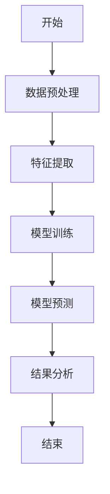
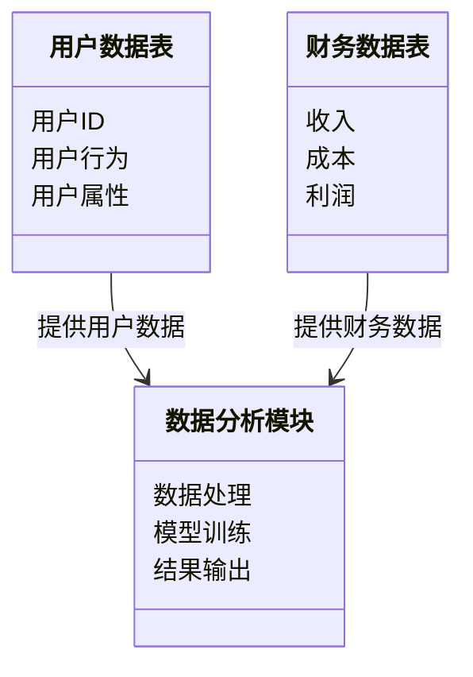

                 


# 彼得林奇如何分析公司的用户留存率与盈利能力关系

## 关键词：用户留存率，盈利能力，彼得·林奇，数据分析，企业价值

## 摘要：用户留存率和盈利能力是衡量企业价值的两个关键指标。本文将通过彼得·林奇的视角，分析用户留存率与盈利能力之间的关系，探讨如何通过用户留存率预测和优化企业盈利能力。文章结合理论与实践，详细阐述了数据分析方法、算法原理、系统架构设计以及实际案例分析，为企业管理者和投资者提供深刻的见解和实用的工具。

---

## 第1章 背景介绍

### 1.1 问题背景

#### 1.1.1 用户留存率的定义与重要性
用户留存率是指在一定时间内，用户持续使用产品或服务的比例。它是衡量产品用户粘性和市场生命力的重要指标。高留存率意味着用户对产品的需求和满意度较高，企业能够通过持续的用户价值实现长期发展。

#### 1.1.2 盈利能力的定义与核心要素
盈利能力是指企业在一定时期内赚取利润的能力。它是衡量企业经营效率和市场竞争力的核心指标。盈利能力包括净利润率、毛利率等，反映了企业将收入转化为利润的能力。

#### 1.1.3 彼得·林奇对用户留存率与盈利能力关系的关注
彼得·林奇是全球著名投资专家，他强调企业的长期价值取决于用户的持续留存和盈利能力。他认为，用户留存率是企业盈利能力的重要驱动力，而盈利能力是企业价值的核心体现。

### 1.2 问题描述

#### 1.2.1 用户留存率对企业长期发展的意义
用户留存率高意味着企业能够持续获取稳定的收入来源，降低客户获取成本，并通过用户粘性提高市场竞争力。

#### 1.2.2 盈利能力与企业价值的关系
盈利能力直接反映了企业的经营效率和市场地位。高盈利能力意味着企业能够通过高效运营实现更高的股东价值。

#### 1.2.3 两者关系的复杂性与挑战
用户留存率与盈利能力之间的关系并非线性，受多种因素影响，如市场需求、产品创新、竞争环境等。如何准确量化两者的关联，并通过优化用户留存率来提升盈利能力，是企业面临的挑战。

### 1.3 问题解决

#### 1.3.1 如何通过用户留存率预测盈利能力
通过分析用户留存率的变化趋势，可以预测企业的收入稳定性，从而评估盈利能力的变化。例如，留存率下降可能预示着收入减少，进而影响盈利能力。

#### 1.3.2 如何通过提升用户留存率优化盈利能力
通过优化用户体验、提供个性化服务和持续创新，可以提升用户留存率。留存率的提升将带来收入的稳定增长，从而优化企业的盈利能力。

#### 1.3.3 两者关系的量化分析方法
通过建立数学模型，可以量化用户留存率对盈利能力的影响。例如，使用回归分析方法，将用户留存率作为自变量，盈利能力作为因变量，进行关系建模。

### 1.4 边界与外延

#### 1.4.1 用户留存率与盈利能力的适用范围
适用于所有依赖用户持续使用的产品或服务的企业，尤其是互联网、软件和电子商务行业。

#### 1.4.2 相关概念的对比与区分
用户留存率与用户增长率不同，前者关注用户持续使用，后者关注用户数量增长。盈利能力与收入增长也不同，前者关注利润，后者关注收入。

#### 1.4.3 关系模型的边界条件
用户留存率与盈利能力的关系模型需要考虑市场环境、企业规模、行业特点等因素，不同企业可能有不同的关系模型。

### 1.5 概念结构与核心要素组成

#### 1.5.1 用户留存率的核心要素
- 用户基数
- 用户行为
- 用户满意度

#### 1.5.2 盈利能力的核心要素
- 收入
- 成本
- 利润

#### 1.5.3 两者关系的核心要素
- 用户价值
- 市场定位
- 经营效率

### 1.6 本章小结

---

## 第2章 核心概念与联系

### 2.1 核心概念原理

#### 2.1.1 用户留存率的计算方法
用户留存率 = （总用户数 - 新增用户数） / 总用户数

#### 2.1.2 盈利能力的计算方法
净利润率 = 净利润 / 收入

#### 2.1.3 两者关系的理论基础
用户留存率与盈利能力呈正相关关系，高留存率通常意味着高盈利能力。

### 2.2 概念属性特征对比表格

| 概念 | 定义 | 计算公式 | 影响因素 | 战略意义 |
|------|------|----------|----------|----------|
| 用户留存率 | 用户在一定时间内持续使用产品或服务的比例 | 留存率 = (总用户数 - 新增用户数) / 总用户数 | 产品价值、用户体验、客户支持 | 企业长期发展的重要指标 |
| 盈利能力 | 企业在一定时期内赚取利润的能力 | 净利润率 = 净利润 / 收入 | 收入、成本、税费 | 企业价值的核心决定因素 |

### 2.3 ER实体关系图架构

```mermaid
er
  title 用户留存率与盈利能力关系模型
  User table
    id
    用户行为
    用户属性
  Profit table
    id
    收入
    成本
    利润
  持股关系
    股东
    股权比例
  关系线
    User --> Profit: 通过用户行为影响收入和成本
    Profit --> User: 通过利润反馈影响用户留存率
```

### 2.4 本章小结

---

## 第3章 算法原理讲解

### 3.1 算法原理

#### 3.1.1 用户留存率预测模型
使用机器学习方法，如逻辑回归或随机森林，基于用户特征预测用户留存率。

#### 3.1.2 盈利能力预测模型
通过时间序列分析或回归模型，预测企业的盈利能力。

#### 3.1.3 两者关系的综合预测模型
建立联合模型，将用户留存率作为输入变量，预测企业的盈利能力。

### 3.2 算法流程图



### 3.3 Python源代码实现

```python
import pandas as pd
from sklearn.linear_model import LogisticRegression

# 数据加载与预处理
data = pd.read_csv('user_profit.csv')
data = data.dropna()

# 特征提取
features = data[['user_age', 'user_gender', 'user_behavior']]
target = data['user_retention']

# 模型训练
model = LogisticRegression()
model.fit(features, target)

# 模型预测
predicted_retention = model.predict(features)
```

### 3.4 数学公式与详细解释

#### 3.4.1 用户留存率预测的数学模型
$$ P(\text{留存}) = \beta_0 + \beta_1 \times \text{用户属性} + \epsilon $$

#### 3.4.2 盈利能力预测的数学模型
$$ \text{净利润率} = \alpha_0 + \alpha_1 \times \text{收入} + \alpha_2 \times \text{成本} + \epsilon $$

### 3.5 本章小结

---

## 第4章 系统分析与架构设计方案

### 4.1 问题场景介绍
设计一个数据分析系统，用于实时监测和分析用户留存率与盈利能力的关系。

### 4.2 系统功能设计



### 4.3 系统架构设计


### 4.4 系统接口设计
- 数据接口：提供REST API，供外部系统调用数据。
- 分析接口：提供API用于模型训练和预测。

### 4.5 系统交互设计

```mermaid
sequenceDiagram
    用户发起请求
    -> 数据采集层: 获取用户数据
    数据采集层 --> 数据处理层: 数据预处理
    数据处理层 --> 数据分析层: 模型训练
    数据分析层 --> 用户: 返回结果
```

### 4.6 本章小结

---

## 第5章 项目实战

### 5.1 环境安装
安装Python、Pandas、Scikit-learn等工具。

### 5.2 系统核心实现源代码

```python
import pandas as pd
from sklearn.linear_model import LogisticRegression

# 数据加载与预处理
data = pd.read_csv('user_profit.csv')
data = data.dropna()

# 特征提取
features = data[['user_age', 'user_gender', 'user_behavior']]
target = data['user_retention']

# 模型训练
model = LogisticRegression()
model.fit(features, target)

# 模型预测
predicted_retention = model.predict(features)
```

### 5.3 代码应用解读与分析
- 数据加载：从CSV文件中读取用户和财务数据。
- 特征提取：选择用户年龄、性别和行为作为预测留存率的特征。
- 模型训练：使用逻辑回归模型进行训练。
- 模型预测：预测用户留存率，并输出结果。

### 5.4 实际案例分析
以某互联网公司为例，分析用户留存率与盈利能力的关系，展示如何通过数据驱动优化企业经营。

### 5.5 本章小结

---

## 第6章 最佳实践与总结

### 6.1 小结
用户留存率和盈利能力是企业价值的核心指标。通过数据分析和模型预测，可以量化两者的关系，并优化企业经营策略。

### 6.2 注意事项
- 数据质量影响模型准确性。
- 模型需定期更新，以适应市场变化。
- 结合企业实际情况，选择合适的分析方法。

### 6.3 拓展阅读
建议阅读彼得·林奇的书籍，深入理解投资与企业管理的更多细节。

### 6.4 本章小结

---

## 第7章 结语

用户留存率与盈利能力的关系是企业经营中的核心问题。通过数据分析和模型预测，企业可以更好地理解和优化这两个关键指标。未来，随着数据科学和人工智能技术的发展，企业将能够更精准地预测和优化用户留存率与盈利能力的关系，实现持续增长和价值创造。

--- 

# END

