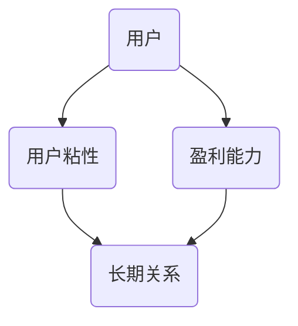
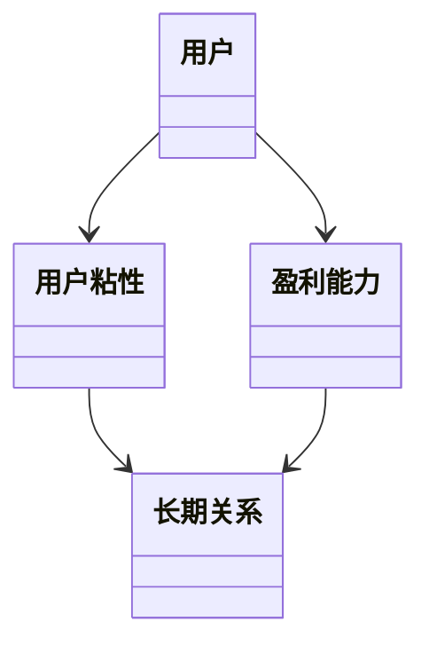
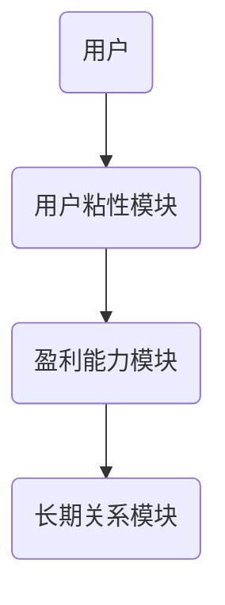
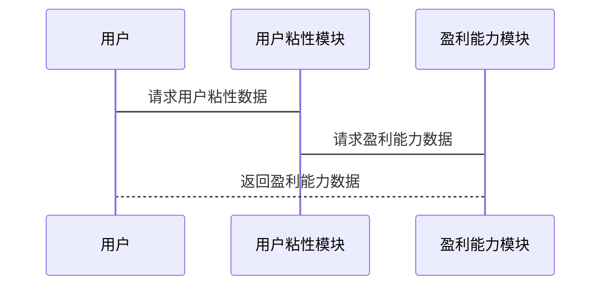

                 


# 彼得林奇如何分析公司的用户粘性与盈利能力的长期关系

---

## 关键词：
- 彼得林奇分析方法
- 用户粘性
- 盈利能力
- 长期关系
- 投资策略
- 企业分析

---

## 摘要：
本文详细探讨彼得·林奇分析方法中用户粘性与盈利能力之间的长期关系。通过系统分析用户粘性对企业盈利能力的影响，结合数学模型、算法原理和实际案例，帮助读者理解如何通过用户粘性提升企业长期盈利能力。文章内容涵盖背景介绍、核心概念、分析方法、系统架构设计和项目实战，旨在为投资者和企业管理者提供科学的决策依据。

---

# 目录大纲

## 第一章: 背景介绍

### 1.1 问题背景
- 用户粘性与盈利能力的定义
- 彼得林奇分析方法的提出
- 长期关系的重要性

### 1.2 问题描述
- 用户粘性与盈利能力的关系
- 彼得林奇分析方法的目标
- 需要解决的核心问题

### 1.3 问题解决
- 分析方法的步骤
- 关键因素的识别
- 长期关系的构建

### 1.4 边界与外延
- 分析的适用范围
- 方法的局限性
- 相关概念的对比

### 1.5 概念结构与核心要素
- 核心概念的组成
- 要素之间的关系
- 模型的框架

### 1.6 本章小结
- 主要内容回顾
- 下文的引导

---

## 第二章: 核心概念与联系

### 2.1 核心概念原理
- 用户粘性的原理
- 盈利能力的原理
- 长期关系的原理

### 2.2 概念属性特征对比
- 用户粘性与盈利能力的属性对比（表格形式）
- 长期关系的特征分析
- 彼得林奇方法的核心要素

### 2.3 ER实体关系图


---

## 第三章: 用户粘性与盈利能力的关系

### 3.1 影响因素分析
- 用户粘性的关键指标
- 盈利能力的驱动因素
- 两者之间的互动关系

### 3.2 数学模型与公式
- 用户粘性指数的计算公式：
  $$ 用户粘性指数 = \frac{用户留存率}{用户获取成本} $$
- 盈利能力的评估模型：
  $$ 盈利能力 = 收入 - 成本 $$

### 3.3 实际案例分析
- 某互联网公司的用户粘性与盈利能力的分析
- 案例中的关键指标计算与对比

### 3.4 本章小结
- 关键因素总结
- 模型的应用价值

---

## 第四章: 彼得林奇的分析方法

### 4.1 分析指标体系
- 用户粘性指标
- 盈利能力指标
- 综合评估指标

### 4.2 投资策略模型
- 投资策略的选择依据
- 模型的构建与应用
- 案例分析

### 4.3 本章小结
- 方法的总结
- 下文的引导

---

## 第五章: 系统分析与架构设计

### 5.1 问题场景介绍
- 系统目标
- 分析框架的构建
- 核心功能模块

### 5.2 项目介绍
- 项目背景
- 项目目标
- 项目范围

### 5.3 系统功能设计
- 领域模型设计（mermaid类图）


### 5.4 系统架构设计
- 系统架构图（mermaid架构图）


### 5.5 系统接口设计
- 接口定义
- 接口交互流程

### 5.6 系统交互设计
- 用户与系统的交互流程（mermaid序列图）


### 5.7 本章小结
- 系统设计总结
- 下文的引导

---

## 第六章: 项目实战

### 6.1 环境安装与配置
- 开发环境搭建
- 工具安装
- 数据准备

### 6.2 核心实现源代码
```python
# 示例代码：用户粘性与盈利能力的分析
def calculate_user_sticky(users):
    return users['留存率'].mean() / users['获取成本'].mean()

def calculate_profitability(revenue, cost):
    return revenue - cost

# 示例数据
users = {
    '留存率': [0.8, 0.75, 0.9],
    '获取成本': [50, 60, 40]
}
revenue = 1000
cost = 200

sticky_score = calculate_user_sticky(users)
profitability = calculate_profitability(revenue, cost)
print(f"用户粘性得分: {sticky_score}")
print(f"盈利能力: {profitability}")
```

### 6.3 代码应用解读
- 代码实现的功能
- 代码逻辑的详细解读
- 应用场景分析

### 6.4 实际案例分析
- 案例背景
- 数据分析与计算
- 结果解读

### 6.5 本章小结
- 项目成果总结
- 经验教训

---

## 第七章: 总结与展望

### 7.1 最佳实践
- 关键点总结
- 实际应用中的注意事项

### 7.2 本章小结
- 核心内容回顾
- 下文的引导

### 7.3 注意事项
- 分析方法的局限性
- 数据质量的重要性
- 实际应用中的潜在问题

### 7.4 拓展阅读
- 相关书籍推荐
- 其他相关资源

### 7.5 未来研究方向
- 新方法的探索
- 技术的进一步发展

---

## 参考文献
（此处列出相关书籍、论文和技术文档）

---

## 致谢
（感谢参与本书编写和审阅的人员）

---

以上目录大纲涵盖了从理论到实践的各个方面，确保内容逻辑清晰、结构紧凑、内容丰富。每一章和每一节都紧密围绕主题，帮助读者全面理解彼得林奇分析方法的核心思想及其在实际中的应用。

