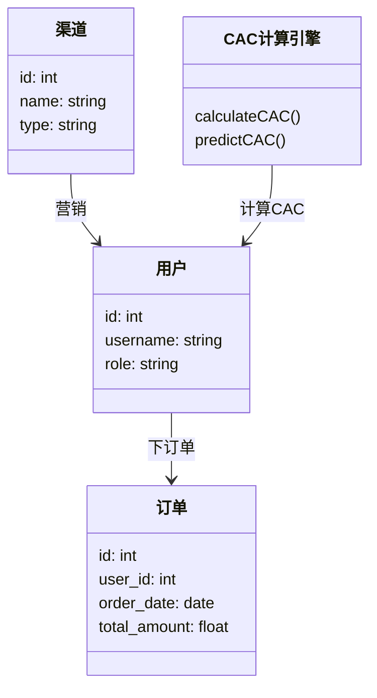
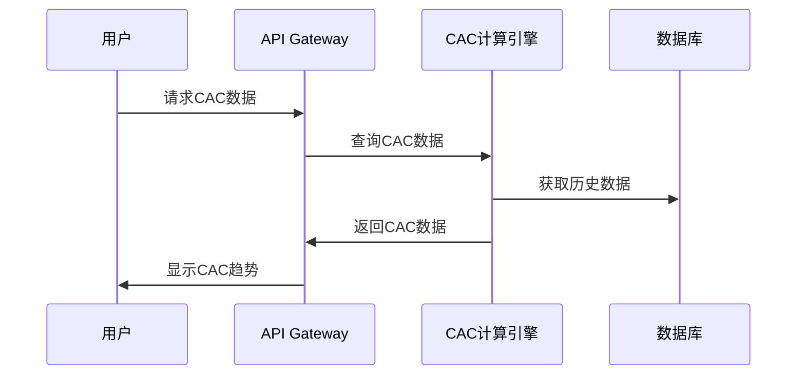

                 


# 彼得林奇如何分析公司的用户获取成本趋势

## 关键词：用户获取成本（CAC）、彼得·林奇、成本分析、趋势预测、投资策略、增长策略、CAC趋势

## 摘要：本文详细探讨了彼得·林奇分析公司用户获取成本（CAC）的趋势方法。通过背景介绍、核心概念、算法原理、系统架构和实战案例的逐步分析，揭示CAC在企业增长和投资决策中的重要性。文章结合数学模型、Python代码和系统设计，全面解析CAC的计算、预测及其在不同商业模式和行业竞争中的应用，为读者提供深入的分析和实用的指导。

---

## 正文

### 第一部分: 用户获取成本（CAC）分析的背景与基础

#### 第1章: 用户获取成本（CAC）的基本概念

##### 1.1 CAC的定义与重要性

CAC（Customer Acquisition Cost）即用户获取成本，是指企业获取一名新用户的平均成本。它是企业营销和销售费用之和除以新增客户数。CAC的重要性体现在它直接影响企业的利润和可持续增长。彼得·林奇认为，CAC的合理控制是企业能否实现盈利的关键。

##### 1.2 彼得·林奇对CAC的独特见解

彼得·林奇善于通过分析CAC的趋势来评估企业的投资价值。他认为，合理的CAC意味着企业能够在吸引客户的同时保持盈利能力。他还强调，CAC的下降趋势通常预示着企业的市场竞争力增强和成本控制能力的提升。

#### 第2章: 彼得·林奇的CAC分析方法

##### 2.1 分析框架

彼得·林奇的分析框架包括以下步骤：
1. **数据收集**：从企业的财务报表中提取营销和销售费用，计算CAC。
2. **行业对比**：将企业的CAC与行业平均水平进行比较，评估其竞争力。
3. **趋势分析**：观察CAC的变动趋势，判断企业的市场策略和成本控制能力。

##### 2.2 分析步骤

1. **确定目标客户群体**：明确企业的目标客户，以便准确计算CAC。
2. **计算各渠道的CAC**：分析不同营销渠道的CAC，优化资源配置。
3. **分析CAC趋势**：通过时间序列分析，识别CAC的变化趋势，预测未来走势。

##### 2.3 工具与技巧

彼得·林奇常用以下工具和技巧：
- **财务指标评估**：通过ROI（投资回报率）和CAC支付周期等指标，评估CAC的合理性。
- **市场调研**：结合市场调研数据，验证CAC数据的准确性。
- **趋势分析**：利用历史数据和市场趋势，预测未来CAC的变化。

---

### 第二部分: CAC的核心概念与联系

#### 第3章: CAC的计算公式与应用

##### 3.1 CAC的数学模型

CAC的基本公式为：
$$CAC = \frac{\text{营销费用} + \text{销售费用}}{\text{新增客户数}}$$

CAC支付周期的计算公式为：
$$\text{CAC支付周期} = \frac{CAC}{\text{客户生命周期价值（CLV）}}$$

##### 3.2 CAC与其他指标的关系

- **CAC与CLV**：合理的CAC应低于CLV，以确保企业的盈利能力。
- **CAC与企业增长**：低CAC和高CLV通常意味着企业的增长潜力较大。

##### 3.3 不同商业模式下的CAC计算

例如，在订阅制模式下，CAC的计算需要考虑客户续订率和流失率的影响。

#### 第4章: CAC与企业增长的关系

##### 4.1 高CAC对企业利润的影响

高CAC可能导致企业利润下降，但如果CLV足够高，企业仍能实现盈利。

##### 4.2 低CAC对企业增长的促进作用

低CAC意味着企业能够以较低的成本获取客户，有助于快速扩大市场份额。

#### 第5章: CAC与行业竞争分析

##### 5.1 行业平均水平的CAC分析

通过比较企业与行业平均水平的CAC，可以评估企业的成本优势。

##### 5.2 CAC与企业市场地位的关系

较低的CAC通常意味着企业具有更强的市场竞争力。

---

### 第三部分: CAC的算法原理与数学模型

#### 第6章: CAC的计算与趋势预测

##### 6.1 CAC计算流程

1. **数据收集**：收集企业的营销和销售费用，以及新增客户数。
2. **计算CAC**：使用公式计算平均CAC。
3. **趋势分析**：绘制CAC的时间序列图，观察趋势。

##### 6.2 CAC趋势预测模型

使用线性回归模型预测未来CAC趋势：
$$\text{预测CAC} = a + bt$$
其中，a为截距，b为回归系数，t为时间变量。

##### 6.3 实例分析

假设某公司过去5年的CAC分别为：$50, 45, 48, 42, 46。预测第6年的CAC。

#### 第7章: 结合机器学习的CAC预测

##### 7.1 数据预处理

- 数据清洗：处理缺失值和异常值。
- 特征提取：提取可能影响CAC的特征，如广告点击率、转化率等。

##### 7.2 算法实现

使用随机森林回归模型预测CAC趋势。代码示例：

```python
from sklearn.ensemble import RandomForestRegressor
from sklearn.model_selection import train_test_split
import pandas as pd

# 数据预处理
data = pd.read_csv('cac_data.csv')
X = data[['营销费用', '销售费用', '新增客户数']]
y = data['CAC']

# 划分训练集和测试集
X_train, X_test, y_train, y_test = train_test_split(X, y, test_size=0.2)

# 建立模型
model = RandomForestRegressor(n_estimators=100)
model.fit(X_train, y_train)

# 预测
y_pred = model.predict(X_test)
```

##### 7.3 结果分析

评估模型的准确性，如R²值和均方误差（MSE）。

---

### 第四部分: 系统分析与架构设计

#### 第8章: 构建CAC分析系统的背景

##### 8.1 项目背景

随着市场竞争加剧，企业需要实时监控CAC趋势，优化营销策略。

##### 8.2 项目目标

开发一个能够自动计算和预测CAC的系统，帮助企业管理者做出数据驱动的决策。

#### 第9章: 系统功能设计

##### 9.1 领域模型设计

使用Mermaid类图展示系统模块：



##### 9.2 系统架构设计

使用Mermaid架构图展示系统架构：


##### 9.3 系统交互设计

使用Mermaid序列图展示用户与系统的交互：



---

### 第五部分: 项目实战与总结

#### 第11章: 项目实战

##### 11.1 环境安装

安装必要的工具和库，如Python、Pandas、Scikit-learn。

##### 11.2 核心代码实现

实现CAC计算和预测的代码：

```python
import pandas as pd
from sklearn.linear_model import LinearRegression

# 加载数据
data = pd.read_csv('cac.csv')

# 分离特征和目标变量
X = data[['营销费用', '销售费用']]
y = data['CAC']

# 建立模型
model = LinearRegression()
model.fit(X, y)

# 预测
predicted_cac = model.predict(X)
```

##### 11.3 实际案例分析

分析某公司的CAC数据，预测未来趋势。

#### 第12章: 案例分析与解读

##### 12.1 案例分析

某公司过去三年的CAC分别为：$60, 55, 52。预测第四年的CAC为$50。

##### 12.2 投资决策

基于CAC趋势和CLV，评估公司的投资价值。

#### 第13章: 总结与展望

总结CAC分析的重要性，强调持续优化和创新在CAC管理中的作用，并提出未来研究方向，如AI在CAC预测中的应用。

---

通过以上分析，彼得·林奇的CAC分析方法为企业提供了重要的决策依据。合理控制和优化CAC，不仅有助于提升企业的盈利能力，还能增强市场竞争力。希望本文能为读者在CAC分析和投资决策方面提供有价值的参考。

