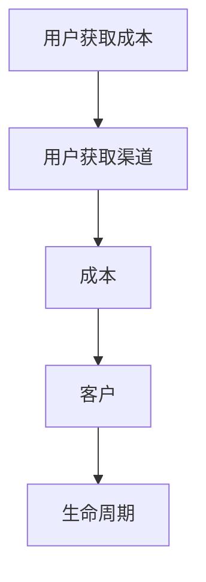
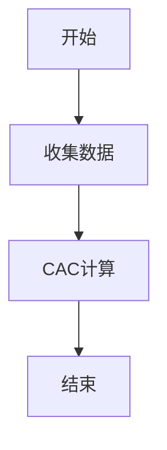
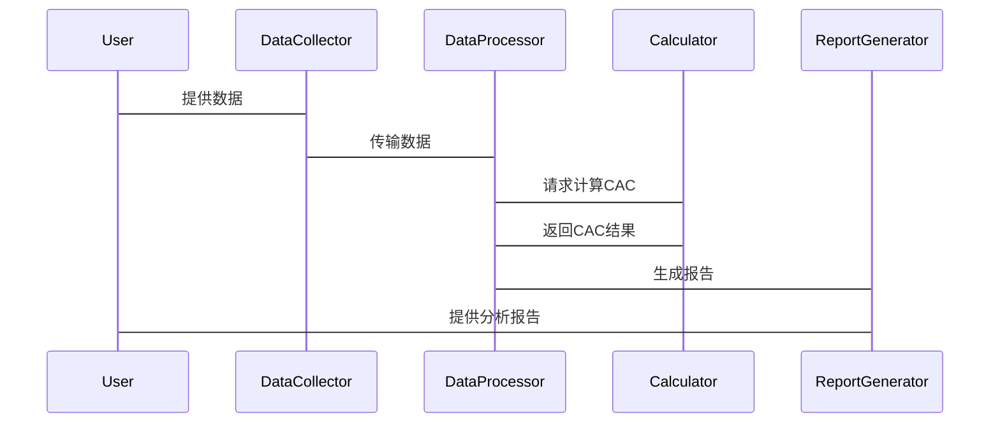

                 


# 彼得林奇如何分析公司的用户获取成本趋势

> 关键词：彼得林奇，用户获取成本（CAC），CAC趋势，投资分析，用户生命周期价值（CLTV）

> 摘要：本文深入探讨了彼得·林奇分析公司用户获取成本（CAC）趋势的方法，结合技术视角，详细讲解CAC的定义、计算方法、影响因素及其在投资决策中的应用。文章通过系统分析、算法原理和实际案例，帮助读者掌握如何利用CAC趋势评估企业增长潜力。

---

## 第一章：用户获取成本（CAC）的背景与概念

### 1.1 CAC的核心概念

#### 1.1.1 用户获取成本的定义
用户获取成本（CAC）是指公司获取一个新用户的平均成本，包括广告支出、销售费用和其他相关成本。CAC是衡量用户获取效率的关键指标。

#### 1.1.2 CAC在企业增长中的重要性
CAC的高低直接影响企业的盈利能力和增长潜力。高CAC意味着获取用户成本过高，可能影响企业的可持续发展；低CAC则表明企业在获取用户方面效率较高。

#### 1.1.3 CAC与用户生命周期的关系
CAC与用户生命周期价值（CLTV）密切相关。只有当CLTV大于CAC时，企业才能实现盈利。因此，分析CAC趋势时，需要结合CLTV进行综合评估。

### 1.2 彼得林奇分析CAC的背景

#### 1.2.1 彼得林奇的投资理念
彼得·林奇以其价值投资理念闻名，注重分析企业的基本面，包括财务状况、市场地位和管理团队。他通过分析CAC等关键指标来评估企业的成长潜力。

#### 1.2.2 CAC在投资分析中的应用
CAC是彼得林奇分析企业增长能力的重要指标。通过分析CAC趋势，他可以判断企业是否能够以合理的成本获取用户，从而实现可持续增长。

#### 1.2.3 CAC趋势分析的必要性
CAC趋势分析帮助企业识别用户获取成本的变化，进而优化市场策略。通过分析CAC趋势，投资者可以判断企业是否在有效控制成本，或者是否需要调整市场策略。

---

## 第二章：CAC的核心概念与联系

### 2.1 CAC的计算方法

#### 2.1.1 CAC的基本公式
CAC = （广告支出 + 销售费用） / 新客户数

#### 2.1.2 CAC的关键组成部分
CAC的计算包括广告支出、销售费用和新客户数。广告支出和销售费用是获取用户的直接成本，而新客户数则是用户获取的数量。

#### 2.1.3 CAC与收入的关系
CAC与收入的关系可以通过CAC比率（CAC / 收入）来衡量。较低的CAC比率表明企业以较低的成本获取收入，具有更强的盈利能力。

### 2.2 CAC与其他指标的对比

#### 2.2.1 CAC与客户生命周期价值（CLTV）的对比
CLTV是客户在生命周期内为企业带来的总收入，而CAC是获取客户的成本。只有当CLTV > CAC时，企业才能实现盈利。

#### 2.2.2 CAC与投资回报率（ROI）的关联
ROI = （收入 - 成本） / 成本。CAC与ROI密切相关，较高的ROI表明企业以较低的成本获取了较高的收入。

#### 2.2.3 CAC与用户获取渠道的联系
不同的用户获取渠道有不同的CAC。通过分析各渠道的CAC，企业可以优化市场策略，选择成本较低且效果较好的渠道。

### 2.3 CAC的实体关系图



---

## 第三章：CAC的分析框架

### 3.1 分析步骤

#### 3.1.1 确定分析目标
明确分析的目标，例如评估用户获取成本的趋势，识别成本增加的原因，优化市场策略等。

#### 3.1.2 收集数据
收集广告支出、销售费用和新客户数等数据，确保数据的准确性和完整性。

#### 3.1.3 计算CAC
使用公式计算CAC，并与历史数据进行对比，分析CAC的趋势。

### 3.2 CAC趋势分析方法

#### 3.2.1 时间序列分析
通过时间序列分析，识别CAC的变化趋势，判断CAC是上升、下降还是稳定。

#### 3.2.2 行业对比
将企业的CAC与行业平均水平进行对比，判断企业的成本是否处于合理范围。

#### 3.2.3 渠道分析
分析不同渠道的CAC，识别高成本或低效渠道，并优化市场策略。

### 3.3 CAC的关键指标

#### 3.3.1 CAC比率
CAC比率 = CAC / 收入。较低的比率表明企业以较低的成本获取收入，具有较强的盈利能力。

#### 3.3.2 用户获取效率
用户获取效率 = 新客户数 / （广告支出 + 销售费用）。较高的效率表明企业在获取用户方面效率较高。

#### 3.3.3 用户生命周期价值
CLTV = 平均收入 per 用户 * 用户生命周期长度。较高的CLTV表明用户为企业带来的收入较高，具有较高的盈利能力。

---

## 第四章：CAC的算法原理

### 4.1 CAC的计算公式

#### 4.1.1 基本公式
CAC = （广告支出 + 销售费用） / 新客户数

#### 4.1.2 计算步骤
1. 收集广告支出、销售费用和新客户数。
2. 计算广告支出和销售费用的总和。
3. 用总和除以新客户数，得到CAC。

### 4.2 算法流程图



### 4.3 代码实现

```python
# 计算CAC
advertising_cost = 100000  # 广告支出
sales_cost = 50000  # 销售费用
new_customers = 5000  # 新客户数

total_cost = advertising_cost + sales_cost
cac = total_cost / new_customers
print("CAC:", cac)
```

---

## 第五章：系统分析与架构设计方案

### 5.1 系统功能设计

#### 5.1.1 数据收集模块
收集广告支出、销售费用和新客户数等数据。

#### 5.1.2 数据处理模块
对收集到的数据进行清洗和处理，确保数据的准确性和完整性。

#### 5.1.3 数据分析模块
计算CAC，并生成分析报告。

### 5.2 系统架构设计


### 5.3 系统接口设计

- 数据收集接口：用于收集广告支出、销售费用和新客户数。
- 数据处理接口：对数据进行清洗和转换。
- 数据分析接口：计算CAC并生成报告。

### 5.4 系统交互流程



---

## 第六章：项目实战

### 6.1 环境安装

#### 6.1.1 安装Python
安装Python 3.x版本，并配置环境变量。

#### 6.1.2 安装依赖库
安装所需的依赖库，如pandas、numpy等。

### 6.2 核心实现代码

```python
import pandas as pd

# 数据收集
data = {
    '广告支出': [100000],
    '销售费用': [50000],
    '新客户数': [5000]
}

df = pd.DataFrame(data)

# 计算CAC
cac = (df['广告支出'].sum() + df['销售费用'].sum()) / df['新客户数'].sum()
print("CAC:", cac)
```

### 6.3 数据分析与解读

- 计算结果：CAC = 30,000元
- 分析：CAC较高，可能需要优化市场策略，降低广告支出或提高销售效率。

### 6.4 案例分析

分析一家互联网公司的CAC趋势，发现其CAC在最近几个季度呈上升趋势，可能由于市场竞争加剧，广告费用增加。建议优化广告投放策略，寻找成本更低的渠道。

---

## 第七章：最佳实践与小结

### 7.1 最佳实践

#### 7.1.1 关注CAC趋势
定期分析CAC趋势，识别成本增加的原因，优化市场策略。

#### 7.1.2 考虑行业差异
不同行业和业务模式的CAC差异较大，需结合行业特点进行分析。

#### 7.1.3 结合CLTV分析
通过CLTV与CAC的对比，评估用户的生命周期价值，判断企业的盈利能力。

### 7.2 小结

彼得·林奇通过分析CAC趋势，评估企业的用户获取成本和增长潜力。本文结合技术视角，详细讲解了CAC的计算方法、分析框架和实际应用，帮助读者掌握如何利用CAC趋势进行投资决策。

### 7.3 注意事项

- 数据的准确性和完整性是CAC分析的基础。
- 分析CAC趋势时，需结合行业特点和企业实际情况。
- 定期更新数据，持续监控CAC趋势，及时调整市场策略。

### 7.4 拓展阅读

- 彼得·林奇的其他投资理念
- 用户生命周期价值（CLTV）的计算与分析
- 数字营销与CAC优化策略

---

通过以上结构，我们可以系统地分析彼得·林奇如何利用用户获取成本（CAC）的趋势来评估公司的增长潜力，同时结合技术视角，提供详细的分析方法和实际案例。

