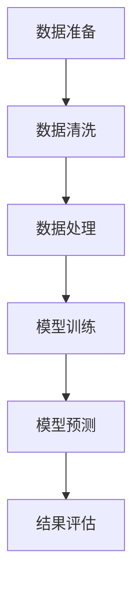
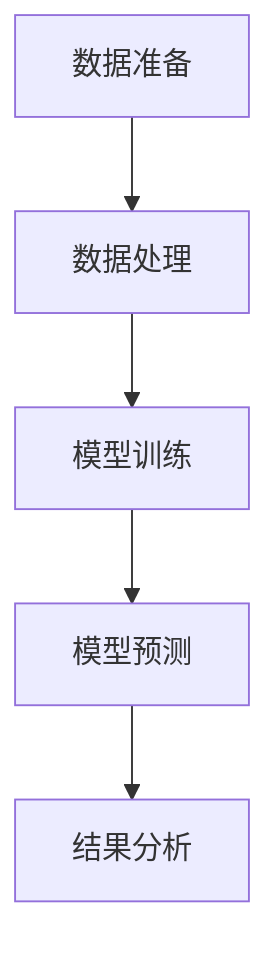
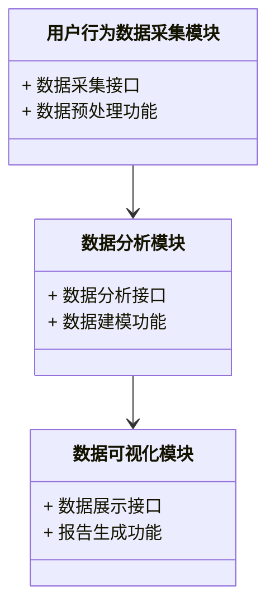
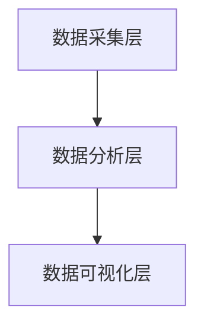
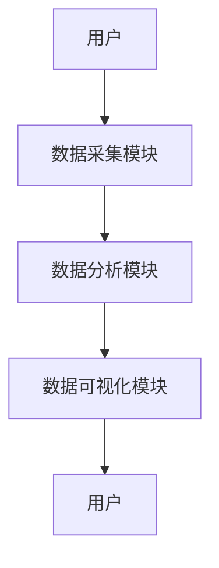

                 


# 彼得林奇如何分析公司的用户行为数据价值

## 关键词：彼得林奇, 用户行为数据, 数据价值, 投资决策, 数据分析, 数据驱动, 投资策略

## 摘要：  
彼得·林奇作为全球著名投资专家，其成功不仅依赖于市场分析，还依赖于对公司用户行为数据的深入挖掘与分析。本文将详细探讨用户行为数据的价值，分析其如何为投资决策提供支持，并结合实际案例，通过技术手段解析用户行为数据的分析方法与应用。文章内容涵盖数据分析的核心算法、系统架构设计、项目实战及最佳实践，旨在为读者提供全面的技术指导。

---

## 第一部分：用户行为数据价值分析概述

### 第1章：用户行为数据价值的核心概念

#### 1.1 用户行为数据的基本概念

- **1.1.1 数据的定义与分类**  
  用户行为数据是指用户在使用产品或服务时产生的所有交互记录，包括点击、浏览、购买、登录等行为。这些数据可以分为结构化数据（如用户ID、时间戳）和非结构化数据（如文本评论）。

- **1.1.2 用户行为数据的特征**  
  - **实时性**：数据生成于用户操作的瞬间。  
  - **多样性**：涵盖用户行为的多个维度（如时间、频率、行为类型）。  
  - **关联性**：不同行为之间可能存在关联，例如用户浏览产品后可能产生购买行为。  

- **1.1.3 数据价值的内涵与外延**  
  数据价值体现在通过分析行为数据，发现用户偏好、预测市场趋势并优化投资策略。其外延包括数据的采集、处理、分析和可视化等环节。

#### 1.2 数据价值的评估方法

- **1.2.1 数据质量评估指标**  
  - 完整性：数据是否完整无缺失。  
  - 准确性：数据是否真实反映用户行为。  
  - 及时性：数据是否能够及时采集和处理。  

- **1.2.2 数据价值的量化模型**  
  通过建立用户行为模型，评估数据对投资决策的影响力。例如，使用A/B测试评估不同用户行为对投资收益的影响。

- **1.2.3 数据与投资决策的关系**  
  数据是投资决策的重要依据，通过分析用户行为数据，可以识别市场趋势、用户需求和潜在风险。

#### 1.3 数据分析的基本流程

- **1.3.1 数据收集与预处理**  
  - 数据采集：通过日志记录、问卷调查等方式收集用户行为数据。  
  - 数据清洗：去除无效数据、处理异常值。  

- **1.3.2 数据清洗与标准化**  
  - 数据清洗：移除重复数据、填补缺失值。  
  - 数据标准化：将数据转换为统一格式，便于后续分析。  

- **1.3.3 数据分析与可视化**  
  - 数据分析：使用统计方法、机器学习算法等对数据进行分析。  
  - 数据可视化：通过图表直观展示数据分析结果，例如使用折线图展示用户行为趋势。

### 第2章：用户行为数据的分析方法

#### 2.1 数据分析的核心工具

- **2.1.1 数据挖掘技术**  
  - 关联规则挖掘：发现用户行为之间的关联性，例如购买行为的关联性。  
  - 分类与回归树（CART）：用于预测用户行为。

- **2.1.2 统计分析方法**  
  - 描述性统计：分析数据的基本特征，如均值、方差。  
  - 推断统计：基于样本数据推断总体特征。  

- **2.1.3 机器学习算法**  
  - 聚类分析：将用户分成不同的群体，分析不同群体的行为特征。  
  - 支持向量机（SVM）：用于分类用户行为类型。

#### 2.2 数据分析的常见模型

- **2.2.1 协同过滤算法**  
  - 通过用户行为相似性推荐相关内容，例如推荐相似产品给用户。

- **2.2.2 聚类分析模型**  
  - 将用户分成不同的群体，分析不同群体的行为特征，例如高消费用户和低消费用户。

- **2.2.3 回归分析模型**  
  - 用于预测用户行为，例如预测用户是否会购买某产品。

#### 2.3 数据分析的实践应用

- **2.3.1 用户行为预测**  
  - 使用时间序列分析预测未来用户行为，例如预测用户活跃度。

- **2.3.2 用户分群与画像**  
  - 通过聚类分析将用户分成不同的群体，构建用户画像，例如年轻用户和老年用户的行为差异。

- **2.3.3 数据驱动的投资决策**  
  - 通过分析用户行为数据，优化投资组合，例如根据用户需求调整投资策略。

### 第3章：数据价值的评估与投资决策

#### 3.1 数据价值的评估框架

- **3.1.1 数据的稀缺性**  
  稀缺的数据更具价值，因为它们可能包含独特的见解。

- **3.1.2 数据的准确性**  
  准确的数据能够提供可靠的分析结果。

- **3.1.3 数据的可操作性**  
  数据能够被投资决策者有效利用，才能真正体现其价值。

#### 3.2 数据驱动的投资策略

- **3.2.1 数据与投资决策的关系**  
  数据是投资决策的重要依据，通过分析用户行为数据，优化投资组合。

- **3.2.2 数据分析在投资中的应用**  
  - 市场趋势分析：通过用户行为数据预测市场趋势，例如分析用户搜索关键词的变化预测行业动态。

- **3.2.3 数据驱动的投资模型**  
  - 使用机器学习模型预测投资收益，例如使用随机森林模型预测股票价格。

#### 3.3 数据分析的局限性与挑战

- **3.3.1 数据隐私问题**  
  数据分析需要遵守隐私保护法规，例如GDPR。

- **3.3.2 数据质量控制**  
  数据清洗和预处理是数据分析的重要步骤，需要确保数据的准确性和完整性。

- **3.3.3 数据分析的伦理问题**  
  数据分析需要遵循伦理规范，避免滥用数据。

### 第4章：数据分析的系统架构与实现

#### 4.1 数据分析系统的功能设计

- **4.1.1 数据采集模块**  
  - 采集用户行为数据，例如日志记录、API接口调用。

- **4.1.2 数据处理模块**  
  - 数据清洗、数据转换，例如将日期格式统一。

- **4.1.3 数据分析模块**  
  - 数据分析：使用统计方法、机器学习算法等对数据进行分析。

#### 4.2 数据分析系统的架构设计

- **4.2.1 分层架构设计**  
  - 数据采集层：负责数据的采集和预处理。  
  - 数据分析层：负责数据的分析和建模。  
  - 数据可视化层：负责数据的展示和报告生成。  

- **4.2.2 微服务架构设计**  
  - 数据采集服务：负责采集用户行为数据。  
  - 数据处理服务：负责数据清洗和转换。  
  - 数据分析服务：负责数据的分析和建模。  

- **4.2.3 数据流的可视化设计**  
  - 使用数据流图展示数据从采集到分析的全过程。

#### 4.3 数据分析系统的接口

- **4.3.1 数据接口设计**  
  - API接口：用于数据的交互，例如RESTful API。

- **4.3.2 数据可视化接口**  
  - 可视化工具：例如Tableau、Power BI等。

---

## 第二部分：数据分析的核心算法与模型

### 第5章：协同过滤算法

#### 5.1 协同过滤算法的原理

- 协同过滤是一种推荐算法，基于用户行为相似性推荐相关内容。  
- 使用矩阵分解方法，例如奇异值分解（SVD）。

#### 5.2 协同过滤算法的实现

- **5.2.1 数据准备**  
  - 数据加载：读取用户行为数据，例如用户ID、物品ID、评分。

- **5.2.2 数据处理**  
  - 数据清洗：处理缺失值、异常值。

- **5.2.3 模型训练**  
  - 使用矩阵分解方法训练模型，例如使用交替最小二乘法（ALS）。

- **5.2.4 模型预测**  
  - 使用训练好的模型预测用户对物品的评分。

- **5.2.5 结果评估**  
  - 使用指标评估模型性能，例如准确率、召回率。

#### 5.3 协同过滤算法的代码实现

```python
from surprise import SVD, Dataset, accuracy
from surprise.model_selection import train_test_split

# 加载数据
data = Dataset.load_from_file('user_rating.csv', format='csv', sep=',', header=True)

# 数据集划分
train_set, test_set = train_test_split(data, test_size=0.25)

# 模型训练
model = SVD()
model.fit(train_set)

# 模型预测
test_pred = model.test(test_set)

# 模型评估
accuracy.rmse(test_pred)
accuracy.mae(test_pred)
```

#### 5.4 协同过滤算法的流程图



### 第6章：聚类分析模型

#### 6.1 聚类分析模型的原理

- 聚类分析是一种无监督学习方法，用于将数据分成不同的群体。  
- 常见的聚类算法包括K-means、层次聚类等。

#### 6.2 聚类分析模型的实现

- **6.2.1 数据准备**  
  - 数据加载：读取用户行为数据，例如用户ID、行为特征。

- **6.2.2 数据处理**  
  - 数据标准化：例如使用归一化方法处理数据。

- **6.2.3 模型训练**  
  - 选择合适的聚类算法，例如K-means。

- **6.2.4 模型预测**  
  - 使用训练好的模型预测用户群体。

- **6.2.5 结果分析**  
  - 分析每个群体的行为特征，例如高消费群体和低消费群体。

#### 6.3 聚类分析模型的代码实现

```python
from sklearn.cluster import KMeans
from sklearn.preprocessing import StandardScaler

# 加载数据
data = pd.read_csv('user_behavior.csv')

# 数据处理
scaler = StandardScaler()
scaled_data = scaler.fit_transform(data)

# 模型训练
model = KMeans(n_clusters=3, random_state=42)
model.fit(scaled_data)

# 模型预测
clusters = model.predict(scaled_data)
```

#### 6.4 聚类分析模型的流程图



### 第7章：回归分析模型

#### 7.1 回归分析模型的原理

- 回归分析是一种用于预测的统计方法，通过建立变量之间的关系模型，预测目标变量的值。  
- 常见的回归算法包括线性回归、逻辑回归等。

#### 7.2 回归分析模型的实现

- **7.2.1 数据准备**  
  - 数据加载：读取用户行为数据，例如用户ID、行为特征、目标变量。

- **7.2.2 数据处理**  
  - 数据清洗：处理缺失值、异常值。

- **7.2.3 模型训练**  
  - 选择合适的回归算法，例如线性回归。

- **7.2.4 模型预测**  
  - 使用训练好的模型预测目标变量的值。

- **7.2.5 结果分析**  
  - 分析模型的预测精度，例如R平方值、均方误差。

#### 7.3 回归分析模型的代码实现

```python
import statsmodels.api as sm

# 加载数据
data = pd.read_csv('user_behavior.csv')

# 数据处理
X = data[['feature1', 'feature2']]
y = data['target']

# 模型训练
model = sm.OLS(y, sm.add_constant(X))
results = model.fit()

# 模型预测
predictions = results.predict(sm.add_constant(X))
```

#### 7.4 回归分析模型的流程图


---

## 第三部分：系统分析与架构设计方案

### 第8章：用户行为数据分析系统的功能设计

#### 8.1 问题场景介绍

- 数据分析系统需要满足用户行为数据的采集、处理、分析和可视化需求。

#### 8.2 系统功能设计

- **8.2.1 功能模块设计**  
  - 数据采集模块：负责数据的采集和预处理。  
  - 数据分析模块：负责数据的分析和建模。  
  - 数据可视化模块：负责数据的展示和报告生成。  

- **8.2.2 功能流程设计**  
  - 用户输入数据，系统进行数据处理，生成分析结果，展示给用户。

#### 8.3 系统功能的mermaid类图



### 第9章：系统架构设计

#### 9.1 项目介绍

- 数据分析系统的设计目标是实现用户行为数据的高效采集、处理、分析和可视化。

#### 9.2 系统架构设计

- **9.2.1 分层架构设计**  
  - 数据采集层：负责数据的采集和预处理。  
  - 数据分析层：负责数据的分析和建模。  
  - 数据可视化层：负责数据的展示和报告生成。  

- **9.2.2 系统架构的mermaid架构图**



#### 9.3 系统接口设计

- **9.3.1 数据接口设计**  
  - RESTful API接口：用于数据的交互，例如数据采集模块提供API接口供数据分析模块调用。

- **9.3.2 数据可视化接口**  
  - 数据可视化模块提供API接口，供前端展示数据。

#### 9.4 系统交互设计

- **9.4.1 系统交互流程图**



---

## 第四部分：项目实战

### 第10章：用户行为数据分析的实战

#### 10.1 环境安装

- **10.1.1 安装Python环境**  
  安装Python 3.x，建议使用Anaconda或virtualenv管理环境。

- **10.1.2 安装数据分析库**  
  安装numpy、pandas、scikit-learn、surprise等库。

#### 10.2 系统核心实现

- **10.2.1 数据采集模块实现**  
  ```python
  import requests

  def fetch_data(api_url):
      response = requests.get(api_url)
      return response.json()
  ```

- **10.2.2 数据分析模块实现**  
  ```python
  from sklearn.cluster import KMeans

  def perform_clustering(data):
      scaler = StandardScaler()
      scaled_data = scaler.fit_transform(data)
      model = KMeans(n_clusters=3)
      clusters = model.fit_predict(scaled_data)
      return clusters
  ```

- **10.2.3 数据可视化模块实现**  
  ```python
  import matplotlib.pyplot as plt

  def visualize_clusters(clusters, data):
      plt.scatter(data[:, 0], data[:, 1], c=clusters)
      plt.xlabel('Feature 1')
      plt.ylabel('Feature 2')
      plt.show()
  ```

#### 10.3 代码应用解读

- **10.3.1 数据采集模块**  
  通过API接口获取用户行为数据，例如从数据库中读取日志数据。

- **10.3.2 数据分析模块**  
  使用K-means算法将用户分成不同的群体，分析不同群体的行为特征。

- **10.3.3 数据可视化模块**  
  将分析结果可视化，例如绘制用户群体分布图。

#### 10.4 实际案例分析

- **10.4.1 案例背景**  
  某电商平台希望分析用户购买行为，优化推荐算法。

- **10.4.2 数据分析与解读**  
  通过聚类分析将用户分成高消费群体和低消费群体，分析不同群体的行为特征。

- **10.4.3 投资决策优化**  
  根据用户行为分析结果，优化投资策略，例如增加对高消费群体的营销力度。

#### 10.5 项目小结

- 通过实际案例分析，验证了用户行为数据分析在投资决策中的应用价值。

---

## 第五部分：最佳实践

### 第11章：数据分析的注意事项与总结

#### 11.1 小结

- 用户行为数据分析是投资决策的重要工具，通过分析用户行为数据，优化投资策略。

#### 11.2 注意事项

- 数据隐私保护：遵守相关法律法规，确保数据安全。
- 数据质量控制：确保数据的准确性和完整性。
- 数据分析的伦理问题：避免数据滥用，确保数据分析的透明性和公正性。

#### 11.3 拓展阅读

- 推荐阅读《数据驱动的决策》、《投资学基础》等书籍，深入学习数据分析与投资决策的结合。

---

## 总结

通过本文的详细讲解，读者可以全面了解彼得·林奇如何分析公司用户行为数据价值，并掌握数据分析的核心算法与系统架构设计。希望本文能够为读者在投资决策中提供有价值的指导与启发。

